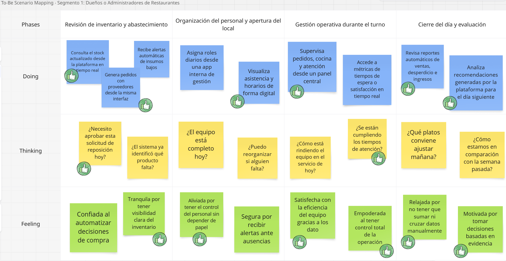
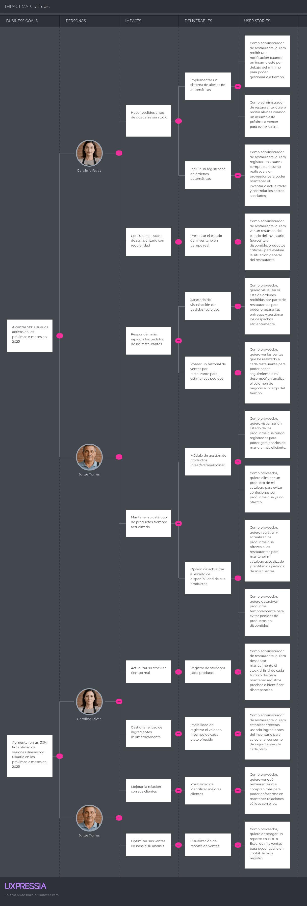

# Capítulo III: Requirements Specification

## 3.1 To-Be Scenario Mapping

**Segmento Objetivo 1:** Dueños o Administradores de Restaurantes

Este escenario To-Be fue construido tras una revisión detallada del escenario As-Is de Carolina Rivas y de las oportunidades de mejora identificadas a partir de las entrevistas. Se definieron las fases del proceso y se contrastaron con las actuales. Se priorizaron mejoras en eficiencia, control, automatización y reducción de frustraciones operativas.

**Segmento objetivo 2:** Proveedores de Restaurantes

Este escenario To-Be fue construido a partir del análisis del escenario As-Is de Jorge Torres. se incorporaron mejoras basadas en las necesidades y frustraciones. El equipo propuso una experiencia futura donde Jorge cuenta con una plataforma digital para gestionar pedidos, organizar rutas, registrar pagos y comunicarse con los restaurantes

## 3.2 User Stories

| Epic / Story ID | Título                                                                   | Descripción                                                                                                                                                                                                                                                                                                                                               | Criterios de Aceptación                                                                                                                                                                                                                                                                                                                                                                                                                                                                                                                                                                                                                                                                                                                                                                                                                                                                                                                                                                                                                                                                                                                                                                                                                                                                                                                                                                                                                                                                                                                                                                                                                                                                                                                                                                                                                                                                                                                                                                                                                                                             | Relacionado con (Epic ID) |
| :-------------- | ------------------------------------------------------------------------- | ---------------------------------------------------------------------------------------------------------------------------------------------------------------------------------------------------------------------------------------------------------------------------------------------------------------------------------------------------------- | ------------------------------------------------------------------------------------------------------------------------------------------------------------------------------------------------------------------------------------------------------------------------------------------------------------------------------------------------------------------------------------------------------------------------------------------------------------------------------------------------------------------------------------------------------------------------------------------------------------------------------------------------------------------------------------------------------------------------------------------------------------------------------------------------------------------------------------------------------------------------------------------------------------------------------------------------------------------------------------------------------------------------------------------------------------------------------------------------------------------------------------------------------------------------------------------------------------------------------------------------------------------------------------------------------------------------------------------------------------------------------------------------------------------------------------------------------------------------------------------------------------------------------------------------------------------------------------------------------------------------------------------------------------------------------------------------------------------------------------------------------------------------------------------------------------------------------------------------------------------------------------------------------------------------------------------------------------------------------------------------------------------------------------------------------------------------------------ | ------------------------- |
| EP-01           | Comunicación de Valor y Conversión en la Página de Inicio              | Como visitante, quiero entender claramente el valor de la plataforma y ser guiado mediante acciones concretas, para sentirme motivado a registrarme o descargar la aplicación.                                                                                                                                                                            |                                                                                                                                                                                                                                                                                                                                                                                                                                                                                                                                                                                                                                                                                                                                                                                                                                                                                                                                                                                                                                                                                                                                                                                                                                                                                                                                                                                                                                                                                                                                                                                                                                                                                                                                                                                                                                                                                                                                                                                                                                                                                      |                           |
| EP-02           | Accesibilidad de la plataforma                                            | Como visitante con cualquier tipo de dispositivo o capacidad, quiero que la página de inicio sea clara, rápida y accesible, para navegar sin dificultades y tener una buena primera impresión de la plataforma.                                                                                                                                         |                                                                                                                                                                                                                                                                                                                                                                                                                                                                                                                                                                                                                                                                                                                                                                                                                                                                                                                                                                                                                                                                                                                                                                                                                                                                                                                                                                                                                                                                                                                                                                                                                                                                                                                                                                                                                                                                                                                                                                                                                                                                                      |                           |
| EP-03           | Gestión de autenticación y acceso de usuarios                           | Como usuario de la plataforma, quiero poder registrarme, iniciar sesión y recuperar mi contraseña, para acceder a mis funcionalidades de forma segura y sin inconvenientes, incluso si olvido mis credenciales.                                                                                                                                          |                                                                                                                                                                                                                                                                                                                                                                                                                                                                                                                                                                                                                                                                                                                                                                                                                                                                                                                                                                                                                                                                                                                                                                                                                                                                                                                                                                                                                                                                                                                                                                                                                                                                                                                                                                                                                                                                                                                                                                                                                                                                                      |                           |
| EP-04           | Gestión de Suscripción y Acceso al Dashboard                            | Como usuario de la plataforma, quiero gestionar mi suscripción desde el dashboard, para poder renovar, ver el estado de mi plan y saber cuándo expira.                                                                                                                                                                                                   |                                                                                                                                                                                                                                                                                                                                                                                                                                                                                                                                                                                                                                                                                                                                                                                                                                                                                                                                                                                                                                                                                                                                                                                                                                                                                                                                                                                                                                                                                                                                                                                                                                                                                                                                                                                                                                                                                                                                                                                                                                                                                      |                           |
| EP-05           | Gestión de perfil                                                        | Como usuario, quiero poder visualizar y actualizar mi información personal o comercial, para mantener mis datos actualizados, generar confianza y facilitar la comunicación dentro de la plataforma.                                                                                                                                                     |                                                                                                                                                                                                                                                                                                                                                                                                                                                                                                                                                                                                                                                                                                                                                                                                                                                                                                                                                                                                                                                                                                                                                                                                                                                                                                                                                                                                                                                                                                                                                                                                                                                                                                                                                                                                                                                                                                                                                                                                                                                                                      |                           |
| EP-06           | Gestión de Stock de Inventario para Operaciones en Restaurantes          | Como administrador de restaurante, quiero gestionar los niveles de inventario de todos los insumos, para asegurar la continuidad operativa, reducir el desperdicio y mantener el control del stock en todo momento.                                                                                                                                        |                                                                                                                                                                                                                                                                                                                                                                                                                                                                                                                                                                                                                                                                                                                                                                                                                                                                                                                                                                                                                                                                                                                                                                                                                                                                                                                                                                                                                                                                                                                                                                                                                                                                                                                                                                                                                                                                                                                                                                                                                                                                                      |                           |
| EP-07           | Gestión de Compras de Insumos                                            | Como administrador de restaurante, quiero registrar y consultar las compras de insumos realizadas, para tener control del abastecimiento, reducir pérdidas y mantener actualizado el inventario.                                                                                                                                                          |                                                                                                                                                                                                                                                                                                                                                                                                                                                                                                                                                                                                                                                                                                                                                                                                                                                                                                                                                                                                                                                                                                                                                                                                                                                                                                                                                                                                                                                                                                                                                                                                                                                                                                                                                                                                                                                                                                                                                                                                                                                                                      |                           |
| EP-08           | Gestión de recetas para pedidos                                          | Como administrador de restaurante, quiero gestionar recetas vinculadas a insumos del inventario, para controlar mejor el consumo y tener trazabilidad en la preparación de platos.                                                                                                                                                                        |                                                                                                                                                                                                                                                                                                                                                                                                                                                                                                                                                                                                                                                                                                                                                                                                                                                                                                                                                                                                                                                                                                                                                                                                                                                                                                                                                                                                                                                                                                                                                                                                                                                                                                                                                                                                                                                                                                                                                                                                                                                                                      |                           |
| EP-09           | Panel de control y estadísticas                                          | Como administrador del restaurante, quiero visualizar un panel con métricas clave, para tomar decisiones estratégicas                                                                                                                                                                                                                                    |                                                                                                                                                                                                                                                                                                                                                                                                                                                                                                                                                                                                                                                                                                                                                                                                                                                                                                                                                                                                                                                                                                                                                                                                                                                                                                                                                                                                                                                                                                                                                                                                                                                                                                                                                                                                                                                                                                                                                                                                                                                                                      |                           |
| EP-10           | Alertas inteligentes                                                      | Como administrador de restaurante, quiero recibir alertas automáticas sobre el estado del inventario y eventos importantes, para tomar decisiones oportunas que eviten la escasez de insumos o el exceso de stock.                                                                                                                                        |                                                                                                                                                                                                                                                                                                                                                                                                                                                                                                                                                                                                                                                                                                                                                                                                                                                                                                                                                                                                                                                                                                                                                                                                                                                                                                                                                                                                                                                                                                                                                                                                                                                                                                                                                                                                                                                                                                                                                                                                                                                                                      |                           |
| EP-11           | Seguimiento de entregas                                                   | Como administrador de restaurante, quiero consultar el estado actual de mis pedidos, para tener visibilidad en tiempo real del progreso de cada entrega y planificar mejor mi operación interna. Y como proveedor, quiero actualizar el estado de las órdenes, para mantener informados a los restaurantes y organizar mis despachos de forma eficiente. |                                                                                                                                                                                                                                                                                                                                                                                                                                                                                                                                                                                                                                                                                                                                                                                                                                                                                                                                                                                                                                                                                                                                                                                                                                                                                                                                                                                                                                                                                                                                                                                                                                                                                                                                                                                                                                                                                                                                                                                                                                                                                      |                           |
| EP-12           | Calificaciones y feedback a proveedores                                   | Como administrador de restaurante, quiero calificar y dejar comentarios sobre los proveedores con los que trabajo, para compartir mi experiencia, ayudar a otros restaurantes a tomar decisiones informadas y brindar retroalimentación útil a los proveedores.                                                                                          |                                                                                                                                                                                                                                                                                                                                                                                                                                                                                                                                                                                                                                                                                                                                                                                                                                                                                                                                                                                                                                                                                                                                                                                                                                                                                                                                                                                                                                                                                                                                                                                                                                                                                                                                                                                                                                                                                                                                                                                                                                                                                      |                           |
| EP-13           | Gestión de Productos Ofrecidos                                           | Como proveedor, quiero registrar, editar y eliminar los productos que ofrezco a los restaurantes, para asegurar que mi catálogo esté siempre actualizado y facilitar la gestión de pedidos.                                                                                                                                                             |                                                                                                                                                                                                                                                                                                                                                                                                                                                                                                                                                                                                                                                                                                                                                                                                                                                                                                                                                                                                                                                                                                                                                                                                                                                                                                                                                                                                                                                                                                                                                                                                                                                                                                                                                                                                                                                                                                                                                                                                                                                                                      |                           |
| EP-14           | Recepción y Gestión de Órdenes                                         | Como proveedor, quiero recibir, visualizar y actualizar el estado de las órdenes realizadas por restaurantes, para organizar mis entregas, garantizar puntualidad y mantener una buena comunicación con mis clientes.                                                                                                                                    |                                                                                                                                                                                                                                                                                                                                                                                                                                                                                                                                                                                                                                                                                                                                                                                                                                                                                                                                                                                                                                                                                                                                                                                                                                                                                                                                                                                                                                                                                                                                                                                                                                                                                                                                                                                                                                                                                                                                                                                                                                                                                      |                           |
| EP-15           | Historial de Ventas y Acceso a Facturación, para Proveedores             | Como proveedor, quiero acceder a un historial detallado de mis ventas a cada restaurante, para poder descargar reportes de facturación e identificar a mis mejores clientes.                                                                                                                                                                              |                                                                                                                                                                                                                                                                                                                                                                                                                                                                                                                                                                                                                                                                                                                                                                                                                                                                                                                                                                                                                                                                                                                                                                                                                                                                                                                                                                                                                                                                                                                                                                                                                                                                                                                                                                                                                                                                                                                                                                                                                                                                                      |                           |
| EP-16           | Gestión de Proveedores                                                   | Como administrador de restaurante, quiero poder agregar, editar, visualizar y eliminar proveedores desde la plataforma, para tener un control eficiente de quiénes suministran los insumos y facilitar la comunicación.                                                                                                                                  |                                                                                                                                                                                                                                                                                                                                                                                                                                                                                                                                                                                                                                                                                                                                                                                                                                                                                                                                                                                                                                                                                                                                                                                                                                                                                                                                                                                                                                                                                                                                                                                                                                                                                                                                                                                                                                                                                                                                                                                                                                                                                      |                           |
| US-01           | Acceso a la plataforma                                                    | Como visitante o usuario, quiero tener la posibilidad de registrarme si no tengo una cuenta o iniciar sesión si ya la tengo, para poder acceder a los servicios de la plataforma.                                                                                                                                                                         | Escenario 1: Registro de nuevo usuario Dado que el visitante no posee una cuenta registrada,  cuando solicita iniciar el registro como nuevo usuario,  entonces el sistema debe permitir el ingreso de datos personales requeridos  y registrar al visitante como nuevo usuario de la plataforma  Escenario 2: Inicio de sesión de usuario existente  Dado que el usuario ya cuenta con una cuenta registrada,  cuando proporciona sus credenciales para iniciar sesión,  entonces el sistema debe validarlas  y permitir el acceso a la plataforma.                                                                                                                                                                                                                                                                                                                                                                                                                                                                                                                                                                                                                                                                                                                                                                                                                                                                                                                                                                                                                                                                                                                                                                                                                                                                                                                                                                                                                                                                        | EP-01                     |
| US-02           | Recuperación de contraseña                                              | Como usuario, quiero recuperar el acceso a mi cuenta mediante la restauración de mi contraseña, para continuar utilizando la plataforma incluso si olvidé mis credenciales.                                                                                                                                                                             | **Escenario 1: Solicitud de recuperación de contraseña** Dado que el usuario no ha iniciado sesión y desea recuperar el acceso,  cuando solicita iniciar el proceso de recuperación de contraseña,  entonces el sistema le permite ingresar su dirección de correo electrónico asociada a la cuenta **Escenario 2: Envío de instrucciones de recuperación** Dado que el usuario ha proporcionado una dirección de correo electrónico válida,  cuando envía la solicitud de recuperación,  entonces el sistema genera un medio seguro para restablecer la contraseña y notifica al usuario que se han enviado instrucciones al canal correspondiente **Escenario 3: Enlace inválido o expirado** Dado que el usuario accede a un medio de recuperación previamente generado,  cuando dicho recurso ya no es válido o ha expirado,  entonces el sistema informa que la recuperación no puede completarse Y ofrece la posibilidad de generar una nueva solicitud. **Escenario 4: Restablecimiento exitoso** Dado que el usuario accede a un recurso válido para restaurar su contraseña,  cuando proporciona una nueva contraseña que cumple con las reglas establecidas,  entonces el sistema actualiza su información de acceso  Y confirma que podrá ingresar con sus nuevas credenciales                                                                                                                                                                                                                                                                                                                                                                                                                                                                                                                                                                                                                                                            | EP-01                     |
| US-03           | Soporte de acceso según estado de suscripción                           | Como usuario, quiero que mi acceso al sistema esté condicionado al estado activo de mi suscripción, para garantizar que solo pueda utilizar todas las funcionalidades mientras mi plan esté vigente.                                                                                                                                                    | **Escenario 1: Acceso completo con suscripción activa**  Dado que el usuario posee una suscripción vigente,  cuando inicia sesión en la plataforma,  entonces el sistema permite el uso completo de las funcionalidades habilitadas por su plan  Escenario 2: Acceso restringido con suscripción inactiva  Dado que el usuario tiene una suscripción vencida o inactiva,  cuando intenta acceder a funcionalidades del sistema,  entonces el sistema restringe su acceso y muestra un mensaje que informa sobre el estado de la suscripción  Escenario 3: Acceso denegado a funcionalidades exclusivas Dado que el usuario no posee una suscripción activa,  cuando intenta utilizar una funcionalidad reservada para suscriptores,  entonces el sistema bloquea el acceso a dicha funcionalidad y ofrece la opción de renovar o actualizar su plan.  Escenario 4: Restauración del acceso tras renovación.  Dado que el usuario ha renovado su suscripción de forma exitosa,  cuando vuelve a ingresar al sistema,  entonces el sistema actualiza su estado  y permite nuevamente el uso de todas las funcionalidades correspondientes a su plan                                                                                                                                                                                                                                                                                                                                                                                                                                                                                                                                                                                                                                                                                                                                                                                                                   | EP-01                     |
| US-04           | Gestión manual de stock e insumos                                        | Como visitante del sitio web, quiero acceder fácilmente a información sobre redes sociales, contacto y aspectos legales, para obtener soporte o informarme sobre las condiciones de uso de la plataforma.                                                                                                                                                | **Escenario 1: Registro manual de stock** Dado que el administrador de restaurante se encuentra en la sección de inventario,  cuando agrega un insumo al catalogo de insumos registra el tipo de insumo,  así como el stock mínimo y máximo,  entonces el sistema actualiza el inventario y muestra un mensaje de éxito.  Escenario 2: Registro manual de stoc Dado que el administrador de restaurante está en la sección de inventario,  cuando agrega un insumo del catálogo registra el stock actual y la fecha de expiración si es perecible,  entonces el sistema actualiza el inventario y muestra un mensaje de éxito  Escenario 3: Validación de datos de stock Dado que el administrador ingresa datos para el stock,  cuando los datos son negativos o no numéricos,  entonces el sistema muestra un mensaje de error y evita la actualización  Escenario 4: Descuento manual de stock  Dado que el administrador identifica un insumo para descontar del stock del inventario,  cuando registra una cantidad válida para descuento,  entonces el sistema actualiza el stock y confirma la operación;   Escenario 5: Advertencia por descuento excesivo  Dado que el administrador ingresa una cantidad de descuento de stock mayor al stock actual,  cuando intenta guardar el descuento,  entonces el sistema muestra una advertencia y solicita confirmación antes de proceder.                                                                                                                                                                                                                                                                                                                                                                                                                                                                                                                                  | EP-01                     |
| US-05           | Gestión integral de notificaciones de inventario                         | Como administrador de restaurante, quiero recibir notificaciones automáticas por vencimiento próximo, exceso o escasez de stock en los insumos, para tomar decisiones logísticas y oportunas, y evitar pérdidas, desperdicios o quiebres de stock.                                                                                                     | Escenario 1: Notificación del sistema por vencimiento próximo. Dado que un insumo tiene una fecha de vencimiento registrada  cuando faltan 5 días o menos para su vencimiento  entonces el sistema marca el insumo en la lista de inventario.   Escenario 2: Notificación automática por vencimiento.  Dado que existen insumos en el inventario  cuando el sistema detecta insumos con vencimiento próximo  entonces envía una notificación al administrador de restaurante.   Escenario 3: Notificación del sistema por exceso de stock.  Dado que un insumo tiene definido un stock máximo permitido  cuando el stock actual es igual o mayor a ese valor  entonces el sistema resalta el insumo como excedente en el listado de inventario.   Escenario 4: Notificación del sistema por bajo stock.  Dado que un insumo tiene un stock mínimo de referencia  cuando el stock actual es menor o igual al mínimo establecido  entonces el sistema resalta el insumo como escaso en el listado de inventario.                                                                                                                                                                                                                                                                                                                                                                                                                                                                                                                                                                                                                                                                                                                                                                                                                                                                                                                                                                | EP-01                     |
| US-06           | Enviar comentarios y calificaciones sobre pedidos                         | Como administrador de restaurante, quiero calificar y dejar comentarios sobre los pedidos recibidos de los proveedores, para dar retroalimentación sobre la calidad del servicio y los productos.                                                                                                                                                         | Escenario 1: Registro exitoso de retroalimentación. Dado que el pedido ha sido entregado  cuando el administrador de restaurante proporciona una calificación válida y un comentario  entonces el sistema registra la retroalimentación y la asocia al pedido y proveedor correspondiente.   Escenario 2: Intento de calificación de pedido no entregado.  Dado que el pedido aún no ha sido marcado como entregado  cuando el administrador de restaurante intenta registrar una calificación  entonces el sistema rechaza la operación e informa que solo se pueden calificar pedidos entregados.   Escenario 3: Datos inválidos en la retroalimentación.  Dado que el administrador de restaurante proporciona una calificación fuera del rango permitido o un comentario vacío  cuando intenta registrar la retroalimentación  entonces el sistema muestra un mensaje de error indicando los datos inválidos.                                                                                                                                                                                                                                                                                                                                                                                                                                                                                                                                                                                                                                                                                                                                                                                                                                                                                                                                                                                                                                                                                     | EP-01                     |
| US-07           | Gestionar productos en el inventario                                      | Como proveedor, quiero gestionar la información de los productos que ofrezco a los restaurantes, para mantener mi catálogo de productos actualizado y facilitar los pedidos de mis clientes.                                                                                                                                                             | Escenario 1: Visualizar listado de productos. Dado que el proveedor ha iniciado sesión  cuando accede a la sección de productos  entonces el sistema muestra todos los productos que tiene registrados y que están actualmente ofrecidos.   Escenario 2: Registrar un nuevo producto.  Dado que el proveedor proporciona nombre, descripción, categoría y precio unitario del producto  cuando confirma el registro del nuevo producto y lo agrega a su inventario  entonces el sistema añade el producto al catálogo y lo hace visible para los restaurantes asociados.   Escenario 3: Editar un producto existente.  Dado que un producto ya existe en el inventario del proveedor  cuando actualiza uno o más de sus atributos  entonces el sistema guarda los cambios y los refleja en el inventario actualizado.   Escenario 4: Eliminar un producto.  Dado que un producto existe en el inventario del proveedor  cuando el proveedor decide eliminarlo y confirma la acción  entonces el sistema remueve el producto y deja de mostrarlo a los restaurantes asociados.   Escenario 5: Desactivar un producto temporalmente.  Dado que un producto no está disponible  cuando el proveedor cambia su estado a inactivo  entonces el sistema oculta el producto y deja de mostrarlo a los restaurantes.   Escenario 6: Reactivar un producto.  Dado que un producto inactivo vuelve a estar disponible  cuando el proveedor cambia su estado a activo  entonces el sistema muestra nuevamente el producto en el catálogo disponible para los restaurantes.   Escenario 7: Intento de gestión con datos incompletos o inválidos.  Dado que el proveedor omite uno o más campos obligatorios o ingresa datos inválidos al crear o actualizar un producto  cuando intenta completar la acción  entonces el sistema muestra un mensaje de error indicando qué datos faltan o son incorrectos. | EP-01                     |
| US-08           | Gestión de Proveedores                                                   | Como administrador de restaurante, quiero seleccionar proveedores disponibles en la plataforma y guardarlos en mi lista personal, para acceder fácilmente a su información cuando necesite realizar pedidos.                                                                                                                                             | Escenario 1: Agregar nuevo proveedor.  Dado que el administrador de restaurante accede a la sección de proveedores  cuando ingresa el nombre del proveedor que busca lo selecciona y lo confirma  entonces el sistema guarda al proveedor y lo incluye en su lista de proveedores.   Escenario 2: Visualizar lista de proveedores.  Dado que existen proveedores registrados  cuando el administrador de restaurante accede a la sección de proveedores  entonces el sistema muestra la lista con nombre contacto y estado de cada proveedor.   Escenario 4: Eliminar proveedor.  Dado que el administrador desea eliminar un proveedor de su lista  cuando confirma la eliminación  entonces el sistema elimina al proveedor y se actualiza la lista de proveedores.   Escenario 5: Búsqueda por nombre.  Dado que hay múltiples proveedores registrados  cuando el administrador ingresa un nombre parcial o completo en la búsqueda  entonces el sistema actualiza la lista mostrando solo los proveedores cuyo nombre coincide.   Escenario 6: Filtrado por categoría.  Dado que existen proveedores con diferentes categorías  cuando el administrador selecciona una categoría para filtrar  entonces el sistema muestra solo los proveedores que coinciden con esa categoría.   Escenario 7: Combinación de filtros.  Dado que el administrador aplica múltiples criterios de búsqueda  cuando utiliza nombre y categoría simultáneamente  entonces el sistema muestra solo los proveedores que cumplen con todos los criterios aplicados.                                                                                                                                                                                                                                                                                                                                                                         | EP-01                     |
| US-09           | Gestión de receta                                                        | Como administrador de restaurante, quiero mantener actualizadas las recetas del menú según las necesidades del negocio, para asegurar que solo estén disponibles las preparaciones activas y relevantes.                                                                                                                                                | Escenario 1: Agregar una nueva receta. Dado que el administrador necesita incluir una nueva preparación en el menú  cuando indica su nombre, ingredientes y valor de venta  entonces el sistema registra la preparación como receta activa  y la hace disponible para futuras operaciones del restaurante.   Escenario 2: Ajustar una receta existente.  Dado que una receta contiene información desactualizada o requiere cambios  cuando el administrador actualiza sus detalles  entonces el sistema almacena los cambios y asegura que se reflejen en las funciones que dependen de esa receta.   Escenario 3: Retirar una receta no vigente.  Dado que una receta ya no forma parte del menú actual y no está vinculada a operaciones recientes  cuando el administrador solicita su retiro entonces el sistema la remueve de las recetas activas y conserva la trazabilidad histórica correspondiente.                                                                                                                                                                                                                                                                                                                                                                                                                                                                                                                                                                                                                                                                                                                                                                                                                                                                                                                                                                                                                                                                                           | EP-01                     |
| US-10           | Consultar detalles de una receta registrada                               | Como administrador de restaurante, quiero consultar la información detallada de una receta, para revisar los ingredientes utilizados y sus cantidades por porción.                                                                                                                                                                                       | Escenario 1: Consulta general. Dado que existen recetas registradas  cuando el administrador de restaurante accede a una receta específica  entonces el sistema muestra el nombre porciones insumos y cantidades asociadas.   Escenario 2: Receta inexistente.  Dado que se intenta acceder a una receta eliminada o inexistente  cuando el administrador de restaurante la consulta por ID o nombre  entonces el sistema muestra un mensaje indicando que no se encuentra disponible.                                                                                                                                                                                                                                                                                                                                                                                                                                                                                                                                                                                                                                                                                                                                                                                                                                                                                                                                                                                                                                                                                                                                                                                                                                                                                                                                                                                                                                                                                                                                                      | EP-01                     |
| US-11           | Gestión de perfil                                                        | Como usuario quiero actualizar mi perfil para mantener mi información al día y asegurar que sea correctamente mostrada a otros usuarios en la plataforma.                                                                                                                                                                                                | Escenario 1: Edición de datos básicos. Dado que el usuario ha accedido a su sección de perfil  cuando actualiza datos como nombre correo electrónico teléfono dirección o descripción del negocio  entonces el sistema guarda los cambios y los refleja en su perfil.   Escenario 2: Subida de imagen de perfil o logo.  Dado que el usuario desea personalizar la imagen de su perfil  cuando selecciona una imagen válida y la carga  entonces el sistema la almacena y la muestra correctamente en el panel de perfil.   Escenario 3: Validación de campos obligatorios.   Dado que el usuario está editando su perfil  cuando deja campos obligatorios en blanco o introduce datos inválidos  por ejemplo un correo con formato incorrecto  entonces el sistema muestra mensajes de error claros  y no permite guardar los cambios hasta que los datos sean válidos.                                                                                                                                                                                                                                                                                                                                                                                                                                                                                                                                                                                                                                                                                                                                                                                                                                                                                                                                                                                                                                                                                                                 | EP-02                     |
| US-12           | Visualizar ingredientes más usados                                       | Como administrador, quiero ver los ingredientes más usados durante un período definido (semana, mes), para entender el consumo frecuente y anticipar reposiciones.                                                                                                                                                                                       | Escenario 1: Visualización de ingredientes frecuentes. Dado que el administrador de restaurante ha ingresado al dashboard  cuando selecciona un período de análisis (por ejemplo, “últimos 7 días”)  entonces el sistema muestra los ingredientes más utilizados durante ese período.   Escenario 2: Cambio de período.  Dado que el administrador de restaurante visualiza los ingredientes más usados  cuando cambia el período de análisis a otro (por ejemplo, “último mes”)  entonces el sistema actualiza la información mostrada con los datos correspondientes.                                                                                                                                                                                                                                                                                                                                                                                                                                                                                                                                                                                                                                                                                                                                                                                                                                                                                                                                                                                                                                                                                                                                                                                                                                                                                                                                                                                                                                                     | EP-02                     |
| US-13           | Ver alertas recientes                                                     | Como administrador, quiero ver alertas importantes (productos por vencer, bajo stock, etc.), para tomar acciones correctivas a tiempo.                                                                                                                                                                                                                     | Escenario 1: Visualización de alertas. Dado que el administrador accede al panel de control  cuando el sistema detecta productos por vencer o con bajo stock  entonces se muestran alertas clasificadas por tipo (vencimiento, stock, etc.).   Escenario 2: Archivado de alertas.  Dado que una alerta ha sido revisada por el administrador  cuando esta se marca como revisada  entonces desaparece del panel principal y se almacena en un historial de alertas.                                                                                                                                                                                                                                                                                                                                                                                                                                                                                                                                                                                                                                                                                                                                                                                                                                                                                                                                                                                                                                                                                                                                                                                                                                                                                                                                                                                                                                                                                                                                                                         | EP-02                     |
| US-14           | Identificar a los Mejores Clientes                                        | Como proveedor, quiero ver qué restaurantes me compran más, para poder enfocarme en mantener relaciones sólidas con ellos.                                                                                                                                                                                                                              | **Escenario 1: Ordenamiento de clientes por volumen de ventas** Dado que el proveedor solicita información sobre sus mejores clientes,  cuando define un rango de fechas válido,  entonces el sistema presenta una lista ordenada de restaurantes  según el monto total adquirido durante ese periodo                                                                                                                                                                                                                                                                                                                                                                                                                                                                                                                                                                                                                                                                                                                                                                                                                                                                                                                                                                                                                                                                                                                                                                                                                                                                                                                                                                                                                                                                                                                                                                                                                                                                                                                                                   | EP-02                     |
| US-15           | Actualización manual de estado del inventario                            | Como administrador de restaurante, quiero actualizar manualmente el estado del inventario, para asegurar que los insumos sean descontados correctamente y el inventario refleje información actualizada.                                                                                                                                                  | Escenario 1: Visualización previa a la actualización del inventario. Dado que existen ventas registradas pendientes de aplicar al inventario  cuando el administrador de restaurante accede a la sección de actualización manual del inventario  entonces el sistema muestra una lista con información completa de  cada venta pendiente a registrar en el inventario.   Escenario 2: Actualización manual del estado del inventario.  Dado que existen ventas registradas pendientes de aplicar al inventario  cuando el administrador de restaurante confirma la acción  entonces el sistema descuenta los insumos correspondientes y actualiza el stock del inventario.                                                                                                                                                                                                                                                                                                                                                                                                                                                                                                                                                                                                                                                                                                                                                                                                                                                                                                                                                                                                                                                                                                                                                                                                                                                                                                                                                       | EP-02                     |
| US-16           | Gestión de ventas                                                        | Como empleado del restaurante, quiero registrar y gestionar las ventas del restaurante según las recetas e insumos disponibles, para para mantener un registro preciso del consumo.                                                                                                                                                                       | Escenario 1: Selección de platos e insumos adicionales. Dado que el cliente del restaurante realiza una compra  cuando el empleado indica los platos e insumos adicionales vendidos  entonces el sistema registra la venta incluyendo fecha, hora y los elementos seleccionados.   Escenario 2: Registro de venta pendiente de actualización en el inventario.  Dado que la venta incluye platos con recetas registradas e insumos adicionales  cuando se confirma la venta  entonces el sistema marca la venta como pendiente de descontar del inventario  y la registra en el sistema para futuras actualizaciones de stock.  Escenario 3: Edición previa a la actualización de inventario.  Dado que el administrador de restaurante visualiza ventas aún no aplicadas al inventario  cuando edita o elimina una venta  entonces el sistema ajusta el estado de las ventas pendientes a ntes de que se confirme su aplicación al inventario.                                                                                                                                                                                                                                                                                                                                                                                                                                                                                                                                                                                                                                                                                                                                                                                                                                                                                                                                                                                                                                                          | EP-02                     |
| US-17           | Seguimiento de una orden                                                  | Como proveedor, quiero establecer el estado de una orden, para que el restaurante conozca la etapa actual de la orden.                                                                                                                                                                                                                                     | Escenario 1: Cambio exitoso de estado de una orden. Dado que el proveedor visualiza una orden pendiente de actualización  cuando establece el nuevo estado de la orden con “Preparando”, “En camino” o “Entregado”  entonces el sistema actualiza el estado y notifica al restaurante sobre el cambio.   Escenario 2: Fallo al cambiar el estado por falta de permisos.  Dado que el proveedor intenta modificar una orden ya finalizada  cuando intenta establecer un nuevo estado  entonces el sistema muestra un mensaje de error indicando que no se puede modificar una orden finalizada.                                                                                                                                                                                                                                                                                                                                                                                                                                                                                                                                                                                                                                                                                                                                                                                                                                                                                                                                                                                                                                                                                                                                                                                                                                                                                                                                                                                                                                        | EP-03                     |
| US-18           | Visualización de calificaciones recibidas                                | Como proveedor, quiero ver los comentarios y calificaciones de mis órdenes completadas, para evaluar mi desempeño y mejorar la calidad de mis servicios.                                                                                                                                                                                                 | Escenario 1: Consulta general de feedback. Dado que el proveedor desea revisar su desempeño  cuando accede a la sección de calificaciones  entonces el sistema muestra los puntajes y comentarios asociados a sus servicios.   Escenario 2: Visualizar promedio total de calificaciones.  Dado que el proveedor accede a la sección de calificaciones  cuando el sistema carga todos los comentarios y puntajes de las órdenes completadas  entonces muestra un valor numérico con el promedio total de las calificaciones recibidas.                                                                                                                                                                                                                                                                                                                                                                                                                                                                                                                                                                                                                                                                                                                                                                                                                                                                                                                                                                                                                                                                                                                                                                                                                                                                                                                                                                                                                                                                                                   | EP-03                     |
| US-19           | Visualizar y gestionar ordenes recibidas                                  | Como proveedor, quiero visualizar la lista de órdenes solicitadas por los restaurantes, para preparar las entregas y gestionar los despachos eficientemente.                                                                                                                                                                                              | Escenario 1: Visualizar todas las órdenes entrantes. Dado que hay órdenes pendientes asignadas al proveedor  cuando accede a la sección de órdenes  entonces el sistema muestra una lista con el nombre del restaurante  los ítems solicitados las cantidades y la fecha de entrega requerida.   Escenario 2: Confirmar una orden para despacho. Dado que una orden está en situación “pendiente”  cuando el proveedor la confirma entonces el sistema cambia su estado a “aprobada” y notifica al restaurante.   Escenario 3: Rechazar una orden.  Dado que una orden no es viable  cuando el proveedor la rechaza e ntonces el sistema marca la orden como “rechazada” y notifica al restaurante con el motivo.                                                                                                                                                                                                                                                                                                                                                                                                                                                                                                                                                                                                                                                                                                                                                                                                                                                                                                                                                                                                                                                                                                                                                                                                                                                                                           | EP-03                     |
| US-20           | Visualizar información específica de una orden                          | Como proveedor, quiero ver todos los datos asociados a una orden específica, para prepararla correctamente.                                                                                                                                                                                                                                               | Escenario 1: Seleccionar una orden desde el listado. Dado que el proveedor ha seleccionado una orden desde el listado,  cuando se presenta la vista de detalle de la orden  entonces el sistema muestra todos los productos incluidos, sus cantidades, precios y descripción de la orden.                                                                                                                                                                                                                                                                                                                                                                                                                                                                                                                                                                                                                                                                                                                                                                                                                                                                                                                                                                                                                                                                                                                                                                                                                                                                                                                                                                                                                                                                                                                                                                                                                                                                                                                                                                            | EP-04                     |
| US-21           | Visualizar historial de órdenes por restaurante                          | Como proveedor, quiero ver las órdenes que he completado de cada restaurante, para llevar un registro de mis entregas anteriores y evaluar el historial de órdenes por cliente.                                                                                                                                                                          | Escenario 1: Filtrar órdenes completadas por restaurante. Dado que el proveedor accede a la sección de historial de órdenes  cuando selecciona un restaurante específico y filtra las órdenes completadas  entonces el sistema muestra una lista de todas las órdenes finalizadas correspondientes a ese restaurante.   Escenario 2: Visualizar órdenes en orden cronológico.  Dado que el proveedor accede a la sección de historial de órdenes  cuando el sistema carga las órdenes registradas  entonces muestra las órdenes ordenadas de la más reciente a la más antigua.                                                                                                                                                                                                                                                                                                                                                                                                                                                                                                                                                                                                                                                                                                                                                                                                                                                                                                                                                                                                                                                                                                                                                                                                                                                                                                                                                                                                                                                 | EP-05                     |
| US-22           | Descargar reportes de historial de órdenes cumplidas                     | Como proveedor, quiero descargar un reporte en Excel de las órdenes completadas, para analizar fácilmente las ventas y llevar un control detallado de mis entregas.                                                                                                                                                                                      | Escenario 1: Generación de reporte con éxito. Dado que el proveedor visualiza las órdenes aceptadas  cuando solicita un reporte  entonces el sistema debe generar un archivo Excel con los datos de todas las órdenes aceptadas.   Escenario 2: Aplicación de filtros previos a la generación de reporte.  Dado que el proveedor ha definido un estado de orden o restaurante específico  cuando se genera el reporte  entonces el sistema debe generar un archivo que incluya únicamente la información filtrada.                                                                                                                                                                                                                                                                                                                                                                                                                                                                                                                                                                                                                                                                                                                                                                                                                                                                                                                                                                                                                                                                                                                                                                                                                                                                                                                                                                                                                                                                                                                  | EP-05                     |
| US-23           | Cambio de contraseña                                                     | Como usuario autenticado, quiero tener la posibilidad de cambiar mi contraseña desde la aplicación, para mantener la seguridad de mi cuenta y prevenir accesos no autorizados.                                                                                                                                                                           | Escenario 1: Cambio exitoso de contraseña. Dado que el usuario está autenticado y accede a la opción de cambiar contraseña  cuando proporciona su contraseña actual, una nueva contraseña válida y su confirmación  entonces el sistema actualiza la contraseña y muestra un mensaje de confirmación indicando que el cambio fue exitoso.   Escenario 2: Contraseña actual incorrecta. Dado que el usuario intenta cambiar su contraseña  cuando proporciona una contraseña actual incorrecta  entonces el sistema rechaza la solicitud y muestra un mensaje de error indicando que la contraseña actual no coincide.                                                                                                                                                                                                                                                                                                                                                                                                                                                                                                                                                                                                                                                                                                                                                                                                                                                                                                                                                                                                                                                                                                                                                                                                                                                                                                                                                                                                               | EP-06                     |
| US-24           | Eliminar cuenta                                                           | Como usuario autenticado, quiero tener la opción de eliminar permanentemente mi cuenta, para poder dejar de utilizar el servicio y borrar todos mis datos personales asociados.                                                                                                                                                                           | Escenario 1: Eliminación exitosa de la cuenta. Dado que el usuario está autenticado y accede a la opción de eliminar su cuenta  cuando confirma su decisión mediante un paso de verificación (hacer clic en "Confirmar eliminación")  entonces el sistema elimina su cuenta y datos personales  y muestra un mensaje de confirmación indicando que la cuenta ha sido eliminada exitosamente.   Escenario 2: Confirmación no realizada.  Dado que el usuario ha iniciado el proceso de eliminación  cuando no completa el paso de verificación o cancela la acción  entonces el sistema no elimina la cuenta y mantiene el acceso del usuario sin cambios.                                                                                                                                                                                                                                                                                                                                                                                                                                                                                                                                                                                                                                                                                                                                                                                                                                                                                                                                                                                                                                                                                                                                                                                                                                                                                                                                                                    | EP-06                     |
| US-25           | Ver testimonios de clientes                                               | Como visitante del sitio web, quiero leer testimonios de otros dueños o administradores de restaurantes y proveedores, para confiar más en la plataforma antes de registrarme.                                                                                                                                                                           | Escenario 1: Ver sección de testimonios. Dado que un visitante accede al sitio web  cuando accede a la sección de testimonios  entonces ve al menos tres testimonios y cada uno muestra el nombre, el rol (dueño, proveedor, etc.) y su comentario.                                                                                                                                                                                                                                                                                                                                                                                                                                                                                                                                                                                                                                                                                                                                                                                                                                                                                                                                                                                                                                                                                                                                                                                                                                                                                                                                                                                                                                                                                                                                                                                                                                                                                                                                                                                                                | EP-07                     |
| US-26           | Consultar Preguntas Frecuentes                                            | Como visitante, quiero ver una lista de preguntas frecuentes, para resolver mis dudas sin contactar al soporte.                                                                                                                                                                                                                                            | Escenario 1: Visualización de respuestas claras en FAQ. Dado que un visitante accede a la sección de preguntas frecuentes  cuando consulta su contenido  entonces el sistema muestra una lista de al menos tres preguntas frecuentes y  cada pregunta está acompañada de una respuesta visible y redactada en lenguaje claro y directo.                                                                                                                                                                                                                                                                                                                                                                                                                                                                                                                                                                                                                                                                                                                                                                                                                                                                                                                                                                                                                                                                                                                                                                                                                                                                                                                                                                                                                                                                                                                                                                                                                                                                                                                      | EP-07                     |
| US-27           | Consultas directas al equipo de la plataforma                             | Como visitante, quiero poder proporcionar mi nombre, correo electrónico y un mensaje, para comunicarme directamente con el equipo de la plataforma y recibir una respuesta a mis consultas o comentarios.                                                                                                                                                 | Escenario 1: Validación y almacenamiento exitoso de la solicitud. Dado que un visitante proporciona un nombre, un correo electrónico válido y un mensaje,  cuando envía la información  entonces el sistema valida los datos ingresados y almacena la solicitud correctamente.   Escenario 2: Confirmación de recepción al visitante.  Dado que el sistema ha almacenado correctamente la solicitud de contacto,  cuando finaliza el proceso sin errores  entonces el sistema muestra un mensaje de confirmación con el texto “Gracias por tu mensaje, te responderemos pronto”.                                                                                                                                                                                                                                                                                                                                                                                                                                                                                                                                                                                                                                                                                                                                                                                                                                                                                                                                                                                                                                                                                                                                                                                                                                                                                                                                                                                                                                                   | EP-08                     |
| US-28           | Visualización persistente de información institucional en todo el sitio | Como visitante del sitio web, quiero acceder fácilmente a información sobre redes sociales, contacto y aspectos legales, para obtener soporte o conocer las condiciones de uso de la plataforma.                                                                                                                                                         | Escenario 1: Disponibilidad de información institucional. Dado que el visitante navega por el sitio web  cuando accede a diferentes secciones  entonces puede consultar en todo momento la información de contacto redes sociales y aspectos legales;   Escenario 2: Acceso a contenido legal.  Dado que el visitante desea consultar los términos y condiciones  cuando accede a la sección de Términos y Condiciones  entonces visualiza la información legal completa y comprensible.                                                                                                                                                                                                                                                                                                                                                                                                                                                                                                                                                                                                                                                                                                                                                                                                                                                                                                                                                                                                                                                                                                                                                                                                                                                                                                                                                                                                                                                                                                                                               | EP-08                     |
| US-29           | Acceso a secciones principales del sitio                                  | Como visitante del sitio web, quiero acceder fácilmente a las distintas secciones del sitio desde la página principal, para orientarme y navegar sin dificultad.                                                                                                                                                                                         | Escenario 1: Acceso a secciones clave desde el sitio web. Dado que el visitante accede al sitio web  cuando el contenido inicial está disponible  entonces puede acceder a las secciones principales del sitio tales como Inicio, Beneficios, Cómo funciona y Contacto.                                                                                                                                                                                                                                                                                                                                                                                                                                                                                                                                                                                                                                                                                                                                                                                                                                                                                                                                                                                                                                                                                                                                                                                                                                                                                                                                                                                                                                                                                                                                                                                                                                                                                                                                                                                             | EP-08                     |
| US-30           | Conocer el funcionamiento general de la plataforma                        | Como visitante del sitio web, quiero que se presenten de forma clara y estructurada las etapas para usar la plataforma, para comprender rápidamente el flujo general de funcionamiento.                                                                                                                                                                   | Escenario 1: Presentación estructurada del funcionamiento. Dado que el visitante accede al sitio web  cuando revisa la información sobre el funcionamiento de la plataforma  entonces puede ver hasta cuatro etapas claramente definidas que explican el proceso de uso.                                                                                                                                                                                                                                                                                                                                                                                                                                                                                                                                                                                                                                                                                                                                                                                                                                                                                                                                                                                                                                                                                                                                                                                                                                                                                                                                                                                                                                                                                                                                                                                                                                                                                                                                                                                            | EP-09                     |
| US-31           | Opción de comprender el funcionamiento mediante recurso audiovisual      | Como visitante del sitio web, quiero tener la opción de acceder a un video explicativo acerca del funcionamiento de la plataforma, para entender su uso de forma visual y dinámica.                                                                                                                                                                      | Escenario 1: Visualización de video explicativo. Dado que un visitante se encuentra en la sección de “¿Cómo funciona?”  cuando se le muestra la opción de ver el video explicativo  entonces el visitante puede reproducir un video embebido directamente en la página.                                                                                                                                                                                                                                                                                                                                                                                                                                                                                                                                                                                                                                                                                                                                                                                                                                                                                                                                                                                                                                                                                                                                                                                                                                                                                                                                                                                                                                                                                                                                                                                                                                                                                                                                                                                       | EP-09                     |
| US-32           | Comprensión del propósito y valor desde el inicio                       | Como visitante del sitio web, quiero entender de inmediato el propósito y los beneficios de la plataforma, para decidir si es relevante para mis necesidades.                                                                                                                                                                                             | Escenario 1: Claridad del mensaje principal. Dado que un visitante accede al sitio web  cuando la página ha cargado completamente  entonces comprende claramente el propósito y los beneficios de la plataforma.   Escenario 2: Accesibilidad del mensaje en diferentes dispositivos.  Dado que un visitante accede al sitio desde un dispositivo móvil o de escritorio  cuando se muestra la sección principal  entonces percibe el mensaje de valor de forma legible y comprensible sin importar el tipo de dispositivo.                                                                                                                                                                                                                                                                                                                                                                                                                                                                                                                                                                                                                                                                                                                                                                                                                                                                                                                                                                                                                                                                                                                                                                                                                                                                                                                                                                                                                                                                                                               | EP-09                     |
| US-33           | Visualización de beneficios según perfil de usuario                     | Como visitante del sitio web, quiero ver beneficios adaptados a mi perfil (dueño o administrador de restaurante, o proveedor), para entender cómo la plataforma me ayuda específicamente.                                                                                                                                                               | Escenario 1: Segmentación por perfil. Dado que un visitante se desplaza hasta la sección de beneficios  cuando visualiza el contenido de dicha sección  entonces encuentra información diferenciada según el perfil:  una para dueños o administradores de restaurantes y otra para proveedores.   Escenario 2: Accesibilidad desde dispositivos móviles.   Dado que un visitante accede al sitio desde un dispositivo móvil  cuando se desplaza hasta la sección de beneficios  entonces el contenido segmentado se presenta de forma legible y comprensible desde pantallas pequeñas.                                                                                                                                                                                                                                                                                                                                                                                                                                                                                                                                                                                                                                                                                                                                                                                                                                                                                                                                                                                                                                                                                                                                                                                                                                                                                                                                                                                                                                  | EP-10                     |
| US-34           | Selección de idioma para una experiencia personalizada                   | Como visitante o usuario, quiero cambiar entre los idiomas inglés y español fácilmente, para interactuar con la plataforma en el idioma que me resulte más cómodo.                                                                                                                                                                                    | Escenario 1: Cambio exitoso de idioma. Dado que el idioma actual de la plataforma está configurado en inglés  cuando el visitante o usuario solicita el uso del idioma español  entonces el sistema actualiza todo el contenido textual visible a español.   Escenario 2: Persistencia del idioma seleccionado.  Dado que el visitante o usuario ha cambiado el idioma predeterminado de la plataforma  cuando se produce una nueva solicitud dentro de la misma sesión  entonces el idioma previamente seleccionado se mantiene sin necesidad de reconfiguración.                                                                                                                                                                                                                                                                                                                                                                                                                                                                                                                                                                                                                                                                                                                                                                                                                                                                                                                                                                                                                                                                                                                                                                                                                                                                                                                                                                                                                                                                     | EP-10                     |
| US-35           | Navegación accesible para personas con discapacidad visual               | Como visitante o usuario con discapacidad visual, quiero utilizar un lector de pantalla para acceder al contenido del sitio, para comprender toda la información disponible en la plataforma sin barreras.                                                                                                                                                | Escenario 1: Accesibilidad de la información textual con lector de pantalla. Dado que un visitante o usuario accede al sitio usando un lector de pantalla compatible  cuando interactúa con las distintas secciones  entonces el lector interpreta y vocaliza el contenido textual enlaces y botones de forma comprensible y en orden lógico.   Escenario 2: Provisión de alternativas textuales para contenido visual.  Dado que el sitio incluye imágenes íconos o elementos gráficos relevantes para la comprensión del contenido  cuando un visitante o usuario utiliza el lector de pantalla  entonces el sistema proporciona alternativas textuales descriptivas  mediante atributos accesibles como alt aria-label o etiquetas semánticas.                                                                                                                                                                                                                                                                                                                                                                                                                                                                                                                                                                                                                                                                                                                                                                                                                                                                                                                                                                                                                                                                                                                                                                                                                                                                              | EP-10                     |
| US-36           | Optimización para pantallas de escritorio                                | Como proveedor, quiero marcar el estado de una entrega, para que el restaurante sepa en qué etapa va                                                                                                                                                                                                                                                      | Escenario 1:Visualización adaptativa en pantallas de escritorio. Dado que el usuario o visitante accede a la plataforma desde un navegador con una resolución igual o mayor a 1280px  cuando se carga la interfaz principal  entonces el sistema organiza el contenido de forma que la información relevante  esté visible sin necesidad de interacción adicional  y los elementos estén distribuidos de forma clara para facilitar la comprensión  y el acceso a las funciones disponibles.                                                                                                                                                                                                                                                                                                                                                                                                                                                                                                                                                                                                                                                                                                                                                                                                                                                                                                                                                                                                                                                                                                                                                                                                                                                                                                                                                                                                                                                                                                                                                    | EP-11                     |
| US-37           | Optimización para pantallas de tablet                                    | Como usuario o visitante que accede desde una tablet u otro dispositivo con pantalla intermedia, quiero que el contenido de la plataforma se reorganice para ese formato,, para acceder a las funcionalidades sin esfuerzo adicional y con la información claramente presentada.                                                                          | Escenario 1: Visualización optimizada en pantallas intermedias. Dado que el usuario o visitante accede a la plataforma desde un dispositivo con resolución entre 768px y 1024px  cuando se carga la interfaz principal  entonces el contenido debe presentarse con una estructura ajustada a ese ancho  y la información clave debe estar organizada de forma que sea legible  y accesible sin acciones adicionales                                                                                                                                                                                                                                                                                                                                                                                                                                                                                                                                                                                                                                                                                                                                                                                                                                                                                                                                                                                                                                                                                                                                                                                                                                                                                                                                                                                                                                                                                                                                                                                                                                      | EP-12                     |
| US-38           | Optimización para dispositivos móviles móviles                         | Como visitante del sitio web que accede desde un dispositivo móvil, quiero que el contenido de inicio se ajuste adecuadamente al tamaño de pantalla, para poder leer la información sin dificultad e interactuar por el contenido de forma cómoda.                                                                                                     | Escenario 1: Visualización optimizada en pantallas móviles. Dado que el visitante accede al sitio web desde un dispositivo con resolución menor a 768px  cuando se carga el sitio  entonces el contenido debe reorganizarse en una disposición vertical con bloques apilados  y los textos e imágenes deben escalarse correctamente para garantizar legibilidad  y evitar desbordes o desplazamiento horizontal innecesario.                                                                                                                                                                                                                                                                                                                                                                                                                                                                                                                                                                                                                                                                                                                                                                                                                                                                                                                                                                                                                                                                                                                                                                                                                                                                                                                                                                                                                                                                                                                                                                                                                           | EP-12                     |
| US-39           | Navegación fluida entre secciones                                        | Como visitante, quiero que cada sección del sitio esté claramente diferenciada, para comprender fácilmente la estructura del contenido y recorrerlo sin perderme.                                                                                                                                                                                       | Escenario 1: Identificación clara de secciones. Dado que un visitante accede al sitio web desde cualquier dispositivo  cuando se desplaza por el contenido  entonces identifica cada sección como una unidad separada  y comprende el flujo natural de lectura sin necesidad de interacción adicional.                                                                                                                                                                                                                                                                                                                                                                                                                                                                                                                                                                                                                                                                                                                                                                                                                                                                                                                                                                                                                                                                                                                                                                                                                                                                                                                                                                                                                                                                                                                                                                                                                                                                                                                                                        | EP-13                     |
| US-40           | Inclusión de videos explicativos en el sitio web                         | Como visitante, quiero visualizar videos sobre el equipo de Restock y sobre el funcionamiento del producto para conocer quiénes están detrás del proyecto y entender mejor cómo funciona antes de usarlo.                                                                                                                                              | Escenario 1: Visualización del video sobre el equipo. Dado que el visitante ha interactuado hasta la sección “Sobre nosotros”  cuando llega al final de dicha sección  entonces debe visualizarse un video incrustado con una breve presentación del equipo  y este debe estar embebido, ser responsivo y reproducible desde diferentes dispositivos.   Escenario 2: Visualización del video sobre el producto.  Dado que el visitante ha interactuado hasta la sección “Tutorial”  cuando llega al final de dicha sección  entonces debe visualizar un video incrustado que explique brevemente cómo funciona la plataforma  y este debe mostrarse con diseño limpio, accesibilidad adecuada y compatibilidad móvil y de escritorio.                                                                                                                                                                                                                                                                                                                                                                                                                                                                                                                                                                                                                                                                                                                                                                                                                                                                                                                                                                                                                                                                                                                                                                                                                                                                                | EP-13                     |
| US-41           | Acceso a la plataforma                                                    | Como visitante o usuario, quiero tener la posibilidad de registrarme si no tengo una cuenta o iniciar sesión si ya la tengo, para poder acceder a los servicios de la plataforma.                                                                                                                                                                         | Escenario 1: Registro de nuevo usuario. Dado que el visitante no posee una cuenta registrada,  cuando solicita iniciar el registro como nuevo usuario  entonces el sistema debe permitir el ingreso de los datos personales  requeridos y registrar al visitante como nuevo usuario de la plataforma.  Escenario 2: Inicio de sesión de usuario existente.  Dado que el usuario ya cuenta con una cuenta registrada,  cuando proporciona sus credenciales  entonces el sistema debe validarlas y permitir el acceso a la plataforma.                                                                                                                                                                                                                                                                                                                                                                                                                                                                                                                                                                                                                                                                                                                                                                                                                                                                                                                                                                                                                                                                                                                                                                                                                                                                                                                                                                                                                                                                                                   | EP-13                     |
| TS-01           | Registrar usuarios vía POST                                              | Como desarrollador, quiero registrar nuevos usuarios vía POST, para permitir su ingreso al sistema                                                                                                                                                                                                                                                        | Escenario 1: Registro exitoso. Dado que se recibe un payload con un email y una contraseña válidos, Cuando se hace POST a /api/auth/register, Entonces el sistema crea el usuario y retorna status 201 con un token.  Escenario 2: Email duplicado. Dado que el email ya está registrado en la base de datos, Cuando se hace POST a /api/auth/register, Entonces responde con status 409 (conflicto).  Escenario 3: Payload inválido. Dado que se recibe un payload con campos inválidos (por ejemplo, email mal formado o contraseña que no cumple requisitos), Cuando se hace POST a /api/auth/register, Entonces el sistema responde con status 400 y un mensaje indicando qué campos no cumplen con los requisitos.                                                                                                                                                                                                                                                                                                                                                                                                                                                                                                                                                                                                                                                                                                                                                                                                                                                                                                                                                                                                                                                                                                                                                                                                                                                                                      | EP-03                     |
| TS-02           | Recuperar contraseña vía POST usando Resend                             | Como desarrollador, quiero enviar enlaces de recuperación usando Resend, para que el usuario pueda restablecer su clave                                                                                                                                                                                                                                   | Escenario 1: Solicitud enviada con éxito. Dado que se recibe un payload con un email válido registrado en el sistema, Cuando se hace POST a /api/auth/recover, Entonces el sistema envía un enlace de recuperación usando Resend y responde con status 200.  Escenario 2: Correo no registrado. Dado que el email recibido no pertenece a ningún usuario, Cuando se hace POST a /api/auth/recover, Entonces el sistema responde con status 404.  Escenario 3: Contraseña restablecida. Dado que se recibe un token válido y una nueva contraseña válida, Cuando se hace POST a /api/auth/reset, Entonces el sistema actualiza la contraseña y responde con status 200.  Escenario 4: Contraseña repetida. Dado que se recibe un token válido y una nueva contraseña igual a la actual, Cuando se hace POST a /api/auth/reset, Entonces el sistema responde con status 400 y un mensaje indicando que la nueva contraseña debe ser diferente a la anterior.                                                                                                                                                                                                                                                                                                                                                                                                                                                                                                                                                                                                                                                                                                                                                                                                                                                                                                                                                                                                                   | EP-03                     |
| TS-03           | Soporte técnico para modelo de suscripción de usuarios                  | Como desarrollador, quiero implementar el soporte técnico necesario para gestionar el estado de suscripción de los usuarios, de modo que el sistema pueda manejar correctamente la activación, expiración, advertencias y renovación de suscripciones a nivel de backend.                                                                             | Escenario 1: Solicitud válida con suscripción activa. Dado que un usuario posee una suscripción activa en el sistema, Cuando se realiza una solicitud a un endpoint protegido con middleware de validación de suscripción, Entonces la API permite el acceso, responde con status 200 y ejecuta la funcionalidad esperada.  Escenario 2: Solicitud bloqueada con suscripción vencida. Dado que un usuario posee una suscripción expirada, Cuando se realiza una solicitud a un endpoint protegido, Entonces el middleware bloquea la solicitud y la API responde con status 403 (Forbidden).  Escenario 3: Acceso permitido a endpoints de suscripción. Dado que un usuario con suscripción expirada realiza una solicitud a endpoints públicos o relacionados con el manejo de suscripción (consulta o renovación), Cuando se accede a dichos endpoints, Entonces la API responde con status 200 y permite ejecutar la operación.  Escenario 4: Renovación de suscripción exitosa. Dado que el backend procesa una solicitud de renovación válida (ej. vía webhook, endpoint privado o integración con un proveedor de pagos), Cuando la renovación se completa exitosamente, Entonces el estado de la suscripción del usuario se actualiza a activa, Y las futuras solicitudes a endpoints protegidos responden con status 200.  Escenario 5: Advertencia de suscripción próxima a vencer. Dado que un usuario posee una suscripción con menos de 5 días de vigencia, Cuando realiza una solicitud a cualquier endpoint, Entonces el sistema incluye en la respuesta un encabezado o payload adicional indicando la proximidad del vencimiento, con la fecha exacta.                                                                                                                                                                                                                                                              | EP-04                     |
| TS-04           | Obtener perfil via GET                                                    | Como desarrollador, quiero obtener la información de perfil del usuario autenticado, para mostrarla en la sección de perfil                                                                                                                                                                                                                              | Escenario 1: Obtener perfil exitosamente. Dado que el usuario ha sido autenticado mediante un token JWT válido, Cuando se hace GET a /api/profile/:id Entonces el sistema responde con status 200 y retorna un JSON que incluye: id, nombre, email, tipo de usuario, URL de imagen y status (activo/inactivo).  Escenario 2: Usuario no autenticado. Dado que no se proporciona un token válido o el token ha expirado, Cuando se hace GET a /api/perfil/:id, Entonces el middleware de autenticación bloquea el acceso y el sistema responde con status 401 (Unauthorized).                                                                                                                                                                                                                                                                                                                                                                                                                                                                                                                                                                                                                                                                                                                                                                                                                                                                                                                                                                                                                                                                                                                                                                                                                                                                                                                                                                                                                                                              | EP-05                     |
| TS-05           | Actualizar perfil via PUT                                                 | Como desarrollador, quiero permitir que el backend acepte actualizaciones del perfil del usuario autenticado vía PUT, para mantener la información personal actualizada y consistente                                                                                                                                                                    | Escenario 1: Actualización exitosa. Dado que la solicitud autenticada incluye un ID de usuario válido y un payload con campos válidos (nombre descripción teléfono), Cuando se hace PUT a /api/profile/:id, Entonces el sistema actualiza el registro correspondiente y responde con status 200 incluyendo los datos actualizados y el id del usuario.  Escenario 2: Datos inválidos. Dado que el payload contiene al menos un campo con formato incorrecto (por ejemplo, un teléfono con letras), Cuando se hace PUT a /api/profile/:id, Entonces el sistema responde con status 400 incluyendo detalles de los errores de validación.                                                                                                                                                                                                                                                                                                                                                                                                                                                                                                                                                                                                                                                                                                                                                                                                                                                                                                                                                                                                                                                                                                                                                                                                                                                                                                                                                                                              | EP-05                     |
| TS-06           | Subir imagen de perfil vía POST usando Cloudinary                        | Como desarrollador, quiero subir imágenes a Cloudinary desde el backend, para almacenar la foto de perfil del usuario de forma centralizada y accesible mediante URL                                                                                                                                                                                      | Escenario 1: Imagen válida. Dado que se recibe un archivo de imagen válido junto con un ID de usuario, Cuando se hace POST a /api/profile/images/:id, Entonces el backend sube la imagen a Cloudinary, guarda la URL asociada al usuario y responde con status 200 incluyendo la URL y el id.  Escenario 2: Imagen no válida. Dado que el archivo recibido no corresponde a un formato soportado (por ejemplo, no es JPG PNG o WEBP), Cuando se hace POST a /api/profile/images/:id, Entonces el backend rechaza la imagen y responde con status 415 (Unsupported Media Type).                                                                                                                                                                                                                                                                                                                                                                                                                                                                                                                                                                                                                                                                                                                                                                                                                                                                                                                                                                                                                                                                                                                                                                                                                                                                                                                                                                                                                                                            | EP-05                     |
| TS-07           | Registrar stock mediante POST                                             | Como desarrollador, quiero registrar el stock actual y el stock máximo de un insumo mediante una solicitud POST, para almacenar correctamente los datos de inventario en el sistema backend.                                                                                                                                                              | Escenario 1: Registro válido de stock. Dado que el desarrollador envía un payload válido con los campos requeridos (stockActual stockMaximo idProducto), Cuando se realiza una solicitud POST a /api/inventory/register, Entonces el sistema guarda los valores en la base de datos y responde con status 201 incluyendo un mensaje de éxito y los datos registrados.                                                                                                                                                                                                                                                                                                                                                                                                                                                                                                                                                                                                                                                                                                                                                                                                                                                                                                                                                                                                                                                                                                                                                                                                                                                                                                                                                                                                                                                                                                                                                                                                                                                                                             | EP-06                     |
| TS-08           | Descontar stock mediante PATCH                                            | Como desarrollador, quiero descontar manualmente el stock de un insumo mediante un endpoint de API, para reflejar salidas o consumos no automáticos.                                                                                                                                                                                                      | Escenario 1: Descuento válido de stock. Dado que el insumo tiene stock disponible y se envía un valor de descuento válido, Cuando se realiza una solicitud PATCH a /api/inventory/deduct/:id con el campo cantidadADescontar en el payload, Entonces el sistema descuenta la cantidad indicada del stock actual y responde con status 200 incluyendo la nueva cantidad de stock.                                                                                                                                                                                                                                                                                                                                                                                                                                                                                                                                                                                                                                                                                                                                                                                                                                                                                                                                                                                                                                                                                                                                                                                                                                                                                                                                                                                                                                                                                                                                                                                                                                                                                   | EP-06                     |
| TS-09           | Validar límite de descuento de stock en PATCH                            | Como desarrollador, quiero validar que el valor enviado no exceda el stock disponible, para evitar inconsistencias en el inventario y garantizar la integridad de los datos.                                                                                                                                                                               | Escenario 1: Descuento excede el stock disponible. Dado que el stock actual es de 5 unidades, Cuando se realiza una solicitud PATCH a /api/inventory/deduct/:id con un valor de descuento mayor (por ejemplo 10), Entonces el sistema responde con status 400 incluyendo un mensaje que indique que la cantidad a descontar excede el stock disponible y no realiza ninguna modificación.                                                                                                                                                                                                                                                                                                                                                                                                                                                                                                                                                                                                                                                                                                                                                                                                                                                                                                                                                                                                                                                                                                                                                                                                                                                                                                                                                                                                                                                                                                                                                                                                                                                                            | EP-06                     |
| TS-10           | Registrar compra de insumo mediante POST                                  | Como desarrollador, quiero registrar una compra de insumo mediante una solicitud POST a /api/purchases, para que el sistema almacene los datos de la compra y actualice automáticamente el stock disponible del insumo.                                                                                                                                   | Escenario 1: Registro válido de compra. Dado que se recibe una solicitud POST con los campos requeridos (nombre unidadMedida siPerecible fechaIngreso fechaVencimiento precio cantidad proveedor), Cuando se procesa la solicitud, Entonces el sistema responde con status 201 Created, guarda la compra en la base de datos y actualiza el stock del insumo.  Escenario 2: Campos obligatorios faltantes. Dado que la solicitud POST omite uno o más campos requeridos o contiene datos inválidos, Cuando se procesa la solicitud, Entonces el sistema responde con status 400 incluyendo un mensaje que detalle los errores de validación.                                                                                                                                                                                                                                                                                                                                                                                                                                                                                                                                                                                                                                                                                                                                                                                                                                                                                                                                                                                                                                                                                                                                                                                                                                                                                                                                                                                             | EP-07                     |
| TS-11           | Gestionar historial de compras mediante GET, PUT y DELETE                 | Como desarrollador, quiero implementar los endpoints GET, PUT y DELETE en /api/purchases y /api/purchases/:id, para consultar, actualizar y eliminar registros del historial de compras, permitiendo así la administración completa desde el backend.                                                                                                    | Escenario 1: Consulta sin filtros (GET) Cuando se recibe una solicitud GET a /api/purchases sin parámetros, Entonces el sistema retorna todas las compras registradas con status 200.  Escenario 2: Consulta con filtros (GET) Cuando se recibe una solicitud GET a /api/purchases con parámetros como rango de fechas o ID de producto, Entonces el sistema retorna únicamente los registros que coinciden con los filtros aplicados, con status 200.  Escenario 3: Actualización de compra (PUT) Dado que se recibe una solicitud PUT a /api/purchases/:id con un ID válido y nuevos valores como cantidad, fecha o precio, Cuando se procesa la solicitud, Entonces el sistema actualiza el registro correspondiente y responde con status 200 incluyendo los datos actualizados.  Escenario 4: Eliminación de compra (DELETE) Dado que se recibe una solicitud DELETE a /api/purchases/:id con un ID válido, Cuando se procesa la solicitud, Entonces el sistema elimina el registro correspondiente y responde con status 200 confirmando la eliminación.                                                                                                                                                                                                                                                                                                                                                                                                                                                                                                                                                                                                                                                                                                                                                                                                                                                                                                                               | EP-07                     |
| TS-12           | Registrar recetas mediante POST                                           | Como desarrollador, quiero crear un endpoint POST en /api/recipes para registrar recetas nuevas, de modo que puedan integrarse con el módulo de gestión de platos e inventario.                                                                                                                                                                          | Escenario 1: Crear receta. Dado que se recibe una solicitud POST con los datos obligatorios (nombre y lista de ingredientes), Cuando el desarrollador realiza la solicitud a /api/recipes, Entonces el sistema guarda la receta, responde con status 201 Created y retorna el ID de la receta creada.  Escenario 2: Datos incompletos. Dado que se recibe una solicitud POST con información faltante o inválida, Cuando se procesa la solicitud, Entonces el sistema responde con status 422 Unprocessable Entity y un mensaje indicando los errores de validación.                                                                                                                                                                                                                                                                                                                                                                                                                                                                                                                                                                                                                                                                                                                                                                                                                                                                                                                                                                                                                                                                                                                                                                                                                                                                                                                                                                                                                                                                      | EP-08                     |
| TS-13           | Consultar todas las recetas mediante GET                                  | Como desarrollador, quiero implementar un endpoint GET en /api/recipes para consultar la lista completa de recetas registradas, y permitir su visualización o integración con otras interfaces.                                                                                                                                                          | Escenario 1: Obtener lista de recetas. Dado que existen recetas registradas en el sistema, Cuando el desarrollador realiza una solicitud GET a /api/recipes, Entonces el sistema responde con status 200 y retorna un arreglo JSON con las recetas existentes.  Escenario 2: No hay recetas registradas. Dado que no existen recetas en el sistema, Cuando el desarrollador realiza una solicitud GET a /api/recipes, Entonces el sistema responde con status 200 y retorna un arreglo vacío.                                                                                                                                                                                                                                                                                                                                                                                                                                                                                                                                                                                                                                                                                                                                                                                                                                                                                                                                                                                                                                                                                                                                                                                                                                                                                                                                                                                                                                                                                                                                               | EP-08                     |
| TS-14           | Actualizar receta mediante PUT                                            | Como desarrollador, quiero implementar un endpoint PUT en /api/recipes/:id para actualizar la información de una receta existente, de modo que se puedan corregir o ajustar ingredientes y otros detalles.                                                                                                                                                | Escenario 1: Actualización exitosa. Dado que existe una receta con ID 10, Cuando el desarrollador realiza una solicitud PUT a /api/recipes/10 con una nueva lista de ingredientes y datos válidos, Entonces el sistema actualiza la receta, responde con status 200 y un mensaje de éxito.  Escenario 2: Datos inválidos en la solicitud. Dado que se envía una solicitud PUT con datos incompletos o con errores de validación, Cuando el desarrollador realiza la solicitud a /api/recipes/10, Entonces el sistema responde con status 422 Unprocessable Entity y un mensaje indicando los errores de validación.                                                                                                                                                                                                                                                                                                                                                                                                                                                                                                                                                                                                                                                                                                                                                                                                                                                                                                                                                                                                                                                                                                                                                                                                                                                                                                                                                                                                                   | EP-08                     |
| TS-15           | Eliminar receta mediante DELETE                                           | Como desarrollador, quiero implementar un endpoint DELETE en /api/recipes/:id para permitir la eliminación de recetas, de modo que se puedan remover recetas que ya no se utilizan o fueron creadas por error.                                                                                                                                            | Escenario 1: Eliminar receta existente. Dado que existe una receta con ID 7, Cuando el desarrollador hace DELETE a /api/recipes/7, Entonces el sistema elimina la receta y retorna status 204 sin contenido.  Escenario 2: Eliminar receta inexistente. Dado que no existe una receta con ID 999, Cuando el desarrollador hace DELETE a /api/recipes/999, Entonces el sistema retorna status 404 con el mensaje "Receta no encontrada".                                                                                                                                                                                                                                                                                                                                                                                                                                                                                                                                                                                                                                                                                                                                                                                                                                                                                                                                                                                                                                                                                                                                                                                                                                                                                                                                                                                                                                                                                                                                                                                                      | EP-08                     |
| TS-16           | Consultar ingredientes más utilizados mediante GET                       | Como desarrollador, quiero implementar un endpoint GET en /api/ingredients/most-used para obtener los ingredientes más utilizados durante un período de tiempo determinado, de modo que se pueda analizar su frecuencia de uso.                                                                                                                          | Escenario 1: Obtener ingredientes más usados por período. Dado que el desarrollador especifica un período de análisis (por ejemplo, "últimos 7 días"), Cuando el desarrollador realiza una solicitud GET a /api/ingredients/most-used?period=7d, Entonces el sistema responde con status 200 OK y retorna un JSON con los ingredientes más utilizados en ese período, incluyendo los campos id, nombre y cantidad_utilizada.                                                                                                                                                                                                                                                                                                                                                                                                                                                                                                                                                                                                                                                                                                                                                                                                                                                                                                                                                                                                                                                                                                                                                                                                                                                                                                                                                                                                                                                                                                                                                                                                                                  | EP-09                     |
| TS-17           | Consultar alertas recientes mediante GET                                  | Como desarrollador, quiero implementar un endpoint GET en /api/alerts para obtener las alertas recientes del sistema, como productos por vencer o con bajo stock, a fin de integrarlas en paneles de monitoreo o respuestas automáticas.                                                                                                                  | Escenario 1: Obtener alertas recientes. Dado que el sistema ha identificado productos con bajo stock o próximos a vencer, Cuando el desarrollador realiza una solicitud GET a /api/alerts, Entonces el sistema responde con status 200 OK y devuelve un JSON con las alertas clasificadas por tipo (vencimiento, stock, etc.).  Escenario 2: No hay alertas recientes. Dado que el sistema no ha encontrado productos con bajo stock ni por vencer, Cuando el desarrollador realiza una solicitud GET a /api/alerts, Entonces el sistema responde con status 200 OK y devuelve un JSON vacío.                                                                                                                                                                                                                                                                                                                                                                                                                                                                                                                                                                                                                                                                                                                                                                                                                                                                                                                                                                                                                                                                                                                                                                                                                                                                                                                                                                                                                                              |                           |
| TS-18           | Consultar estado general del inventario mediante GET                      | Como desarrollador, quiero implementar un endpoint GET en /api/inventory/status para obtener un resumen general del inventario, incluyendo el porcentaje de stock disponible y los productos críticos, con el fin de integrarlo en dashboards o sistemas de monitoreo.                                                                                    | Escenario 1: Obtener estado general del inventario. Dado que existe información consolidada del inventario en la base de datos, Cuando el desarrollador realiza una solicitud GET a /api/inventory/status, Entonces el sistema responde con status 200 OK, Y devuelve un JSON con el porcentaje de stock disponible y el total de productos inventariados.  Escenario 2: Obtener productos críticos. Dado que existen productos que han alcanzado el límite mínimo de stock o tienen fecha de vencimiento próxima, Cuando el desarrollador realiza una solicitud GET a /api/inventory/status, Entonces el sistema responde con status 200 OK, Y devuelve un JSON con una lista de productos críticos, identificando los que tienen bajo stock o vencimiento cercano.                                                                                                                                                                                                                                                                                                                                                                                                                                                                                                                                                                                                                                                                                                                                                                                                                                                                                                                                                                                                                                                                                                                                                                                                                                                         | EP-09                     |
| TS-19           | Consultar alertas por bajo stock mediante GET                             | Como desarrollador, quiero implementar un endpoint GET en /api/alerts/low-stock para obtener una lista de insumos cuyo stock actual esté por debajo del mínimo permitido, a fin de mostrar alertas en el sistema frontend o panel de control.                                                                                                            | Escenario 1: Obtener insumos con bajo stock. Dado que existen productos cuyo stock actual está por debajo del mínimo definido, Cuando el desarrollador realiza una solicitud GET a /api/alerts/low-stock, Entonces el sistema responde con status 200 OK y un JSON que incluye id, nombre y cantidad actual de cada insumo.  Escenario 2: Sin productos con bajo stock. Dado que todos los productos tienen un stock igual o superior al mínimo requerido, Cuando el desarrollador realiza una solicitud GET a /api/alerts/low-stock, Entonces el sistema responde con status 200 OK y devuelve una lista vacía.                                                                                                                                                                                                                                                                                                                                                                                                                                                                                                                                                                                                                                                                                                                                                                                                                                                                                                                                                                                                                                                                                                                                                                                                                                                                                                                                                                                                                         | EP-10                     |
| TS-20           | Consultar insumos próximos a vencer mediante GET                         | Como desarrollador, quiero implementar un endpoint GET en /api/alerts/expiring para obtener los insumos cuya fecha de vencimiento esté próxima (por ejemplo, dentro de los próximos 5 días), con el fin de habilitar alertas automáticas en el frontend.                                                                                              | Escenario 1: Obtener insumos próximos a vencer. Dado que existen insumos cuya fecha de vencimiento es dentro de los próximos 5 días, Cuando el desarrollador realiza una solicitud GET a /api/alerts/expiring, Entonces el sistema responde con status 200 OK y un JSON que incluye nombre, cantidad y fecha de vencimiento de cada insumo.  Escenario 2: No hay insumos próximos a vencer. Dado que todos los productos vencen en más de 5 días, Cuando el desarrollador realiza una solicitud GET a /api/alerts/expiring, Entonces el sistema responde con status 204 No Content o con una lista vacía.                                                                                                                                                                                                                                                                                                                                                                                                                                                                                                                                                                                                                                                                                                                                                                                                                                                                                                                                                                                                                                                                                                                                                                                                                                                                                                                                                                                                                             | EP-10                     |
| TS-21           | Actualizar estado de entrega mediante PATCH                               | Como desarrollador, quiero implementar un endpoint PATCH en /api/orders/:id/status, para que los proveedores puedan actualizar el estado de una entrega y mantener informado al restaurante.                                                                                                                                                               | Escenario 1: Estado actualizado correctamente. Dado que el proveedor envía un nuevo estado válido como "en camino", Cuando el desarrollador realiza una solicitud PATCH a /api/orders/:id/status con el campo `estado` en el body, Entonces el sistema actualiza el estado y responde con status 200 OK.  Escenario 2: No se actualiza el estado. Dado que el proveedor no incluye el campo `estado` en la solicitud, Cuando el desarrollador realiza una solicitud PATCH a /api/orders/:id/status sin un valor válido, Entonces el sistema responde con status 400 Bad Request y un mensaje de error indicando que el estado es obligatorio.                                                                                                                                                                                                                                                                                                                                                                                                                                                                                                                                                                                                                                                                                                                                                                                                                                                                                                                                                                                                                                                                                                                                                                                                                                                                                                                                                                                         | EP-11                     |
| TS-22           | Consultar estado de entrega mediante GET                                  | Como desarrollador, quiero implementar un endpoint GET en /api/orders/:id/status, para que los restaurantes puedan consultar el estado actual de una orden y monitorear el progreso de la entrega.                                                                                                                                                         | Escenario 1: Recuperación exitosa del estado. Dado que el desarrollador proporciona una solicitud autenticada válida y un ID de orden existente, Cuando realiza una solicitud GET a /api/orders/:id/status, Entonces la API responde con código HTTP 200 OK y retorna un objeto JSON con el estado actual de la orden, por ejemplo: `"estado": "en camino"`.  Escenario 2: ID de orden inválido. Dado que el desarrollador proporciona un ID de orden que no existe, Cuando realiza una solicitud GET a /api/orders/:id/status, Entonces la API responde con código HTTP 404 Not Found y un mensaje de error indicando que la orden no fue encontrada.  Escenario 3: Acceso no autorizado. Dado que el desarrollador realiza la solicitud sin autenticación o con permisos insuficientes, Cuando realiza una solicitud GET a /api/orders/:id/status, Entonces la API responde con código HTTP 401 Unauthorized o 403 Forbidden, según corresponda, y un mensaje de error adecuado.                                                                                                                                                                                                                                                                                                                                                                                                                                                                                                                                                                                                                                                                                                                                                                                                                                                                                                                                                                                                                        | EP-11                     |
| TS-23           | Obtener calificaciones de un producto mediante GET                        | Como desarrollador, quiero implementar un endpoint GET en /api/feedback/product/:id, para que el proveedor pueda visualizar los comentarios, puntajes y fechas de retroalimentación que han sido registrados por los restaurantes.                                                                                                                        | Escenario 1: Calificaciones disponibles. Dado que el producto tiene feedback registrado, Cuando se realiza una solicitud GET a /api/feedback/product/:id, Entonces el sistema responde con código HTTP 200 OK y retorna un JSON con la lista de calificaciones, incluyendo comentarios, puntajes y fechas.  Escenario 2: Sin calificaciones registradas. Dado que el producto no tiene retroalimentación registrada, Cuando se realiza una solicitud GET a /api/feedback/product/:id, Entonces el sistema responde con código HTTP 204 No Content o con un JSON vacío.                                                                                                                                                                                                                                                                                                                                                                                                                                                                                                                                                                                                                                                                                                                                                                                                                                                                                                                                                                                                                                                                                                                                                                                                                                                                                                                                                                                                                                                                   | EP-12                     |
| TS-24           | Enviar calificación y comentario mediante POST                           | Como desarrollador, quiero permitir el registro de calificaciones y comentarios mediante una solicitud POST a /api/feedback, para que los restaurantes puedan brindar retroalimentación estructurada sobre los proveedores al finalizar un pedido.                                                                                                        | Escenario 1: Registro válido de feedback. Dado que se envía un cuerpo con `pedidoId`, `calificacion` (entre 1 y 5) y un `comentario` no vacío, Cuando se realiza una solicitud POST a /api/feedback, Entonces la API guarda la calificación asociada al pedido y responde con código HTTP 201 Created.  Escenario 2: Pedido no entregado aún. Dado que el pedido indicado aún no tiene estado "entregado", Cuando se realiza una solicitud POST a /api/feedback, Entonces la API responde con código HTTP 400 Bad Request y un mensaje indicando que el pedido no puede ser calificado todavía.  Escenario 3: Datos inválidos. Dado que el cuerpo de la solicitud contiene una `calificacion` fuera del rango permitido o un `comentario` vacío, Cuando se realiza la solicitud, Entonces la API responde con código HTTP 422 Unprocessable Entity y retorna los errores de validación.  Escenario 4: Pedido ya calificado. Dado que el pedido ya tiene una retroalimentación registrada, Cuando se intenta realizar un nuevo POST con el mismo `pedidoId`, Entonces la API responde con código HTTP 409 Conflict y un mensaje indicando que el pedido ya fue evaluado.                                                                                                                                                                                                                                                                                                                                                                                                                                                                                                                                                                                                                                                                                                                                                                                         | EP-12                     |
| TS-25           | Crear y actualizar productos mediante POST y PUT                          | Como desarrollador, quiero exponer los endpoints POST y PUT en `/api/products` para permitir el registro y actualización de productos ofrecidos, de forma que el catálogo del sistema se mantenga actualizado y consistente.                                                                                                                           | Escenario 1: Registro válido de producto. Dado que se envía una solicitud POST con `name`, `description`, `unit`, `unitPrice`, `perishable` y `availableStock`, Cuando se realiza una solicitud POST a /api/products, Entonces la API guarda el producto y responde con código HTTP 201 Created.  Escenario 2: Actualización válida de producto. Dado que se envía una solicitud PUT con un ID válido y un cuerpo con datos actualizados, Cuando se realiza una solicitud PUT a /api/products/{id}, Entonces la API actualiza el producto y responde con código HTTP 200 OK.  Escenario 3: Faltan campos obligatorios. Dado que la solicitud POST no incluye uno o más campos requeridos, Cuando se procesa la solicitud, Entonces la API responde con código HTTP 400 Bad Request y un mensaje indicando los campos faltantes.  Escenario 4: Producto no encontrado. Dado que se realiza una solicitud PUT con un ID de producto que no existe, Cuando se procesa la solicitud, Entonces la API responde con código HTTP 404 Not Found y un mensaje indicando que el producto no fue encontrado.                                                                                                                                                                                                                                                                                                                                                                                                                                                                                                                                                                                                                                                                                                                                                                                                                                                                   | EP-13                     |
| TS-26           | Eliminar producto mediante DELETE                                         | Como desarrollador, quiero implementar un endpoint DELETE en `/api/products/{id}` para eliminar productos del catálogo, para que el sistema mantenga actualizado el listado de productos ofrecidos.                                                                                                                                                     | Escenario 1: Eliminación válida. Dado que se recibe una solicitud DELETE con un ID de producto válido, Cuando se realiza la solicitud DELETE a /api/products/{id}, Entonces el sistema elimina el producto y responde con código HTTP 200 OK.  Escenario 2: ID inválido o inexistente. Dado que se recibe una solicitud DELETE con un ID de producto que no existe, Cuando se procesa la solicitud, Entonces el sistema responde con código HTTP 404 Not Found y un mensaje indicando que el producto no fue encontrado.                                                                                                                                                                                                                                                                                                                                                                                                                                                                                                                                                                                                                                                                                                                                                                                                                                                                                                                                                                                                                                                                                                                                                                                                                                                                                                                                                                                                                                                                                                               | EP-13                     |
| TS-27           | Consultar listado de productos mediante GET                               | Como desarrollador, quiero crear un endpoint GET en `/api/products?providerId={id}` para recuperar los productos registrados por un proveedor, para que se puedan visualizar en la interfaz correspondiente.                                                                                                                                             | Escenario 1: ID de proveedor válido. Dado que se recibe una solicitud GET con un `providerId` válido, Cuando se realiza una solicitud GET a /api/products?providerId={id}, Entonces el sistema devuelve todos los productos registrados por ese proveedor y responde con código HTTP 200 OK.  Escenario 2: ID inválido o faltante. Dado que se recibe una solicitud GET con un `providerId` inválido o ausente, Cuando se procesa la solicitud, Entonces el sistema responde con código HTTP 400 Bad Request y un mensaje indicando que el parámetro es inválido o requerido.                                                                                                                                                                                                                                                                                                                                                                                                                                                                                                                                                                                                                                                                                                                                                                                                                                                                                                                                                                                                                                                                                                                                                                                                                                                                                                                                                                                                                                                    | EP-13                     |
| TS-28           | Activar/desactivar un producto mediante PATCH                             | Como desarrollador, quiero permitir a los proveedores activar o desactivar productos mediante un endpoint PATCH en `/api/products/{id}/availability`, para controlar su visibilidad en el catálogo.                                                                                                                                                     | Escenario 1: Producto desactivado. Dado que el proveedor desea desactivar un producto, Cuando se realiza una solicitud PATCH a /api/products/{id}/availability con el cuerpo `{ available: false }`, Entonces el producto se marca como no disponible y el sistema responde con código HTTP 200 OK.  Escenario 2: Producto no encontrado. Dado que el ID del producto no existe, Cuando se realiza una solicitud PATCH a /api/products/999/availability, Entonces el sistema responde con código HTTP 404 Not Found y un mensaje indicando que el producto no fue encontrado.                                                                                                                                                                                                                                                                                                                                                                                                                                                                                                                                                                                                                                                                                                                                                                                                                                                                                                                                                                                                                                                                                                                                                                                                                                                                                                                                                                                                                                                            | EP–13                    |
| TS-29           | Gestionar órdenes recibidas mediante GET y PATCH                         | Como desarrollador, quiero crear los endpoints GET y PATCH en `/api/orders` para consultar y actualizar el estado de órdenes recibidas, de forma que se pueda coordinar correctamente el despacho de productos.                                                                                                                                         | Escenario 1: Obtener órdenes recibidas (GET). Dado que se recibe una solicitud GET con el ID del proveedor, Cuando se realiza la solicitud GET a /api/orders?providerId={id}, Entonces el sistema devuelve la lista de órdenes asociadas al proveedor y responde con código HTTP 200 OK.  Escenario 2: Confirmar o rechazar orden (PATCH). Dado que se recibe una solicitud PATCH con el ID de orden y un nuevo estado (`confirmed` o `rejected`), Cuando se realiza la solicitud PATCH a /api/orders/{id}/status, Entonces el sistema actualiza la orden y responde con código HTTP 200 OK.  Escenario 3: Datos inválidos o ID inexistente. Dado que se recibe una solicitud PATCH con datos incompletos o un ID de orden inexistente, Cuando se procesa la solicitud, Entonces el sistema responde con código HTTP 400 Bad Request o 404 Not Found, según corresponda.                                                                                                                                                                                                                                                                                                                                                                                                                                                                                                                                                                                                                                                                                                                                                                                                                                                                                                                                                                                                                                                                                                                                 | EP-14                     |
| TS-30           | Consultar detalles de una orden mediante GET                              | Como desarrollador, quiero implementar un endpoint GET en `/api/orders/{id}` para obtener los detalles de una orden específica por su ID, para que se pueda visualizar toda la información antes del despacho.                                                                                                                                         | Escenario 1: ID válido de orden. Dado que se recibe una solicitud GET con un ID válido de orden, Cuando se realiza la solicitud GET a /api/orders/{id}, Entonces el sistema devuelve los detalles completos de la orden (productos, restaurante, fecha de entrega) y responde con código HTTP 200 OK.  Escenario 2: Orden no encontrada. Dado que se recibe un ID que no corresponde a ninguna orden, Cuando se procesa la solicitud, Entonces el sistema responde con código HTTP 404 Not Found y un mensaje indicando que la orden no fue encontrada.                                                                                                                                                                                                                                                                                                                                                                                                                                                                                                                                                                                                                                                                                                                                                                                                                                                                                                                                                                                                                                                                                                                                                                                                                                                                                                                                                                                                                                                                                  | EP-14                     |
| TS-31           | Obtener historial de ventas mediante GET                                  | Como desarrollador, quiero obtener todas las ventas que un proveedor realizó a un restaurante, ordenadas por fecha, usando un endpoint de API en `/api/supplier/sales-history`.                                                                                                                                                                         | Escenario 1: Recuperación cronológica de ventas. Dado que el proveedor proporciona un `restaurantId` válido, Cuando se realiza una solicitud GET a /api/supplier/sales-history?restaurantId={id}, Entonces el sistema devuelve una lista de ventas ordenadas por fecha y responde con código HTTP 200 OK.                                                                                                                                                                                                                                                                                                                                                                                                                                                                                                                                                                                                                                                                                                                                                                                                                                                                                                                                                                                                                                                                                                                                                                                                                                                                                                                                                                                                                                                                                                                                                                                                                                                                                                                                                       | EP-15                     |
| TS-32           | Exportar reporte de facturación mediante GET                             | Como desarrollador, quiero generar un reporte en PDF o Excel de las ventas de un proveedor utilizando un endpoint en `/api/supplier/export-report`.                                                                                                                                                                                                      | Escenario 1: Exportación filtrada del reporte. Dado que el proveedor aplica filtros por rango de fechas o cliente, Cuando el desarrollador realiza una solicitud GET a /api/supplier/export-report?startDate={startDate}&endDate={endDate}&clientId={clientId}, Entonces el sistema devuelve un archivo descargable en formato PDF o Excel con los datos de ventas filtrados y responde con código HTTP 200 OK.                                                                                                                                                                                                                                                                                                                                                                                                                                                                                                                                                                                                                                                                                                                                                                                                                                                                                                                                                                                                                                                                                                                                                                                                                                                                                                                                                                                                                                                                                                                                                                                                                                                     | EP-15                     |
| TS-33           | Obtener lista de mejores clientes mediante GET                            | Como desarrollador, quiero obtener una lista de los restaurantes que más compran a un proveedor utilizando un endpoint en `/api/supplier/top-clients`.                                                                                                                                                                                                  | Escenario 1: Datos de clientes ordenados por volumen de compra. Dado que se proporciona un rango de tiempo (por ejemplo, `startDate` y `endDate`), Cuando el desarrollador realiza una solicitud GET a /api/supplier/top-clients?startDate={startDate}&endDate={endDate}, Entonces el sistema devuelve una lista de restaurantes ordenada por el monto total comprado y responde con código HTTP 200 OK.                                                                                                                                                                                                                                                                                                                                                                                                                                                                                                                                                                                                                                                                                                                                                                                                                                                                                                                                                                                                                                                                                                                                                                                                                                                                                                                                                                                                                                                                                                                                                                                                                                                         | EP-15                     |
| TS-34           | Crear y listar proveedores mediante POST y GET                            | Como desarrollador, quiero implementar los endpoints POST y GET en `/api/suppliers` para agregar y listar proveedores, para que los administradores puedan gestionar sus proveedores desde la plataforma.                                                                                                                                                | Escenario 1: Alta de proveedor (POST). Dado que se recibe una solicitud POST con los datos de un proveedor válidos, Cuando se realiza la solicitud POST a /api/suppliers, Entonces el sistema agrega el proveedor y responde con código HTTP 201 Created.  Escenario 2: Visualización de proveedores (GET). Dado que se recibe una solicitud GET sin parámetros adicionales, Cuando se realiza la solicitud GET a /api/suppliers, Entonces el sistema devuelve la lista de proveedores y responde con código HTTP 200 OK.                                                                                                                                                                                                                                                                                                                                                                                                                                                                                                                                                                                                                                                                                                                                                                                                                                                                                                                                                                                                                                                                                                                                                                                                                                                                                                                                                                                                                                                                                                               | EP-16                     |
| TS-35           | Buscar y filtrar proveedores mediante GET                                 | Como desarrollador, quiero implementar un endpoint GET en `/api/providers` que permita buscar y filtrar proveedores, para que los administradores puedan encontrar fácilmente proveedores específicos en la plataforma.                                                                                                                                | Escenario 1: Filtro por nombre. Dado que se hace una petición GET a /api/providers?name=ferretería, Cuando existen proveedores cuyo nombre contiene “ferretería”, Entonces el sistema responde con código HTTP 200 OK y una lista filtrada.  Escenario 2: Filtro por estado. Dado que se hace una petición GET a /api/providers?status=activo, Cuando existen proveedores activos, Entonces el sistema responde con código HTTP 200 OK y una lista con esos proveedores.  Escenario 3: Combinación de filtros. Dado que se hace una petición GET con múltiples parámetros, Cuando hay proveedores que cumplen con todos los criterios, Entonces se devuelve la lista filtrada correspondiente.  Escenario 4: Sin coincidencias. Dado que no hay proveedores que cumplan los filtros aplicados, Cuando se realiza la petición GET, Entonces el sistema responde con código HTTP 200 OK y una lista vacía.                                                                                                                                                                                                                                                                                                                                                                                                                                                                                                                                                                                                                                                                                                                                                                                                                                                                                                                                                                                                                                                                    | EP-16                     |

Escenario 1: Visualización de ingredientes frecuentes. Dado que el administrador de restaurante ha ingresado al dashboard cuando selecciona un período de análisis (por ejemplo, “últimos 7 días”) entonces el sistema muestra los ingredientes más utilizados durante ese período.

Escenario 2: Cambio de período. Dado que el administrador de restaurante visualiza los ingredientes más usados cuando cambia el período de análisis a otro (por ejemplo, “último mes”) entonces el sistema actualiza la información mostrada con los datos correspondientes.

Escenario 1: Visualización de ingredientes frecuentes. Dado que el administrador de restaurante ha ingresado al dashboard cuando selecciona un período de análisis (por ejemplo, “últimos 7 días”) entonces el sistema muestra los ingredientes más utilizados durante ese período.

Escenario 2: Cambio de período. Dado que el administrador de restaurante visualiza los ingredientes más usados cuando cambia el período de análisis a otro (por ejemplo, “último mes”) entonces el sistema actualiza la información mostrada con los datos correspondientes.

Escenario 1: Visualización de ingredientes frecuentes. Dado que el administrador de restaurante ha ingresado al dashboard cuando selecciona un período de análisis (por ejemplo, “últimos 7 días”) entonces el sistema muestra los ingredientes más utilizados durante ese período.

Escenario 2: Cambio de período. Dado que el administrador de restaurante visualiza los ingredientes más usados cuando cambia el período de análisis a otro (por ejemplo, “último mes”) entonces el sistema actualiza la información mostrada con los datos correspondientes.

Escenario 1: Visualización de ingredientes frecuentes. Dado que el administrador de restaurante ha ingresado al dashboard cuando selecciona un período de análisis (por ejemplo, “últimos 7 días”) entonces el sistema muestra los ingredientes más utilizados durante ese período.

Escenario 2: Cambio de período. Dado que el administrador de restaurante visualiza los ingredientes más usados cuando cambia el período de análisis a otro (por ejemplo, “último mes”) entonces el sistema actualiza la información mostrada con los datos correspondientes.

Dado que el visitante no posee una cuenta registrada, cuando solicita iniciar el registro como nuevo usuario, entonces el sistema debe permitir el ingreso de datos personales requeridos y registrar al visitante como nuevo usuario de la plataforma

Escenario 2: Inicio de sesión de usuario existente

Dado que el usuario ya cuenta con una cuenta registrada, cuando proporciona sus credenciales para iniciar sesión, entonces el sistema debe validarlas
y permitir el acceso a la plataforma.

Escenario 1: Registro de nuevo usuario

Dado que el visitante no posee una cuenta registrada, cuando solicita iniciar el registro como nuevo usuario, entonces el sistema debe permitir el ingreso de datos personales requeridos y registrar al visitante como nuevo usuario de la plataforma

Escenario 2: Inicio de sesión de usuario existente

Dado que el usuario ya cuenta con una cuenta registrada, cuando proporciona sus credenciales para iniciar sesión, entonces el sistema debe validarlas
y permitir el acceso a la plataforma.

## 3.3 Impact Mapping

A continuación se presenta el Impact Map de Restock , el cual permite visualizar de manera clara cómo las funcionalidades clave de la aplicación se alinean con los objetivos de negocio, considerando a los actores involucrados y los impactos esperados en su comportamiento.

## 3.4 Product Backlog

| # Orden | User Story Id | Título                                                                               | Descripción                                                                                                                                                                                                                                                                   | Story Points |
| ------- | ------------- | ------------------------------------------------------------------------------------- | ------------------------------------------------------------------------------------------------------------------------------------------------------------------------------------------------------------------------------------------------------------------------------ | ------------ |
| 1       | US-08         | Comprensión del propósito y valor desde el inicio                                   | Como visitante, quiero entender de inmediato el propósito y los beneficios de la plataforma, para decidir si es relevante para mis necesidades.                                                                                                                               | 1            |
| 2       | US-09         | Visualización de beneficios según perfil de usuario                                 | Como visitante, quiero ver beneficios adaptados a mi perfil (dueño o administrador de restaurante, o proveedor), para entender cómo la plataforma me ayuda específicamente.                                                                                                 | 1            |
| 3       | US-10         | Acceso rápido a la plataforma y a la aplicación                                     | Como visitante, quiero poder registrarme para comenzar a usar la plataforma rápidamente.                                                                                                                                                                                      | 2            |
| 4       | US-05         | Acceso a secciones principales del sitio                                              | Como visitante, quiero poder acceder fácilmente a las distintas secciones del sitio desde el landing page, para orientarme y navegar sin dificultad.                                                                                                                          | 1            |
| 5       | US-06         | Comprender los pasos para utilizar la plataforma                                      | Como visitante,   quiero que se presenten de forma clara y estructurada las etapas para usar la plataforma (máximo 4), para comprender rápidamente el flujo general de funcionamiento.                                                                                       | 1            |
| 6       | US-07         | Opción de comprender el funcionamiento mediante recurso audiovisual                  | Como visitante, quiero tener la opción de acceder a un video explicativo acerca del funcionamiento de la plataforma, para entender su uso de forma visual y dinámica.                                                                                                        | 1            |
| 7       | US-04         | Acceso a información institucional desde cualquier parte del sitio                   | Como visitante del sitio web, quiero acceder fácilmente a información sobre redes sociales, contacto y aspectos legales, para obtener soporte o informarme sobre las condiciones de uso de la plataforma.                                                                    | 1            |
| 8       | US-01         | Ver testimonios de clientes                                                           | Como visitante de la página de inicio, quiero leer testimonios de otros dueños o administradores de restaurantes y proveedores, para poder confiar en la plataforma antes de registrarme.                                                                                    | 1            |
| 9       | US-02         | Consultar Preguntas Frecuentes                                                        | Como visitante, quiero acceder a una lista de preguntas frecuentes, para poder resolver dudas sin necesidad de contactar al equipo de soporte.                                                                                                                                 | 1            |
| 10      | US-03         | Enviar Formulario de Contacto                                                         | Como visitante, quiero enviar un formulario de contacto con mi nombre, correo electrónico y mensaje, para poder comunicarme con el equipo de la plataforma.                                                                                                                   | 1            |
| 11      | US-16         | Navegación fluida entre secciones                                                    | Como visitante, quiero a cada sección desde la barra de navegación, para poder explorar el contenido sin desplazarme manualmente                                                                                                                                             | 1            |
| 12      | US-13         | Optimización para pantallas de escritorio                                            | Como usuario,  quiero que la plataforma se vea correctamente en una pantalla de escritorio,para aprovechar mejor el espacio disponible y tener una navegación fluida.                                                                                                         | 1            |
| 13      | US-15         | Optimización para dispositivos móviles móviles                                     | Como usuario móvil, quiero que la plataforma se vea claramente y con una estructura optimizada, para tener una buena experiencia de navegación incluso en pantallas pequeñas.                                                                                               | 1            |
| 14      | US-14         | Optimización para pantallas de tablet                                                | Como usuario, quiero que el sitio se adapte a pantallas de tamaño intermedio, para que los elementos no se vean amontonados y pueda navegar con facilidad.                                                                                                                    | 1            |
| 15      | US-11         | Selección de idioma para una experiencia personalizada                               | Como visitante de la plataforma, quiero cambiar entre inglés y español fácilmente,  para navegar con mayor comodidad.                                                                                                                                                       | 2            |
| 16      | US-12         | Navegación accesible para personas con discapacidad visual                           | Como visitante con discapacidad visual, quiero navegar el sitio usando un lector de pantalla,   para acceder a toda la información del sistema.                                                                                                                               | 1            |
| 17      | US-17         | Registro                                                                              | Como nuevo usuario, quiero registrarme, para poder usar la plataforma                                                                                                                                                                                                          | 2            |
| 18      | US-18         | Inicio de sesión                                                                     | Como usuario, quiero iniciar sesión, para acceder a mi cuenta                                                                                                                                                                                                                 | 2            |
| 19      | US-19         | Recuperación de contraseña                                                          | Como usuario, quiero recuperar mi contraseña, para poder ingresar                                                                                                                                                                                                             | 3            |
| 20      | US-20         | Acceso limitado según estado de suscripción                                         | Como usuario, quiero que mi acceso al sistema dependa del estado de mi suscripción, para asegurarme de que solo tengo acceso completo mientras mi plan esté vigente.                                                                                                         | 3            |
| 21      | US-21         | Gestión de perfil del restaurante                                                    | Como administrador de restaurante, quiero editar mi perfil, para mantener actualizada mi información                                                                                                                                                                          | 2            |
| 22      | US-23         | Registro Manual de Stock                                                              | Como administrador de restaurante, quiero ingresar manualmente la cantidad y el nivel máximo de stock de cada insumo, para mantener actualizado el inventario y evitar el sobreabastecimiento.                                                                                | 5            |
| 23      | US-24         | Descuento Manual de Stock                                                             | Como administrador, quiero descontar manualmente el stock al final de cada turno o día, para mantener registros precisos e identificar discrepancias.                                                                                                                         | 3            |
| 24      | US-22         | Gestión de perfil del proveedor                                                      | Como proveedor, quiero actualizar mi información comercial, para que los restaurantes vean mis datos correctos                                                                                                                                                                | 2            |
| 25      | US-25         | Registrar una compra de insumo                                                        | Como administrador de restaurante, quiero registrar una nueva compra de insumo realizada a un proveedor, para poder mantener el inventario actualizado y controlar los costos asociados.                                                                                       | 3            |
| 26      | US-26         | Visualizar historial de compras                                                       | Como administrador de restaurante, quiero visualizar un listado de compras de insumos realizadas, para poder hacer seguimiento del inventario y validar mis gastos.                                                                                                            | 2            |
| 27      | US-27         | Registrar receta con insumos                                                          | Como administrador de restaurante, quiero establecer recetas usando ingredientes del inventario, para calcular el consumo de ingredientes de cada plato                                                                                                                        | 5            |
| 28      | US-28         | Actualización manual y edición previa de inventario                                 | Como administrador de un restaurante, quiero poder editar o eliminar pedidos pendientes y luego calcular manualmente el estado del inventario, para asegurar que los insumos sean descontados correctamente y el inventario refleje la información actualizada.               | 3            |
| 29      | US-29         | Registrar pedidos desde la carta                                                      | Como empleado del restaurante, quiero registrar los pedidos desde la carta, para controlar el stock indirectamente                                                                                                                                                             | 3            |
| 30      | US-30         | Visualizar ingredientes más usados                                                   | Como administrador, quiero ver los ingredientes más usados durante un período definido (semana, mes), para entender el consumo frecuente y anticipar reposiciones.                                                                                                           | 3            |
| 31      | US-31         | Ver alertas recientes                                                                 | Como administrador, quiero ver alertas importantes (productos por vencer, bajo stock, etc.), para tomar acciones correctivas a tiempo.                                                                                                                                         | 2            |
| 32      | US-32         | Estado general del inventario                                                         | Como administrador, quiero ver un resumen del estado del inventario (porcentaje disponible, productos críticos), para evaluar la situación general del restaurante.                                                                                                          | 3            |
| 33      | US-33         | Notificación por bajo stock                                                          | Como administrador de restaurante, quiero recibir una notificación, cuando un insumo esté por debajo del mínimo, para poder gestionarlo a tiempo                                                                                                                            | 1            |
| 34      | US-34         | Alerta por vencimiento próximo                                                       | Como administrador de restaurante, quiero recibir alertas, cuando un insumo esté próximo a vencer, para evitar su uso                                                                                                                                                        | 1            |
| 35      | US-35         | Alerta por exceso de stock                                                            | Como administrador de restaurante, quiero ser notificado si hay exceso de stock en algún producto, para tomar decisiones logísticas                                                                                                                                          | 1            |
| 36      | US-36         | Seguimiento de entrega                                                                | Como proveedor, quiero marcar el estado de una entrega, para que el restaurante sepa en qué etapa va                                                                                                                                                                          | 5            |
| 37      | US-37         | Visualización de feedback                                                            | Como proveedor, quiero ver los comentarios y puntuaciones de mis productos, para mejorar mi servicio                                                                                                                                                                           | 3            |
| 38      | US-38         | Enviar comentarios y calificaciones sobre pedidos                                     | Como administrador de restaurante, quiero poder calificar y dejar comentarios sobre los pedidos recibidos de los proveedores, para dar retroalimentación sobre la calidad del servicio y los productos.                                                                       | 3            |
| 39      | US-39         | Gestionar productos ofrecidos                                                         | Como proveedor, quiero registrar y actualizar los productos que ofrezco a los restaurantes, para mantener mi catálogo actualizado y facilitar los pedidos de mis clientes.                                                                                                    | 5            |
| 40      | US-40         | Eliminar producto ofrecido                                                            | Como proveedor, quiero eliminar un producto de mi catálogo, para evitar confusiones con productos que ya no ofrezco.                                                                                                                                                          | 3            |
| 41      | US-41         | Ver listado de productos ofrecidos                                                    | Como proveedor, quiero visualizar un listado de los productos que tengo registrados, para poder gestionarlos de manera más eficiente.                                                                                                                                         | 3            |
| 42      | US-42         | Activar/desactivar productos                                                          | Como proveedor, quiero desactivar productos temporalmente, para evitar pedidos de productos no disponibles                                                                                                                                                                     | 2            |
| 43      | US-43         | Visualizar y gestionar órdenes recibidas                                             | Como proveedor, quiero visualizar la lista de órdenes recibidas por parte de restaurantes, para poder preparar las entregas y gestionar los despachos eficientemente.                                                                                                         | 5            |
| 44      | US-44         | Visualizar detalles de una orden                                                      | Como proveedor, quiero ver todos los detalles de una orden específica, para poder prepararla correctamente.                                                                                                                                                                   | 3            |
| 45      | US-45         | Ver Historial de Ventas por Restaurante                                               | Como proveedor, quiero ver las ventas que he realizado a cada restaurante, para poder hacer seguimiento a mi desempeño y analizar el volumen de negocio a lo largo del tiempo.                                                                                                | 2            |
| 46      | US-46         | Descargar Reportes de Facturación                                                    | Como proveedor, quiero descargar un reporte en PDF o Excel de mis ventas, para poder usarlo en contabilidad y registro.                                                                                                                                                        | 5            |
| 47      | US-47         | Identificar a los Mejores Clientes                                                    | Como proveedor, quiero ver qué restaurantes me compran más, para poder enfocarme en mantener relaciones sólidas con ellos.                                                                                                                                                  | 2            |
| 48      | US-48         | Gestión de Proveedores                                                               | Como administrador de restaurante, quiero tener una sección dedicada a proveedores en la plataforma, para poder agregarlos, gestionarlos y visualizarlos fácilmente.                                                                                                         | 2            |
| 49      | US-49         | Búsqueda y Filtrado de Proveedores                                                   | Como administrador de restaurante, quiero poder buscar y filtrar proveedores por nombre, estado o tipo de insumo, para encontrar rápidamente al proveedor que necesito sin revisar toda la lista.                                                                             | 2            |
| 50      | TS-01         | Registrar usuarios vía POST                                                          | Como desarrollador, quiero registrar nuevos usuarios vía POST, para permitir su ingreso al sistema                                                                                                                                                                            | 2            |
| 51      | TS-02         | Recuperar contraseña vía POST usando Resend                                         | Como desarrollador, quiero enviar enlaces de recuperación usando Resend, para que el usuario pueda restablecer su clave                                                                                                                                                       | 3            |
| 52      | TS-04         | Obtener perfil via GET                                                                | Como desarrollador, quiero obtener la información de perfil del usuario autenticado, para mostrarla en la sección de perfil                                                                                                                                                  | 1            |
| 53      | TS-05         | Actualizar perfil via PUT                                                             | Como desarrollador, quiero permitir que el usuario actualice sus datos personales, para mantener su información actualizada                                                                                                                                                   | 2            |
| 54      | TS-06         | Subir imagen de perfil vía POST usando Cloudinary                                    | Como desarrollador, quiero subir imágenes a Cloudinary desde el backend, para almacenar la foto de perfil del usuario                                                                                                                                                         | 5            |
| 55      | TS-03         | Soporte técnico para modelo de suscripción de usuarios                              | Como desarrollador, quiero implementar el soporte técnico necesario para gestionar el estado de suscripción de los usuarios, de modo que el sistema pueda manejar correctamente la activación, expiración, advertencias y renovación de suscripciones a nivel de backend. | 8            |
| 56      | TS-07         | Registrar stock mediante POST                                                         | Como desarrollador, quiero registrar el stock actual y el stock máximo de un insumo usando un endpoint de API.                                                                                                                                                                | 5            |
| 57      | TS-08         | Descontar stock mediante POST                                                         | Como desarrollador, quiero descontar stock manualmente usando un endpoint de API.                                                                                                                                                                                              | 2            |
| 58      | TS-09         | Prevenir descuento que exceda el stock                                                | Como desarrollador, quiero que el sistema detecte y alerte, cuando el descuento de stock exceda el disponible.                                                                                                                                                                 | 2            |
| 59      | TS-10         | Registrar compra de insumo mediante POST                                              | Como desarrollador, quiero registrar una compra de insumo mediante una solicitud POST, para que el sistema actualice el stock y almacene los datos de la compra.                                                                                                               | 3            |
| 60      | TS-11         | Consultar historial de compras mediante GET, actualizar con PUT y eliminar con DELETE | Como desarrollador, quiero implementar endpoints GET, PUT y DELETE para gestionar el historial de compras, para que el sistema permita su visualización, actualización y eliminación.                                                                                       | 5            |
| 61      | TS-12         | Crear recetas via POST                                                                | Como desarrollador, quiero crear un endpoint que registre recetas nuevas, para integrarlo con la gestión de platos e inventario                                                                                                                                               | 5            |
| 62      | TS-13         | Consultar todas las recetas via GET                                                   | Como desarrollador, quiero consultar la lista de recetas registradas, para visualizarlas o listarlas en otras interfaces                                                                                                                                                       | 2            |
| 63      | TS-14         | Actualizar receta vía PUT                                                            | Como desarrollador, quiero actualizar la información de una receta, para corregir o ajustar ingredientes o detalles                                                                                                                                                           | 3            |
| 64      | TS-15         | Eliminar una receta vía DELETE                                                       | Como desarrollador, quiero eliminar una receta, para depurar el sistema o quitar recetas que ya no se usan                                                                                                                                                                     | 2            |
| 65      | TS-16         | Endpoint, para ingredientes más usados                                               | Como desarrollador, quiero implementar un endpoint GET /api/ingredientes/mas-usados, para que el sistema devuelva los ingredientes más utilizados en un período de tiempo determinado.                                                                                       | 2            |
| 66      | TS-17         | Endpoint, para alertas recientes                                                      | Como desarrollador, quiero implementar un endpoint GET /api/alertas, para que el sistema devuelva las alertas recientes (productos por vencer, bajo stock, etc.).                                                                                                              | 2            |
| 67      | TS-18         | Endpoint, para obtener el estado general del inventario                               | Como desarrollador, quiero implementar un endpoint GET /api/inventario/estado, para que el sistema exponga el resumen general del inventario, incluyendo productos críticos y porcentaje de stock disponible.                                                                 | 2            |
| 68      | TS-19         | Endpoint de alerta por bajo stock                                                     | Como desarrollador, quiero implementar un endpoint GET para alertas por bajo stock, para que el sistema pueda consultar esta información desde frontend                                                                                                                       | 2            |
| 69      | TS-20         | Endpoint GET para alertas de vencimiento                                              | Como desarrollador, quiero implementar un endpoint que devuelva insumos próximos a vencer, para permitir alertas automatizadas desde el frontend                                                                                                                              | 2            |
| 70      | TS-21         | Actualizar estado de entrega via PATCH                                                | Como desarrollador, quiero permitir que los proveedores marquen el estado de una entrega, para mantener informado al restaurante                                                                                                                                               | 2            |
| 71      | TS-22         | Consultar estado de entrega via GET                                                   | Como desarrollador, quiero permitir que los restaurantes consulten el estado actual de una orden mediante una solicitud GET, para que puedan monitorear el progreso de la entrega.                                                                                             | 2            |
| 72      | TS-23         | Obtener calificaciones de un producto via GET                                         | Como desarrollador, quiero mostrar al proveedor la retroalimentación de los restaurantes, para que pueda mejorar su servicio                                                                                                                                                  | 2            |
| 73      | TS-24         | Enviar calificación y comentario vía POST                                           | Como desarrollador, quiero permitir el registro de calificaciones y comentarios, para pedidos entregados mediante una solicitud POST, para que los restaurantes puedan dar feedback estructurado sobre los proveedores.                                                        | 3            |
| 74      | TS-25         | Crear y actualizar productos mediante POST y PUT                                      | Como desarrollador, quiero crear endpoints POST y PUT para registrar y actualizar productos ofrecidos, para que el sistema mantenga los datos del catálogo sincronizados.                                                                                                     | 5            |
| 75      | TS-26         | Eliminar producto mediante DELETE                                                     | Como desarrollador, quiero implementar un endpoint DELETE para eliminar productos del catálogo, para que el sistema mantenga actualizado el listado de productos ofrecidos.                                                                                                   | 2            |
| 76      | TS-27         | Consultar listado de productos mediante GET                                           | Como desarrollador, quiero crear un endpoint GET para recuperar los productos registrados por un proveedor, para que se puedan visualizar en la interfaz correspondiente.                                                                                                      | 2            |
| 77      | TS-28         | Activar/desactivar un producto via PATCH                                              | Como desarrollador, quiero permitir a los proveedores activar o desactivar productos, para controlar su visibilidad en el catálogo                                                                                                                                            | 1            |
| 78      | TS-29         | Gestionar órdenes recibidas mediante GET y PATCH                                     | Como desarrollador, quiero crear endpoints GET y PATCH para consultar y actualizar el estado de órdenes recibidas, para que se pueda coordinar correctamente el despacho de productos.                                                                                        | 3            |
| 79      | TS-30         | Consultar detalles de una orden mediante GET                                          | Como desarrollador, quiero implementar un endpoint GET para obtener los detalles de una orden específica por su ID, para que se pueda visualizar toda la información antes del despacho.                                                                                     | 2            |
| 80      | TS-31         | Obtener historial de ventas mediante GET                                              | Como desarrollador, quiero obtener todas las ventas que un proveedor realizó a un restaurante, ordenadas por fecha, usando un endpoint de API.                                                                                                                                | 2            |
| 81      | TS-32         | Exportar reporte de facturación mediante GET                                         | Como desarrollador, quiero generar un reporte en PDF o Excel de las ventas de un proveedor.                                                                                                                                                                                    | 5            |
| 82      | TS-33         | Obtener lista de mejores clientes mediante GET                                        | Como desarrollador, quiero obtener una lista de los restaurantes que más compran a un proveedor.                                                                                                                                                                              | 2            |

### 3.4.1 Evidencia del Product Backlog

A continuación, se presenta una captura de pantalla del backlog de historias de usuario gestionado en la herramienta Trello.

El tablero está estructurado en torno a diversas épicas que agrupan funcionalidades afines, y cada historia está vinculada a su correspondiente epic.

Asimismo, se puede acceder directamente al backlog mediante el siguiente enlace:

[Ver Product Backlog en Trello](https://trello.com/invite/b/681ab5854ac93bbc3c456c4e/ATTI3bc282d94f00464507f472fdaccf5ab62C45DF4D/sprint-backlog-2)
