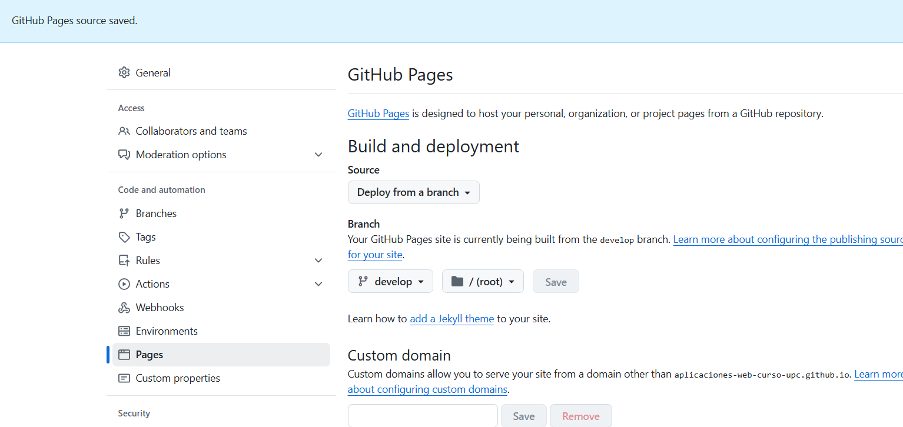
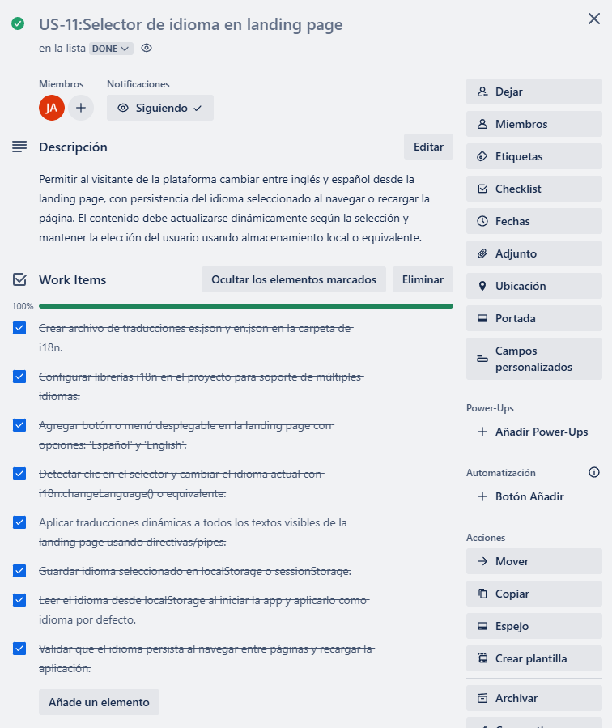
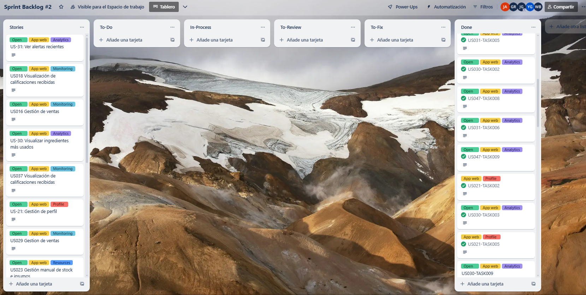
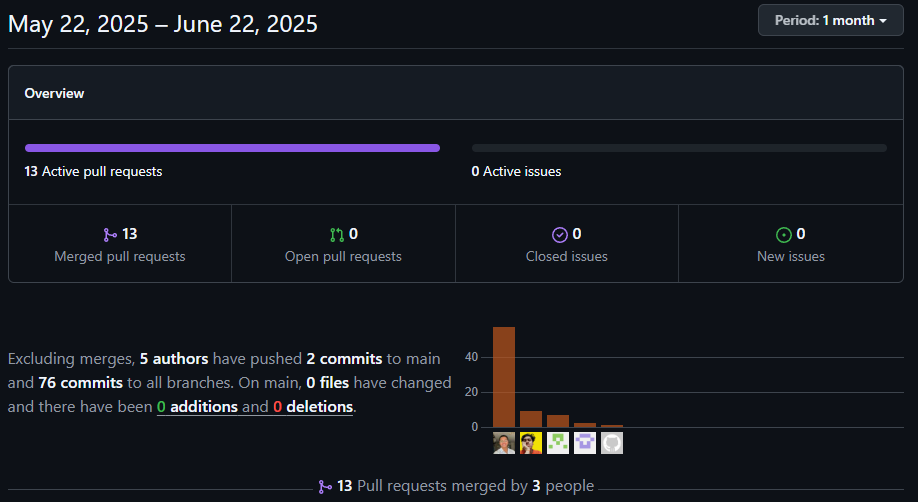
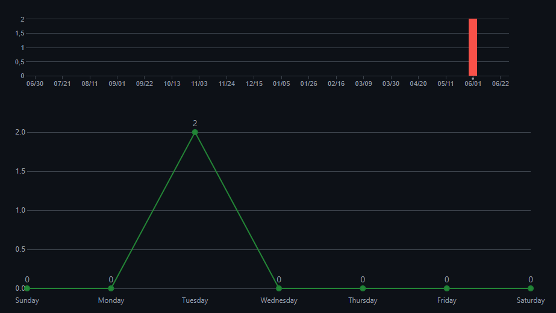

# Capítulo V: Product Implementation, Validation & Deployment

## 5.1. Software Configuration Management.

### 5.1.1 Software Development Environment Configuration

A continuación, se listan las herramientas y estándares adoptados por el equipo para el desarrollo colaborativo del sistema:

| Actividad               | Herramienta / Guía                                    | Propósito                                                     | Tipo de acceso / Ruta                                                                                                                 |
| ----------------------- | ------------------------------------------------------ | -------------------------------------------------------------- | ------------------------------------------------------------------------------------------------------------------------------------- |
| Project Management      | Trello                                                 | Seguimiento de backlog, tareas y sprints.                      | [https://trello.com/](https://trello.com/)                                                                                               |
| Requirements Management | Gherkin Conventions                                    | Escritura legible de requisitos con formato Given/When/Then.   | [https://cucumber.io/docs/gherkin/](https://cucumber.io/docs/gherkin/)                                                                   |
| Product UX/UI Design    | Figma                                                  | Prototipos y diseño responsive.                               | SaaS –[https://figma.com](https://figma.com)                                                                                            |
| Frontend Dev            | HTML, CSS, JavaScript, TypeScript, Angular             | Construcción del frontend del sistema.                        | [https://angular.io/guide/styleguide](https://angular.io/guide/styleguide)                                                               |
| Backend Dev             | Java + Spring Boot                                     | Lógica de negocio y servicios REST.                           | [https://spring.io/projects/spring-boot](https://spring.io/projects/spring-boot)                                                         |
| IDE                     | IntelliJ IDEA + WebStorm                               | Desarrollo, depuración y pruebas.                             | [https://www.jetbrains.com/idea](https://www.jetbrains.com/idea) / [https://www.jetbrains.com/webstorm](https://www.jetbrains.com/webstorm) |
| Code Standards          | Google Java Style Guide, Google TypeScript Style Guide | Mantener un código consistente y legible.                     | [https://google.github.io/styleguide](https://google.github.io/styleguide)                                                               |
| Version Control         | Git + GitHub                                           | Gestión colaborativa del código fuente.                      | SaaS –[https://github.com](https://github.com)                                                                                          |
| Software Deployment     | Github pages                                           | Despliegue continuo del sistema en ambientes de testing.       | SaaS –[https://railway.app](https://railway.app) / [https://render.com](https://render.com)                                                |
| Software Documentation  | Swagger                                                | Documentación de APIs, funcionalidades y criterios técnicos. | SaaS –[https://swagger.io/](https://swagger.io/)                                                                                        |

### 5.1.2. Source Code Management

En esta sección el equipo establece los medios y esquema de organización que aplicará para el seguimiento de modificaciones. Para ello se utilizará **GitHub** como plataforma y sistema de control de versiones.

A continuación se indican los URLs de los repositorios de GitHub para cada producto:

- **Landing Page**: [https://shorturl.at/wOqID](https://github.com/Desarrollo-de-App-Open-Source-Curso-UPC/UI-Topic-landing.git)
- **Web Services**: [https://shorturl.at/O4PHS](https://github.com/Desarrollo-de-App-Open-Source-Curso-UPC/UI-Topic-backend.git)
- _(Incluye el proyecto y los archivos de pruebas unitarias e integración/aceptación)_
- **Frontend Web Application**: [https://shorturl.at/tnpvh](https://github.com/Desarrollo-de-App-Open-Source-Curso-UPC/UI-Topic-frontend.git)

#### GitFlow Workflow

Se implementará el modelo de ramificación propuesto por Vincent Driessen en su artículo *“A successful Git branching model”*, conocido como **GitFlow**. Este modelo organiza el trabajo en las siguientes ramas:

- `main`: Rama principal, contiene siempre el código en producción.
- `develop`: Rama de desarrollo principal, donde se integran las funcionalidades antes de pasar a producción.
- `feature/*`: Ramas creadas a partir de `develop` para desarrollar nuevas funcionalidades.**Convención de nombres:** `feature/<nombre-corto-descriptivo>`_Ejemplo: `feature/login-auth`_
- `release/*`: Ramas creadas desde `develop` cuando se prepara una nueva versión para producción.**Convención de nombres:** `release/<versión>`_Ejemplo: `release/1.2.0`_
- `hotfix/*`: Ramas creadas desde `main` para corregir errores críticos en producción.
  **Convención de nombres:** `hotfix/<descripción-corta>`
  _Ejemplo: `hotfix/fix-payment-bug`_

#### Versionado Semántico

Se aplicará el esquema de **Semantic Versioning 2.0.0**, con el siguiente formato:

- **MAJOR**: Incompatibilidades en la API.
- **MINOR**: Nuevas funcionalidades sin romper compatibilidad.
- **PATCH**: Correcciones de errores menores y ajustes sin afectar funcionalidades.

_Ejemplo de versión:_ `v1.3.2`

#### Convenciones de Commits

Se utilizará el estándar de **Conventional Commits** para los mensajes de commits. Esto facilitará la automatización en los procesos de integración continua y generación de changelogs.

**Ejemplos:**

- `feat: add login functionality`
- `fix: correct null pointer exception on user service`
- `chore: update dependencies`

### 5.1.3. Source Code Style Guide & Conventions.

#### Frontend (Landing Page - HTML, CSS, JavaScript)

##### Convenciones generales:

- **Idioma**: Todo el código, incluyendo nombres de variables, funciones y clases, está escrito en **inglés**.
- **Indentación**: 2 espacios.
- **Formato de archivos**: `.html`, `.css`, `.js`
- **Estilo de código adoptado**:
  - [W3Schools HTML Style Guide](https://www.w3schools.com/html/html5_syntax.asp)
  - [Google HTML/CSS Style Guide](https://google.github.io/styleguide/htmlcssguide.html)

##### Nomenclatura:

- **Clases CSS**: `kebab-case` (ej. `main-container`)
- **IDs HTML**: `camelCase` (ej. `mainContent`)
- **Variables JS**: `camelCase` (ej. `userName`)
- **Funciones JS**: `camelCase` (ej. `handleClick()`)

#### Frontend Web App (Angular + TypeScript)

##### Convenciones generales:

- **Idioma**: Código completamente en **inglés**.
- **Estructura de carpetas**: Segregación por módulos y componentes.
- **Indentación**: 2 espacios.
- **Formato de archivos**: `.ts`, `.html`, `.css`

##### Estilo de código adoptado:

- [Angular Style Guide (Oficial)](https://angular.io/guide/styleguide)
- [Google TypeScript Style Guide](https://google.github.io/styleguide/tsguide.html)

##### Nomenclatura:

- **Componentes**: `PascalCase` (ej. `UserProfileComponent`)
- **Servicios**: `camelCase` + sufijo `Service` (ej. `authService`)
- **Interfaces**: `PascalCase`, prefijo `I` opcional (ej. `User`, `IUser`)
- **Archivos**: `kebab-case` (ej. `user-profile.component.ts`)
- **Variables y funciones**: `camelCase`

#### Backend (Java + Spring Boot)

##### Convenciones generales:

- **Idioma**: Código y documentación interna en **inglés**.
- **Indentación**: 4 espacios.
- **Formato de archivos**: `.java`

##### Estilo de código adoptado:

- [Google Java Style Guide](https://google.github.io/styleguide/javaguide.html)
- [Spring Boot Features &amp; Best Practices](https://docs.spring.io/spring-boot/docs/current/reference/html/features.html)

##### Nomenclatura:

- **Clases**: `PascalCase` (ej. `UserService`)
- **Variables**: `camelCase` (ej. `userRepository`)
- **Constantes**: `UPPER_SNAKE_CASE` (ej. `MAX_USERS`)
- **Endpoints**: `kebab-case` para URLs (ej. `/api/user-profile`)
- **Paquetes**: Todo en minúsculas y separados por punto (ej. `com.project.backend.controller`)

### 5.1.4. Software Deployment Configuration

Esta sección detalla los pasos necesarios para desplegar de forma satisfactoria los productos digitales que componen la solución: el landing page, la aplicación web (frontend) y los Web Services (backend), partiendo desde sus respectivos repositorios de código fuente.

**1. Landing Page - HTML, CSS y Javascript**

**Tecnología Base**

* Lenguajes: HTML5, CSS3, JavaScript
* Hosting: GitHub Pages

**Configuración y Despliegue**

* Repositorio de Código Fuente:
  La Landing Page se desarrolla utilizando HTML, CSS y JavaScript puro. Todos los archivos del proyecto deben subirse a un repositorio público en GitHub. Es obligatorio que el archivo `index.html` esté ubicado en la raíz del repositorio (`/`) para que GitHub Pages lo detecte correctamente como punto de entrada del sitio.

**Configuración del despliegue en GitHub Pages** :

* Acceder al repositorio en GitHub.
* Ir a la sección **Settings** del repositorio.
* En el menú lateral, seleccionar  **Pages** .
* En el campo  **Source** , elegir:
  * Rama: `main`
  * Carpeta: `/ (root)`
* Guardar los cambios.

**Publicación** :

Una vez guardada la configuración, GitHub generará automáticamente una URL pública donde la Landing Page estará disponible. Esta URL sigue el formato: `https://<usuario>.github.io/<repositorio>/`

**Actualizaciones** :

Cualquier nuevo commit hecho a la rama `main` será detectado automáticamente por GitHub Pages y aplicado en la versión publicada sin necesidad de acciones adicionales.

**2. Frontend Web Application – Angular**
**Tecnología Base**

* Framework: Angular
* Build Tool: Angular CLI (ng build)
* Hosting: GitHub Pages
* Configuración y Despliegue
  Repositorio vinculado:
  El proyecto frontend está alojado en GitHub y conectado directamente a GitHub Pages. Cada push en la rama principal dispara un nuevo despliegue automático.
* Build:
  GitHub Pages ejecuta automáticamente el comando ng build utilizando Angular CLI. El resultado (/dist) se utiliza como carpeta de salida para servir la aplicación web.
* Variables de entorno:
  Las URLs de los servicios REST del backend se configuran mediante variables de entorno en GitHub Pages y no están hardcodeadas.

**Entornos diferenciados:**

* Desarrollo: Angular se ejecuta localmente (ng serve) apuntando a un entorno de backend local o staging.
* Producción: El entorno de producción utiliza las variables configuradas en GitHub Pages, que apuntan al backend desplegado en Render.

**Integración con backend:**
El frontend se comunica con el backend a través de HTTP consumiendo la API REST pública expuesta desde Render. Se realiza control de errores y carga de recursos asincrónicos desde los endpoints definidos.

**3. Web Services – Java Spring Boot**

**Tecnología Base**

* Framework: Spring Boot
* Lenguaje: Java 21
* Build Tool: Maven
* Contenedorización: Docker
* Base de datos: MySQL (freesqldatabase.com)
* Hosting: Render

**Configuración y Despliegue**

* Contenerización:
  El proyecto backend incluye un archivo Dockerfile que define la imagen a construir. Esta imagen es utilizada por Render para levantar el contenedor de aplicación.
* Repositorio vinculado:
  El servicio se despliega directamente desde un repositorio Git (GitHub) vinculado a Render. Render detecta el Dockerfile y construye la imagen automáticamente.
* Configuración de variables de entorno:
  Las credenciales para la conexión a la base de datos MySQL en freesqldatabase.com se configuran como variables de entorno en Render, tales como:

  DB_HOST

  DB_PORT

  DB_NAME

  DB_USERNAME

  DB_PASSWORD
* Acceso a la base de datos:
  Se utiliza una base de datos MySQL gratuita alojada en freesqldatabase.com. Los parámetros de conexión son definidos mediante variables de entorno y referenciados en el archivo application.properties o application.yml.
* Exposición de servicios:
  La aplicación expone una API RESTful que es consumida por el frontend. Todos los endpoints siguen la convención REST y están documentados a través del contrato OpenAPI.
* Deploy automático:
  Cada vez que se hace un push a la rama principal del repositorio, Render ejecuta un nuevo despliegue utilizando el Dockerfile, sin necesidad de configurar un pipeline de CI/CD adicional.

## 5.2. Landing Page, Services & Applications Implementation

### 5.2.1 Sprint 1

#### 5.2.1.1. Sprint Planning 1

A continuación, se presenta la planificación correspondiente a nuestro Sprint 1, el cual tiene como enfoque principal el desarrollo de la landing page de Restock. En esta etapa inicial, el equipo definió el objetivo del sprint, seleccionó las historias de usuario más relevantes y estableció los entregables clave que permitirán construir una primera versión funcional y visualmente atractiva de la página. Esta planificación busca asegurar un entendimiento compartido entre todos los miembros del equipo y sentar las bases para comunicar eficazmente el valor de la plataforma a los usuarios potenciales.

| Sprint #                             | Sprint 1                                                                                                                                                                                                                                                                                                                                                                                                                                                                                                                              |
| ------------------------------------ | ------------------------------------------------------------------------------------------------------------------------------------------------------------------------------------------------------------------------------------------------------------------------------------------------------------------------------------------------------------------------------------------------------------------------------------------------------------------------------------------------------------------------------------- |
| **Sprint Planning Background** |                                                                                                                                                                                                                                                                                                                                                                                                                                                                                                                                       |
| Date                                 | 2025-04-23                                                                                                                                                                                                                                                                                                                                                                                                                                                                                                                            |
| Time                                 | 19:00 pm (GMT-5)                                                                                                                                                                                                                                                                                                                                                                                                                                                                                                                      |
| Location                             | Modalidad remota mediante la plataforma Discord                                                                                                                                                                                                                                                                                                                                                                                                                                                                                       |
| Prepared By                          | Shapiama Rivera, Gabriela Nicole                                                                                                                                                                                                                                                                                                                                                                                                                                                                                                      |
| Attendees (to planning meeting)      | Avendaño Balarezo, Williams Eduardo / Castro Alejos / Julio, Guerra Perez, José Jahaziel / Guzmán Cabrejos, Yaku Mateo / Shapiama Rivera, Gabriela Nicole                                                                                                                                                                                                                                                                                                                                                                          |
| Sprint 0 Review Summary              | Dado que este es el sprint inicial, no se presenta un resumen del sprint anterior.                                                                                                                                                                                                                                                                                                                                                                                                                                                    |
| Sprint 0 Retrospective Summary       | Dado que este es el sprint inicial, no se presenta una retroalimentación del sprint anterior.                                                                                                                                                                                                                                                                                                                                                                                                                                        |
| **Sprint Goal & User Stories** |                                                                                                                                                                                                                                                                                                                                                                                                                                                                                                                                       |
| Sprint 1 Goal                        | Nos enfocamos en implementar la estructura principal y las funcionalidades clave de la landing page pública de Restock.<br />Creemos que esto aportará una percepción más sólida del producto y despertará mayor interés entre los usuarios potenciales, al comunicar de forma clara el valor y los beneficios de la plataforma.<br />Esto se confirmará cuando los visitantes puedan navegar de manera fluida por la página, comprendan fácilmente qué ofrece Restock y muestren intención de interactuar o registrarse. |
| Sprint 1 Velocity                    | 18 puntos                                                                                                                                                                                                                                                                                                                                                                                                                                                                                                                             |
| Sum of Story Points                  | 18 puntos                                                                                                                                                                                                                                                                                                                                                                                                                                                                                                                             |

#### 5.2.1.2 Aspect Leaders and Collaborators

##### Aspect Leaders and Collaborators

Durante el Sprint 1, se han definido los principales aspectos a desarrollar, correspondientes a funcionalidades específicas como la visualización de contenido, navegación fluida, adaptabilidad responsiva y gestión de autenticación de usuarios.

Con el objetivo de asegurar una comunicación clara y eficiente dentro del equipo, se elaboró la siguiente matriz de liderazgo y colaboración (LACX), asignando para cada aspecto un líder responsable (L) y colaboradores de apoyo (C).

| Team Member (Last Name, First Name) | GitHub Username    | Questions and Tutorial | About us | Benefits | Testimonials | Contact and Download |
| :---------------------------------- | :----------------- | :--------------------- | :------- | :------- | :----------- | :------------------- |
| Vendaño Balarezo, Williams Eduardo | dev-willy-code     | L                      | C        | C        | C            | C                    |
| Castro Alejos, Julio                | JulioXC4           | C                      | L        | C        | C            | C                    |
| Guerra Perez, José Jahaziel        | jahazielgp         | C                      | C        | L        | C            |                      |
| Guzmán Cabrejos, Yaku Mateo        | yak-cod            | C                      | C        | C        | L            | C                    |
| Shapiama Rivera, Gabriela Nicole    | GabrielaShapiama28 | C                      | C        | C        | C            | L                    |

#### 5.2.1.3 Sprint Backlog 1

El objetivo principal de este Sprint es diseñar, implementar y validar las secciones del landing page, asegurando una navegación fluida, una experiencia responsiva en todos los dispositivos y funcionalidades críticas como registro, inicio de sesión y recuperación de contraseña. Se busca garantizar que el usuario final pueda interactuar de manera sencilla y eficiente con la plataforma, mejorando su satisfacción y promoviendo el cumplimiento de los objetivos de negocio.


[[Enlace al Trello](https://trello.com/invite/b/680c05f1fac416bfdb0ea024/ATTI41428da9336a1d11b0878438a247c3531DFD7E76/sprint-backlog-1)]

| User Story ID | User Story Title                                                          | Task ID | Task Title                                     | Task Description                                                                                                                                                                                             | Estimated Hours |
| ------------- | ------------------------------------------------------------------------- | ------- | ---------------------------------------------- | ------------------------------------------------------------------------------------------------------------------------------------------------------------------------------------------------------------ | --------------- |
| US-001        | Ver testimonios de clientes                                               | T001    | Diseño de la Sección de Testimonios          | Diseñar una sección visualmente destacada para testimonios.                                                                                                                                                | 1/2h           |
|               |                                                                           | T002    | Implementación de Testimonios                 | Mostrar mínimo tres testimonios con nombre, rol y comentario.                                                                                                                                               | 1h              |
|               |                                                                           | T003    | Armonización de Estilos UI                    | Aplicar estilos consistentes (tipografía, colores, disposición).                                                                                                                                           | 1/2h            |
| US-0002       | Consultar Preguntas Frecuentes                                            | T004    | Definición de Preguntas Frecuentes            | Definir al menos tres preguntas frecuentes con sus respuestas claras y breves.                                                                                                                               | 1/2h            |
|               |                                                                           | T005    | Integración de Contenido Estático en FAQ     | Incluir las preguntas y respuestas directamente en el contenido estático de la sección FAQ.                                                                                                                | 1h              |
|               |                                                                           | T006    | Asegurar Visibilidad Directa de Respuestas FAQ | Verificar que las respuestas estén visibles de forma directa sin necesidad de interacción.                                                                                                                 | 1/2h            |
| US-003        | Consultas directas al equipo de la plataforma                             | T007    | Diseño de Formulario de Contacto                                   | Diseñar un formulario limpio con campos de nombre, correo y mensaje.                                                                                                                                        | 1/2h            |
|               |                                                                           | T008    | Implementación de Validación Visual en Formulario                                   | Aplicar validación visual (mensajes de error si faltan datos).                                                                                                                                              | 1h              |
|               |                                                                           | T009    | Mensaje de Confirmación de Envío de Formulario                                   | Mostrar un mensaje de confirmación claro tras el envío.                                                                                                                                                    | 1/2h            |
| US-004        | Visualización persistente de información institucional en todo el sitio | T010    | Implementación de Footer Fijo                                   | Implementar una sección fija en el pie de página con enlaces a redes sociales, contacto y aviso legal.                                                                                                     | 1/2h            |
|               |                                                                           | T011    | Creación de Sección "Términos y Condiciones"                                   | Crear la sección de "Términos y Condiciones" con contenido legal claro y accesible.                                                                                                                        | 1h              |
|               |                                                                           | T012    | Visibilidad Global de Información Institucional                                   | Asegurar que la sección de información institucional esté visible en todas las vistas públicas del sitio.                                                                                                | 1/2h            |
| US-005        | Acceso a secciones principales del sitio                                  | T013    | Definición de Rutas Internas                                   | Definir y estructurar las rutas internas para las secciones: Inicio, Beneficios, Cómo funciona y Contacto.                                                                                                  | 1/2h            |
|               |                                                                           | T014    | Implementación de Menú de Navegación Principal                                   | Implementar un menú de navegación accesible desde la página principal que enlace a las secciones principales del sitio.                                                                                   | 1h              |
|               |                                                                           | T015    | Verificación de Redirección de Enlaces de Navegación                                   | Asegurar que cada enlace de navegación redirija correctamente a su respectiva sección dentro del sitio.                                                                                                    | 1/2h            |
| US-006        | Conocer el funcionamiento general de la plataforma                        | T016    | Definición de Contenido de Etapas Explicativas                                   | Definir el contenido de las cuatro etapas que explican el funcionamiento general de la plataforma. explicativo'.                                                                                             | 1/2h            |
|               |                                                                           | T017    | Estructuración de Sección "Cómo Funciona"                                   | Estructurar la sección informativa que describa paso a paso cómo utilizar la plataforma.                                                                                                                   | 1h              |
|               |                                                                           | T018    | Implementación Visual de Etapas Secuenciales                                   | Implementar la visualización de las cuatro etapas de forma secuencial y clara dentro del sitio.                                                                                                             | 1/2h            |
| US-007        | Opción de comprender el funcionamiento mediante recurso audiovisual      | T019    | Estructura para Visualización de Video Explicativo                                   | Implementación de estructura necesarios para asegurar que el video explicativo se muestre correctamente                                                                                                     | 1/2h            |
| US-008        | Comprensión del propósito y valor desde el inicio                       | T020    | Estructura para Visualización de Beneficios Generales                                   | Implementación de estructura necesarios para asegurar que los beneficios se muestren correctamente                                                                                                          | 2h              |
| US-009        | Visualización de beneficios según perfil de usuario                     | T025    | Estructura para Visualización de Beneficios Personalizados                                   | Implementación de estructura necesarios para asegurar que los beneficios adaptados a mi perfil se muestre correctamente.                                                                                    | 1/2h            |
| US-011        | Selección de idioma para una experiencia personalizada                   | T028    | Preparación de Contenido Multilingüe (ES/EN)                                   | Preparar el contenido de la landing page y web application en dos idiomas (español e inglés).                                                                                                              | 1h              |
|               |                                                                           | T029    | Implementación de Selector de Idioma                                   | Implementar botón que permita cambiar entre ambos idiomas.                                                                                                                                                  | 1/2h            |
|               |                                                                           | T030    | Persistencia de Selección de Idioma                                   | Guardar la selección del idioma para que se mantenga al recargar la página.                                                                                                                                | 1h              |
| US012         | Navegación accesible para personas con discapacidad visual               | T031    | Diseño de Navegación Fluida                                   | Crear diseño visual para 'navegación fluida entre secciones'.                                                                                                                                              | 1/2h            |
|               |                                                                           | T032    | Codificación de Componente de Navegación Fluida                                   | Codificar el componente necesario para 'navegación fluida entre secciones'.                                                                                                                                 | 1h              |
|               |                                                                           | T033    | Verificación de Navegación Fluida                                   | Verificar que 'navegación fluida entre secciones' funcione correctamente.                                                                                                                                   | 1/2h            |
| US-013        | Optimización para pantallas de escritorio                                | T034    | Definición de Breakpoint para Desktop                                   | Definir breakpoint específico para resolución ≥ 1280px en hoja de estilos principal (ej. media queries o framework CSS utilizado)                                                                         | 1/2h            |
|               |                                                                           | T035    | Ajuste de Layout Principal para Desktop                                   | Reorganizar layout principal (header, sidebar, content) para aprovechar el espacio horizontal sin superposición ni columnas colapsadas                                                                      | 1h              |
|               |                                                                           | T036    | Mejora de Legibilidad en Desktop                                   | Ajustar tipografía, padding y márgenes para mejorar legibilidad en pantallas grandes                                                                                                                       | 1/2h            |
| US-014        | Optimización para pantallas de tablet                                    | T037    | Definición de Breakpoint para Tablets/Laptops                                   | Definir breakpoint específico para resolución ≥ 1024px en hoja de estilos principal (ej. media queries o framework CSS utilizado)                                                                         | 1h              |
|               |                                                                           | T038    | Ajuste de Layout Principal para Tablets/Laptops                                   | Reorganizar layout principal (header, sidebar, content) para aprovechar el espacio horizontal sin superposición ni columnas colapsadas                                                                      | 1/2h            |
|               |                                                                           | T039    | Mejora de Legibilidad en Tablets/Laptops                                   | Ajustar tipografía, padding y márgenes para mejorar legibilidad en pantallas grandes                                                                                                                       | 1/2h            |
| US-015        | Optimización para dispositivos móviles                                  | T040    | Definición de Breakpoint para Tablets                                   | Definir breakpoint específico para resolución ≥ 768px en hoja de estilos principal (ej. media queries o framework CSS utilizado)                                                                          | 1/2h            |
|               |                                                                           | T041    | Ajuste de Layout Principal para Tablets                                   | Reorganizar layout principal (header, sidebar, content) para optimizar el espacio horizontal                                                                                                                 | 1h              |
|               |                                                                           | T042    | Mejora de Legibilidad en Tablets                                   | Ajustar tipografía, padding y márgenes para mejorar legibilidad en pantallas pequeñas                                                                                                                     | 1/2h            |
| US-016        | Navegación fluida entre secciones                                        | T043    | Implementación de Transiciones de Navegación Fluidas                                   | Implementar una experiencia de navegación fluida y sin interrupciones entre las diferentes secciones de la aplicación, garantizando transiciones rápidas, suaves y coherentes con la interfaz de usuario. | 2h              |

#### 5.2.1.4. Development Evidence for Sprint Review

Durante el Sprint 1, el equipo se enfocó exclusivamente en el desarrollo de la Landing Page de la plataforma Restock.
El objetivo principal fue construir una página pública funcional, atractiva visualmente y completamente responsiva, que comunique eficazmente la propuesta de valor de la plataforma a los usuarios potenciales.
A lo largo del Sprint se diseñaron e implementaron secciones clave como Hero, Sobre Nosotros, Beneficios, Testimonios, Preguntas Frecuentes, Tutoriales, Contacto y el Footer.
También se trabajó en asegurar la adaptabilidad móvil, el cumplimiento de criterios de accesibilidad y la optimización inicial para motores de búsqueda (SEO).

| Repository                        | Branch                             | Commit Id | Commit Message                                                                  | Commit Message Body                                                                            | Commited on (Date) |
| --------------------------------- | ---------------------------------- | --------- | ------------------------------------------------------------------------------- | ---------------------------------------------------------------------------------------------- | ------------------ |
| GabrielaShapiama/UI-Topic-landing | feature/acces                      | f3de2d0   | fix(access): remove incorrect image.                                            | Removed an incorrect image that was incorrectly placed in the access module.                   | 26-04-2025         |
| Yaku Guzman/UI-Topic-landing      | feature/tutorial-section           | 1c1d5e2   | fix(tutorial-section): fix tutorial links width                                 | Fixed the width issue affecting the layout of tutorial links on different screens.             | 26-04-2025         |
| Williams/UI-Topic-landing         | feature/seo-tags-meta-tags         | b50e3c3   | feat(seo-tags-meta-tags): adding seo tags and meta tags                         | Added SEO and meta tags to improve page indexing and online visibility.                        | 26-04-2025         |
| JulioXC4/UI-Topic-landing         | feature/voice-reader-accessibility | 936c01d   | feat(voice): add file voice.js                                                  | Added a new JavaScript file to handle voice-related functionalities.                           | 26-04-2025         |
| JulioXC4/UI-Topic-landing         | feature/language-toggle            | 5bf2a4f   | feat(navbar): add language switch icon and console log for future functionality | Introduced a language switcher icon and set up console logs for future multi-language support. | 26-04-2025         |
| GabrielaShapiama/UI-Topic-landing | feature/acces                      | 4fd9958   | fix(access): fix text position.                                                 | Adjusted the text alignment issues on the access screen.                                       | 26-04-2025         |
| GabrielaShapiama/UI-Topic-landing | feature/acces                      | a9b89b2   | fix(access): remove incorrect css.                                              | Removed unnecessary or incorrect CSS rules from the access styles.                             | 26-04-2025         |
| GabrielaShapiama/UI-Topic-landing | feature/acces                      | c0f15db   | style(access): change buttons format.                                           | Updated the button styles to align with the platform's visual guidelines.                      | 25-04-2025         |
| jahazielgp/UI-Topic-landing       | feature/fix-navbar                 | e293098   | fix(navbar): fix navbar.                                                        | Fixed layout and functionality issues in the navigation bar.                                   | 25-04-2025         |
| jahazielgp/UI-Topic-landing       | feature/benefits-section           | d6cee23   | feat(benefits): add benefits section.                                           | Added HTML and CSS structure for the Benefits section.                                         | 25-04-2025         |
| Yaku Guzman/UI-Topic-landing      | feature/tutorial-section           | 4d7e12d   | fix(tutorial-section): add tutorial css file                                    | Added a dedicated CSS file to improve the Tutorial section styling.                            | 25-04-2025         |
| Yaku Guzman/UI-Topic-landing      | feature/footer-section             | a3187cc   | fix(footer-section): fix link to css                                            | Fixed broken or incorrect link to the footer’s CSS file.                                      | 25-04-2025         |
| Williams/UI-Topic-landing         | feature/preguntas                  | c307001   | fix(preguntas): adding other files                                              | Added missing assets and files needed for the FAQ section.                                     | 25-04-2025         |
| Williams/UI-Topic-landing         | feature/preguntas                  | 057ba2e   | fix(preguntas): adding add dropdown menu                                        | Implemented the dropdown functionality for the FAQ section.                                    | 25-04-2025         |
| GabrielaShapiama/UI-Topic-landing | feature/access                     | 57c525a   | feat(access): add navebar.                                                      | Created and styled the navbar for the access page.                                             | 25-04-2025         |
| GabrielaShapiama/UI-Topic-landing | feature/access                     | 1269f12   | chore(access): translate some comments.                                         | Translated developer comments into English for better clarity.                                 | 25-04-2025         |
| GabrielaShapiama/UI-Topic-landing | feature/access                     | e48c646   | fix(access): remove incorrect function.                                         | Removed a non-functional or unnecessary JavaScript function.                                   | 25-04-2025         |
| GabrielaShapiama/UI-Topic-landing | feature/access                     | 84764de   | feat(access): add recovery password logic.                                      | Implemented logic for the password recovery feature.                                           | 25-04-2025         |
| GabrielaShapiama/UI-Topic-landing | feature/access                     | f787614   | feat(access): add access to plataform.                                          | Added login and basic access functionality to the platform.                                    | 25-04-2025         |
| Williams/UI-Topic-landing         | feature/descargar                  | 06f232a   | fix(descargar): make section fully responsive for all screen sizes              | Made the Descargar section fully responsive across all devices.                                | 25-04-2025         |
| Yaku Guzman/UI-Topic-landing      | feature/footer-section             | ef64a65   | fix(footer-section): fix vh                                                     | Adjusted viewport height (vh) settings in the footer section.                                  | 23-04-2025         |
| Yaku Guzman/UI-Topic-landing      | feature/footer-section             | 5bcde82   | feat(tutorial-section): add tutorial section                                    | Built the complete Tutorial section (HTML and CSS).                                            | 23-04-2025         |
| Yaku Guzman/UI-Topic-landing      | feature/footer-section             | 7ecf4f2   | fix(footer-section): fix responsive                                             | Fixed responsiveness issues in the footer layout.                                              | 23-04-2025         |
| Yaku Guzman/UI-Topic-landing      | feature/footer-section             | 1dea22f   | feat(contacto-section): add responsive                                          | Made the Contact section fully responsive.                                                     | 23-04-2025         |
| Williams/UI-Topic-landing         | feature/descargar                  | e4598c3   | feat(descargar): create descargar section(html,css)                             | Created the Download section with full HTML and CSS styling.                                   | 22-04-2025         |
| Williams/UI-Topic-landing         | feature/preguntas                  | 64f1af0   | feat(preguntas): create preguntas frecuentes(html,css)                          | Developed the FAQ (Preguntas Frecuentes) section structure and style.                          | 22-04-2025         |
| Williams/UI-Topic-landing         | feature/testimonios                | 74f270e   | fix(testimonios): moving section to main tag                                    | Moved the Testimonials section to the main content area for better semantics.                  | 22-04-2025         |
| Williams/UI-Topic-landing         | feature/testimonios                | 9e3685a   | fix(testimonios): updating testimonios(html)                                    | Updated the Testimonials section HTML content.                                                 | 22-04-2025         |
| Yaku Guzman/UI-Topic-landing      | feature/footer-section             | cdc23c1   | feat(footer-section): add responsive                                            | Implemented responsive behavior for the footer section.                                        | 22-04-2025         |
| jahazielgp/UI-Topic-landing       | feature/about-us-section           | 71e82c6   | feat(about-us): add about-us section.                                           | Added the About Us section including structure and initial styling.                            | 22-04-2025         |
| Yaku Guzman/UI-Topic-landing      | feature/footer-section             | 7bb7da7   | feat(footer-section): add icons                                                 | Added social media icons into the footer layout.                                               | 22-04-2025         |
| jahazielgp/UI-Topic-landing       | feature/develop                    | f6e104a   | chore: refactor directories.                                                    | Restructured project folders for better organization and scalability.                          | 21-04-2025         |
| Williams/UI-Topic-landing         | feature/testimonios                | 27377d0   | feat(testimonios): add testimonios(html,css,img)                                | Created the Testimonials section including text and images.                                    | 21-04-2025         |
| Yaku Guzman/UI-Topic-landing      | feature/contacto-section           | b469827   | feat(contacto-section): add contacto html and css                               | Built the Contact section with full HTML and CSS.                                              | 21-04-2025         |
| Yaku Guzman/UI-Topic-landing      | feature/footer-section             | efd9aac   | feat(footer/section): add footer html and css                                   | Implemented the complete Footer section including structure and styles.                        | 21-04-2025         |
| jahazielgp/UI-Topic-landing       | feature/hero-section               | 9341bde   | feat(hero-section): add responsive design.                                      | Made the Hero section fully responsive for mobile and desktop.                                 | 20-04-2025         |
| jahazielgp/UI-Topic-landing       | feature/hero-section               | 7746107   | feat(hero-section): add hero html, css and js components.                       | Built the Hero section with its respective HTML, CSS, and JavaScript.                          | 20-04-2025         |
| jahazielgp/UI-Topic-landing       | feature/develop                    | 303ad89   | chore: initial commit                                                           | Project initialization with base structure.                                                    | 20-04-2025         |
| jahazielgp/UI-Topic-landing       | main                               | 556268a   | Initial commit                                                                  | Setup initial project files and base structure.                                                | 02-04-2025         |

#### Productos según alcance del Sprint:

##### Landing Page

Durante el Sprint 1 se implementó la Landing Page de Restock.
Los principales avances fueron:

- Diseño responsivo para diferentes tamaños de pantalla.
- Creación de secciones: Hero, Sobre Nosotros, Beneficios, Testimonios, Preguntas Frecuentes, Tutorial, Contacto y Footer.
- Aplicación de buenas prácticas de accesibilidad (etiquetado semántico, contraste adecuado).
- Optimización inicial para motores de búsqueda (SEO básico).
- Implementación de navegación fluida entre secciones.
- Validación de compatibilidad en navegadores y dispositivos.

#### 5.2.1.5 Execution Evidence for Sprint Review

A continuación, se presenta el video de la landing page. Este muestra la interacción principal de los usuarios con la plataforma, destacando los flujos de navegación, diseño responsivo y la estructura general de la aplicación.

**Video de landing page:**

[https:/linkcuts.org/5rwvpm3k](https:/linkcuts.org/5rwvpm3k)

#### 5.2.1.6 Services Documentation Evidence for Sprint Review

Durante este sprint se completó el diseño e implementación del Landing Page del sistema, el cual forma parte del acceso inicial al sistema y constituye un punto de entrada fundamental para los usuarios. Aunque no se implementaron endpoints tradicionales de tipo REST en este sprint, se documenta a continuación la URL del recurso publicado, junto con evidencia de despliegue, interacción y commits relacionados.

**Descripción del Logro:**

-Implementación del Landing Page estático.

-Deployment del landing page.

### Recursos del Sprint

| Recurso      | Acción implementada   | Método HTTP | URL / Endpoint                                                              | Link de repositorio                                                         |
| ------------ | ---------------------- | ------------ | --------------------------------------------------------------------------- | --------------------------------------------------------------------------- |
| Landing Page | Visualización inicial | GET          | https://desarrollo-de-app-open-source-curso-upc.github.io/UI-Topic-landing/ | https://github.com/Desarrollo-de-App-Open-Source-Curso-UPC/UI-Topic-landing |

#### 5.2.1.7. Software Deployment Evidence for Sprint Review.

Durante este Sprint, se realizaron actividades de despliegue de la Landing Page utilizando GitHub Pages como plataforma de hosting. A continuación, se detallan los pasos ejecutados:

**1- Se accedió a la sección Settings del repositorio.**

Dentro de Pages, se seleccionó la rama (main o master) y la carpeta (root o /docs) desde la cual GitHub Pages debía publicar el sitio.
Se guardaron los cambios para activar la publicación automática.



**2- Por default ya esta activado el https**


**3- En la seccion "All workflows" se puede ver que la app se esta deployando.**


**4- El landing page fue exitosamente deployado**


**5- Se obtuvo y verificó la URL pública proporcionada por GitHub Pages.**


#### 5.2.1.8 Team Collaboration Insights during Sprint

##### Desarrollo de las Actividades de Implementación

Durante el Sprint 1, el equipo de Restock se enfocó en el desarrollo de la **Landing Page**.
Las actividades de implementación se llevaron a cabo de la siguiente manera:

- Se crearon ramas específicas para cada sección o funcionalidad (`feature/[nombre-de-seccion]`), permitiendo un trabajo paralelo organizado.
- Cada miembro del equipo asumió la responsabilidad de desarrollar una o más secciones de la Landing Page.
- Se realizaron commits frecuentes, registrando avances de manera continua y detallada.
- Las funcionalidades desarrolladas se integraron mediante Pull Requests hacia la rama `develop`.
- Se mantuvo una comunicación constante mediante la plataforma Discord para coordinar avances y resolver dudas en tiempo real.
- Se aplicaron buenas prácticas de programación, control de versiones y colaboración en equipo.

Gracias a esta organización, se logró cumplir de manera efectiva el objetivo del sprint, garantizando que todos los integrantes contribuyeran de forma activa en el desarrollo de la Landing Page.

##### Evidencia de Colaboración en GitHub

Se presenta a continuación la captura de los insights del repositorio de GitHub, correspondiente al Sprint 1:


**Insights:**

- **26 Pull Requests** fusionados correctamente.
- **5 autores** contribuyendo al repositorio.
- **39 commits** realizados en el periodo del Sprint.
- Participación activa de todos los miembros asignados al desarrollo de la Landing Page.

### 5.2.2 Sprint 2

#### 5.2.2.1. Sprint Planning 2

| Sprint #                             | Sprint 2                                                                                                                                                                                                                                                                                                                                                                                                                                                                                                                                                                                                                                                                                                                                                                                           |
| ------------------------------------ | -------------------------------------------------------------------------------------------------------------------------------------------------------------------------------------------------------------------------------------------------------------------------------------------------------------------------------------------------------------------------------------------------------------------------------------------------------------------------------------------------------------------------------------------------------------------------------------------------------------------------------------------------------------------------------------------------------------------------------------------------------------------------------------------------- |
| **Sprint Planning Background** |                                                                                                                                                                                                                                                                                                                                                                                                                                                                                                                                                                                                                                                                                                                                                                                                    |
| Date                                 | 2025-05-05                                                                                                                                                                                                                                                                                                                                                                                                                                                                                                                                                                                                                                                                                                                                                                                         |
| Time                                 | 07:00 pm (GMT-5)                                                                                                                                                                                                                                                                                                                                                                                                                                                                                                                                                                                                                                                                                                                                                                                   |
| Location                             | Modalidad remota mediante la plataforma Discord                                                                                                                                                                                                                                                                                                                                                                                                                                                                                                                                                                                                                                                                                                                                                    |
| Prepared By                          | Guzmán Cabrejos, Yaku Mateo                                                                                                                                                                                                                                                                                                                                                                                                                                                                                                                                                                                                                                                                                                                                                                       |
| Attendees (to planning meeting)      | Avendaño Balarezo, Williams Eduardo / Castro Alejos, Julio / Guerra Perez, José Jahaziel / Guzmán Cabrejos, Yaku Mateo / Shapiama Rivera, Gabriela Nicole                                                                                                                                                                                                                                                                                                                                                                                                                                                                                                                                                                                                                                       |
| Sprint 1 Review Summary              | Durante el Sprint 1 se logró implementar casi en su totalidad la Landing Page del sistema Restock, desarrollando secciones clave como el header, footer, sección de beneficios y preguntas frecuentes, así como la integración inicial de estilos globales y tipografía. Quedó faltante la funcionalidad de cambio de idioma, la cual será prioridad para el siguiente sprint. El equipo cumplió con los entregables establecidos, respetando el diseño de mockups y la guía de estilos. Se identificaron oportunidades de mejora en la velocidad de desarrollo y gestión de tiempos.                                                                                                                                                                                                   |
| Sprint 1 Retrospective Summary       | Durante el Sprint 1, el equipo logró avanzar de forma coordinada y efectiva en el desarrollo de la landing page, sin enfrentar mayores dificultades. Cada integrante cumplió puntualmente con las secciones asignadas, lo que permitió avanzar según lo planificado. La adopción de convenciones comunes en el código y el diseño contribuyó a mantener la coherencia del producto y facilitó la integración entre partes. Como mejora para el siguiente sprint, se acordó implementar revisiones diarias (daily reviews) que permitan alinear mejor los avances, detectar bloqueos tempranos y mejorar la comunicación continua entre miembros.                                                                                                                                       |
| **Sprint Goal & User Stories** |                                                                                                                                                                                                                                                                                                                                                                                                                                                                                                                                                                                                                                                                                                                                                                                                    |
| Sprint 2 Goal                        | Nuestro enfoque está en  brindar información clara y detallada a los visitantes de la plataforma, así como habilitar la gestión de inventario, configuración de perfil, notificaciones, resumen de datos y gestión deventas para los usuarios del sistema  interno.<br />Creemos que esto proporciona  mayor comprensión del propósito de la solución a los visitantes y mejora la eficiencia operativa de insumos de los administradores de restaurantes y proveedores.<br />Esto se confirmará cuando  los visitantes puedan explorar contenido relevante desde el acceso  público, y los usuarios autenticados naveguen por el panel principal y accedan a los módulos de gestión de inventario, configuración de perfil, notificaciones, resumen de datos y ventas del sistema. |
| Sprint 2 Velocity                    | 45                                                                                                                                                                                                                                                                                                                                                                                                                                                                                                                                                                                                                                                                                                                                                                                                 |
| Sum of Story Points                  | 42                                                                                                                                                                                                                                                                                                                                                                                                                                                                                                                                                                                                                                                                                                                                                                                                 |

#### 5.2.2.2 Aspect Leaders and Collaborators

##### Aspect Leaders and Collaborators

Durante el Sprint 2,  se ha definido el desarrollo e integración de los módulos principales del frontend de la aplicación web interna  Restock , abarcando funcionalidades clave como la gestión de productos, pedidos, inventario y compras. Estas implementaciones buscan optimizar los procesos internos y mejorar la trazabilidad del inventario, brindando mayor eficiencia a los administradores de restaurantes y su personal.

Con el fin de mantener una coordinación efectiva y una comunicación fluida entre los integrantes del equipo, se estructuró la matriz de liderazgo y colaboración (LACX), donde se asignó un líder (L) encargado de cada funcionalidad y colaboradores (C) que brindan apoyo en su implementación.

<div style="font-size: 0.75em; overflow-x: auto;">

| Team Member (Last Name, First Name) | GitHub Username    | Configuración de perfil | Panel de suscripción | Notificaciones y calificaciones | Registro de ventas | Registro de proveedores | Inventario | Resumen de datos |
| :---------------------------------- | :----------------- | :----------------------- | :-------------------- | :------------------------------ | :----------------- | :---------------------- | :--------- | :--------------- |
| Vendaño Balarezo, Williams Eduardo | dev-willy-code     | C                        | L                     | C                               | C                  | C                       | C          | C                |
| Castro Alejos, Julio                | JulioXC4           | C                        | C                     | C                               | L                  | C                       | L          | C                |
| Guerra Perez, José Jahaziel        | jahazielgg         | C                        | C                     | L                               | C                  | C                       | C          | C                |
| Guzmán Cabrejos, Yaku Mateo        | yak-cod            | C                        | C                     | C                               | C                  | L                       | C          | L                |
| Shapiama Rivera, Gabriela Nicole    | GabrielaShapiama28 | L                        | C                     | C                               | C                  | C                       | C          | C                |

</div>

#### 5.2.2.3 Sprint Backlog 2

El objetivo principal de este Sprint es desarrollar la interfaz frontend de los dashboards para **administradores de restaurantes y proveedores**, enfocándose en una estructura clara, navegación eficiente y visualización adecuada de datos críticos.


Además, se realizaron mejoras en el *landing page*, incluyendo la implementación de un **toggle de idioma** (inglés/español) y la incorporación de **atributos de accesibilidad** como `aria-label` y `lang`, asegurando mayor inclusión y cumplimiento de estándares web.





Trello: [[https:/linkcuts.org/gmhr4kmc](https:/linkcuts.org/gmhr4kmc)]

| User Story ID | User Story Title                                      | Task ID | Task Title                | Task Description                                                                                          | Estimated Hours |
| ------------- | ----------------------------------------------------- | ------- | ------------------------- | --------------------------------------------------------------------------------------------------------- | --------------- |
| US-16         | Gestión de ventas                    | T001    | Formulario de Registro de Venta         | Diseñar la interfaz de formulario para registrar una venta (campos: ítems, cantidad, método de pago).                            | 1/2h          |
|               |                                                       | T002    | Confirmación de Venta Registrada | Mostrar confirmación de registro y resumen de venta registrada.               | 1h              |
| US-18         | Visualización de calificaciones recibidas                | T003    | Calificaciones por Orden         | Crear el layout general que contenga las calificaciones por orden completada.                           | 1/2h            |
|               |                                                       | T004    | Componente de Valoración | Crear componente para mostrar calificación y comentario.              | 1h              |
|               |                                                       | T005    | Manejo de Errores y Vacíos          | Validar estados vacíos o errores (sin calificaciones, error de conexión, etc.).                | 1/2h            |
|               |                                                       | T006    | Documentación: Vista de Calificaciones          | Documentar la vista de calificaciones, describiendo cómo se usa, qué datos muestra y cómo se integra con el backend.                | 1/2h            |
| US-11         | Gestión de perfil         | T007    | Editar mi Información         | Crear formulario editable con campos de su información.              | 1/2h            |
|               |                                                       | T008    | Vinculación de Formulario con Datos Simulados | Vincular formulario con datos simulados del perfil. | 1h              |
|               |                                                       | T009    | Validaciones Básicas          | Implementar validaciones básicas.   | 1/2h            |
|               |                                                       | T010    | Mensaje de Confirmación de Envío de Formulario          | Mostrar mensaje de confirmación tras guardar los cambios.   | 1/2h            |
|               |                                                       | T011    | Diseño Responsivo y Accesible          | Asegurar que el diseño sea responsivo y accesible.   | 1/2h            |
| US-04         | Gestión manual de stock e insumos                        | T012    | Formulario de Registro de Insumos         | Diseñar formulario para registrar insumos manualmente (nombre, tipo, cantidad, unidad de medida, fecha).                                    | 1/2h            |
|               |                                                       | T013    | Visualización del Stock Actual | Implementar vista con tabla dinámica que muestre el stock actual de insumos registrados.                       | 1h              |
|               |                                                       | T014    | Edición de Insumos | Permitir al usuario editar insumos existentes desde la vista de stock.                       | 1h              |
| US-12         | Visualizar ingredientes más usados                    | T015    | Maquetar vista del panel de control con selector de período         | Maquetar vista del panel de control con la opción de seleccionar el período de análisis (últimos 7 días, último mes, etc.).                                   | 2h            |
|               |                                                       | T016    | Simular datos de uso de ingredientes | Simular datos de uso de ingredientes con frecuencia (cantidad utilizada) para los períodos seleccionados (mock JSON).                      | 1/2h              |
|               |                                                       | T017    | Mostrar ingredientes más usados por período          | Mostrar un gráfico o lista con los ingredientes más usados durante el período seleccionado, incluyendo cantidad usada y nombre del ingrediente.                        | 2h            |
|               |                                                       | T018    | Funcionalidad para cambiar período de análisis          | Implementar funcionalidad para cambiar el período de análisis (últimos 7 días, último mes, etc.).                        | 1/2h            |
|               |                                                       | T019    | Actualizar datos según período seleccionado          | Actualizar los datos mostrados de acuerdo con el nuevo período de análisis seleccionado.                        | 1/2h            |
|               |                                                       | T020    | Cambio de período sin recarga de página          | Asegurar que el cambio de período sea dinámico y no requiera recargar la página.                        | 1h            |
|               |                                                       | T021    | Mejorar visualización de datos de ingredientes          | Asegurar que los datos de los ingredientes sean claros, visualmente atractivos y fáciles de interpretar.                        | 1/2h            |
|               |                                                       | T022    | Hacer vista responsiva y accesible          | Asegurar que la vista sea responsiva y accesible en dispositivos móviles y de escritorio.                        | 1h            |
|               |                                                       | T023    | Probar flujo completo con datos mock          | Probar el flujo completo de selección de período y visualización de ingredientes con datos falsos.                        | 1h            |
| US-13         | Ver alertas recientes                      | T024    | Maquetar vista de alertas recientes         | Maquetar vista de panel de alertas con lista de alertas recientes (por vencer, bajo stock, etc.).                                            | 2h            |
|               |                                                       | T025    | Simular alertas con datos mock | Simular alertas usando datos precargados (mock JSON) que incluyan información como tipo de alerta, nombre del producto, cantidad y fecha de vencimiento.                               | 1/2h              |
|               |                                                       | T026    | Mostrar alertas clasificadas por tipo          | Mostrar alertas clasificada por tipo (por vencimiento, bajo stock, etc.) con una visualización clara y accesible.                                 | 2h            |
|               |                                                       | T027    | Marcar alertas como revisadas          | Implementar la opción para que el administrador marque las alertas como "revisadas".                                 | 1h            |
|               |                                                       | T028    | Mover alertas revisadas a sección archivadas          | Al marcar una alerta como revisada, esta debe desaparecer del panel principal y pasar a una sección de "archivadas".                                 | 1/2h            |
|               |                                                       | T029    | Actualizar alertas dinámicamente al revisar          | Asegurar que el sistema actualice las alertas de manera dinámica al marcar una como revisada.                                 | 1h            |
|               |                                                       | T030    | Notificar al archivar una alerta          | Implementar mensajes de confirmación o notificación al archivarse una alerta.                                 | 1h            |
|               |                                                       | T031    | Responsividad de vista de alertas          | Asegurar que la vista sea responsiva y se adapte bien a dispositivos móviles y de escritorio.                                 | 2h            |
| US-05         | Gestión integral de notificaciones de inventario | T032    | Simular alertas con datos         | Generar un archivo JSON con datos falsos que incluyan tipo de alerta, producto, cantidad y fecha.                                     | 1/2h            |
|               |                                                       | T033    | 	Marcar alertas como revisadas | Permitir que el administrador marque las alertas como gestionadas (revisadas).                        | 2h              |
|               |                                                       | T034    | Responsividad de vista de alertas          | Asegurar que la interfaz de alertas se adapte correctamente a móviles y escritorio.                          | 2h            |
|               |                                                       | T035    | Priorizar alertas críticas          | Ordenar las alertas dando prioridad a las más urgentes (por cercanía de vencimiento o gravedad del stock).                          | 1/2h            |
| US-06         | Enviar comentarios y calificaciones sobre pedidos                   | T036    | Maquetar formulario de retroalimentación         | Diseñar la vista con campos para calificación (e.g. estrellas o 1–5) y comentario.                                                  | 2h              |
|               |                                                       | T037    | 	Validar entrega antes de permitir feedback | Implementar validación para permitir comentarios solo si el pedido está marcado como entregado.                                     | 1/2h            |
|               |                                                       | T038    | 	Validar datos del formulario          | Asegurar que la calificación esté en rango permitido y el comentario no esté vacío.                                       | 1h              |
|               |                                                       | T039    | Registrar feedback en el sistema | Guardar los datos del comentario y calificación y asociarlos al pedido y proveedor correspondientes.                                  | 2h              |
| US-07         | Gestionar productos en el inventario                   | T040    | Mostrar listado de productos         | Implementar vista para mostrar todos los productos registrados por el proveedor logueado.                                                  | 1/2h              |
|               |                                                       | T041    | Maquetar formulario de nuevo producto          | Diseñar formulario con campos: nombre, descripción, categoría y precio unitario.                                    | 1/2h            |
|               |                                                       | T042    | Validar datos al registrar producto          | Verificar que todos los campos obligatorios estén completos y sean válidos.                                    | 1/2h            |
|               |                                                       | T043    | Registrar nuevo producto en catálogo          | Enviar y guardar nuevo producto en el sistema, asociándolo al proveedor.                                    | 2h            |
|               |                                                       | T044    | Mostrar mensaje de éxito o error          | Notificar visualmente si el producto fue registrado correctamente o si hubo un error.                                    | 1h            |
|               |                                                       | T045    | Editar producto existente          | Permitir modificar nombre, descripción, categoría o precio de un producto.                                    | 1/2h            |
|               |                                                       | T046    | Guardar cambios al editar producto          | Validar cambios y actualizar producto en el sistema.                                    | 1h            |
|               |                                                       | T047    | Eliminar producto          | Permitir al proveedor eliminar un producto con confirmación previa.                                    | 1/2h            |
|               |                                                       | T048    | Manejar errores por datos inválidos          | Mostrar mensaje claro si el proveedor intenta registrar o editar un producto con datos inválidos.                                    | 1h            |
| US-14         | Identificar a los Mejores Clientes                   | T049    | Sección “Mejores clientes” en panel proveedor         | Agregar opción de navegación o sección “Mejores clientes” en el panel del proveedor.                                                 | 1/2h              |
|               |                                                       | T050    | Formulario con rango de fechas | Crear formulario con selección de rango de fechas (p-calendar o similar de PrimeVue).                                    | 1h            |
|               |                                                       | T051    | Realizar pruebas          | Verificar que 'recuperación de contraseña' funcione correctamente.                                      | 1h              |
|               |                                                       | T052    | Validar selección de fechas completas          | Validar que ambas fechas estén seleccionadas antes de permitir la solicitud.                                      | 1h              |
|               |                                                       | T053    | Definir interfaz DTO de respuesta          | Definir interfaz del DTO de respuesta esperado (ej: nombreCliente, totalComprado, cantidadPedidos).                                      | 1h              |
|               |                                                       | T054    | Configurar servicio axios para mejores clientes          | Configurar servicio con axios para llamar al endpoint /proveedores/{id}/mejores-clientes con fechas como parámetros.                                      | 1/2h              |
|               |                                                       | T055    | Simular respuesta de mejores clientes (mock)          | Simular respuesta del backend con datos mockeados en formato final mientras no exista el backend.                                      | 1/2h              |
|               |                                                       | T056    | Renderizar tabla con p-datatable          | Renderizar tabla de resultados usando p-datatable, ordenada por total comprado.                                      | 1/2h              |
|               |                                                       | T057    | Agregar feedback de carga y errores          | Incluir feedback visual para estados de carga (p-progressSpinner) y errores.                                      | 1h              |
|               |                                                       | T058    | Mostrar mensaje si no hay resultados          | Mostrar mensaje amigable si no hay resultados para el rango seleccionado.                                      | 1h              |
|               |                                                       | T059    | Función para exportar tabla (stub)          | Preparar función de exportación de tabla a Excel/PDF (dejar stub si depende de backend).                                      | 1/2h              |
| US-08         | Gestión de Proveedores                   | T060    | Vista de proveedores disponibles         | Maquetar y mostrar todos los proveedores registrados en la plataforma.                                                 | 1/2h              |
|               |                                                       | T061    | Buscar proveedor por nombre | Implementar campo de búsqueda por nombre parcial o completo.                                    | 1h            |
|               |                                                       | T062    | Filtrar proveedores por categoría          | Agregar filtro por categoría y aplicar al listado de proveedores.                                      | 1h              |
|               |                                                       | T063    | Combinar filtros de nombre y categoría          | Permitir aplicar búsqueda y filtro de forma combinada.                                      | 1/2h              |
|               |                                                       | T064    | Agregar proveedor a lista personal          | Permitir seleccionar un proveedor y añadirlo a la lista del administrador.                                      | 1/2h              |
|               |                                                       | T065    | Confirmar y guardar proveedor agregado          | Mostrar confirmación y guardar el proveedor seleccionado.                                      | 1h              |
|               |                                                       | T066    | Mostrar lista personal de proveedores          | Renderizar lista de proveedores guardados con nombre, contacto y estado.                                      | 1/2h              |
|               |                                                       | T067    | Eliminar proveedor de lista          | Permitir eliminar un proveedor de la lista personal con confirmación.                                      | 1h              |

#### 5.2.2.4 Development Evidence for Sprint Review

En esta sección se presentan los avances realizados durante el Sprint 2, centrado en el desarrollo de los módulos principales de la aplicación web interna de Restock.
El objetivo principal fue implementar funcionalidades claves para la gestión de productos, inventario y resumen, con el fin de mejorar la eficiencia operativa y la trazabilidad de los recursos dentro de los administradores de restaurantes y proveedores.

| Repository                          | Branch                      | Commit id | Commit message                                                                           | Commit Message Body | Commited on |
| ----------------------------------- | --------------------------- | --------- | ---------------------------------------------------------------------------------------- | ------------------- | ----------- |
| JulioXC4/UI-Topic-landing           | feature/TODO-BRANCH         | be4a0ea   | fix: deploy fixes                                                                        |                     | 16-05-2025  |
| GabrielaShapiama/UI-Topic-landing   | feature/profile             | e47acb8   | feat(profile): update styles of add and create component.                                |                     | 16-05-2025  |
| GabrielaShapiama/UI-Topic-landing   | feature/profile             | b2a9c16   | feat(profile): update styles of add and create component.                                |                     | 16-05-2025  |
| jahazielgg/UI-Topic-landing         | feature/alerts              | 7a50f75   | feat(alerts): add mock data for restaurant alerts and update routing                     |                     | 16-05-2025  |
| jahazielgg/UI-Topic-landing         | feature/alerts              | 2f1ce38   | feat(alerts): add restaurant alerts component and update routing                         |                     | 16-05-2025  |
| GabrielaShapiama/UI-Topic-landing   | feature/profile             | 99ba24e   | feat(profile): add observable to profile service.                                        |                     | 16-05-2025  |
| GabrielaShapiama/UI-Topic-landing   | feature/profile             | cca31b5   | chore(profile): delete constant test.                                                    |                     | 16-05-2025  |
| GabrielaShapiama/UI-Topic-landing   | feature/profile             | ddee246   | chore(profile): add import to dashboard layout component.                                |                     | 16-05-2025  |
| GabrielaShapiama/UI-Topic-landing   | feature/profile             | b59b0ca   | chore(profile): organize imports of profile overview.                                    |                     | 16-05-2025  |
| GabrielaShapiama/UI-Topic-landing   | feature/profile             | ff9a8aa   | chore(profile): organize imports of profile settings.                                    |                     | 16-05-2025  |
| GabrielaShapiama/UI-Topic-landing   | feature/profile             | 8dabaa2   | chore(profile): organize imports of profile details.                                     |                     | 16-05-2025  |
| GabrielaShapiama/UI-Topic-landing   | feature/profile             | ade3f7e   | chore(profile): organize imports of personal data settings.                              |                     | 16-05-2025  |
| GabrielaShapiama/UI-Topic-landing   | feature/profile             | e99de89   | chore(profile): organize imports of business data settings.                              |                     | 16-05-2025  |
| GabrielaShapiama/UI-Topic-landing   | feature/profile             | e367a6b   | feat(profile): import route link for profile section.                                    |                     | 16-05-2025  |
| GabrielaShapiama/UI-Topic-landing   | feature/profile             | 49ea5b8   | feat(profile): add route to icon profile.                                                |                     | 16-05-2025  |
| GabrielaShapiama/UI-Topic-landing   | feature/profile             | d28acd5   | feat(profile): add route to profile.                                                     |                     | 16-05-2025  |
| GabrielaShapiama/UI-Topic-landing   | feature/profile             | 3ae6fd2   | feat(profile): add admin avatar image.                                                   |                     | 16-05-2025  |
| GabrielaShapiama/UI-Topic-landing   | feature/profile             | 418d61f   | feat(profile): add profile overview page.                                                |                     | 16-05-2025  |
| GabrielaShapiama/UI-Topic-landing   | feature/profile             | 52c64bb   | feat(profile): add profile details component.                                            |                     | 16-05-2025  |
| GabrielaShapiama/UI-Topic-landing   | feature/profile             | 6ccec51   | feat(profile): add profile settings component.                                           |                     | 16-05-2025  |
| GabrielaShapiama/UI-Topic-landing   | feature/profile             | 5cf61e0   | feat(profile): add business data settings component.                                     |                     | 16-05-2025  |
| GabrielaShapiama/UI-Topic-landing   | feature/profile             | e6f92b0   | feat(profile): add personal data settings component.                                     |                     | 16-05-2025  |
| GabrielaShapiama/UI-Topic-landing   | feature/profile             | 7ecec12   | feat(profile): add security settings component.                                          |                     | 16-05-2025  |
| GabrielaShapiama/UI-Topic-landing   | feature/profile             | 128ccb4   | feat(profile): add profile entity.                                                       |                     | 16-05-2025  |
| GabrielaShapiama/UI-Topic-landing   | feature/profile             | 33ec5ae   | feat(profile): add profile service.                                                      |                     | 16-05-2025  |
| GabrielaShapiama/UI-Topic-landing   | feature/profile             | 8c16a75   | chore(profile): update schema.                                                           |                     | 16-05-2025  |
| Williams/UI-Topic-landing           | feature/inventory           | 0a6bc69   | feat(styles-inventory): adding styles in inventory                                       |                     | 16-05-2025  |
| jahazielgg/UI-Topic-landing         | feature/inventory           | e973505   | feat(supplier-inventory): add supplier inventory route and update role name in mock data |                     | 16-05-2025  |
| Williams/UI-Topic-landing           | feature/sales               | 2c21c71   | feat(sales): adding registered sales not added to inventory modal component              |                     | 15-05-2025  |
| Yaku Guzman/UI-Topic-landing        | feature/restaurant-supplier | 87a2190   | feat(restaurant-supplier): add responsive.                                               |                     | 15-05-2025  |
| Williams/UI-Topic-landing           | feature/sales               | d1776c5   | feat(sales): adding registered sales button                                              |                     | 15-05-2025  |
| Yaku Guzman/UI-Topic-landing        | feature/restaurant-supplier | a1c4628   | chore: optimize imports.                                                                 |                     | 15-05-2025  |
| Yaku Guzman/UI-Topic-landing        | feature/restaurant-supplier | 408199c   | feat(restaurant-supplier-modal): add responsive.                                         |                     | 15-05-2025  |
| Yaku Guzman/UI-Topic-landing        | feature/restaurant-supplier | 93e5b19   | feat(supplier-analytics-overview): add responsive.                                       |                     | 15-05-2025  |
| Williams/UI-Topic-landing           | feature/sales               | 0d6c6b2   | feat(sales): fixing roots                                                                |                     | 15-05-2025  |
| Yaku Guzman/UI-Topic-landing        | feature/supplier-analytics  | ab01bd1   | chore: restructure supplier-catalog directory.                                           |                     | 15-05-2025  |
| Yaku Guzman/UI-Topic-landing        | feature/supplier-analytics  | 7d940a0   | feat(supplier-analytics): add responsive.                                                |                     | 15-05-2025  |
| Yaku Guzman/UI-Topic-landing        | feature/supplier-analytics  | 3f319bb   | chore: optimize imports.                                                                 |                     | 15-05-2025  |
| Yaku Guzman/UI-Topic-landing        | feature/supplier-analytics  | 321982f   | feat(restaurant-analytics): add responsive.                                              |                     | 15-05-2025  |
| Yaku Guzman/UI-Topic-landing        | feature/supplier-analytics  | 0732c4d   | fix(restaurant-analytics): add scroll if the height is over the max.                     |                     | 15-05-2025  |
| Yaku Guzman/UI-Topic-landing        | feature/supplier-analytics  | 128abf8   | fix(restaurant-analytics-pending-order): fix background color.                           |                     | 15-05-2025  |
| Williams/UI-Topic-landing           | feature/sales               | bf49e46   | feat(sales): adding 3 bounded context                                                    |                     | 15-05-2025  |
| Williams/UI-Topic-landing           | feature/sales               | 416d176   | feat(general-styles): fixing styles                                                      |                     | 15-05-2025  |
| Jahaziel Guerra/UI-Topic-landing    | feature/dashboard           | f72ebe7   | Update dashboard-layout.component.css                                                    |                     | 15-05-2025  |
| jahazielgg/UI-Topic-landing         | feature/sidebar             | 5ae3cd5   | style(sidebar): adjust layout height and update sidebar background color                 |                     | 15-05-2025  |
| Yaku Guzman/UI-Topic-landing        | feature/restaurant-summary  | 8d677a3   | fix(restaurant-last-supplies): fix color of category.                                    |                     | 15-05-2025  |
| Yaku Guzman/UI-Topic-landing        | feature/restaurant-summary  | da5fc55   | fix(restaurant-analytics-pending-order): add pending order component.                    |                     | 15-05-2025  |
| Yaku Guzman/UI-Topic-landing        | feature/restaurant-summary  | 257d041   | fix(order-entity): add order entity.                                                     |                     | 15-05-2025  |
| Yaku Guzman/UI-Topic-landing        | feature/restaurant-summary  | ee0aa16   | fix(restaurant-analytics-alert): fix alert button width.                                 |                     | 15-05-2025  |
| Yaku Guzman/UI-Topic-landing        | feature/restaurant-summary  | 3a94089   | feat(mockup): add order mockup for testing.                                              |                     | 15-05-2025  |
| Yaku Guzman/UI-Topic-landing        | feature/restaurant-summary  | dc6279f   | feat(restaurant-analytics-overview): add restaurant analytics overview format.           |                     | 15-05-2025  |
| Yaku Guzman/UI-Topic-landing        | feature/restaurant-summary  | e8f3f6a   | feat(restaurant-last-supplies): add restaurant last supplies component.                  |                     | 15-05-2025  |
| Williams/UI-Topic-landing           | feature/sales               | 617987d   | feat(sales): fixing styles.css                                                           |                     | 15-05-2025  |
| Williams/UI-Topic-landing           | feature/sales               | 932e82c   | feat(sales): fixing styles.css                                                           |                     | 15-05-2025  |
| Jahaziel Guerra/UI-Topic-landing    | feature/inventory           | 2a273ed   | Update user.service.ts                                                                   |                     | 15-05-2025  |
| jahazielgg/UI-Topic-landing         | feature/side-bar            | 3b40f04   | style(sidebar): correct background color and clean up unused styles in sidebar           |                     | 14-05-2025  |
| jahazielgg/UI-Topic-landing         | feature/side-bar            | 50c510f   | feat(sidebar): update sidebar dimensions and adjust styles for improved layout           |                     | 14-05-2025  |
| jahazielgg/UI-Topic-landing         | feature/side-bar            | 966ff46   | feat(sidebar): implement responsive sidebar layout and update routing configuration      |                     | 14-05-2025  |
| Williams/UI-Topic-landing           | feature/sales               | 07c0e1b   | feat(sales): fixing app.route.ts                                                         |                     | 14-05-2025  |
| Williams/UI-Topic-landing           | feature/sales               | 76270a3   | feat(sales): fixing app.route.ts                                                         |                     | 14-05-2025  |
| Williams/UI-Topic-landing           | feature/sales               | 683e925   | chore(bounded-context): reeestructure bounded context                                    |                     | 14-05-2025  |
| Yaku Guzman/UI-Topic-landing        | feature/restaurant-summary  | 8fcb204   | feat(restaurant-analytics-overview): add restaurant analytics overview structure.        |                     | 14-05-2025  |
| Yaku Guzman/UI-Topic-landing        | feature/restaurant-summary  | 04e0e0f   | feat(restaurant-analytics-alert): restaurant analytics alerts component.                 |                     | 14-05-2025  |
| Yaku Guzman/UI-Topic-landing        | feature/restaurant-summary  | e52919d   | feat(restaurant-analytics-overview): add restaurant analytics overview.                  |                     | 14-05-2025  |
| Yaku Guzman/UI-Topic-landing        | feature/restaurant-summary  | 6cee60e   | feat(routes): add restaurant summary route.                                              |                     | 14-05-2025  |
| Williams/UI-Topic-landing           | feature/sales               | 16e1410   | feat(sales): adding sales table                                                          |                     | 14-05-2025  |
| Yaku Guzman/UI-Topic-landing        | feature/supplier-summary    | 151cb8b   | feat(supplier-analytics-overview): complete summary overview composition.                |                     | 14-05-2025  |
| Yaku Guzman/UI-Topic-landing        | feature/supplier-summary    | 49227ac   | feat(supplier-analytics-frequent): add supplier analytics frequent customer component.   |                     | 14-05-2025  |
| Yaku Guzman/UI-Topic-landing        | feature/supplier-summary    | 3437c04   | chore: for testing                                                                       |                     | 14-05-2025  |
| Yaku Guzman/UI-Topic-landing        | feature/supplier-summary    | 4ff97d2   | feat(supplier-analytics-account): add supplier analytics account component.              |                     | 14-05-2025  |
| Yaku Guzman/UI-Topic-landing        | feature/supplier-summary    | 2735580   | feat(supplier-analytics-alert): add supplier analytics alert component.                  |                     | 14-05-2025  |
| Yaku Guzman/UI-Topic-landing        | feature/supplier-summary    | cd81849   | feat(supplier-analytics-overview): add supplier analytics overview page.                 |                     | 14-05-2025  |
| Yaku Guzman/UI-Topic-landing        | feature/supplier-summary    | a149e49   | feat(summary-alerts): add summary alerts chore.                                          |                     | 14-05-2025  |
| Yaku Guzman/UI-Topic-landing        | feature/supplier-summary    | a2a1da4   | feat(supplier-summary): add general image.                                               |                     | 14-05-2025  |
| Yaku Guzman/UI-Topic-landing        | feature/supplier-summary    | 6ece90d   | feat(supplier-summary): change addSupplier behavior.                                     |                     | 14-05-2025  |
| Yaku Guzman/UI-Topic-landing        | feature/supplier-summary    | 25a3ef2   | feat(supplier-summary): add general image.                                               |                     | 14-05-2025  |
| Yaku Guzman/UI-Topic-landing        | feature/supplier-summary    | 0e359c2   | feat(supplier-overview): add filters.                                                    |                     | 14-05-2025  |
| Yaku Guzman/UI-Topic-landing        | feature/supplier-summary    | 7038cfe   | feat(supplier-detail): add format to buttons.                                            |                     | 14-05-2025  |
| Williams/UI-Topic-landing           | feature/navbar              | 949b474   | feat(navbar): adding navbar                                                              |                     | 14-05-2025  |
| Williams/UI-Topic-landing           | feature/dashboard           | 697314c   | feat(dashboard-layout): adding role redirect in dashboard-layout                         |                     | 14-05-2025  |
| Williams/UI-Topic-landing           | feature/sales               | 69771c6   | feat(sales): adding control_point icon                                                   |                     | 14-05-2025  |
| Williams/UI-Topic-landing           | feature/sales               | 102c42e   | feat(sales): adding control_point icon                                                   |                     | 14-05-2025  |
| Yaku Guzman/UI-Topic-landing        | feature/supplier-summary    | 07223d2   | feat(routes): add role redirect.                                                         |                     | 14-05-2025  |
| Yaku Guzman/UI-Topic-landing        | feature/supplier-summary    | 35180ab   | feat(styles): add styles.                                                                |                     | 14-05-2025  |
| Williams/UI-Topic-landing           | feature/sales               | ac7de9e   | feat(sales): adding roleredirect                                                         |                     | 14-05-2025  |
| Williams/UI-Topic-landing           | feature/sales               | 8a183a8   | feat(sales): adding roleredirect                                                         |                     | 14-05-2025  |
| Yaku Guzman/UI-Topic-landing        | feature/TODO-BRANCH         | f36330b   | chore: delete unused component                                                           |                     | 14-05-2025  |
| Williams/UI-Topic-landing           | feature/TODO-BRANCH         | d56e5ea   | feat(sales): add register modal                                                          |                     | 14-05-2025  |
| Yaku Guzman/UI-Topic-landing        | feature/restaurant-supplier | b5e56d2   | feat(supplier-detail): format for new summary component.                                 |                     | 14-05-2025  |
| Yaku Guzman/UI-Topic-landing        | feature/restaurant-supplier | 8a3c083   | feat(supplier-summary): add supplier summary component.                                  |                     | 14-05-2025  |
| Yaku Guzman/UI-Topic-landing        | feature/restaurant-supplier | 12723db   | chore: add format to buttons.                                                            |                     | 14-05-2025  |
| Yaku Guzman/UI-Topic-landing        | feature/restaurant-supplier | 2bdd124   | fix(supplier-service): fix file name                                                     |                     | 14-05-2025  |
| Yaku Guzman/UI-Topic-landing        | feature/restaurant-supplier | aa11a2f   | chore: change role_id for testing.                                                       |                     | 14-05-2025  |
| Yaku Guzman/UI-Topic-landing        | feature/restaurant-supplier | af8b637   | feat(supplier-modal): optimize import.                                                   |                     | 14-05-2025  |
| Yaku Guzman/UI-Topic-landing        | feature/restaurant-supplier | 445322d   | feat(supplier-mock): add supplier mock for testing.                                      |                     | 14-05-2025  |
| Yaku Guzman/UI-Topic-landing        | feature/restaurant-supplier | 8fbd66b   | feat(supplier-overview): add supplier overview format.                                   |                     | 14-05-2025  |
| Yaku Guzman/UI-Topic-landing        | feature/restaurant-supplier | a99c0ac   | feat(supplier-modal): add format.                                                        |                     | 14-05-2025  |
| Yaku Guzman/UI-Topic-landing        | feature/restaurant-supplier | 08428ec   | feat(supplier-detail): mock supplier for testing.                                        |                     | 14-05-2025  |
| Yaku Guzman/UI-Topic-landing        | feature/restaurant-supplier | 39cf23f   | feat(supplier-entity): add "added" attribute for testing.                                |                     | 14-05-2025  |
| Yaku Guzman/UI-Topic-landing        | feature/restaurant-supplier | 7023229   | chore: delete unused file.                                                               |                     | 13-05-2025  |
| Yaku Guzman/UI-Topic-landing        | feature/restaurant-supplier | 103f94a   | fix(supplier-overview): add import ngs.                                                  |                     | 13-05-2025  |
| Yaku Guzman/UI-Topic-landing        | feature/restaurant-supplier | 3fe8dd8   | fix(supplier-modal): fix mat row                                                         |                     | 13-05-2025  |
| Yaku Guzman/UI-Topic-landing        | feature/restaurant-supplier | ea2af74   | chore: add mock testing                                                                  |                     | 13-05-2025  |
| Yaku Guzman/UI-Topic-landing        | feature/restaurant-supplier | 680eb7e   | fix(supplier-modal): fix mat-header                                                      |                     | 13-05-2025  |
| Yaku Guzman/UI-Topic-landing        | feature/restaurant-supplier | 22518c6   | chore: add import                                                                        |                     | 13-05-2025  |
| Yaku Guzman/UI-Topic-landing        | feature/restaurant-supplier | dc9c985   | feat(supplier-overview): change hasSuppliers.                                            |                     | 13-05-2025  |
| Yaku Guzman/UI-Topic-landing        | feature/restaurant-supplier | 21aa017   | feat(supplier-modal): add button.                                                        |                     | 13-05-2025  |
| Yaku Guzman/UI-Topic-landing        | feature/restaurant-supplier | b0e34ec   | feat(supplier-service): add supplier service.                                            |                     | 13-05-2025  |
| Yaku Guzman/UI-Topic-landing        | feature/restaurant-supplier | 7e24822   | chore: add environment behavior                                                          |                     | 13-05-2025  |
| Yaku Guzman/UI-Topic-landing        | feature/restaurant-supplier | 3adad03   | feat(supplier-overview): add supplier overview component.                                |                     | 13-05-2025  |
| Yaku Guzman/UI-Topic-landing        | feature/restaurant-supplier | 60f3d4d   | feat(supplier-modal): add supplier modal component.                                      |                     | 13-05-2025  |
| Yaku Guzman/UI-Topic-landing        | feature/restaurant-supplier | d9dfcbd   | feat(supplier-detail): add supplier detail component.                                    |                     | 13-05-2025  |
| Yaku Guzman/UI-Topic-landing        | feature/restaurant-supplier | 9f2d7ad   | feat(supplier): add supplier service.                                                    |                     | 13-05-2025  |
| Yaku Guzman/UI-Topic-landing        | feature/restaurant-supplier | 975ec35   | feat(supplier): add supplier entity.                                                     |                     | 13-05-2025  |
| jahazielgg/UI-Topic-landing         | feature/dashboard           | a4bbdd0   | feat(dashboard): refactor layout with responsive sidebar and add role redirect component |                     | 13-05-2025  |
| jahazielgg/UI-Topic-landing         | feature/laguage-switcher    | 83d16d5   | feat(user): update User interface to include optional fields and restructure address     |                     | 13-05-2025  |
| jahazielgg/UI-Topic-landing         | feature/laguage-switcher    | d49c5d2   | refactor(language-switcher): rename component class for consistency                      |                     | 13-05-2025  |
| jahazielgg/UI-Topic-landing         | feature/laguage-switcher    | a5a2390   | feat(sidebar): refactor sidebar layout and styles for improved responsiveness            |                     | 13-05-2025  |
| jahazielgg/UI-Topic-landing         | feature/laguage-switcher    | 5387fed   | feat(routes): update routing configuration and remove unused animation provider          |                     | 13-05-2025  |
| Yaku Guzman/UI-Topic-landing        | feature/restaurant-supplier | a117d8f   | feat(supplier-overview): create suppliers overview component.                            |                     | 13-05-2025  |
| Williams/UI-Topic-landing           | feature/reviews             | 6f8fc0d   | (feat/reviews): add review                                                               |                     | 13-05-2025  |
| Williams/UI-Topic-landing           | feature/dashboard           | 7498eb4   | chore(reeestruring-bounded-contexts): add reeestruring bounded contexts                  |                     | 13-05-2025  |
| Williams/UI-Topic-landing           | feature/suscriptions        | ad3822b   | feat(subscriptions): add subscription styles and reestructuring                          |                     | 13-05-2025  |
| Williams/UI-Topic-landing           | feature/subscription        | 6522efe   | feat(supplier-alerts): add supplier alerts                                               |                     | 12-05-2025  |
| Williams/UI-Topic-landing           | feature/subscription        | 8fde40e   | feat(subscriptions): organize code                                                       |                     | 12-05-2025  |
| Williams/UI-Topic-landing           | feature/subscription        | 6cd7b4d   | feat(subscriptions): add validation and component                                        |                     | 12-05-2025  |
| Williams/UI-Topic-landing           | feature/subscription        | 0e10372   | chore(json-server): add db.json and routes                                               |                     | 11-05-2025  |
| Williams/UI-Topic-landing           | feature/subscription        | bbddc72   | chore(json-server): add json-server                                                      |                     | 11-05-2025  |
| Williams/UI-Topic-landing           | feature/subscription        | af825e7   | feat(subscription): add subscription styles                                              |                     | 11-05-2025  |
| Williams/UI-Topic-landing           | feature/subscription        | 85eb2aa   | feat(subscription): add subscription css.                                                |                     | 11-05-2025  |
| Williams/UI-Topic-landing           | feature/subscription        | e0eb816   | feat(subscription): add subscription html css.                                           |                     | 11-05-2025  |
| Williams/UI-Topic-landing           | feature/subscription        | 1f26f33   | feat(subscription): add subscription styles.                                             |                     | 11-05-2025  |
| Williams/UI-Topic-landing           | feature/subscription        | 3685df3   | feat(subscription): add subscription styles.                                             |                     | 10-05-2025  |
| Williams/UI-Topic-landing           | feature/subscription        | 0f2ddad   | feat(subscription): add subscription bounded context.                                    |                     | 10-05-2025  |
| jahazielgg/UI-Topic-landing         | feature/sidebar             | 96caa4f   | fix(sidebar): update angular json.                                                       |                     | 10-05-2025  |
| jahazielgg/UI-Topic-landing         | feature/sidebar             | d9533b1   | feat(sidebar): add language switcher to integrate into the sidebar                       |                     | 10-05-2025  |
| jahazielgg/UI-Topic-landing         | feature/sidebar             | ccd8434   | feat(sidebar): add language switcher to integrate into the sidebar                       |                     | 10-05-2025  |
| jahazielgg/UI-Topic-landing         | feature/sidebar             | 463b593   | feat(sidebar): add a mock service for user info use                                      |                     | 10-05-2025  |
| jahazielgg/UI-Topic-landing         | feature/sidebar             | daafbac   | feat(sidebar): add sidebar component.                                                    |                     | 10-05-2025  |
| jahazielgg/UI-Topic-landing         | develop                     | 4b36778   | chore: initial commit.                                                                   |                     | 09-05-2025  |
| Williams/UI-Topic-landing           | develop                     | 9854a5b   | chore(install-dependencies): add ngx-translate angular-material tailwindcss.             |                     | 10-05-2025  |
| Williams Avendaño/UI-Topic-landing | main                        | 079dd3d   | Initial commit                                                                           |                     | 09-05-2025  |

#### 5.2.2.5 Execution Evidence for Sprint Review

A continuación, se presenta el video del frontend de la aplicación web interna. Este demuestra la interacción de los usuarios autenticados con los módulos principales del sistema, incluyendo la navegación por el sidebar, la gestión de productos, el seguimiento de alertas y el control de inventario.

**Video del frontend:**


Video: [https:/linkcuts.org/konqfr2w](https:/linkcuts.org/konqfr2w)

#### 5.2.2.6 Services Documentation Evidence for Sprint Review.

Durante este sprint se completó al 100% el desarrollo del Landing Page del sistema, consolidando su estructura visual, diseño responsivo, traducción multilenguaje y funcionalidades de navegación. Asimismo, se avanzó de forma significativa en la construcción del frontend del sistema, incluyendo componentes claves como el menú lateral, el dashboard inicial, el módulo de gestión de insumos y la arquitectura modular en Angular bajo DDD (Domain-Driven Design).

Aunque no se desplegaron endpoints REST aún, se documentan a continuación los recursos y avances relevantes del sprint, junto con evidencia de despliegue y repositorio de código.

**Descripción del Logro:**

- Finalización del Landing Page (100%).
- Implementación completa de diseño responsivo, i18n, y redirecciones funcionales.
- Estructura de frontend modular iniciada (menu sidebar, dashboard y componentes base).
- Aplicación de buenas prácticas de organización por bounded contexts en Angular.
- Integración visual basada en Angular y Angular Material.

#### 5.2.2.7 Software Deployment Evidence for Sprint Review

Durante este Sprint, se realizaron las actividades de despliegue del frontend de la aplicación web `UI-Topic-frontend` utilizando la plataforma **GitHub Pages**. A continuación, se detallan los pasos ejecutados:

1. Se preparó la aplicación Angular para producción ejecutando el comando de compilación con la ruta base correspondiente:

```bash
ng build --base-href="/UI-Topic-frontend/"

```


Esto generó una versión optimizada del frontend dentro de la carpeta dist/.

2. Se instaló el paquete oficial angular-cli-ghpages para facilitar el despliegue en GitHub Pages:

```bash
ng add angular-cli-ghpages
```


Esto configuró automáticamente los scripts necesarios para hacer deploy desde dist/.

3. Se ejecutó el siguiente comando para desplegar el contenido compilado a la rama gh-pages del repositorio:

```bash
npx angular-cli-ghpages --dir=dist/UI-Topic-frontend
```


Esto creó la rama gh-pages, subió los archivos de producción y habilitó el sitio público.

4. Luego, se accedió al repositorio en GitHub y se ingresó a la sección Settings > Pages, donde se verificó que el origen de publicación estuviera configurado correctamente (rama gh-pages y carpeta raíz /).
5. Finalmente, se obtuvo y verificó la URL pública generada por GitHub Pages, validando que la aplicación se mostrara correctamente.


Link del frontend: [https://desarrollo-de-app-open-source-curso-upc.github.io/UI-Topic-Frontend/dashboard/restaurant/inventory](https://desarrollo-de-app-open-source-curso-upc.github.io/UI-Topic-Frontend/dashboard/restaurant/inventory)

#### 5.2.2.8 Team Collaboration Insights During Sprint

Durante el sprint, se adoptaron estrategias de colaboración efectivas que permitieron un desarrollo fluido y bien organizado del proyecto. A continuación se detallan las prácticas aplicadas:

- Se crearon ramas específicas por funcionalidad o sección, siguiendo la convención `feature/[nombre-de-seccion]`. Esto facilitó un trabajo paralelo sin conflictos y mantuvo el repositorio estructurado.
- Cada integrante fue responsable del desarrollo de una o más secciones del frontend, distribuyéndose el trabajo de forma equitativa.
- Se realizaron **commits frecuentes y atómicos**, lo que permitió un seguimiento detallado del progreso y facilitó la revisión del código.
- Todas las funcionalidades fueron integradas a través de *pull requests* hacia la rama `develop`, garantizando control de calidad mediante revisiones cruzadas.
- La comunicación entre los miembros del equipo fue constante, utilizando la plataforma **Discord** como canal principal para coordinación diaria, resolución de dudas y toma de decisiones técnicas.
- Se aplicaron buenas prácticas de control de versiones con Git, como descripciones claras en los commits, ramas temáticas, y revisión colaborativa mediante PRs.
- El equipo también se enfocó en la calidad del código, utilizando estructuras consistentes, siguiendo estándares de codificación, y asegurando coherencia en estilos y convenciones.

##### **Analíticos de colaboración**


- Total de commits realizados: **146**
- Total de autores contribuyentes: **5**
- Nivel de participación equilibrado entre todos los miembros
- El gráfico muestra una distribución consistente de actividad a lo largo del sprint

##### **Analíticos de *commits* y *pull requests* en GitHub**


- Total de *pull requests* registradas: **50**
- *Pull requests* actualmente abiertas: **1**
- Todas las PRs contaron con revisiones por al menos un miembro del equipo
- El flujo de integración continua fue respetado en todas las funcionalidades importantes

Estas métricas reflejan una colaboración activa, estructurada y bien gestionada por parte del equipo, lo que contribuyó significativamente a la calidad final del producto entregado.

### 5.2.3. Sprint 3

#### 5.2.3.1. Sprint Planning 3

| Sprint #                             | Sprint 3                                                                                                                                                                                                                                                                                                                                                                                                                                                                                                                                                                                                                                                                                                                                                                                                                                                                                                                                                                                                                                                                                                                                                                                                                                                                                                                                                                                                                                                                                                                                                                                                                                                                                                                                                                                                                                                                                                                                             |
| ------------------------------------ | ---------------------------------------------------------------------------------------------------------------------------------------------------------------------------------------------------------------------------------------------------------------------------------------------------------------------------------------------------------------------------------------------------------------------------------------------------------------------------------------------------------------------------------------------------------------------------------------------------------------------------------------------------------------------------------------------------------------------------------------------------------------------------------------------------------------------------------------------------------------------------------------------------------------------------------------------------------------------------------------------------------------------------------------------------------------------------------------------------------------------------------------------------------------------------------------------------------------------------------------------------------------------------------------------------------------------------------------------------------------------------------------------------------------------------------------------------------------------------------------------------------------------------------------------------------------------------------------------------------------------------------------------------------------------------------------------------------------------------------------------------------------------------------------------------------------------------------------------------------------------------------------------------------------------------------------------------- |
| **Sprint Planning Background** |                                                                                                                                                                                                                                                                                                                                                                                                                                                                                                                                                                                                                                                                                                                                                                                                                                                                                                                                                                                                                                                                                                                                                                                                                                                                                                                                                                                                                                                                                                                                                                                                                                                                                                                                                                                                                                                                                                                                                      |
| Date                                 | 2025-06-21                                                                                                                                                                                                                                                                                                                                                                                                                                                                                                                                                                                                                                                                                                                                                                                                                                                                                                                                                                                                                                                                                                                                                                                                                                                                                                                                                                                                                                                                                                                                                                                                                                                                                                                                                                                                                                                                                                                                           |
| Time                                 | 08:00 pm (GMT-5)                                                                                                                                                                                                                                                                                                                                                                                                                                                                                                                                                                                                                                                                                                                                                                                                                                                                                                                                                                                                                                                                                                                                                                                                                                                                                                                                                                                                                                                                                                                                                                                                                                                                                                                                                                                                                                                                                                                                     |
| Location                             | Modalidad remota mediante la plataforma Discord                                                                                                                                                                                                                                                                                                                                                                                                                                                                                                                                                                                                                                                                                                                                                                                                                                                                                                                                                                                                                                                                                                                                                                                                                                                                                                                                                                                                                                                                                                                                                                                                                                                                                                                                                                                                                                                                                                      |
| Prepared By                          | Guerra Perez, José Jahaziel                                                                                                                                                                                                                                                                                                                                                                                                                                                                                                                                                                                                                                                                                                                                                                                                                                                                                                                                                                                                                                                                                                                                                                                                                                                                                                                                                                                                                                                                                                                                                                                                                                                                                                                                                                                                                                                                                                                         |
| Attendees (to planning meeting)      | Avendaño Balarezo, Williams Eduardo / Castro Alejos, Julio / Guerra Perez, José Jahaziel<br /> / Guzmán Cabrejos, Yaku Mateo / Shapiama Rivera, Gabriela Nicole                                                                                                                                                                                                                                                                                                                                                                                                                                                                                                                                                                                                                                                                                                                                                                                                                                                                                                                                                                                                                                                                                                                                                                                                                                                                                                                                                                                                                                                                                                                                                                                                                                                                                                                                                                                   |
| Sprint 2 Review Summary              | Durante el Sprint 2 se logró una mejora significativa en la experiencia de inicio para nuevos usuarios,<br /> al rediseñar e integrar la landing page con el frontend principal de la aplicación web Restock. Se<br /> avanzó considerablemente en el desarrollo del módulo frontend, incorporando funcionalidades clave <br />como la gestión de inventario, notificaciones, analíticas y suscripciones para los perfiles de administradores <br />y proveedores.<br />El equipo demostró una sólida coordinación y colaboración en la implementación de estos <br />componentes, respetando los lineamientos definidos en la planificación. Como oportunidad de <br />mejora, se identificó la necesidad de fortalecer aún más la alineación del equipo con los objetivos <br />priorizados del sprint, para asegurar una entrega aún más consistente en próximos ciclos.                                                                                                                                                                                                                                                                                                                                                                                                                                                                                                                                                                                                                                                                                                                                                                                                                                                                                                                                                                                                                                                      |
| Sprint 2 Retrospective Summary       | Durante el Sprint 2, el equipo mantuvo una comunicación fluida y una coordinación efectiva,<br />lo cual permitió avanzar de forma sólida en varios módulos clave del frontend. La integración <br />continua, las revisiones cruzadas de código y la claridad en las responsabilidades asignadas <br />fueron aspectos destacados que facilitaron un buen ritmo de trabajo.<br />Como oportunidad de mejora, se identificó la necesidad de reforzar el seguimiento y <br />cumplimiento de los objetivos priorizados, así como de mejorar la estimación de tiempos en <br />algunos flujos más complejos. También se mencionó la importancia de alinear aún más los <br />esfuerzos individuales con los objetivos de entrega colectivos.                                                                                                                                                                                                                                                                                                                                                                                                                                                                                                                                                                                                                                                                                                                                                                                                                                                                                                                                                                                                                                                                                                                                                                                            |
| **Sprint Goal & User Stories** |                                                                                                                                                                                                                                                                                                                                                                                                                                                                                                                                                                                                                                                                                                                                                                                                                                                                                                                                                                                                                                                                                                                                                                                                                                                                                                                                                                                                                                                                                                                                                                                                                                                                                                                                                                                                                                                                                                                                                      |
| Sprint 3 Goal                       | Nuestro enfoque está en presentar de forma efectiva nuestra propuesta de valor a los nuevos visitantes. También, habilitar la gestión de recetas y pedidos, así como mejorar la sección de ventas, para los administradores de restaurantes; incorporar la gestión de órdenes para los proveedores; y, en general, permitir a ambos segmentos realizar el pago de su suscripción. Asimismo, proporcionar, mediante el API de la plataforma, puntos de accesos a los desarrolladores frontend para que implementen funcionalidades relacionadas con gestión de pedidos, ventas, recetas, inventario, perfil y comentarios.<br />Creemos que esto ofrece a los visitantes mayor confianza hacia el equipo de trabajo y les permite conocer mejor la propuesta de valor. Del mismo modo, mejora los flujos de usuario, al permitir la realización de pagos de suscripción; agiliza las operaciones para los administradores de restaurantes, al facilitar la creación y gestión de ventas, la configuración de recetas y la gestión de pedidos; optimiza el tiempo operativo para los proveedores, al permitir el seguimiento de pedidos. Además, permite a los desarrolladores frontend implementar funcionalidades esenciales de forma más eficiente, incluyendo pedidos, ventas, recetas, inventario, perfil y comentarios.<br />Esto se confirmará cuando aumente la cantidad de visitantes que se registren en la plataforma. Del mismo modo, cuando se incremente la cantidad de ordenes, ventas e insumos que registran administradores de restaurantes en la plataforma; aumente el número de insumos registrados y órdenes gestionadas por los proveedores; y se incremente la cantidad de suscripciones por parte de ambos segmentos. Además, cuando los desarrolladores frontend aumenten la cantidad de funcionalidades relacionadas con el pedidos, ventas, recetas, inventario, perfil y comentarios en el frontend. |
| Sprint 3 Velocity                    | 60                                                                                                                                                                                                                                                                                                                                                                                                                                                                                                                                                                                                                                                                                                                                                                                                                                                                                                                                                                                                                                                                                                                                                                                                                                                                                                                                                                                                                                                                                                                                                                                                                                                                                                                                                                                                                                                                                                                                                   |
| Sum of Story Points                  | 57                                                                                                                                                                                                                                                                                                                                                                                                                                                                                                                                                                                                                                                                                                                                                                                                                                                                                                                                                                                                                                                                                                                                                                                                                                                                                                                                                                                                                                                                                                                                                                                                                                                                                                                                                                                                                                                                                                                                                   |

#### 5.2.3.2. Aspect Leaders and Collaborators.

Durante el Sprint 3,  se ha definido el desarrollo e integración de los módulos principales del frontend de la aplicación web interna  Restock  y del backend, abarcando funcionalidades clave como la gestión de productos, pedidos, inventario y compras. Estas implementaciones buscan optimizar los procesos internos y mejorar la trazabilidad del inventario, brindando mayor eficiencia a los administradores de restaurantes y su personal.

Con el fin de mantener una coordinación efectiva y una comunicación fluida entre los integrantes del equipo, se estructuró la matriz de liderazgo y colaboración (LACX), donde se asignó un líder (L) encargado de cada funcionalidad y colaboradores (C) que brindan apoyo en su implementación.

<div style="font-size: 0.75em; overflow-x: auto;">

| Team Member (Last Name, First Name) | GitHub Username    | Planning | Subscription | Profile | IAM | Analytics | Resource | Monitoring |
| :---------------------------------- | :----------------- | :------- | :----------- | :------ | :-- | :-------- | :------- | :--------- |
| Vendaño Balarezo, Williams Eduardo | dev-willy-code     | C        | L            | L       | L   | C         | C        | C          |
| Castro Alejos, Julio                | JulioXC4           | C        | C            | C       | C   | C         | C        | C          |
| Guerra Perez, José Jahaziel        | jahazielgg         | L        | C            | C       | C   | L         | L        | L          |
| Guzmán Cabrejos, Yaku Mateo        | yak-cod            | C        | C            | C       | C   | C         | C        | C          |
| Shapiama Rivera, Gabriela Nicole    | GabrielaShapiama28 | C        | C            | C       | C   | C         | C        | C          |

</div>

#### 5.2.3.3 Sprint Backlog 3

El objetivo principal de este Sprint es consolidar una experiencia funcional completa para los distintos perfiles de usuario dentro de la plataforma Restock. Se prioriza la mejora de la landing page para comunicar eficazmente la propuesta de valor a nuevos visitantes, así como la habilitación de módulos clave como la gestión de ventas, recetas y pedidos para los administradores de restaurantes, y la gestión de órdenes para los proveedores.

Asimismo, se trabajará en la integración del flujo de pagos por suscripción y en la provisión de APIs REST documentadas, permitiendo al equipo frontend consumir endpoints de forma eficiente para construir las vistas requeridas. Este enfoque integral busca mejorar la usabilidad, operatividad y cohesión entre el frontend y backend, facilitando la validación funcional de la plataforma y avanzando hacia su adopción por parte de los usuarios finales.


| User Story ID | User Story Title                                                           | Task ID | Task Title                                                                                                                 | Task Description                                                                                                                                                                                                                                 | Estimated Hours |
| ------------- | -------------------------------------------------------------------------- | ------- | -------------------------------------------------------------------------------------------------------------------------- | ------------------------------------------------------------------------------------------------------------------------------------------------------------------------------------------------------------------------------------------------ | --------------- |
| US-02         | Recuperación de contraseña                                               | T001     |Diseñar pantalla de solicitud de recuperación | Diseñar la pantalla de solicitud de recuperación de contraseña'.                                                                                                                                                                                                                                                                                                          | 1h              |
|               |                                                                            | T002   | Conectar solicitud de recuperación con backend| Conectar la pantalla con el endpoint /api/v1/auth/forgot-password.                                                                                                                                                                                                                                                                                                           | 1h              |
|               |                                                                            | T003   |Diseñar formulario de nueva contraseña | Diseñar la pantalla de restablecimiento de contraseña (formulario de nueva contraseña).                                                                                                                                                                                                                                                                                   | 1h              |
|               |                                                                            | T004   | Manejar tokens inválidos o expirados	| Implementar manejo de tokens inválidos o expirados en el frontend                                                                                                                                                                                                                                                                                                           | 1h              |
|               |                                                                            | T005   | Conectar formulario de restablecimiento con backend	| Conectar formulario de nueva contraseña con endpoint /api/v1/auth/reset-password                                                                                                                                                                                                                                                                                            | 1h              |
| US-03         | Soporte de acceso según estado de suscripción                            | T001      |Consultar estado de suscripción al iniciar sesión	                                                                                                                            | Consultar el estado de suscripción del usuario al iniciar sesión.                                                                                                                                                                              | 1h              |
|               |                                                                            | T002   |Controlar acceso según suscripción	 | Mostrar o restringir funcionalidades según el estado de suscripción                                                                                                                                                                                                                                                                                                        | 1h              |
|               |                                                                            | T003   | Diseñar vista de advertencia por suscripción inactiva	| Diseñar una vista de advertencia para usuarios con suscripción vencida o inactiva                                                                                                                                                                                                                                                                                          | 1h              |
|               |                                                                            | T004   |Restringir acceso a rutas protegidas	 | Redirigir o bloquear el acceso a rutas protegidas si el estado no es válido                                                                                                                                                                                                                                                                                                 | 1/2h            |
|               |                                                                            | T005   | Actualizar acceso tras renovación	| Verificar y actualizar el acceso luego de la renovación                                                                                                                                                                                                                                                                                                                     | 1h              |
| US-04         | Gestión manual de stock e insumos                                         | T001      | Implementar interfaz de edición de stock e insumo                                                                         | Diseñar y desarrollar un formulario o sección para que el administrador registre el stock actual, nivel máximo y descuentos manuales. Incluir campos necesarios y diseño validado con UX básico.                                            | 1h              |
|               |                                                                            | T002    | Validar entradas de stock en frontend y backend                                                                            | Agregar validaciones tanto para evitar valores negativos o no numéricos en stock, nivel máximo y descuento. Incluir advertencias o bloqueos según corresponda.                                                                                | 1h            |
|               |                                                                            | T003    | Desarrollar lógica de actualización de stock                                                                             | Implementar lógica para actualizar el stock de un insumo, aplicando registros nuevos, con control de errores y advertencias.                                                                                                                    | 1h              |
|               |                                                                            | T004    | Registrar compras y actualizar stock                                                                                       | Crear el flujo completo para registrar una compra de insumo: formulario, validaciones, actualización de stock, y registro del costo en historial.                                                                                               | 1h              |
|               |                                                                            | T005    | Manejar mensajes de éxito y error en la interfaz                                                                          | Integrar mensajes visuales para notificar al usuario sobre operaciones exitosas (registro, actualización, descuento) y errores (validaciones, datos faltantes o inválidos).                                                                    | 2h              |
| US-05         | Gestión integral de notificaciones de inventario                          | T001     | Mostrar alertas visuales en listado de inventario                                                                          | Implementar lógica y diseño en la vista de inventario                                                                                                                                                                                          | 1/2h            |
|               |                                                                            | T002    | Integrar bandera de vencimiento                                                                                            | A partir de la fecha de vencimiento de cada insumo, calcular si debe marcarse como próximo a vencer. Mostrar tooltip o badge indicando días restantes si corresponde.                                                                          | 2h              |
|               |                                                                            | T003    | Habilitar y mostrar configuración de notificaciones automáticas                                                          | Agregar en una sección donde el administrador pueda habilitar/deshabilitar las notificaciones automáticas.                                                                                                                                     | 2h              |
|               |                                                                            | T004    | Mostrar aviso en la interfaz si hay notificaciones recientes                                                               | Agregar un componente de notificación que muestre alertas recientes de vencimiento o bajo stock si han sido enviadas.                                                                                                                           | 1h              |
| US-06         | Enviar comentarios y calificaciones sobre pedidos                          | T001    | Crear componente de retroalimentación para pedidos entregados                                                             | Diseñar e implementar un componente reutilizable que permita al administrador de restaurante ver un pedido entregado.                                                                                                                           | 1h              |
|               |                                                                            | T002    | Validar calificación y comentario en frontend                                                                             | Agregar validaciones al formulario de retroalimentación                                                                                                                                                                                         | 1h              |
|               |                                                                            | T003    | Enviar retroalimentación y mostrar confirmación                                                                          | Registrar la retroalimentación asegurándose de enviar el ID del pedido, calificación y comentario.                                                                                                                                            | 1h              |
| US-07         | Gestionar productos en el inventario                                       | T001    | Implementar vista de listado y estados de productos del proveedor                                                          | Crear una vista que muestre todos los productos registrados del proveedor                                                                                                                                                                        | 2h              |
|               |                                                                            | T002    | Crear formulario unificado para registrar y editar productos                                                               | Implementar un formulario reutilizable para crear o editar productos                                                                                                                                                                             | 1h              |
|               |                                                                            | T003    | Integrar acciones CRUD en el catálogo del proveedor                                                                       | Desde la vista del listado: Permitir crear un nuevo producto (abre formulario), Permitir editar un producto existente, Permitir eliminar un producto con confirmación, Permitir activar/desactivar un producto con botones de cambio de estado. | 1h               |
| US-07         | Gestionar productos en el inventario                                       | T001    | Implementar vista de listado y estados de productos del proveedor                                                          | Crear una vista que muestre todos los productos registrados del proveedor                                                                                                                                                                        | 2h              |
|               |                                                                            | T002    | Crear formulario unificado para registrar y editar productos                                                               | Implementar un formulario reutilizable para crear o editar productos                                                                                                                                                                             | 1h              |
|               |                                                                            | T003    | Integrar acciones CRUD en el catálogo del proveedor                                                                       | Desde la vista del listado: Permitir crear un nuevo producto (abre formulario), Permitir editar un producto existente, Permitir eliminar un producto con confirmación, Permitir activar/desactivar un producto con botones de cambio de estado. |h              |
| US-15         | Actualización manual de estado del inventario                             | T001   | Diseñar pantalla de edición manual de inventario	| Diseñar pantalla de edición manual de inventario con campos editables por insumo.                                                                                                                                                                                                                                                                                          | 2h              |
|               |                                                                            | T002  | Validar cantidades ingresadas en pantalla de edición	 | Implementar la lógica de validación de cantidades ingresadas.                                                                                                                                                                                                                                                                                                              | 2h              |
|               |                                                                            | T003  |Mostrar confirmación de inventario actualizado	  | Mostrar confirmación visual de inventario actualizado correctamente.                                                                                                                                                                                                                                                                                                        | 1/2h            |
|               |                                                                            | T004  | Mostrar errores por valores inválidos	 | Agregar mensajes de error si los valores ingresados son inválidos.                                                                                                                                                                                                                                                                                                          | 1h              |
|               |                                                                            | T005  | Integrar pantalla de edición con vista principal	 | Integrar la pantalla a la vista principal de administración de insumos.                                                                                                                                                                                                                                                                                                     | 1h              |
|               |                                                                            | T006  |Documentar proceso de actualización manual	  | Documentar el proceso de actualización manual desde el frontend.                                                                                                                                                                                                                                                                                                            | 1h              |
| US-16         | Gestión de ventas                                                         | T001   | Validar disponibilidad de insumos al vender	| Implementar la lógica de validación de insumos disponibles antes de confirmar una venta.                                                                                                                                                                                                                                                                                   | 1h              |
|               |                                                                            | T002  | Mostrar impacto de recetas en inventario	 | Integrar el consumo de recetas asociadas para mostrar impacto en insumos.                                                                                                                                                                                                                                                                                                    | 2h              |
|               |                                                                            | T003  | Documentar flujo de gestión de ventas	 | Documentar el flujo de gestión de ventas desde el frontend.                                                                                                                                                                                                                                                                                                                 | 1h              |
| US-17         | Seguimiento de una orden                                                   | T001  | Diseñar vista de seguimiento de estado de orden	 | Diseñar vista para mostrar y seleccionar el estado actual de cada orden.                                                                                                                                                                                                                                                                                                    | 1h              |
|               |                                                                            | T002  | Implementar selector de estado gráfico	 | Implementar selector gráfico para cambiar el estado (en espera, preparando, en camino, entregado).                                                                                                                                                                                                                                                                          | 1h              |
|               |                                                                            | T003  | Actualizar color según estado	 | Actualizar colores de la fila de la orden de acuerdo al estado actual.                                                                                                                                                                                                                                                                                                       | 1h              |
|               |                                                                            | T004  | Documentar flujo de seguimiento de órdenes	 | Documentar el flujo visual de seguimiento de una orden.                                                                                                                                                                                                                                                                                                                      | 1/2h            |
| US-19         | Visualizar y gestionar ordenes recibidas                                   | T001  | Crear listado de órdenes recibidas	 | Crear pantalla con listado de órdenes solicitadas (tabla).                                                                                                                                                                                                                                                                                                                  | 1h              |
|               |                                                                            | T002  | Implementar modal para actualizar situación de orden	 | Implementar modal para actualizar la situación de una orden (aceptado o denegado) y establecer fecha estimada de entrega.                                                                                                                                                                                                                                                   | 1h              |
|               |                                                                            | T003  | Habilitar ordenamiento por fecha	 | Permitir ordenamiento por fecha.                                                                                                                                                                                                                                                                                                                                             | 2h              |
|               |                                                                            | T004  | Optimizar ordenamiento por fecha	 | Permitir ordenamiento por fecha.                                                                                                                                                                                                                                                                                                                                             | 1/2h            |
|               |                                                                            | T005  | Agregar acceso rápido al detalle de orden	 | Incluir botón de acceso rápido al detalle de cada orden.                                                                                                                                                                                                                                                                                                                   | 1h              |
|               |                                                                            | T006  | Sincronizar lista de órdenes en tiempo real	 | Actualizar automáticamente lista si hay cambios recientes.                                                                                                                                                                                                                                                                                                                  | 1h              |
|               |                                                                            | T007  | Documentar vista de gestión de órdenes	 | Documentar funcionalidad de visualización y gestión de órdenes.                                                                                                                                                                                                                                                                                                           | 1h              |
| US-20         | Visualizar información específica de una orden                           | T001    | Diseñar vista detallada de una orden	 | Diseñar vista detallada que muestre todos los campos de una orden (ítems, cantidades, cliente, etc.).                                                                                                                                                                                                                                                                      | 1h              |
|               |                                                                            | T002  | Implementar navegación desde listado al detalle	 | Implementar navegación desde listado general a detalle de orden.                                                                                                                                                                                                                                                                                                            | 1h              |
|               |                                                                            | T003  | Mostrar estado y fecha estimada de entrega	 | Mostrar estado actual y fecha estimada de entrega.                                                                                                                                                                                                                                                                                                                           | 1h              |
|               |                                                                            | T004  | Agregar sección de observaciones en detalle de orden	 | Agregar sección para observaciones o notas de la orden.                                                                                                                                                                                                                                                                                                                     | 1/2h            |
|               |                                                                            | T005  | Documentar visualización detallada de orden	 | Documentar visualización específica de orden por ID.                                                                                                                                                                                                                                                                                                                       | 1h              |
| US-21         | Visualizar historial de órdenes por restaurante                           | T001   |Crear sección de historial por restaurante	 | Crear sección que agrupe órdenes completadas por restaurante.                                                                                                                                                                                                                                                                                                              | 1h              |
|               |                                                                            | T002  |Implementar búsqueda de restaurante por nombre	 | Permitir búsqueda de restaurante por nombre.                                                                                                                                                                                                                                                                                                                                | 2h              |
|               |                                                                            | T003  | Ordenar historial por fecha	 | Mostrar las órdenes en orden cronológico según se prefiera.                                                                                                                                                                                                                                                                                                               | 1h              |
|               |                                                                            | T004  | Mostrar detalles básicos en historial	 | Incluir detalles básicos como fecha, monto y estado.                                                                                                                                                                                                                                                                                                                        | 1h              |
|               |                                                                            | T005  | Implementar paginación en historial	 | Implementar paginación para historial largo.                                                                                                                                                                                                                                                                                                                                | 2h              |
|               |                                                                            | T006  | Documentar historial de órdenes por restaurante	 | Documentar flujo del historial por restaurante.                                                                                                                                                                                                                                                                                                                              | 1h              |
| US-22         | Descargar reportes de historial de órdenes cumplidas                      | T001   | Diseñar botón de exportación de reportes	| Diseñar botón de exportación en pantalla de historial.                                                                                                                                                                                                                                                                                                                    | 1h              |
|               |                                                                            | T002  | Confirmar descarga de reporte	 | Solicitar confirmación antes de descargar reporte.                                                                                                                                                                                                                                                                                                                          | 1/2h            |
|               |                                                                            | T003  | Notificar resultado de descarga	 | Dar feedback si la descarga fue exitosa o hubo errores.                                                                                                                                                                                                                                                                                                                      | 1h              |
|               |                                                                            | T004  | Documentar proceso de exportación de reportes | Documentar proceso de descarga de reportes desde interfaz.                                                                                                                                                                                                                                                                                                                   | 1h              |
| US-23         | Cambio de contraseña                                                      | T001   | Mostrar opción de cambio de contraseña en perfil	 | Mostrar opción de “Cambiar contraseña” en la configuración de la cuenta                                                                                                                                                                                                                                                                                                 | 1h              |
|               |                                                                            | T002  | Validar nueva contraseña según políticas	 | Validar que la nueva contraseña cumpla con los requisitos de seguridad                                                                                                                                                                                                                                                                                                      | 2h              |
|               |                                                                            | T003  | Verificar coincidencia entre nueva contraseña y confirmación	 | Verificar coincidencia entre nueva contraseña y su confirmación                                                                                                                                                                                                                                                                                                            | 1h              |
|               |                                                                            | T004  | Enviar solicitud de cambio de contraseña al backend	 | Enviar solicitud de cambio de contraseña al servidor                                                                                                                                                                                                                                                                                                                        | 1h              |
|               |                                                                            | T005  | Mostrar mensaje según resultado del cambio de contraseña	 | Mostrar mensaje de éxito tras el cambio correcto o Mostrar mensaje de error si la contraseña actual es incorrecta                                                                                                                                                                                                                                                          | 1h              |
| US-24         | Eliminar cuenta                                                            | T001  | Mostrar opción para eliminar cuenta desde perfil	 | Mostrar opción “Eliminar cuenta” en la configuración del perfil                                                                                                                                                                                                                                                                                                          | 1h              |
|               |                                                                            | T002  | Implementar paso de verificación para confirmar eliminación	 | Solicitar paso de verificación para confirmar la eliminación                                                                                                                                                                                                                                                                                                               | 1h              |
|               |                                                                            | T003  | Enviar solicitud de eliminación de cuenta al backend	 | Enviar la solicitud de eliminación de cuenta al servidor                                                                                                                                                                                                                                                                                                                    | 1h              |
|               |                                                                            | T004  | Mostrar confirmación de eliminación	 | Confirmar visualmente al usuario que la cuenta ha sido borrada.                                                                                                                                                                                                                                                                                                              | 1h              |
|               |                                                                            | T005  | Redirigir tras eliminar cuenta	 | Redirigir al usuario a la página de inicio o despedida tras eliminar la cuenta                                                                                                                                                                                                                                                                                              | 1/2h            |
| TS-01         | Registro y autenticación de usuarios mediante API RESTful                 | T001   |Diseñar modelo de usuario y su persistencia	 | Diseñar el modelo de usuario y estructura de base de datos                                                                                                                                                                                                                                                                                                                  | 2h              |
|               |                                                                            | T002  | Crear endpoint de registro de usuarios	 | Implementar endpoint /api/v1/auth/register para registro de usuarios                                                                                                                                                                                                                                                                                                         | 1h              |
|               |                                                                            | T003  | Crear endpoint de login de usuarios	 | Implementar endpoint /api/v1/auth/login para autenticación                                                                                                                                                                                                                                                                                                                  | 2h              |
|               |                                                                            | T004  | Configurar autenticación con JWT y manejo de errores	 | Configurar control de errores y middleware de autenticación (JWT)                                                                                                                                                                                                                                                                                                           | 1/2h            |
| TS-02         | Recuperar contraseña mediante API RESTful usando Resend                   | T001   | Crear endpoint para recuperación de contraseña	| Diseñar e implementar el endpoint /api/v1/auth/forgot-password                                                                                                                                                                                                                                                                                                              | 1h              |
|               |                                                                            | T002  | Integrar servicio de correo Resend	 | Integrar servicio de correo Resend para envío del enlace de recuperación                                                                                                                                                                                                                                                                                                   | 2h              |
|               |                                                                            | T003  | Manejar errores y respuestas en recuperación	 | Implementar lógica de manejo de errores y respuestas HTTP estándar                                                                                                                                                                                                                                                                                                         | 1h              |
|               |                                                                            | T004  | Generar y guardar token seguro para recuperación	 | Crear y almacenar tokens seguros de recuperación de contraseña                                                                                                                                                                                                                                                                                                             | 1h              |
| TS-03         | Gestión del estado de suscripción mediante API RESTful                   | T001    | Diseñar modelo de suscripción	 | Diseñar el modelo de suscripción de la base de datos                                                                                                                                                                                                                                                                                                                       | 1h              |
|               |                                                                            | T002  | Crear endpoint GET para estado de suscripción	 | Implementar endpoint GET /api/v1/subscription/status/:id                                                                                                                                                                                                                                                                                                                     | 1h              |
|               |                                                                            | T003  | Crear endpoint POST para renovación de suscripción	 | Implementar endpoint POST /api/v1/subscription/renew                                                                                                                                                                                                                                                                                                                         | 1h              |
|               |                                                                            | T004  | Evaluar estado de suscripción desde middleware	 | Agregar middleware o función auxiliar para evaluar el estado de la suscripción                                                                                                                                                                                                                                                                                             | 1/2h            |
| TS-04         | Sistema de notificaciones de inventario mediante API RESTful               | T001  | Crear endpoint de insumos próximos a vencer	 | Implementar endpoint /api/v1/notifications/expiring-supplies                                                                                                                                                                                                                                                                                                                 | 1h              |
|               |                                                                            | T002  | Crear endpoint de insumos que exceden stock	 | Implementar endpoint /api/v1/notifications/exceeding-stock                                                                                                                                                                                                                                                                                                                   | 1h              |
|               |                                                                            | T003  | Diseñar lógica de negocio para filtros de notificaciones	 | Diseñar y aplicar lógica de dominio para filtros de notificaciones                                                                                                                                                                                                                                                                                                         | 1h              |
|               |                                                                            | T004  | Escribir pruebas unitarias para lógica de notificaciones	 | Escribir pruebas unitarias para lógica de notificaciones                                                                                                                                                                                                                                                                                                                    | 2h              |
| TS-06         | Gestionar insumos  mediante API RESTful                                    | T001  | Crear endpoint para obtener insumos por ID de proveedor	 | Implementar endpoint GET /api/v1/supplies/:id (Listar insumos del proveedor)                                                                                                                                                                                                                                                                                                 | 1h              |
|               |                                                                            | T002  | Crear endpoint para registrar nuevos insumos	 | Implementar endpoint POST /api/v1/supplies (Crear nuevo insumo)                                                                                                                                                                                                                                                                                                              |h              |
|               |                                                                            | T003  | Crear endpoint para actualizar insumo existente	 | Implementar endpoint PUT /api/v1/supplies/{id} (Actualizar insumo)                                                                                                                                                                                                                                                                                                           | 1h              |
|               |                                                                            | T004  | Crear endpoint para eliminar insumo | Implementar endpoint DELETE /api/v1/productos/{id} (Eliminar insumo)                                                                                                                                                                                                                                                                                                         | 2h              |
|               |                                                                            | T005  | Crear endpoint para cambiar estado de insumo	 | Implementar endpoint PATCH /api/v1/productos/{id}/estado (Cambiar estado del insumo)                                                                                                                                                                                                                                                                                         | 2h              |
|               |                                                                            | T006  | Validar entradas y manejar errores en insumos	 | Validación y manejo de errores para creación y actualización                                                                                                                                                                                                                                                                                                              | 1h              |
|               |                                                                            | T007  | Escribir pruebas unitarias para endpoints de insumos	 | Implementar pruebas unitarias para todos los endpoints                                                                                                                                                                                                                                                                                                                       | 2h              |
| TS-07         | Registrar comentarios y calificaciones sobre pedidos mediante API RESTful  | T001  | Crear endpoint para registrar retroalimentación	 | Implementar endpoint POST /api/v1/feedback (Registrar retroalimentación)                                                                                                                                                                                                                                                                                                    | 1h              |
|               |                                                                            | T002  | Validar calificación y comentario en feedback	 | Validar calificación y comentario en POST /api/v1/feedback                                                                                                                                                                                                                                                                                                                  | 1h              |
|               |                                                                            | T003  | Verificar estado del pedido antes de aceptar feedback	 | Validar estado del pedido antes de aceptar feedback                                                                                                                                                                                                                                                                                                                          | 1h              |
|               |                                                                            | T004  | Asociar feedback al proveedor correspondiente	 | Asociar retroalimentación al proveedor correspondiente                                                                                                                                                                                                                                                                                                                      | 1h              |
|               |                                                                            | T005  | Escribir pruebas unitarias para endpoint de feedback	 | Implementar pruebas unitarias del endpoint                                                                                                                                                                                                                                                                                                                                   | 1h              |
| TS-08         | Registro histórico de eventos críticos de insumos                        | T001    | Crear colección para eventos críticos de insumos	 | Crear colección supply_event_logs con campos: supplyId, type, detectedAt, details, severity.                                                                                                                                                                                                                                                                                | 1h              |
|               |                                                                            | T002  | Implementar lógica para registrar eventos críticos automáticamente	 | Implementar lógica para detectar condiciones críticas en insumos y registrar evento automáticamente.                                                                                                                                                                                                                                                                      | 1h              |
|               |                                                                            | T003  | Crear endpoint GET para consultar eventos críticos	 | Crear servicio RESTful GET /api/v1/supplies/events con filtros por tipo, insumo y rango de fechas.                                                                                                                                                                                                                                                                           | 2h              |
|               |                                                                            | T004  | Documentar tipos de eventos críticos permitidos	 | Documentar tipos de eventos permitidos: "EXPIRATION_SOON", "LOW_STOCK", "OVERSTOCKED".                                                                                                                                                                                                                                                                                       | 2h              |
|               |                                                                            | T005  | Escribir pruebas unitarias para eventos críticos	 | Agregar pruebas unitarias y de integración para asegurar el correcto registro de eventos críticos.                                                                                                                                                                                                                                                                         | 1/2h            |
| TS-09         | Crear recetas mediante API RESTful                                         | T001  | Definir endpoint para registrar recetas	 | Definir endpoint POST /api/v1/recipes en el controlador                                                                                                                                                                                                                                                                                                                      | 2h              |
|               |                                                                            | T002  | Validar campos requeridos en receta	 | Validar campos requeridos en payload (nombre, ingredientes)                                                                                                                                                                                                                                                                                                                  | 1h              |
|               |                                                                            | T003  | Persistir relación entre receta e insumos	 | Crear lógica de persistencia con relación a insumos                                                                                                                                                                                                                                                                                                                        | 2h            |
|               |                                                                            | T005  | Escribir pruebas para endpoint de recetas	 | Escribir test unitario y de integración para el endpoint                                                                                                                                                                                                                                                                                                                    | 1h              |
| TS-13         | Obtener perfil mediante API RESTful                                        | T001  | Crear endpoint GET para obtener perfil protegido	 | Implementar endpoint GET /api/v1/profile/:id protegido por JWT                                                                                                                                                                                                                                                                                                               | 2h              |
|               |                                                                            | T002  | Validar token JWT antes de procesar perfil	 | Validar que el token sea correcto antes de procesar la solicitud                                                                                                                                                                                                                                                                                                             | 1h              |
|               |                                                                            | T003  | Consultar y retornar información del perfil	 | Consultar y devolver información del perfil (id, nombre, email, URL de imagen, estado)                                                                                                                                                                                                                                                                                      | 1h              |
|               |                                                                            | T004  | Gestionar errores 401 por token inválido	 | Gestionar error 401 en caso de token inválido o expirado                                                                                                                                                                                                                                                                                                                    | 1h              |
|               |                                                                            | T005  | Escribir pruebas unitarias para endpoint de perfil	 | Escribir test unitario y de integración para el endpoint                                                                                                                                                                                                                                                                                                                    | 1h              |
| TS-14         | Actualizar perfil mediante API RESTful                                     | T001  | Crear endpoint PUT para actualizar perfil	 | Implementar endpoint PUT /api/v1/profile/:id con protección por JWT                                                                                                                                                                                                                                                                                                         | 1/2h            |
|               |                                                                            | T002  | Validar formato de datos del perfil	 | Validar formato de campos                                                                                                                                                                                                                                                                                                                                                    | 1h              |
|               |                                                                            | T003  | Actualizar datos del perfil en base de datos	 | Actualizar los datos del perfil en la base de datos                                                                                                                                                                                                                                                                                                                          | 2h              |
|               |                                                                            | T004  | Retornar datos actualizados con código 200	 | Retornar los datos actualizados con código 200                                                                                                                                                                                                                                                                                                                              | 1h              |
|               |                                                                            | T005  | Manejar errores 400 con detalles en perfil	 | Retornar errores 400 con detalles si hay datos inválidos                                                                                                                                                                                                                                                                                                                    | 1h              |
| TS-15         | Subir imagen de perfil mediante API RESTful usando Cloudinary              | T001  | Crear endpoint POST para subir imagen de perfil	 | Implementar endpoint POST /api/v1/profile/images/id.                                                                                                                                                                                                                                                                                                                         | 1h              |
|               |                                                                            | T002  | Validar formato de archivo de imagen	 | Validar formato de archivo antes de subir (JPG, PNG, WEBP)                                                                                                                                                                                                                                                                                                                   | 1h              |
|               |                                                                            | T003  | Asociar imagen de perfil subida al usuario	 | Asociar la URL retornada por Cloudinary al usuario correspondiente                                                                                                                                                                                                                                                                                                           | 2h              |
|               |                                                                            | T004  | Manejar errores por formato no soportado (415)	 | Manejar errores por formato no soportado (415)                                                                                                                                                                                                                                                                                                                               | 1h              |
| TS-16         | Obtener lista para ingredientes más usados mediante API RESTful           | T001   | Crear endpoint GET para ingredientes más usados	 | Implementar endpoint GET /api/v1/ingredients/most-used                                                                                                                                                                                                                                                                                                                       | 1h              |
|               |                                                                            | T002  | Permitir filtrado por periodo en ingredientes más usados	 | Permitir parámetro ?period= con valores como 7d o 30d                                                                                                                                                                                                                                                                                                                       | 1h              |
|               |                                                                            | T003  | Consultar uso agregado de ingredientes según periodo	 | Consultar datos agregados de ingredientes en base al periodo                                                                                                                                                                                                                                                                                                                 | 1/2h            |
|               |                                                                            | T004  | Retornar lista JSON de ingredientes más usados	 | Retornar JSON con lista de ingredientes, id, nombre y cantidad_utilizada                                                                                                                                                                                                                                                                                                     | 2h              |
| TS-17         | Obtener lista de alertas recientes  mediante API RESTful                   | T001  | Crear endpoint GET para alertas recientes	 | Implementar endpoint GET /api/v1/alerts                                                                                                                                                                                                                                                                                                                                      | 2h              |
|               |                                                                            | T002  | Clasificar alertas por tipo	 | Clasificar alertas por tipo: vencimiento, bajo stock, etc                                                                                                                                                                                                                                                                                                                    | 2h              |
|               |                                                                            | T003  | Retornar lista de alertas como JSON	 | Retornar lista de alertas como JSON                                                                                                                                                                                                                                                                                                                                          | 2h              |
|               |                                                                            | T004  | Retornar lista vacía si no hay alertas	 | Retornar lista vacía si no hay alertas activas                                                                                                                                                                                                                                                                                                                              | 1h              |
|               |                                                                            | T004  | Implementar filtros para pruebas de alertas	 | Implementar filtros para pruebas                                                                                                                                                                                                                                                                                                                                             | 1h              |
| TS-18         | Obtener lista de mejores clientes mediante API RESTful                     | T001  | Crear endpoint para top clientes	 | Implementar endpoint GET /api/v1/supplier/top-clients                                                                                                                                                                                                                                                                                                                        | 1/2h            |
|               |                                                                            | T002  | Consultar base y ordenar por total de compras	 | Consultar base de datos y ordenar clientes por total de compras                                                                                                                                                                                                                                                                                                              | 1h              |
|               |                                                                            | T003  | Retornar JSON con nombre y total de compras	 | Retornar JSON con campos: nombre_restaurante, total_compras                                                                                                                                                                                                                                                                                                                  | 2h              |
|               |                                                                            | T004  | Validar fechas y manejar errores	 | Agregar validación de fechas y manejo de errores                                                                                                                                                                                                                                                                                                                            | 1h              |
| TS-19         | Actualizar estado de orden mediante API RESTful                            | T001  | Crear endpoint PATCH para actualizar estado de orden	 | Crear endpoint para cambiar estado de una orden por ID.                                                                                                                                                                                                                                                                                                                      | 1/2h            |
|               |                                                                            | T002  | Validar autenticación y permisos antes de cambio de estado	 | Aplicar lógica de seguridad (autenticación y permisos).                                                                                                                                                                                                                                                                                                                    | 1h              |
|               |                                                                            | T003  | Validar estado válido antes de actualizar	 | Manejar errores de estado inválido o inexistente.                                                                                                                                                                                                                                                                                                                           | 1h              |
|               |                                                                            | T004  | Escribir pruebas para cambios de estado	 | Escribir pruebas para transiciones de estado comunes.                                                                                                                                                                                                                                                                                                                        | 2h              |
|               |                                                                            | T005  | Documentar API para actualizar estado de órdenes	 | Documentar API de actualización de estado de órdenes.                                                                                                                                                                                                                                                                                                                      | 2h              |
| TS-20         | Consultar estado de entrega mediante API RESTful                           | T001  | Crear endpoint GET para estado de entrega	 | Crear endpoint para obtener estado actual de una orden.                                                                                                                                                                                                                                                                                                                      | 1h              |
|               |                                                                            | T002  | Aplicar control de acceso por rol (proveedor/restaurante)	 | Implementar control de acceso para proveedor o restaurante.                                                                                                                                                                                                                                                                                                                  | 1h              |
|               |                                                                            | T003  | Optimizar respuesta con campos esenciales	 | Optimizar respuesta solo con campos necesarios (estado, fecha).                                                                                                                                                                                                                                                                                                              | 2h              |
|               |                                                                            | T004  | Manejar errores por orden inexistente	 | Manejar errores si orden no existe.                                                                                                                                                                                                                                                                                                                                          | 2h              |
|               |                                                                            | T005  | Escribir pruebas unitarias para endpoint de estado	 | Escribir pruebas unitarias del endpoint.                                                                                                                                                                                                                                                                                                                                     | 1h              |
|               |                                                                            | T006  | Documentar consulta de estado de entrega	 | Documentar consulta del estado de entrega por ID.                                                                                                                                                                                                                                                                                                                            | 1h              |
| TS-21         | Obtener calificaciones de servicios de proveedores mediante API RESTful    | T001  | Crear endpoint GET para calificaciones por proveedor	 | Crear endpoint para obtener calificaciones por proveedor ID.                                                                                                                                                                                                                                                                                                                 | 1h              |
|               |                                                                            | T002  | Incluir detalles relevantes en la respuesta	 | Incluir datos como puntuación, comentario, fecha.                                                                                                                                                                                                                                                                                                                           | 1h              |
|               |                                                                            | T003  | Permitir orden cronológico y filtros	 | Agregar orden cronológico o filtros si se requiere.                                                                                                                                                                                                                                                                                                                         | 1h              |
|               |                                                                            | T004  | Validar proveedor existente y acceso autorizado	 | Validar existencia del proveedor y autorización del solicitante.                                                                                                                                                                                                                                                                                                            | 1h              |
|               |                                                                            | T005  | Diseñar pruebas para distintos escenarios	 | Diseñar pruebas para distintos escenarios (sin calificaciones, múltiples).                                                                                                                                                                                                                                                                                                 | 1/2h            |
|               |                                                                            | T006  | Documentar endpoint de calificaciones	 | Documentar la API de calificaciones del proveedor.                                                                                                                                                                                                                                                                                                                           | 2h              |
| TS-22         | Gestionar órdenes recibidas mediante API RESTful                          | T001   | Crear endpoint GET para listar órdenes recibidas	 | Crear endpoint para listar órdenes recibidas por proveedor.                                                                                                                                                                                                                                                                                                                 | 1h              |
|               |                                                                            | T002  | Agregar filtros a las órdenes recibidas	 | Agregar filtros por estado, fecha o restaurante.                                                                                                                                                                                                                                                                                                                             | 2h              |
|               |                                                                            | T003  | Manejar errores en solicitudes de órdenes	 | Manejar errores y datos faltantes en las solicitudes.                                                                                                                                                                                                                                                                                                                        | 1h              |
|               |                                                                            | T004  | Probar flujo completo de gestión de órdenes	 | Probar la gestión completa de órdenes.                                                                                                                                                                                                                                                                                                                                     |h              |
|               |                                                                            | T005  | Documentar endpoints de órdenes recibidas	 | Documentar endpoints RESTful para gestión de órdenes recibidas.                                                                                                                                                                                                                                                                                                            | 1h              |
| TS-23         | Consultar detalles de una orden mediante API RESTful                       | T001  | Crear endpoint GET para detalles completos de una orden	 | Crear endpoint para obtener datos completos de una orden por ID.                                                                                                                                                                                                                                                                                                             | 2h              |
|               |                                                                            | T002  | Verificar existencia y pertenencia de orden	 | Validar existencia de la orden y su pertenencia al proveedor.                                                                                                                                                                                                                                                                                                                | 2h              |
|               |                                                                            | T003  | Incluir datos completos en respuesta	 | Incluir ítems, cantidades, fecha de creación, cliente, etc.                                                                                                                                                                                                                                                                                                                | 2h              |
|               |                                                                            | T004  | Escribir pruebas para consulta de orden	 | Escribir pruebas para orden encontrada y no encontrada.                                                                                                                                                                                                                                                                                                                      | 1h              |
|               |                                                                            | T005  | Documentar estructura de detalle de orden	 | Documentar la estructura de respuesta y ejemplos de consulta.                                                                                                                                                                                                                                                                                                                | 1h              |
| TS-24         | Obtener historial de ordenes mediante API RESTful                          | T001  | Crear endpoint GET para historial agrupado por restaurante	 | Crear endpoint que devuelva órdenes de un proveedor agrupadas por restaurante.                                                                                                                                                                                                                                                                                              | 1h              |
|               |                                                                            | T002  | Ordenar historial por fecha	 | Ordenar por fecha de forma descendente.                                                                                                                                                                                                                                                                                                                                      | 1h              |
|               |                                                                            | T003  | Agregar filtros a historial de órdenes	 | Permitir incluir filtros como fechas o estado.                                                                                                                                                                                                                                                                                                                               | 2h              |
|               |                                                                            | T004  | Validar autenticación del proveedor	 | Validar autenticación y permisos del proveedor.                                                                                                                                                                                                                                                                                                                             | 1h              |
|               |                                                                            | T005  | Documentar endpoint de historial de órdenes | Documentar endpoint de historial cronológico de órdenes.                                                                                                                                                                                                                                                                                                                   | 2h              |
| TS-25         | Exportar reporte de historial de órdenes completados mediante API RESTful | T001   | Crear endpoint para exportar historial en Excel	 | Crear endpoint para generar archivo Excel del historial de órdenes completadas.                                                                                                                                                                                                                                                                                             | 1h              |
|               |                                                                            | T002  | Permitir filtros en generación de reporte	 | Permitir parámetros de filtrado (fechas, restaurantes).                                                                                                                                                                                                                                                                                                                     | 2h              |
|               |                                                                            | T003  | Formatear archivo Excel para reporte	 | Formatear columnas y contenido de forma clara y legible.                                                                                                                                                                                                                                                                                                                     | 2h              |
|               |                                                                            | T004  | Validar descarga correcta del archivo	 | Asegurar que el archivo se descargue correctamente.                                                                                                                                                                                                                                                                                                                          | 1h              |
|               |                                                                            | T005  | Probar descarga del reporte en distintos entornos	 | Probar el export en distintos navegadores/sistemas.                                                                                                                                                                                                                                                                                                                          | 1h              |
|               |                                                                            | T006  | Documentar generación del reporte Excel	 | Documentar generación y descarga del reporte Excel.                                                                                                                                                                                                                                                                                                                         | 1/2h            |
| TS-26         | Gestionar ventas e inventario mediante API RESTful                         | T001  | Crear endpoint POST para registrar ventas	 | Crear endpoints para registrar ventas.                                                                                                                                                                                                                                                                                                                                       | 1h              |
|               |                                                                            | T002  | Validar y verificar stock antes de registrar venta	 | Implementar lógica de validación y verificación de stock antes de registrar una venta en el inventario.                                                                                                                                                                                                                                                                   | 2h              |
|               |                                                                            | T003  | Crear endpoint para actualizar inventario manualmente	 | Crear endpoint para actualizar manualmente el inventario.                                                                                                                                                                                                                                                                                                                    | 1h              |
|               |                                                                            | T004  | Manejar errores comunes en ventas	 | Aplicar manejo de errores para transacciones inválidas o datos incompletos.                                                                                                                                                                                                                                                                                                 | 1/2h            |
|               |                                                                            | T005  | Escribir pruebas para endpoints de ventas e inventario	 | Diseñar pruebas unitarias y de integración para ambos endpoints.                                                                                                                                                                                                                                                                                                           | 1h              |
|               |                                                                            | T006  | Documentar endpoints de ventas e inventario	 | Documentar los endpoints RESTful de ventas.                                                                                                                                                                                                                                                                                                                                  | 1h              |
| TS-27         | Cambio de contraseña mediante API RESTful                                 | T001   | Crear endpoint seguro para cambio de contraseña	 | Crear endpoint seguro /api/v1/auth/change-password                                                                                                                                                                                                                                                                                                                           | 1h              |
|               |                                                                            | T002  | Diseñar estructura del cuerpo para cambio de contraseña	 | Diseñar estructura del cuerpo de la solicitud                                                                                                                                                                                                                                                                                                                               | 1h              |
|               |                                                                            | T003  | Validar entrada del cambio de contraseña	 | Implementar validación de entrada                                                                                                                                                                                                                                                                                                                                           | 1h              |
|               |                                                                            | T004  | Verificar contraseña actual	 | Verificar contraseña actual del usuario                                                                                                                                                                                                                                                                                                                                     | 1h              |
|               |                                                                            | T005  | Actualizar nueva contraseña en base de datos	 | Actualizar la contraseña en base de datos                                                                                                                                                                                                                                                                                                                                   | 1h              |
| TS-28         | Eliminar cuenta mediante API RESTful                                       | T001  | Crear endpoint seguro para eliminación de cuenta	 | Crear endpoint seguro /api/v1/auth/delete-account                                                                                                                                                                                                                                                                                                                            | 1h              |
|               |                                                                            | T002  | Diseñar estructura del cuerpo de solicitud para eliminación	 | Diseñar estructura del cuerpo de la solicitud                                                                                                                                                                                                                                                                                                                               | 1h              |
|               |                                                                            | T003  | Validar autenticación del usuario	 | Validar autenticación del usuario                                                                                                                                                                                                                                                                                                                                           | 1h              |
|               |                                                                            | T004  | Eliminar o desactivar cuenta del usuario	 | Eliminar o desactivar la cuenta del usuario                                                                                                                                                                                                                                                                                                                                  | 2h              |
|               |                                                                            | T005  | Revocar tokens y cerrar sesiones activas	 | Revocar tokens activos y sesiones                                                                                                                                                                                                                                                                                                                                            | 1/2h            |

Trello: [https:/linkcuts.org/9b6h7g0n](https://trello.com/b/yD03C08R)

#### 5.2.3.4. Development Evidence for Sprint Review.

**Landing page:**

Se ha actualizado la sección de tutoriales del sitio para ofrecer una experiencia más dinámica e intuitiva. Ahora, los videos pueden mostrarse en formato YouTube, lo que facilita su visualización directa en la página y mejora la integración de contenido educativo en la interfaz. Esta mejora busca hacer que el aprendizaje y la navegación sean más accesibles y eficientes para todos los usuarios.

| Repository                   | Branch  | Author      | Commit Id | Commit Message                                               | Commit Message Body | Commited on (Date) |
| ---------------------------- | ------- | ----------- | --------- | ------------------------------------------------------------ | ------------------- | ------------------ |
| Yaku Guzman/UI-Topic-landing | develop | Yaku Guzman | a1b950d   | feat(tutorial-section): add youtube format to tutorial video |                     | 30-05-2025         |

**Web Application Application (Frontend):**

Se avanzó considerablemente en el desarrollo del frontend de la plataforma, enfocada en la gestión de pedidos, perfiles de usuario, inventario y relaciones con proveedores. Se implementó soporte para múltiples idiomas (i18n), se reorganizaron y mejoraron los módulos de perfil y pedidos, y se integraron nuevas funcionalidades como filtros avanzados, exportación de datos y validaciones. También se refinaron componentes visuales y formularios dinámicos para mejorar la experiencia del usuario, y se adaptaron estructuras clave como los lotes en pedidos y suministros. Estos cambios buscan robustecer la plataforma y facilitar su uso en distintos contextos operativos.

| Repository                            | Branch  | Author              | Commit Id | Commit Message                                                                                                                          | Commit Message Body | Commited on (Date) |
| ------------------------------------- | ------- | ------------------- | --------- | --------------------------------------------------------------------------------------------------------------------------------------- | ------------------- | ------------------ |
| GabrielaShapiama/UI-Topic-Frontend    | develop | GabrielaShapiama    | 311238a   | feat(orders): add i18n feature.                                                                                                         |                     | 21-06-2025         |
| GabrielaShapiama/UI-Topic-Frontend    | develop | GabrielaShapiama    | b99be69   | feat(profiles): add i18n feature.                                                                                                       |                     | 21-06-2025         |
| GabrielaShapiama/UI-Topic-Frontend    | develop | GabrielaShapiama    | 3c71d65   | feat(business): change categories business data.                                                                                        |                     | 19-06-2025         |
| GabrielaShapiama/UI-Topic-Frontend    | develop | GabrielaShapiama    | 1d7963a   | fix(suppliers): delete suppliers section.                                                                                               |                     | 19-06-2025         |
| GabrielaShapiama/UI-Topic-Frontend    | develop | GabrielaShapiama    | 673e2b8   | feat(sidebar): add profile information to sidebar.                                                                                      |                     | 19-06-2025         |
| GabrielaShapiama/UI-Topic-Frontend    | develop | GabrielaShapiama    | feb6c71   | feat(iam): add session service.                                                                                                         |                     | 19-06-2025         |
| GabrielaShapiama/UI-Topic-Frontend    | develop | GabrielaShapiama    | 4fe96df   | feat(profiles): add update profile data option.                                                                                         |                     | 19-06-2025         |
| GabrielaShapiama/UI-Topic-Frontend    | develop | GabrielaShapiama    | 10d2408   | feat(profiles): add current data to profile details.                                                                                    |                     | 19-06-2025         |
| GabrielaShapiama/UI-Topic-Frontend    | develop | GabrielaShapiama    | 92e558c   | feat(profiles): add personal data update.                                                                                               |                     | 19-06-2025         |
| GabrielaShapiama/UI-Topic-Frontend    | develop | GabrielaShapiama    | 8de255d   | feat(profiles): add security data update.                                                                                               |                     | 19-06-2025         |
| GabrielaShapiama/UI-Topic-Frontend    | develop | GabrielaShapiama    | 7058def   | fix(profiles): fix profiles calls.                                                                                                      |                     | 19-06-2025         |
| GabrielaShapiama/UI-Topic-Frontend    | develop | GabrielaShapiama    | 5ef2f1f   | refactor(profiles): change profile properties format.                                                                                   |                     | 19-06-2025         |
| GabrielaShapiama/UI-Topic-Frontend    | develop | GabrielaShapiama    | 4757b0c   | refactor(users): change user properties format.                                                                                         |                     | 19-06-2025         |
| GabrielaShapiama/UI-Topic-Frontend    | develop | GabrielaShapiama    | dda707e   | feat(profiles): add business assembler.                                                                                                 |                     | 19-06-2025         |
| GabrielaShapiama/UI-Topic-Frontend    | develop | GabrielaShapiama    | 3302606   | feat(profiles): add business service.                                                                                                   |                     | 19-06-2025         |
| GabrielaShapiama/UI-Topic-Frontend    | develop | GabrielaShapiama    | 7abecc1   | feat(profiles): add business entity.                                                                                                    |                     | 19-06-2025         |
| GabrielaShapiama/UI-Topic-Frontend    | develop | GabrielaShapiama    | 3c0c4e7   | feat(profiles): add update business data.                                                                                               |                     | 19-06-2025         |
| GabrielaShapiama/UI-Topic-Frontend    | develop | GabrielaShapiama    | 8e9ed60   | feat(fake-api): add missing batches instances.                                                                                          |                     | 19-06-2025         |
| GabrielaShapiama/UI-Topic-Frontend    | develop | GabrielaShapiama    | 88263f5   | feat(fake-api): add emails to profiles.                                                                                                 |                     | 19-06-2025         |
| GabrielaShapiama/UI-Topic-Frontend    | develop | GabrielaShapiama    | 14f4b63   | feat(fake-api): add business instances.                                                                                                 |                     | 19-06-2025         |
| GabrielaShapiama/UI-Topic-Frontend    | develop | GabrielaShapiama    | 0a3f753   | feat(orders): add delete filters option                                                                                                 |                     | 19-06-2025         |
| GabrielaShapiama/UI-Topic-Frontend    | develop | GabrielaShapiama    | d68b135   | chore(orders): change details format.                                                                                                   |                     | 18-06-2025         |
| GabrielaShapiama/UI-Topic-Frontend    | develop | GabrielaShapiama    | ccd3e9d   | fix(orders): add update stock of supplier inventory function.                                                                           |                     | 18-06-2025         |
| GabrielaShapiama/UI-Topic-Frontend    | develop | GabrielaShapiama    | af17d3a   | fix(fake-api): fix incorrect instances.                                                                                                 |                     | 18-06-2025         |
| Williams/UI-Topic-Frontend            | develop | Williams            | 375d9e4   | feat(subscriptions): updating .ts                                                                                                       |                     | 17-06-2025         |
| JulioXC4/UI-Topic-Frontend            | develop | JulioXC4            | 919fce5   | fix(orders-to-suppliers): fix orders details email and orders select by batches without supplies                                        |                     | 17-06-2025         |
| JulioXC4/UI-Topic-Frontend            | develop | JulioXC4            | be05520   | feat(orders-to-suppliers): fix orders details                                                                                           |                     | 17-06-2025         |
| JulioXC4/UI-Topic-Frontend            | develop | JulioXC4            | a51cf30   | feat(order-to-suppliers): add comments in page orders                                                                                   |                     | 17-06-2025         |
| jahazielgg/UI-Topic-Frontend          | develop | jahazielgg          | 92243a0   | feat(notifications): rename alerts to notifications and implement tabbed display for inventory and order updates                        |                     | 17-06-2025         |
| Williams/UI-Topic-Frontend            | develop | Williams            | 106ca32   | feat(subscriptions): updating htm,ts                                                                                                    |                     | 17-06-2025         |
| GabrielaShapiama/UI-Topic-Frontend    | develop | GabrielaShapiama    | 5e32c27   | feat(orders): add filters.                                                                                                              |                     | 17-06-2025         |
| GabrielaShapiama/UI-Topic-Frontend    | develop | GabrielaShapiama    | cddd007   | feat(orders): add dependencies to export excel.                                                                                         |                     | 17-06-2025         |
| GabrielaShapiama/UI-Topic-Frontend    | develop | GabrielaShapiama    | d3c52aa   | feat(supplier-orders-overview): add update order option.                                                                                |                     | 17-06-2025         |
| GabrielaShapiama/UI-Topic-Frontend    | develop | GabrielaShapiama    | 9dc4398   | feat(orders): add default value to description in order entity.                                                                         |                     | 17-06-2025         |
| GabrielaShapiama/UI-Topic-Frontend    | develop | GabrielaShapiama    | 1b7a46a   | chore(order-details): delete innecessary methods.                                                                                       |                     | 17-06-2025         |
| GabrielaShapiama/UI-Topic-Frontend    | develop | GabrielaShapiama    | 51d1c16   | chore(manage-new-orders): delete innecessary attributes.                                                                                |                     | 17-06-2025         |
| GabrielaShapiama/UI-Topic-Frontend    | develop | GabrielaShapiama    | 5f17bb0   | feat(edit-order): add update data option.                                                                                               |                     | 17-06-2025         |
| GabrielaShapiama/UI-Topic-Frontend    | develop | GabrielaShapiama    | daf1a87   | chore(delivered-orders): delete innecessary methods.                                                                                    |                     | 17-06-2025         |
| GabrielaShapiama/UI-Topic-Frontend    | develop | GabrielaShapiama    | 920fe40   | feat(approved-orders): add emit edit order.                                                                                             |                     | 17-06-2025         |
| JulioXC4/UI-Topic-Frontend            | develop | JulioXC4            | e1d8e68   | feat(orders-to-supplier): add comments functionality, full i18n support, responsive layout, profile updates, and UI improvements        |                     | 17-06-2025         |
| GabrielaShapiama/UI-Topic-Frontend    | develop | GabrielaShapiama    | c6ecf08   | feat(orders): change state section style.                                                                                               |                     | 17-06-2025         |
| GabrielaShapiama/UI-Topic-Frontend    | develop | GabrielaShapiama    | 0c2b1ca   | feat(orders): add null description option.                                                                                              |                     | 17-06-2025         |
| GabrielaShapiama/UI-Topic-Frontend    | develop | GabrielaShapiama    | 5ad7b85   | refactor(order-details): refactor input data call.                                                                                      |                     | 17-06-2025         |
| GabrielaShapiama/UI-Topic-Frontend    | develop | GabrielaShapiama    | e922cf1   | feat(manage-new-orders): add validation.                                                                                                |                     | 17-06-2025         |
| GabrielaShapiama/UI-Topic-Frontend    | develop | GabrielaShapiama    | a621b80   | feat(orders): add order details component call.                                                                                         |                     | 17-06-2025         |
| GabrielaShapiama/UI-Topic-Frontend    | develop | GabrielaShapiama    | 51bf3a9   | feat(fake-api): add batches instances.                                                                                                  |                     | 17-06-2025         |
| Williams/UI-Topic-Frontend            | develop | Williams            | b3a9080   | feat(subscriptions): updating htm,ts                                                                                                    |                     | 17-06-2025         |
| Williams/UI-Topic-Frontend            | develop | Williams            | 7bec8c7   | feat(subscriptions): updating htm,ts                                                                                                    |                     | 17-06-2025         |
| GabrielaShapiama/UI-Topic-Frontend    | develop | GabrielaShapiama    | 0664c21   | feat(supplier-orders-overview): update data in fake api.                                                                                |                     | 16-06-2025         |
| GabrielaShapiama/UI-Topic-Frontend    | develop | GabrielaShapiama    | 5d57be3   | refactor(orders): change supplies to order-batches and type of date.                                                                    |                     | 16-06-2025         |
| GabrielaShapiama/UI-Topic-Frontend    | develop | GabrielaShapiama    | b4a2e25   | feat(orders): add order-batches data to orders assembler.                                                                               |                     | 16-06-2025         |
| GabrielaShapiama/UI-Topic-Frontend    | develop | GabrielaShapiama    | 11d1e21   | refactor(order-details): change supplies to order-batches.                                                                              |                     | 16-06-2025         |
| GabrielaShapiama/UI-Topic-Frontend    | develop | GabrielaShapiama    | 7f1a8b5   | feat(manage-new-orders): update data in fake api.                                                                                       |                     | 16-06-2025         |
| GabrielaShapiama/UI-Topic-Frontend    | develop | GabrielaShapiama    | aeb458e   | refactor(create-orders): change date typo.                                                                                              |                     | 16-06-2025         |
| GabrielaShapiama/UI-Topic-Frontend    | develop | GabrielaShapiama    | 3570cf2   | fix(fake-api): fix batch instances.                                                                                                     |                     | 16-06-2025         |
| GabrielaShapiama/UI-Topic-Frontend    | develop | GabrielaShapiama    | 837a6ff   | feat(supplier-orders): change new id situation in the update.                                                                           |                     | 16-06-2025         |
| GabrielaShapiama/UI-Topic-Frontend    | develop | GabrielaShapiama    | 8fea34e   | feat(app-config): add provide native data adapter for calendar.                                                                         |                     | 16-06-2025         |
| GabrielaShapiama/UI-Topic-Frontend    | develop | GabrielaShapiama    | ad1b7b4   | feat(manage-new-orders): improve form format.                                                                                           |                     | 16-06-2025         |
| GabrielaShapiama/UI-Topic-Frontend    | develop | GabrielaShapiama    | c247054   | feat(base-modal): add description option.                                                                                               |                     | 16-06-2025         |
| jahazielgg/UI-Topic-Frontend          | develop | jahazielgg          | 1fc416f   | feat(inventory): update modal forms to streamline batch and supply management                                                           |                     | 14-06-2025         |
| jahazielgg/UI-Topic-Frontend          | develop | jahazielgg          | 12f0c1c   | feat(inventory): refactor form handling and enhance multi-step functionality in inventory forms                                         |                     | 14-06-2025         |
| jahazielgg/UI-Topic-Frontend          | develop | jahazielgg          | ae25b2e   | feat(inventory): update supply selector to display supply names instead of descriptions                                                 |                     | 14-06-2025         |
| jahazielgg/UI-Topic-Frontend          | develop | jahazielgg          | 855590f   | feat(inventory): add edit button and display supply name in carousel                                                                    |                     | 14-06-2025         |
| jahazielgg/UI-Topic-Frontend          | develop | jahazielgg          | 3e35edd   | feat(inventory): enhance supply management with name display and edit functionality                                                     |                     | 14-06-2025         |
| jahazielgg/UI-Topic-Frontend          | develop | jahazielgg          | a60096b   | feat(inventory): enhance supply management with name display and form updates                                                           |                     | 14-06-2025         |
| jahazielgg/UI-Topic-Frontend          | develop | jahazielgg          | 00ca0de   | feat(inventory): update inventory table to display supply name instead of description                                                   |                     | 14-06-2025         |
| jahazielgg/UI-Topic-Frontend          | develop | jahazielgg          | 9c50f48   | feat(inventory): update product details including name, perishable status, and stock levels                                             |                     | 14-06-2025         |
| jahazielgg/UI-Topic-Frontend          | develop | jahazielgg          | 6b1b5f0   | feat(inventory): add translation key for edit action in inventory management                                                            |                     | 14-06-2025         |
| jahazielgg/UI-Topic-Frontend          | develop | jahazielgg          | 41c2fdf   | feat(inventory): update translation key for create supply action                                                                        |                     | 14-06-2025         |
| GabrielaShapiama/UI-Topic-Frontend    | develop | GabrielaShapiama    | 838c8ac   | feat(supplier-orders): add manage new orders modal call.                                                                                |                     | 14-06-2025         |
| GabrielaShapiama/UI-Topic-Frontend    | develop | GabrielaShapiama    | 6a68a30   | refactor(supplier-orders): add manage new orders modal call.                                                                            |                     | 14-06-2025         |
| GabrielaShapiama/UI-Topic-Frontend    | develop | GabrielaShapiama    | d8df2f6   | refactor(delete): change label name of delete component.                                                                                |                     | 14-06-2025         |
| GabrielaShapiama/UI-Topic-Frontend    | develop | GabrielaShapiama    | a6955ea   | chore(role): change to supplier overview.                                                                                               |                     | 14-06-2025         |
| GabrielaShapiama/UI-Topic-Frontend    | develop | GabrielaShapiama    | b7ad9b2   | chore(profile): comment attribute.                                                                                                      |                     | 14-06-2025         |
| GabrielaShapiama/UI-Topic-Frontend    | develop | GabrielaShapiama    | 033816a   | chore(order-to-supplier-batch): add batch to order to supplier batch service and assembler.                                             |                     | 14-06-2025         |
| GabrielaShapiama/UI-Topic-Frontend    | develop | GabrielaShapiama    | 730d391   | chore(new-orders): delete innecessary import.                                                                                           |                     | 14-06-2025         |
| GabrielaShapiama/UI-Topic-Frontend    | develop | GabrielaShapiama    | cc8f70f   | feat(new-orders): add empty section.                                                                                                    |                     | 14-06-2025         |
| GabrielaShapiama/UI-Topic-Frontend    | develop | GabrielaShapiama    | a329094   | feat(manage-new-orders): call db json data.                                                                                             |                     | 14-06-2025         |
| GabrielaShapiama/UI-Topic-Frontend    | develop | GabrielaShapiama    | 0b496f7   | fix(delivered-orders): add empty section.                                                                                               |                     | 14-06-2025         |
| GabrielaShapiama/UI-Topic-Frontend    | develop | GabrielaShapiama    | 0ab5f41   | fix(base-modal): add label parameter to base modal service.                                                                             |                     | 14-06-2025         |
| GabrielaShapiama/UI-Topic-Frontend    | develop | GabrielaShapiama    | fa5c128   | fix(approved-orders): add empty section and delete component.                                                                           |                     | 14-06-2025         |
| GabrielaShapiama/UI-Topic-Frontend    | develop | GabrielaShapiama    | 7e7931f   | fix(orders): change supply_id attribute to batch_id.                                                                                    |                     | 14-06-2025         |
| JulioXC4/UI-Topic-Frontend            | develop | JulioXC4            | 648b622   | feat(restaurant orders): added feedback modal with rating and comment, integrated supplier profile display and improved UI design       |                     | 14-06-2025         |
| JulioXC4/UI-Topic-Frontend            | develop | JulioXC4            | d6434cb   | feat(orders): added support for user comments on supplier orders                                                                        |                     | 13-06-2025         |
| JulioXC4/UI-Topic-Frontend            | develop | JulioXC4            | 316d9a7   | feat(order-to-supplier): added new properties to entities, assemblers, and services; updated order creation to support multiple batches |                     | 13-06-2025         |
| GabrielaShapiama/UI-Topic-Frontend    | develop | GabrielaShapiama    | 57183d8   | feat(orders): add styles and inputs to delivered orders.                                                                                |                     | 13-06-2025         |
| GabrielaShapiama/UI-Topic-Frontend    | develop | GabrielaShapiama    | dfa5cdf   | feat(orders): add styles and inputs to approved orders.                                                                                 |                     | 13-06-2025         |
| GabrielaShapiama/UI-Topic-Frontend    | develop | GabrielaShapiama    | b738932   | feat(orders): add orders instances                                                                                                      |                     | 13-06-2025         |
| GabrielaShapiama/UI-Topic-Frontend    | develop | GabrielaShapiama    | ba8907e   | feat(orders): add missing attributes.                                                                                                   |                     | 13-06-2025         |
| GabrielaShapiama/UI-Topic-Frontend    | develop | GabrielaShapiama    | 4e8e57d   | fix(orders): fix incorrect names.                                                                                                       |                     | 13-06-2025         |
| GabrielaShapiama/UI-Topic-Frontend    | develop | GabrielaShapiama    | 8e6718b   | feat(orders): call db json data.                                                                                                        |                     | 13-06-2025         |
| GabrielaShapiama/UI-Topic-Frontend    | develop | GabrielaShapiama    | ea88165   | feat(environment): add missing endpoints.                                                                                               |                     | 13-06-2025         |
| GabrielaShapiama/UI-Topic-Frontend    | develop | GabrielaShapiama    | 69e6b8d   | feat(orders): add endpoint const to orders service.                                                                                     |                     | 13-06-2025         |
| GabrielaShapiama/UI-Topic-Frontend    | develop | GabrielaShapiama    | ce94209   | feat(orders): ad requested products count attribute.                                                                                    |                     | 13-06-2025         |
| GabrielaShapiama/UI-Topic-Frontend    | develop | GabrielaShapiama    | c8c0525   | feat(profiles): ad user id attribute.                                                                                                   |                     | 13-06-2025         |
| GabrielaShapiama/UI-Topic-Frontend    | develop | GabrielaShapiama    | a4334b0   | fix(orders): change supply id to batch id of the orders to supplier supply.                                                             |                     | 13-06-2025         |
| JulioXC4/UI-Topic-Frontend            | develop | JulioXC4            | 6000ed0   | feat(orders): add order creation section, support multiple orders, and update supplier batches and db.json                              |                     | 13-06-2025         |
| jahazielgg/UI-Topic-Frontend          | develop | jahazielgg          | 8fc5bb3   | feat(inventory): implement translation for inventory components and update UI elements                                                  |                     | 11-06-2025         |
| jahazielgg/UI-Topic-Frontend          | develop | jahazielgg          | 16ccaed   | feat(inventory): implement translation for inventory table headers and search placeholder                                               |                     | 11-06-2025         |
| jahazielgg/UI-Topic-Frontend          | develop | jahazielgg          | ff4d380   | feat(inventory): enhance inventory form schema with dynamic expiration date for perishable items                                        |                     | 11-06-2025         |
| jahazielgg/UI-Topic-Frontend          | develop | jahazielgg          | 216c04a   | feat(inventory): enhance InventoryTableComponent with improved filtering and lifecycle methods                                          |                     | 11-06-2025         |
| jahazielgg/UI-Topic-Frontend          | develop | jahazielgg          | 9fdddfd   | feat(form): enhance CreateAndEditFormComponent with dynamic schema and initial data handling                                            |                     | 11-06-2025         |
| jahazielgg/UI-Topic-Frontend          | develop | jahazielgg          | 0fac126   | feat(modal): refactor base modal to use ViewContainerRef for dynamic content injection                                                  |                     | 11-06-2025         |
| jahazielgg/UI-Topic-Frontend          | develop | jahazielgg          | a940862   | feat(inventory): enhance batch addition component with dynamic schema updates for perishable items                                      |                     | 11-06-2025         |
| JulioXC4/UI-Topic-Frontend            | develop | JulioXC4            | f721ee6   | fix(env): corrected environment variables to match required backend paths                                                               |                     | 11-06-2025         |
| JulioXC4/UI-Topic-Frontend            | develop | JulioXC4            | 20ed512   | feat(orders): adjusted services and models for order creation integration and other minor updates                                       |                     | 11-06-2025         |
| JulioXC4/UI-Topic-Frontend            | develop | JulioXC4            | 0a9d75e   | feat(orders): added detail view modal, extended services,                                                                               |                     | 10-06-2025         |
| GabrielaShapiama/UI-Topic-Frontend    | develop | GabrielaShapiama    | 073e414   | feat(orders): add edit order component.                                                                                                 |                     | 09-06-2025         |
| GabrielaShapiama/UI-Topic-Frontend    | develop | GabrielaShapiama    | 2059e98   | feat(orders): add manage new order component.                                                                                           |                     | 09-06-2025         |
| GabrielaShapiama/UI-Topic-Frontend    | develop | GabrielaShapiama    | 0e5cf96   | feat(orders): add order details component.                                                                                              |                     | 09-06-2025         |
| GabrielaShapiama/UI-Topic-Frontend    | develop | GabrielaShapiama    | f79f296   | feat(orders): add filter component.                                                                                                     |                     | 09-06-2025         |
| GabrielaShapiama/UI-Topic-Frontend    | develop | GabrielaShapiama    | bd4e3db   | feat(orders): add main tabs of orders.                                                                                                  |                     | 09-06-2025         |
| GabrielaShapiama/UI-Topic-Frontend    | develop | GabrielaShapiama    | 9895e6a   | feat(environment): add environment endpoints.                                                                                           |                     | 09-06-2025         |
| GabrielaShapiama/UI-Topic-Frontend    | develop | GabrielaShapiama    | c515ef1   | feat(orders): add order to supplier service.                                                                                            |                     | 09-06-2025         |
| GabrielaShapiama/UI-Topic-Frontend    | develop | GabrielaShapiama    | 71470f5   | feat(orders): add order to supplier entity.                                                                                             |                     | 09-06-2025         |
| GabrielaShapiama/UI-Topic-Frontend    | develop | GabrielaShapiama    | e14cb8d   | feat(orders): add order to supplier assembler.                                                                                          |                     | 09-06-2025         |
| GabrielaShapiama/UI-Topic-Frontend    | develop | GabrielaShapiama    | a144076   | feat(orders): add order to supplier situation assembler.                                                                                |                     | 09-06-2025         |
| GabrielaShapiama/UI-Topic-Frontend    | develop | GabrielaShapiama    | 390d549   | feat(orders): add order to supplier situation entity.                                                                                   |                     | 09-06-2025         |
| GabrielaShapiama/UI-Topic-Frontend    | develop | GabrielaShapiama    | 7c4c2f5   | feat(orders): add order to supplier situation service.                                                                                  |                     | 09-06-2025         |
| GabrielaShapiama/UI-Topic-Frontend    | develop | GabrielaShapiama    | 08539af   | feat(orders): add order to supplier state assembler.                                                                                    |                     | 09-06-2025         |
| GabrielaShapiama/UI-Topic-Frontend    | develop | GabrielaShapiama    | f8b6f3d   | feat(orders): add order to supplier state entity.                                                                                       |                     | 09-06-2025         |
| GabrielaShapiama/UI-Topic-Frontend    | develop | GabrielaShapiama    | 0b48e19   | feat(orders): add order to supplier state service.                                                                                      |                     | 09-06-2025         |
| GabrielaShapiama/UI-Topic-Frontend    | develop | GabrielaShapiama    | 3b1acd0   | feat(orders): add order to supplier assembler.                                                                                          |                     | 09-06-2025         |
| GabrielaShapiama/UI-Topic-Frontend    | develop | GabrielaShapiama    | ca1f11c   | feat(orders): add order to supplier service.                                                                                            |                     | 09-06-2025         |
| GabrielaShapiama/UI-Topic-Frontend    | develop | GabrielaShapiama    | 341d6bb   | feat(orders): add order to supplier entity.                                                                                             |                     | 09-06-2025         |
| JulioXC4/UI-Topic-Frontend            | develop | JulioXC4            | b149fe8   | feat(orders): add and refactor services, assemblers, and entities; improve orders table section                                         |                     | 09-06-2025         |
| JulioXC4/UI-Topic-Frontend            | develop | JulioXC4            | 8e368e5   | feat(orders): split orders component, add services & assemblers, seed db.json with sample orders, and improve orders UI                 |                     | 09-06-2025         |
| GabrielaShapiama/UI-Topic-Frontend    | develop | GabrielaShapiama    | 331031f   | feat(supplier-orders): add supplier orders overview component to routes.                                                                |                     | 09-06-2025         |
| GabrielaShapiama/UI-Topic-Frontend    | develop | GabrielaShapiama    | 066970c   | feat(supplier-orders): add supplier orders overview component.                                                                          |                     | 09-06-2025         |
| GabrielaShapiama/UI-Topic-Frontend    | develop | GabrielaShapiama    | 7bd7b5a   | feat(supplier-orders): add order details component.                                                                                     |                     | 09-06-2025         |
| GabrielaShapiama/UI-Topic-Frontend    | develop | GabrielaShapiama    | 0ca144e   | feat(supplier-orders): add new orders component.                                                                                        |                     | 09-06-2025         |
| GabrielaShapiama/UI-Topic-Frontend    | develop | GabrielaShapiama    | fdd54d4   | feat(supplier-orders): add manage new order component.                                                                                  |                     | 09-06-2025         |
| GabrielaShapiama/UI-Topic-Frontend    | develop | GabrielaShapiama    | 0942e55   | feat(supplier-orders): add filter section component.                                                                                    |                     | 09-06-2025         |
| GabrielaShapiama/UI-Topic-Frontend    | develop | GabrielaShapiama    | 3e2ba0a   | feat(supplier-orders): add edit order component.                                                                                        |                     | 09-06-2025         |
| GabrielaShapiama/UI-Topic-Frontend    | develop | GabrielaShapiama    | d2f8f97   | feat(supplier-orders): add delivered orders component.                                                                                  |                     | 09-06-2025         |
| GabrielaShapiama/UI-Topic-Frontend    | develop | GabrielaShapiama    | bd02ad9   | feat(supplier-orders): add approved orders component.                                                                                   |                     | 09-06-2025         |
| Yaku Guzman/UI-Topic-Frontend         | develop | Yaku Guzman         | 7d14f38   | feat(restaurant-suppliers): add json server behavior.                                                                                   |                     | 09-06-2025         |
| JulioXC4/UI-Topic-Frontend            | develop | JulioXC4            | 0ca35a4   | feat(orders): add order sections; modal improvements and service integration pending                                                    |                     | 08-06-2025         |
| Williams/UI-Topic-Frontend            | develop | Williams            | 2ff5b88   | feat(sales): updating db.json                                                                                                           |                     | 03-06-2025         |
| Williams/UI-Topic-Frontend            | develop | Williams            | 67935e6   | feat(sales): updating db.json                                                                                                           |                     | 03-06-2025         |
| jahazielgg/UI-Topic-Frontend          | develop | jahazielgg          | e2d3ac1   | feat(supply-section): update title element and enhance styles for improved layout                                                       |                     | 03-06-2025         |
| jahazielgg/UI-Topic-Frontend          | develop | jahazielgg          | a482710   | feat(supply): enhance supply entity and service to include category and unit measurement                                                |                     | 03-06-2025         |
| jahazielgg/UI-Topic-Frontend          | develop | jahazielgg          | d6d1e70   | feat(supplier-inventory): refactor form schema handling and enhance supply loading logic                                                |                     | 03-06-2025         |
| jahazielgg/UI-Topic-Frontend          | develop | jahazielgg          | 966069b   | refactor(restaurant-recipes): remove unnecessary whitespace in component file                                                           |                     | 03-06-2025         |
| jahazielgg/UI-Topic-Frontend          | develop | jahazielgg          | 9d519a0   | feat(inventory): refactor inventory form schema and enhance supply loading logic                                                        |                     | 03-06-2025         |
| jahazielgg/UI-Topic-Frontend          | develop | jahazielgg          | 4c215a4   | feat(styles): adjust inventory table styles for improved layout and readability                                                         |                     | 03-06-2025         |
| jahazielgg/UI-Topic-Frontend          | develop | jahazielgg          | 69cca52   | feat(form): update ngModel binding for two-way data binding and clean up unused NgZone injection                                        |                     | 03-06-2025         |
| jahazielgg/UI-Topic-Frontend          | develop | jahazielgg          | 2bc875f   | feat(inventory): add EventEmitter output to AddBatchToInventory component for better event handling                                     |                     | 03-06-2025         |
| jahazielgg/UI-Topic-Frontend          | develop | jahazielgg          | f51d292   | feat(batch): enhance batch service to retrieve batches with associated supplies                                                         |                     | 03-06-2025         |
| jahazielgg/UI-Topic-Frontend          | develop | jahazielgg          | d9c36db   | feat(database): add initial inventory entry with user association and timestamp                                                         |                     | 02-06-2025         |
| jahazielgg/UI-Topic-Frontend          | develop | jahazielgg          | c3fa7a3   | feat(styles): update font family to Poppins and enhance button styles for better UI                                                     |                     | 02-06-2025         |
| jahazielgg/UI-Topic-Frontend          | develop | jahazielgg          | b6f3377   | feat(modal): enhance BaseModalService to support custom injector values for dynamic dependency injection                                |                     | 02-06-2025         |
| jahazielgg/UI-Topic-Frontend          | develop | jahazielgg          | 8c31e13   | feat(inventory): refactor restaurant inventory component to manage supplies and batches with improved modal handling                    |                     | 02-06-2025         |
| jahazielgg/UI-Topic-Frontend          | develop | jahazielgg          | 8ae29f3   | feat(inventory): update inventory table to display supply details with fallback values                                                  |                     | 02-06-2025         |
| jahazielgg/UI-Topic-Frontend          | develop | jahazielgg          | b39325f   | feat(inventory): refactor inventory table component to handle batches and update event emitters                                         |                     | 02-06-2025         |
| jahazielgg/UI-Topic-Frontend          | develop | jahazielgg          | 52027cd   | feat(environment): update endpoint paths for categories and unit measurements                                                           |                     | 02-06-2025         |
| jahazielgg/UI-Topic-Frontend          | develop | jahazielgg          | a10f8cc   | feat(supply): create supply form component with handling for submission and cancellation                                                |                     | 02-06-2025         |
| jahazielgg/UI-Topic-Frontend          | develop | jahazielgg          | 63fa57c   | feat(category): implement category entity, assembler, and service methods for data handling                                             |                     | 02-06-2025         |
| jahazielgg/UI-Topic-Frontend          | develop | jahazielgg          | bfdbfa3   | feat(batch): add component for adding batches to inventory with form handling                                                           |                     | 02-06-2025         |
| jahazielgg/UI-Topic-Frontend          | develop | jahazielgg          | 7d2450f   | feat(batch): implement batch entity, assembler, and service methods for CRUD operations                                                 |                     | 02-06-2025         |
| jahazielgg/UI-Topic-Frontend          | develop | jahazielgg          | 8fcd176   | feat(supply): implement supply assembler and service methods for entity conversion                                                      |                     | 02-06-2025         |
| jahazielgg/UI-Topic-Frontend          | develop | jahazielgg          | d9f4a4c   | feat(unit-measurement): implement unit measurement assembler and service methods                                                        |                     | 02-06-2025         |
| jahazielgg/UI-Topic-Frontend          | develop | jahazielgg          | e208d3e   | feat(supply-selector): implement supply selector component with add and remove functionality                                            |                     | 01-06-2025         |
| jahazielgg/UI-Topic-Frontend          | develop | jahazielgg          | 8c23b9e   | feat(recipes-overview): implement restaurant recipes overview component with search, sorting, and CRUD functionality                    |                     | 01-06-2025         |
| jahazielgg/UI-Topic-Frontend          | develop | jahazielgg          | d14331a   | fix(html): add newline at end of index.html for proper formatting                                                                       |                     | 01-06-2025         |
| jahazielgg/UI-Topic-Frontend          | develop | jahazielgg          | 7ed1641   | feat(delete): implement delete component with confirmation dialog and styling                                                           |                     | 01-06-2025         |
| jahazielgg/UI-Topic-Frontend          | develop | jahazielgg          | bb5026b   | feat(create-and-edit): implement create and edit recipe component with form and supply selector                                         |                     | 01-06-2025         |
| jahazielgg/UI-Topic-Frontend          | develop | jahazielgg          | 5a0cb8d   | feat(create-and-edit): implement create and edit form component with dynamic field rendering                                            |                     | 01-06-2025         |
| jahazielgg/UI-Topic-Frontend          | develop | jahazielgg          | 5030824   | feat(inventory): add delete component, supply selector, and refactor inventory table structure                                          |                     | 01-06-2025         |
| jahazielgg/UI-Topic-Frontend          | develop | jahazielgg          | 3c97bae   | feat(inventory): add delete component and supply selector, refactor inventory table and recipe overview                                 |                     | 01-06-2025         |
| jahazielgg/UI-Topic-Frontend          | develop | jahazielgg          | cbf5639   | refactor(empty-section): update component structure and improve test imports                                                            |                     | 01-06-2025         |
| jahazielgg/UI-Topic-Frontend          | develop | jahazielgg          | 483ac14   | feat(config): add Angular Material modules for dialog and button support                                                                |                     | 01-06-2025         |
| jahazielgg/UI-Topic-Frontend          | develop | jahazielgg          | 5216e9f   | feat(create-and-edit): refactor component to use BaseModalService and remove template                                                   |                     | 01-06-2025         |
| jahazielgg/UI-Topic-Frontend          | develop | jahazielgg          | c756ae0   | feat(modal): refactor base modal component for improved structure and styling                                                           |                     | 01-06-2025         |
| jahazielgg/UI-Topic-Frontend          | develop | jahazielgg          | 9dd704c   | feat(db): normalize role names and restructure recipe supplies data                                                                     |                     | 30-05-2025         |
| jahazielgg/UI-Topic-Frontend          | develop | jahazielgg          | 32ea64a   | feat(routes): add route for RestaurantRecipesOverviewComponent                                                                          |                     | 30-05-2025         |
| jahazielgg/UI-Topic-Frontend          | develop | jahazielgg          | 32dde28   | feat(environment): add new API endpoints for recipes, supplies, categories, and unit measurements                                       |                     | 30-05-2025         |
| jahazielgg/UI-Topic-Frontend          | develop | jahazielgg          | 6989d1a   | feat(services): add getByQuery method for flexible data retrieval                                                                       |                     | 30-05-2025         |
| jahazielgg/UI-Topic-Frontend          | develop | jahazielgg          | 8d2b2e2   | feat(modals): update supply form modal to reflect CategoryService in label and clean up imports                                         |                     | 30-05-2025         |
| jahazielgg/UI-Topic-Frontend          | develop | jahazielgg          | e3e320b   | feat(services): create SupplyService for supply management with CRUD operations                                                         |                     | 30-05-2025         |
| jahazielgg/UI-Topic-Frontend          | develop | jahazielgg          | 8ae2c2a   | feat(services): add RecipeService and RecipeSupplyService for recipe and supply management                                              |                     | 30-05-2025         |
| jahazielgg/UI-Topic-Frontend          | develop | jahazielgg          | ec63e39   | feat(entities): add Recipe and RecipeSupply classes with constructors for data management                                               |                     | 30-05-2025         |
| jahazielgg/UI-Topic-Frontend          | develop | jahazielgg          | c5f6707   | feat(modals): refactor base modal and create/edit components for improved structure and styling                                         |                     | 30-05-2025         |
| jahazielgg/UI-Topic-Frontend          | develop | jahazielgg          | d0eb0f1   | feat(entities): refactor Category, Supply, and UnitMeasurement to classes with constructors and factory methods                         |                     | 30-05-2025         |
| Williams/UI-Topic-Frontend            | develop | Williams            | bbdd5d9   | feat(sales): adding db.json                                                                                                             |                     | 29-05-2025         |
| Williams/UI-Topic-Frontend            | develop | Williams            | ed90a32   | feat(notifications): adding notifications                                                                                               |                     | 29-05-2025         |
| Williams/UI-Topic-Frontend            | develop | Williams            | 3094a70   | feat(sales): adding sale detail modal                                                                                                   |                     | 29-05-2025         |
| Julio Castro Alejos/UI-Topic-Frontend | develop | Julio Castro Alejos | e0373fd   | Update db.json                                                                                                                          |                     | 28-05-2025         |
| JulioXC4/UI-Topic-Frontend            | develop | JulioXC4            | 4efb6cb   | feat(db_data): add mock data for restaurant alerts and update routing;                                                                  |                     | 28-05-2025         |
| Williams/UI-Topic-Frontend            | develop | Williams            | 9c85b29   | feat(sales): adding sales modal                                                                                                         |                     | 28-05-2025         |
| Williams/UI-Topic-Frontend            | develop | Williams            | 8ac0869   | feat(sales): adding sales html                                                                                                          |                     | 27-05-2025         |
| Williams/UI-Topic-Frontend            | develop | Williams            | 43b8c29   | feat(sales): adding sales styles                                                                                                        |                     | 27-05-2025         |
| Williams/UI-Topic-Frontend            | develop | Williams            | 383a68c   | feat(sales): adding sales html                                                                                                          |                     | 27-05-2025         |
| Yaku Guzman/UI-Topic-Frontend         | develop | Yaku Guzman         | 876a260   | chore: clean restaurant_suppliers array on db json.                                                                                     |                     | 26-05-2025         |
| Yaku Guzman/UI-Topic-Frontend         | develop | Yaku Guzman         | f55ed62   | chore: optimize imports.                                                                                                                |                     | 26-05-2025         |
| Yaku Guzman/UI-Topic-Frontend         | develop | Yaku Guzman         | c521d83   | feat(restaurant-supplier): add json server behavior.                                                                                    |                     | 26-05-2025         |
| Yaku Guzman/UI-Topic-Frontend         | develop | Yaku Guzman         | 8ad1e8f   | feat(restaurant-inventory): enhance supply management with modals and notifications                                                     |                     | 17-05-2025         |
| Williams/UI-Topic-Frontend            | develop | Williams            | e113bd1   | first coomit                                                                                                                            |                     | 17-05-2025         |

**Web Services (Backend):**

En el backend de la plataforma se realizaron importantes avances enfocados en la gestión de recetas, suministros y lotes. Se implementaron las operaciones CRUD para recetas y el manejo detallado de sus insumos, además de validar y reforzar la integridad de datos mediante objetos de valor específicos. También se añadieron configuraciones para ambientes de desarrollo y producción, y se mejoraron las definiciones de columnas en la base de datos para optimizar el manejo de fechas, precios y cantidades. Se desarrollaron servicios y controladores que facilitan la interacción con los recursos, permitiendo una gestión eficiente y segura de los datos relacionados con el inventario y las operaciones del sistema.

| Repository                          | Branch  | Author             | Commit Id | Commit Message                                                                                                                                       | Commit Message Body | Commited on (Date) |
| ----------------------------------- | ------- | ------------------ | --------- | ---------------------------------------------------------------------------------------------------------------------------------------------------- | ------------------- | ------------------ |
| jahazielgg/UI-Topic-backend         | develop | jahazielgg         | d3d9deb   | feat(recipes): add Jackson configuration and enhance RecipesController with CRUD operations for recipes and supplies                                 |                     | 22-06-2025         |
| jahazielgg/UI-Topic-backend         | develop | jahazielgg         | 5b1b4bb   | feat(recipes): implement update, delete, and supply management methods in command and query services                                                 |                     | 22-06-2025         |
| jahazielgg/UI-Topic-backend         | develop | jahazielgg         | 62b0745   | feat(recipes): add update and remove methods for recipe supplies                                                                                     |                     | 22-06-2025         |
| jahazielgg/UI-Topic-backend         | develop | jahazielgg         | f94a0ea   | feat(recipes): change supply ID types to enforce positive values                                                                                     |                     | 22-06-2025         |
| jahazielgg/UI-Topic-backend         | develop | jahazielgg         | 248492d   | feat(recipes): add resources for adding and updating recipes and supplies                                                                            |                     | 22-06-2025         |
| jahazielgg/UI-Topic-backend         | develop | jahazielgg         | b35ae1a   | feat(recipes): add command assemblers for recipe supply management                                                                                   |                     | 22-06-2025         |
| jahazielgg/UI-Topic-backend         | develop | jahazielgg         | a9461d5   | feat(recipes): add command records for recipe supply management                                                                                      |                     | 22-06-2025         |
| jahazielgg/UI-Topic-backend         | develop | jahazielgg         | 7686e04   | feat(recipes): add RecipeRepository and RecipesController for recipe management                                                                      |                     | 22-06-2025         |
| jahazielgg/UI-Topic-backend         | develop | jahazielgg         | 08ce9ad   | feat(recipes): add CreateRecipeResource and RecipeResource records for recipe creation and representation                                            |                     | 22-06-2025         |
| jahazielgg/UI-Topic-backend         | develop | jahazielgg         | ec4fda1   | feat(recipes): implement RecipeCommandService and RecipeQueryService for recipe management                                                           |                     | 22-06-2025         |
| jahazielgg/UI-Topic-backend         | develop | jahazielgg         | 9d599e9   | feat(recipes): refactor Recipe and RecipeSupply classes to improve supply management                                                                 |                     | 22-06-2025         |
| jahazielgg/UI-Topic-backend         | develop | jahazielgg         | 768326c   | feat(recipes): add assemblers for CreateRecipeCommand and RecipeResource transformation                                                              |                     | 22-06-2025         |
| jahazielgg/UI-Topic-backend         | develop | jahazielgg         | 6f268fc   | feat(recipes): add CreateRecipeCommand and GetRecipeByIdQuery records                                                                                |                     | 22-06-2025         |
| jahazielgg/UI-Topic-backend         | develop | jahazielgg         | eb1670f   | feat(recipes): add CatalogSupplyId and RecipeSupplyId value objects with validation                                                                  |                     | 22-06-2025         |
| jahazielgg/UI-Topic-backend         | develop | jahazielgg         | 78bc8b3   | feat(database): update column definitions for date, float, and price attributes                                                                      |                     | 21-06-2025         |
| jahazielgg/UI-Topic-backend         | develop | jahazielgg         | 36ec727   | feat(reference-supplies): update file path for reference supplies JSON and handle classpath loading                                                  |                     | 21-06-2025         |
| jahazielgg/UI-Topic-backend         | develop | jahazielgg         | bcdcea0   | feat(pom): update main class for Restock application                                                                                                 |                     | 21-06-2025         |
| jahazielgg/UI-Topic-backend         | develop | jahazielgg         | b8c2fbb   | feat(configuration): add environment-specific properties for development and production                                                              |                     | 21-06-2025         |
| jahazielgg/UI-Topic-backend         | develop | jahazielgg         | 3c1ad5f   | feat(recipes): add Recipe entity and related value objects for recipe management                                                                     |                     | 21-06-2025         |
| JulioXC4/UI-Topic-backend           | develop | JulioXC4           | d59f11f   | feat(resources): implement category references                                                                                                       |                     | 21-06-2025         |
| JulioXC4/UI-Topic-backend           | develop | JulioXC4           | b8d71a1   | feat(resources): implement CRUD operations for Supply and Batch management                                                                           |                     | 20-06-2025         |
| JulioXC4/UI-Topic-backend           | develop | JulioXC4           | 9f41897   | feat(reference-supplies): initialize reference supplies from JSON on startup                                                                         |                     | 20-06-2025         |
| JulioXC4/UI-Topic-backend           | develop | JulioXC4           | ef26161   | feat(bc-resources): add creation of supplies and batches across domain, application, infrastructure layers and REST API (pending issue verification) |                     | 19-06-2025         |
| GabrielaShapiama28/UI-Topic-backend | develop | GabrielaShapiama28 | 4f67d20   | feat(resource): add unit measurement value object.                                                                                                   |                     | 14-06-2025         |
| GabrielaShapiama28/UI-Topic-backend | develop | GabrielaShapiama28 | a5ad1aa   | feat(resource): add supply Id value object.                                                                                                          |                     | 14-06-2025         |
| GabrielaShapiama28/UI-Topic-backend | develop | GabrielaShapiama28 | 8bc56bf   | feat(resource): add supply category value object.                                                                                                    |                     | 14-06-2025         |
| GabrielaShapiama28/UI-Topic-backend | develop | GabrielaShapiama28 | 86ab985   | feat(resource): add order to supplier state value object.                                                                                            |                     | 14-06-2025         |
| GabrielaShapiama28/UI-Topic-backend | develop | GabrielaShapiama28 | 22f2ad4   | feat(resource): add order to supplier situation value object.                                                                                        |                     | 14-06-2025         |
| GabrielaShapiama28/UI-Topic-backend | develop | GabrielaShapiama28 | 2027954   | feat(resource): add supply entity.                                                                                                                   |                     | 14-06-2025         |
| GabrielaShapiama28/UI-Topic-backend | develop | GabrielaShapiama28 | f74a12c   | feat(resource): add order to supplier batch entity.                                                                                                  |                     | 14-06-2025         |
| GabrielaShapiama28/UI-Topic-backend | develop | GabrielaShapiama28 | a0363ba   | feat(resource): add order to supplier entity.                                                                                                        |                     | 14-06-2025         |
| GabrielaShapiama28/UI-Topic-backend | develop | GabrielaShapiama28 | b1f1862   | feat(resource): add decorators to batch entity.                                                                                                      |                     | 14-06-2025         |
| GabrielaShapiama28/UI-Topic-backend | develop | GabrielaShapiama28 | f3e9745   | feat(resource): add batch entity.                                                                                                                    |                     | 14-06-2025         |
| GabrielaShapiama28/UI-Topic-backend | develop | GabrielaShapiama28 | ebaae05   | feat(readme): add readme information.                                                                                                                |                     | 03-06-2025         |
| JulioXC4/UI-Topic-backend           | develop | JulioXC4           | 6881611   | feat(project-configuration): add dsl diagram                                                                                                         |                     | 03-06-2025         |
| GabrielaShapiama28/UI-Topic-backend | develop | GabrielaShapiama28 | 89650d5   | feat(shared): add class snake case with pluralized to convert nomenclature.                                                                          |                     | 03-06-2025         |
| GabrielaShapiama28/UI-Topic-backend | develop | GabrielaShapiama28 | c8bbeaf   | feat(structure): add project configuration and dependencies.                                                                                         |                     | 03-06-2025         |
| GabrielaShapiama28/UI-Topic-backend | develop | GabrielaShapiama28 | 2fe5383   | chore: initial commit.                                                                                                                               |                     | 03-06-2025         |

#### 5.2.3.5. Execution Evidence for Sprint Review

A continuación, se muestra un video con los avances realizados durante el Sprint 3, en el cual se trabajó en la landing page, así como en el desarrollo del frontend y backend.

**Video del sprint 3:**


[https://shorturl.at/77Cv2](https://shorturl.at/77Cv2)

#### 5.2.3.6. Services Documentation Evidence for Sprint Review

Durante este sprint se completó al 100% el desarrollo del Landing Page del sistema, consolidando su estructura visual, diseño responsivo, traducción multilenguaje y funcionalidades de navegación. Asimismo, se avanzó de forma significativa en la construcción del frontend del sistema, incluyendo componentes claves como el menú lateral, el dashboard inicial, el módulo de gestión de insumos y la arquitectura modular en Angular bajo DDD (Domain-Driven Design).

Aunque no se desplegaron endpoints REST aún, se documentan a continuación los recursos y avances relevantes del sprint, junto con evidencia de despliegue y repositorio de código.

**Descripción del Logro:**

- Finalización del Landing Page (100%).
- Implementación completa de diseño responsivo, i18n, y redirecciones funcionales.
- Estructura de frontend modular iniciada (menu sidebar, dashboard y componentes base).
- Aplicación de buenas prácticas de organización por bounded contexts en Angular.
- Integración visual basada en Angular Material.

### Recursos del Sprint

| Recurso                 | Acción implementada                                | Método HTTP | URL / Endpoint                                                                            | Link de repositorio                                                          |
| ----------------------- | --------------------------------------------------- | ------------ | ----------------------------------------------------------------------------------------- | ---------------------------------------------------------------------------- |
| Landing Page            | Visualización completa y funcional del landing     | GET          | https://desarrollo-de-app-open-source-curso-upc.github.io/UI-Topic-landing/               | https://github.com/Desarrollo-de-App-Open-Source-Curso-UPC/UI-Topic-landing  |
| UI del sistema (WIP)    | Avance en el sistema (menú, dashboard, inventario) | GET          | https://desarrollo-de-app-open-source-curso-upc.github.io/dashboard                       | https://github.com/Desarrollo-de-App-Open-Source-Curso-UPC/UI-Topic-frontend |
| Get supply by ID        | Obtener un insumo por ID                            | GET          | https://restock-platform-sprint-boot.onrender.com/api/v1/supplies/{id}                    | https://github.com/Desarrollo-de-App-Open-Source-Curso-UPC/UI-Topic-backend  |
| Update a supply         | Actualizar un insumo                                | PUT          | https://restock-platform-sprint-boot.onrender.com/api/v1/supplies/{id}                    | https://github.com/Desarrollo-de-App-Open-Source-Curso-UPC/UI-Topic-backend  |
| Delete a supply         | Eliminar un insumo                                  | DELETE       | https://restock-platform-sprint-boot.onrender.com/api/v1/supplies/{id}                    | https://github.com/Desarrollo-de-App-Open-Source-Curso-UPC/UI-Topic-backend  |
| Get all supplies        | Listar todos los insumos                            | GET          | https://restock-platform-sprint-boot.onrender.com/api/v1/supplies                         | https://github.com/Desarrollo-de-App-Open-Source-Curso-UPC/UI-Topic-backend  |
| Create a new supply     | Crear un nuevo insumo                               | POST         | https://restock-platform-sprint-boot.onrender.com/api/v1/supplies                         | https://github.com/Desarrollo-de-App-Open-Source-Curso-UPC/UI-Topic-backend  |
| Get supplies by user ID | Listar insumos por ID de usuario                    | GET          | https://restock-platform-sprint-boot.onrender.com/api/v1/supplies/user/{id}               | https://github.com/Desarrollo-de-App-Open-Source-Curso-UPC/UI-Topic-backend  |
| Get batch by ID         | Obtener un lote por ID                              | GET          | https://restock-platform-sprint-boot.onrender.com/api/v1/batches/{id}                     | https://github.com/Desarrollo-de-App-Open-Source-Curso-UPC/UI-Topic-backend  |
| Update a batch          | Actualizar un lote                                  | PUT          | https://restock-platform-sprint-boot.onrender.com/api/v1/batches/{id}                     | https://github.com/Desarrollo-de-App-Open-Source-Curso-UPC/UI-Topic-backend  |
| Delete a batch          | Eliminar un lote                                    | DELETE       | https://restock-platform-sprint-boot.onrender.com/api/v1/batches/{id}                     | https://github.com/Desarrollo-de-App-Open-Source-Curso-UPC/UI-Topic-backend  |
| Get all batches         | Listar todos los lotes                              | GET          | https://restock-platform-sprint-boot.onrender.com/api/v1/batches                          | https://github.com/Desarrollo-de-App-Open-Source-Curso-UPC/UI-Topic-backend  |
| Create a new batch      | Crear un nuevo lote                                 | POST         | https://restock-platform-sprint-boot.onrender.com/api/v1/batches                          | https://github.com/Desarrollo-de-App-Open-Source-Curso-UPC/UI-Topic-backend  |
| Get batches by user ID  | Listar lotes por ID de usuario                      | GET          | https://restock-platform-sprint-boot.onrender.com/api/v1/batches/user/{id}                | https://github.com/Desarrollo-de-App-Open-Source-Curso-UPC/UI-Topic-backend  |
| Get all ref supplies    | Ver insumos de referencia                           | GET          | https://restock-platform-sprint-boot.onrender.com/api/v1/reference-supplies               | https://github.com/Desarrollo-de-App-Open-Source-Curso-UPC/UI-Topic-backend  |
| Get all ref categories  | Ver categorías de referencia                       | GET          | https://restock-platform-sprint-boot.onrender.com/api/v1/reference-categories             | https://github.com/Desarrollo-de-App-Open-Source-Curso-UPC/UI-Topic-backend  |
| Get recipe by ID        | Obtener receta por ID                               | GET          | https://restock-platform-sprint-boot.onrender.com/api/v1/recipes/{id}                     | https://github.com/Desarrollo-de-App-Open-Source-Curso-UPC/UI-Topic-backend  |
| Update recipe           | Actualizar receta                                   | PUT          | https://restock-platform-sprint-boot.onrender.com/api/v1/recipes/{id}                     | https://github.com/Desarrollo-de-App-Open-Source-Curso-UPC/UI-Topic-backend  |
| Delete recipe           | Eliminar receta                                     | DELETE       | https://restock-platform-sprint-boot.onrender.com/api/v1/recipes/{id}                     | https://github.com/Desarrollo-de-App-Open-Source-Curso-UPC/UI-Topic-backend  |
| Get all recipes         | Listar todas las recetas                            | GET          | https://restock-platform-sprint-boot.onrender.com/api/v1/recipes                          | https://github.com/Desarrollo-de-App-Open-Source-Curso-UPC/UI-Topic-backend  |
| Create a new recipe     | Crear nueva receta                                  | POST         | https://restock-platform-sprint-boot.onrender.com/api/v1/recipes                          | https://github.com/Desarrollo-de-App-Open-Source-Curso-UPC/UI-Topic-backend  |
| Get recipe supplies     | Obtener insumos de una receta                       | GET          | https://restock-platform-sprint-boot.onrender.com/api/v1/recipes/{id}/supplies            | https://github.com/Desarrollo-de-App-Open-Source-Curso-UPC/UI-Topic-backend  |
| Add supply to recipe    | Agregar insumo a receta                             | POST         | https://restock-platform-sprint-boot.onrender.com/api/v1/recipes/{id}/supplies            | https://github.com/Desarrollo-de-App-Open-Source-Curso-UPC/UI-Topic-backend  |
| Update recipe supply    | Actualizar insumo en receta                         | PUT          | https://restock-platform-sprint-boot.onrender.com/api/v1/recipes/{id}/supplies/{supplyId} | https://github.com/Desarrollo-de-App-Open-Source-Curso-UPC/UI-Topic-backend  |
| Delete recipe supply    | Eliminar insumo de receta                           | DELETE       | https://restock-platform-sprint-boot.onrender.com/api/v1/recipes/{id}/supplies/{supplyId} | https://github.com/Desarrollo-de-App-Open-Source-Curso-UPC/UI-Topic-backend  |

#### 5.2.3.7. Software Deployment Evidence for Sprint Review

Durante este sprint, se realizaron actividades de despliegue y pruebas de los servicios desarrollados, asegurando que las funcionalidades del sistema estén operativas y accesibles para los usuarios finales. A continuación, se detallan los pasos realizados:

1. Dockerfile: Se creó un Dockerfile para el backend del sistema, permitiendo la creación de una imagen que encapsula todas las dependencias y configuraciones necesarias para ejecutar el servicio.


2. Iniciar un servicio en Render: Se creó un nuevo servicio en Render para el backend.


3. Configurar el servicio: Se configuró el servicio en Render, especificando el nombre del servicio, la región y el tipo de instancia.


4. Variables de entorno: Se añadieron las variables de entorno necesarias para la configuración del servicio, como las credenciales de la base de datos y las claves de API.


5. Despliegue del servicio: Se inició el despliegue del servicio en Render, lo que permitió que el backend estuviera disponible en la URL proporcionada.


6. Verificación del despliegue: Se verificó que el servicio estuviera funcionando correctamente accediendo a la URL proporcionada por Render.


#### 5.2.3.8. Team Collaboration Insights during Sprint

Seguimos usando ramas específicas para cada sección o funcionalidad (feature/[nombre-de-seccion]), permitiendo un trabajo paralelo organizado.

Cada miembro del equipo asumió la responsabilidad de desarrollar una o más boundeds del Backend.
Se realizaron commits frecuentes, registrando avances de manera continua y detallada.
Las funcionalidades desarrolladas se integraron mediante Pull Requests hacia la rama develop.
Se mantuvo una comunicación constante mediante la plataforma Discord para coordinar avances y resolver dudas en tiempo real.
Se aplicaron buenas prácticas de programación, control de versiones y colaboración en equipo.

##### **Analíticos de colaboración**



##### **Analíticos de commits de GitHub**



### 5.2.4. Sprint 4

#### 5.2.4.1. Sprint Planning 4

| Sprint #                             | Sprint 4                                                                                                                                                           |
| ------------------------------------ | ------------------------------------------------------------------------------------------------------------------------------------------------------------------ |
| **Sprint Planning Background** |                                                                                                                                                                    |
| Date                                 |                                                                                                                                                                    |
| Time                                 | 08:00 pm (GMT-5)                                                                                                                                                   |
| Location                             | Modalidad remota mediante la plataforma Discord                                                                                                                    |
| Prepared By                          |                                                                                                                                                                    |
| Attendees (to planning meeting)      | Avendaño Balarezo, Williams Eduardo / Castro Alejos, Julio / Guerra Perez, José Jahaziel<br /> / Guzmán Cabrejos, Yaku Mateo / Shapiama Rivera, Gabriela Nicole |
| Sprint 3 Review Summary              | Durante el Sprint 3.,,,,,,,,,,,,,                                                                                                                                  |
| Sprint 3 Retrospective Summary       | Durante el Sprint 3,......................                                                                                                                         |
| **Sprint Goal & User Stories** |                                                                                                                                                                    |
| Sprint 4 Goal                        | Nuestro enfoque                                                                                                                                                    |
| Sprint 4 Velocity                    |                                                                                                                                                                    |
| Sum of Story Points                  |                                                                                                                                                                    |

#### 5.2.4.2. Aspect Leaders and Collaborators.

Durante el Sprint 4, se ha definido el desarrollo de los últimos módulos principales del frontend de la aplicación web interna Restock y del backend, abarcando funcionalidades clave como la gestión de productos, pedidos, inventario y compras. Estas implementaciones buscan optimizar los procesos internos y brindar mayor eficiencia a los administradores de restaurantes y proveedores de restaurantes.

Con el fin de mantener una coordinación efectiva y una comunicación fluida entre los integrantes del equipo, se estructuró la matriz de liderazgo y colaboración (LACX), donde se asignó un líder (L) encargado de cada funcionalidad y colaboradores (C) que brindan apoyo en su implementación.

<div style="font-size: 0.75em; overflow-x: auto;">

| Team Member (Last Name, First Name) | GitHub Username    | Planning | Subscription | Profile | IAM | Analytics | Resource | Monitoring |
| :---------------------------------- | :----------------- | :------- | :----------- | :------ | :-- | :-------- | :------- | :--------- |
| Navarro Chinga, Antonio Jhair       | AntonioNavarro24   | C        | L            | C       | L   | C         | C        | C          |
| Castro Alejos, Julio                | JulioXC4           | C        | C            | C       | C   | C         | L        | C          |
| Guerra Perez, José Jahaziel        | jahazielgg         | L        | C            | C       | C   | L         | C        | C          |
| Guzmán Cabrejos, Yaku Mateo        | yak-cod            | C        | C            | C       | C   | C         | C        | C          |
| Shapiama Rivera, Gabriela Nicole    | GabrielaShapiama28 | C        | C            | L       | C   | C         | C        | L          |

</div>

#### 5.2.4.3. Sprint Backlog 4

#### 5.2.4.4. Development Evidence for Sprint Review

#### 5.2.4.5. Execution Evidence for Sprint Review

#### 5.2.4.6. Services Documentation Evidence for Sprint Review

#### 5.2.4.7. Software Deployment Evidence for Sprint Review

#### 5.2.4.8. Team Collaboration Insights during Sprint

## 5.3. Validation Interviews

### 5.3.1. Diseño de Entrevistas

Para garantizar que la aplicación cumpla con las necesidades reales de los usuarios finales, se diseñó un proceso de entrevistas de validación centrado en dos segmentos objetivos clave: **administradores de restaurantes** y **proveedores de insumos**. Cada sesión de validación incluirá interacción con el **Landing Page** y la **aplicación web** (desktop y mobile), siguiendo flujos de usuario específicos que cubren funcionalidades críticas del sistema.

**Objetivo General**

Validar la usabilidad, comprensión y utilidad de las funcionalidades del sistema a través de sesiones controladas de interacción, aplicando principios de evaluación heurística y recogiendo observaciones cualitativas.

**Segmento 1: Administradores de Restaurantes**

* Elementos a validar

- Claridad del valor ofrecido en el landing page.
- Flujo de suscripción y pago.
- Registro y gestión de insumos.
- Gestión de lotes e inventario.
- Gestión de ventas y recetas.
- Visualización y selección de proveedores.
- Realización y seguimiento de pedidos.
- Panel de alertas y resúmenes.

* Flujos de Usuario a evaluar

- **Desktop & Mobile User Flow 1:** Suscripción y pago con Stripe.
- **Desktop & Mobile User Flow 3:** Registro y gestión de insumos.
- **Desktop & Mobile User Flow 4:** Resumen e indicadores.
- **Desktop & Mobile User Flow 5:** Visualización de proveedores y productos.
- **Desktop & Mobile User Flow 6:** Seguimiento de pedidos.
- **Desktop & Mobile User Flow 7:** Comentarios a proveedores.
- **Desktop & Mobile User Flow 8:** Registro y visualización de ventas.
- **Desktop & Mobile User Flow 9:** Creación y gestión de recetas.

* Actividades durante la sesión

1. Navegar el Landing Page y explicar lo que entienden del producto.
2. Simular una suscripción desde un plan.
3. Usar el módulo de inventario: registrar, editar y filtrar insumos.
4. Acceder al panel de resumen y describir lo que entienden.
5. Navegar por proveedores, seleccionar uno y simular una orden.
6. Realizar comentarios sobre proveedores.
7. Registrar una venta.
8. Crear una receta.

**Segmento 2: Proveedores de Restaurantes**

* Elementos a validar

- Claridad del valor en el Landing Page.
- Gestión de catálogo de productos.
- Eliminación de insumos no disponibles.
- Revisión de pedidos realizados por restaurantes.
- Interacción con comentarios recibidos.

* Flujos de Usuario a evaluar

- **Desktop & Mobile User Flow 1:** Suscripción y pago.
- **Desktop & Mobile User Flow 10:** Registro y gestión de productos en el catálogo.
- **Desktop & Mobile User Flow 11:** Eliminación de insumos.
- **Desktop & Mobile User Flow 12:** Gestión de órdenes recibidas.
- **Desktop & Mobile User Flow 13:** Panel principal del proveedor.

* Actividades durante la sesión

1. Explorar el Landing Page y describir su comprensión del producto.
2. Simular el proceso de registro y suscripción.
3. Ingresar al sistema y registrar productos en su catálogo.
4. Eliminar productos del catálogo.
5. Revisar pedidos recibidos de restaurantes.
6. Comentar sobre la utilidad de la interfaz de pedidos y feedback.

**Herramientas y Recursos para Validación**

- **Formato de Evaluación Heurística:** Se aplicarán los 10 principios heurísticos de Nielsen en cada sesión.
- **Instrumento de observación:** Lista de verificación + sección de notas abiertas.
- **Grabación de pantalla y voz:** previa autorización, para análisis posterior.

### 5.3.2. Registro de Entrevistas

Segmento 1: Dueños o administradores de Restaurantes

**Entrevista 1:**

**Nombre:** Alfredo Bernuy  
**Edad:** 52 años  
**Distrito:** Chorrillos  
**Timing:** (00:00- 05:18 min)  


Ver entrevista: https://shorturl.at/YDftM

**Resumen:**
Alfredo Bernuy, administrador de restaurantes con 4 años de experiencia, tiene 52 años, es casado y vive en el distrito de Chorrillos, Lima. Es una persona comprometida y orientada a la mejora continua.

Alfredo Bernuy destaca que la plataforma le resulta muy intuitiva desde el primer acceso: los menús están organizados de forma clara, los botones de acción son fácilmente reconocibles y el flujo para crear o modificar pedidos se siente natural y ágil. Valora especialmente la sección de gestión de stock, que le permite visualizar en tiempo real los niveles de inventario, recibir alertas automáticas al alcanzar el mínimo definido y filtrar por categorías o fechas para detectar tendencias.

Por otro lado, subraya que el diseño es moderno y atractivo: la paleta de colores es sobria pero actual, la tipografía resulta legible y los iconos comunican su función de un vistazo. Considera que la herramienta le brinda un control total sobre pedidos y stock, le ahorra tiempo y le transmite la confianza necesaria para optimizar sus operaciones diarias.

**Entrevista 2:**

**Nombre:** Mery Pilar  
**Edad:** 49 años  
**Distrito:** Chorrillos  
**Timing:** (05:19 - 10:50 min)  


Ver entrevista: https://shorturl.at/YDftM

**Resumen:**

Mery Pilar, administradora de restaurantes con 6 años de experiencia, tiene 49 años, es casada y vive en el distrito de Chorrillos, Lima. Es una persona responsable y orientada a la mejora continua e innovación.

Mery Pilar resalta que la herramienta es sumamente sencilla de usar desde el primer contacto: los apartados están dispuestos de manera ordenada, los elementos interactivos resultan intuitivos y el proceso para generar o actualizar pedidos fluye de forma muy eficiente. Aprecia de forma especial el módulo de control de inventario, que le permite monitorear al instante las existencias, recibir notificaciones automáticas cuando un artículo llega al stock mínimo y aplicar filtros por categoría o periodo para identificar patrones de consumo.

Además, enfatiza que la apariencia es fresca y profesional: los tonos empleados son elegantes sin dejar de ser actuales, la tipografía se lee con total nitidez y los iconos transmiten claramente su función. En su opinión, esta solución le proporciona el dominio completo sobre pedidos e inventario, optimiza su tiempo y le infunde la seguridad necesaria para mejorar sus operaciones diarias.

**Segmento 2: Proveedores para Restaurantes**

**Entrevista 1:**

**Nombre:** Flor Medina  
**Edad:** 28 años  
**Distrito:** San Miguel  
**Timing:** (10:51 - 21:05 min)  


Ver entrevista: https://shorturl.at/YDftM

**Resumen:**

Gerente de logistica y 7 años de experiencia

Flor Medina tiene 28 años, vive en el distrito de San Miguel y es gerente de logistica de pedidos. Es una persona perseverante, responsable y amable.

Comenta que la plataforma le facilita enormemente la gestión de sus pedidos entrantes: puede visualizar al instante las solicitudes de los restaurantes, confirmar o rechazar con un solo clic y programar fechas de envío en un calendario interactivo. Destaca el módulo de invetario, donde actualiza precios y descripciones de productos en tiempo real, y agradece las notificaciones automáticas que recibe cuando un cliente solicita pedidos.

Por su parte, valora que el panel de análisis le proporciona métricas claras que le ayuda a ajustar su producción y planificar rutas de reparto más eficientes. En conjunto, considera que esta herramienta le otorga un control total de sus procesos de venta y logística, reduce errores administrativos y le brinda la confianza de ofrecer un servicio más ágil y profesional.

### 5.3.3. Evaluaciones según heurísticas

**Carrera:** Ingeniería de Software
**Curso:** Desarrollo de Aplicaciones Open Source
**Sección:** 4292
**Profesores:** Angel Velasquez
**Auditor:** Gabriela Nicole Shapiama Rivera y Yaku Mateo Guzman Cabrejos
**Cliente(s):** Mery Pilar, Alfredo Bernuy y Flor Medina

**Site o App a evaluar:** Restock

**ESCALA DE SEVERIDAD:**

Los errores serán puntuados tomando en cuenta la siguiente escala de severidad

<table>
    <tr>
        <td>Nivel</td>
        <td>Descripción</td>
    </tr>
    <tr>
        <td>1</td>
        <td>Problema superficial: puede ser fácilmente superador por el usuario ó ocurre con muy poco frecuencia. No necesita ser arreglado a no ser que exista disponibilidad de tiempo.</td>
    </tr>
    <tr>
        <td>2</td>
        <td>Problema menor: puede ocurrir un poco más frecuentemente o es un poco más difícil de superar para el usuario. Se le debería asignar una prioridad baja resolverlo de cara al siguiente reléase</td>
    </tr>
    <tr>
        <td>3</td>
        <td>Problema mayor: ocurre frecuentemente o los usuarios no son capaces de resolverlos. Es importante que sean corregidos y se les debe asignar una prioridad alta.</td>
    </tr>
    <tr>
        <td>4</td>
        <td>Problema muy grave: un error de gran impacto que impide al usuario continuar con el uso de la herramienta. Es imperativo que sea corregido antes del lanzamiento.</td>
    </tr>
</table>

**Tareas evaluadas:**

1. Visualización de planes de suscripción
2. Gestión de inventario de insumos
3. Recepción de notificaciones automáticas
4. Realización de pedidos
5. Creación de recetas
6. Registro de ventas

---

**TABLA RESUMEN**

| #  | Problema                                                          | Escala de severidad | Heurística / Principio violado                                                 |
| -- | ----------------------------------------------------------------- | ------------------- | ------------------------------------------------------------------------------- |
| 1  | Uso de colores sin etiquetas para estados de pedido               | 2                   | Usabilidad: Visibilidad del estado del sistema                                  |
| 2  | Falta de opciones rápidas para reutilizar recetas                | 1                   | Usabilidad: Reconocer mejor que recordar                                        |
| 3  | No existen accesos directos ni funciones para expertos            | 3                   | Usabilidad: Flexibilidad y eficiencia de uso                                    |
| 4  | Botones y acciones no están claramente etiquetados               | 2                   | Usabilidad: Correspondencia entre sistema y mundo real                          |
| 5  | No se contempla accesibilidad visual o de navegación             | 2                   | Inclusive Design: Accesibilidad y compatibilidad                                |
| 6  | Falta de opciones para editar o cancelar un pedido                | 2                   | Usabilidad: Libertad y control del usuario                                      |
| 7  | Flujo de tareas puede ser poco guiado                             | 1                   | Information Architecture: Is it usable?                                         |
| 8  | Modal de creación de insumos podría ser más informativo        | 1                   | Usabilidad: Ayuda y documentación                                              |
| 9  | Notificaciones no especifican acción sugerida                    | 2                   | Usabilidad: Ayuda al usuario a reconocer, diagnosticar y recuperarse de errores |
| 10 | Registro de ventas puede generar confusión por pasos implícitos | 2                   | Arquitectura de información: Claridad del flujo                                |
| 11 | Panel de análisis no permite filtrar por tipo de cliente         | 2                   | Information Architecture: Is it findable?                                       |
| 12 | Calendario de envíos carece de vista resumen o semanal           | 2                   | Usabilidad: Flexibilidad y eficiencia de uso                                    |

---

**DESCRIPCIÓN DE PROBLEMAS**

**PROBLEMA #1: Uso de colores sin etiquetas para estados de pedido**
**Severidad:** 2
**Heurística violada:** Usabilidad - Visibilidad del estado del sistema
**Problema:** Actualmente, el sistema usa colores para indicar el estado de los pedidos, pero no existe una leyenda textual que acompañe estos colores. Esto puede causar confusión a usuarios que no recuerdan o entienden el significado de cada color.
**Evidencia:** La usuaria indicó: "Le sale de diferente color...". No mencionó saber qué significa cada color.
**Recomendación:** Incorporar columna con dato del estado para que sea inequívocamente identificado ("En camino", "En espera", etc.).

---

**PROBLEMA #2: Falta de opciones rápidas para reutilizar recetas**
**Severidad:** 1
**Heurística violada:** Usabilidad - Reconocer mejor que recordar
**Problema:** El sistema permite crear recetas, pero no ofrece un mecanismo claro para reutilizarlas o seleccionarlas de forma directa. Esto puede hacer que el usuario deba rehacer pasos innecesarios.
**Evidencia:** La usuaria comentó: "Y puedo crear acá nuevos productos también", lo cual implica que debe crear nuevamente la receta en vez de seleccionar una ya existente.
**Recomendación:** Añadir un buscador o selector de recetas guardadas para ser reutilizadas.

---

**PROBLEMA #3: No existen accesos directos ni funciones para expertos**
**Severidad:** 3
**Heurística violada:** Usabilidad - Flexibilidad y eficiencia de uso
**Problema:** El sistema está centrado en tareas básicas, pero no contempla accesos rápidos, atajos o funcionalidades para usuarios frecuentes que desean operar con mayor agilidad.
**Evidencia:** "...tener más tiempo... incluso para poder abrir otra tienda", sugiere que la eficiencia es una necesidad importante para la usuaria.
**Recomendación:** Incluir accesos directos desde el dashboard, filtros inteligentes o teclas rápidas.

---

**PROBLEMA #4: Botones y acciones no están claramente etiquetados**
**Severidad:** 2
**Heurística violada:** Usabilidad - Correspondencia entre sistema y mundo real
**Problema:** Algunos botones como "Place Order" no son intuitivos para un usuario hispanohablante, y su comprensión depende del color o la posición.
**Evidencia:** "Place Order (el morado)" indica que se recuerda el color más que la acción.
**Recomendación:** Usar etiquetas localizadas ("Realizar pedido").

---

**PROBLEMA #5: No se contempla accesibilidad visual o de navegación**
**Severidad:** 2
**Heurística violada:** Inclusive Design - Accesibilidad y compatibilidad
**Problema:** El sistema no ofrece opción de alto contraste, navegación por teclado o soporte para lectores de pantalla.
**Evidencia:** No mencionado directamente, pero se infiere por ausencia de referencia.
**Recomendación:** Añadir opciones de accesibilidad visual y teclas de navegación.

---

**PROBLEMA #6: Falta de opciones para editar o cancelar un pedido**
**Severidad:** 2
**Heurística violada:** Usabilidad - Libertad y control del usuario
**Problema:** El sistema no deja claro si se pueden modificar o anular pedidos una vez registrados, lo cual limita el control del usuario sobre el flujo.
**Evidencia:** No se menciona esta posibilidad en la entrevista, y la acción parece definitiva.
**Recomendación:** Añadir botones de "Editar" y "Cancelar" en pedidos recientes.

---

**PROBLEMA #7: Flujo de tareas puede ser poco guiado**
**Severidad:** 1
**Heurística violada:** Arquitectura de información - Is it usable?
**Problema:** El proceso de registrar ventas o pedidos implica múltiples pasos que pueden resultar poco intuitivos sin guías.
**Evidencia:** "...registrar... seleccionar... luego se descuenta el stock" sugiere un flujo de acciones implícito.
**Recomendación:** Incorporar guías visuales paso a paso.

---

**PROBLEMA #8: Modal de creación de insumos podría ser más informativo**
**Severidad:** 1
**Heurística violada:** Usabilidad - Ayuda y documentación
**Problema:** El modal para añadir insumos es funcional, pero no proporciona ejemplos ni guías sobre qué información debe colocarse.
**Evidencia:** "...tiene ahí la opción de poner cualquiera de sus ítems" indica libertad sin orientación.
**Recomendación:** Incluir sugerencias o placeholders dentro del modal (por ejemplo: "Ej: Lechuga romana").

---

**PROBLEMA #9: Notificaciones no especifican acción sugerida**
**Severidad:** 2
**Heurística violada:** Usabilidad - Ayuda al usuario a reconocer, diagnosticar y recuperarse de errores
**Problema:** Las notificaciones informan del stock mínimo o de pedidos, pero no indican directamente qué hacer a continuación.
**Evidencia:** "...con esto ya tendríamos las notificaciones que nos alertarían" indica utilidad, pero no orientación.
**Recomendación:** Añadir botones de redirección en las notificaciones.

---

**PROBLEMA #10: Registro de ventas puede generar confusión por pasos implícitos**
**Severidad:** 2
**Heurística violada:** Arquitectura de información - Claridad del flujo
**Problema:** El proceso de registrar una venta y luego registrarla nuevamente para descontar del inventario puede resultar confuso para usuarios nuevos.
**Evidencia:** "...ventas registradas que no se han descontado del inventario..." sugiere un doble paso no evidente.
**Recomendación:** Fusionar ambos pasos o hacer explícito el estado intermedio con instrucciones claras ("Venta pendiente de confirmación").

---

**PROBLEMA #11: Panel de análisis no permite filtrar por tipo de cliente**
**Severidad:** 2
**Heurística violada:** Arquitectura de información - Is it findable?
**Problema:** El panel de métricas proporciona datos útiles, pero no permite segmentarlos por tipo de cliente, zona geográfica u otros criterios relevantes para la logística.
**Evidencia:** Flor menciona que "el panel de análisis le proporciona métricas claras", pero sugiere que la información está centralizada sin filtros.
**Recomendación:** Incluir filtros en el panel (por fecha, zona, tipo de restaurante, etc.) para mayor utilidad.

---

**PROBLEMA #12: Calendario de envíos carece de vista resumen o semanal**
**Severidad:** 2
**Heurística violada:** Usabilidad - Flexibilidad y eficiencia de uso
**Problema:** Aunque se puede programar fechas de envío, no se ofrece una vista que permita ver de forma semanal o mensual todas las programaciones a la vez.
**Evidencia:** Flor menciona que programa fechas de envío en un calendario interactivo, pero no indica capacidad de ver planificación agregada.
**Recomendación:** Añadir vistas tipo "semana" o "mes" al calendario para facilitar la gestión logística de varios pedidos.

## 5.4. Video About-the-Product

A continuación, se presenta el video "About the Product" del sistema Restock, una solución tecnológica desarrollada para digitalizar y automatizar la gestión de inventarios y pedidos en restaurantes. Este video está dirigido principalmente a los visitantes del Landing Page, quienes desean conocer el modelo de negocio y las principales funcionalidades de la plataforma, así como a los usuarios potenciales de las aplicaciones, interesados en realizar tareas relacionadas con los procesos soportados por la solución.

El video comunica de forma clara y dinámica el propósito del producto, mostrando cómo Restock ayuda a reducir el desperdicio, mejorar la eficiencia operativa y fortalecer la relación entre administradores de restaurantes y proveedores. Se utiliza un tono consistente con la propuesta visual y comunicacional del producto, combinando narración, demostraciones de uso y escenarios reales.

Como parte de la validación del producto, se incluye también el testimonio de un administrador de restaurante entrevistado en la etapa de descubrimiento.

A continuación, se incluye un screenshot del video, junto con los enlaces de la versión publicada en Microsoft Stream y YouTube, y el detalle del timing.

[https://shorturl.at/kE0En](https://shorturl.at/kE0En)

[https://youtu.be/f_i_Dg1ncb4](https://youtu.be/f_i_Dg1ncb4)
