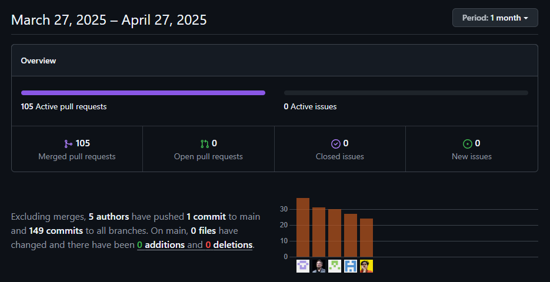

# Carátula

_Universidad Peruana de Ciencias Aplicadas_
_Ingeniería de Software_
_2025-10_

**Código:** _1ASI0729_
**Nombre:** _Desarrollo de Aplicaciones Open Source_

_Sección 4292_

_Prof. Velásquez Núñez, Ángel Augusto_

---

# **Informe de Trabajo Final**

---

## Nombre del Startup

**Nombre:** _UI-Topic_

## Nombre del Producto

**Producto:** _Restock_

## Relación de Integrantes

|  Código  |         Apellidos y Nombres         |
| :--------: | :----------------------------------: |
| u202315325 | Avendaño Balarezo, Williams Eduardo |
| u202021885 |         Castro Alejos, Julio         |
| u202319831 |     Guerra Perez, José Jahaziel     |
| u20231b173 |     Guzmán Cabrejos, Yaku Mateo     |
| u202319448 |   Shapiama Rivera, Gabriela Nicole   |

---

**Mes y Año**
_Abril 2025_

## **Registro de Versiones**

| *Versión* | *Fecha* | *Autor*          | *Descripción de modificación*                                                                                                                                                                                                                                          |
| :----------: | :-------: | :----------------- | :------------------------------------------------------------------------------------------------------------------------------------------------------------------------------------------------------------------------------------------------------------------------- |
|     1.1     | 04/04/25 | Yaku Guzmán       | Se redactó Lean UX Problem Statements y Assumptions.                                                                                                                                                                                                                      |
|     1.2     | 04/04/25 | Gabriela Shapiama  | Se elaboró el Lean UX Canvas y se redactaron los competidores.                                                                                                                                                                                                            |
|     1.3     | 05/04/25 | Williams Avendaño | Se redactó segmentos objetivos y diseño de entrevistas.                                                                                                                                                                                                                  |
|     1.4     | 05/04/25 | Jahaziel Guerra    | Se redactó antecedentes y problemática, y análisis competitivo.                                                                                                                                                                                                         |
|     1.5     | 05/04/25 | Julio Castro       | Se redactó perfil de la startup y estrategias frente a competidores.                                                                                                                                                                                                      |
|     2.1     | 09/04/25 | Williams Avendaño | Se registró 1 entrevista y se elaboró el Journey Mapping.                                                                                                                                                                                                                |
|     2.2     | 10/04/25 | Yaku Guzmán       | Se realizaron 3 entrevistas y se redactó el análisis de entrevistas.` ` Se elaboró el User Task Matrix y tanto el As-Is como el To-Be Scenario Mapping.                                                                                                            |
|     2.3     | 11/04/25 | Julio Castro       | Se realizó User Personas, Empathy Mapping y User Stories.                                                                                                                                                                                                                 |
|     2.4     | 13/04/25 | Gabriela Shapiama  | Se registraron 2 entrevistas. Se elaboró el Impact Mapping ` ` y general Style Guidelines.                                                                                                                                                                           |
|     3.1     | 13/04/25 | Jahaziel Guerra    | Se realizó el Ubiquitous Language, Product Backlog y Web ` `Style Guidelines.                                                                                                                                                                                        |
|     3.2     | 16/04/25 | Yaku Guzmán       | Se redactó Labeling Systems y se realizaron Web Applications,` `tanto Wireframes como Mock-ups.                                                                                                                                                                      |
|     3.5     | 16/04/25 | Jahaziel Guerra    | Se redactó Organization y Navigation Systems. Se realizaron ` ` Software Architecture Container Diagrams y Web Applications,  ` ` tanto Wireframes como Mock-ups.                                                                                               |
|     3.6     | 16/04/25 | Williams Avendaño | Se realizaron SEO and Meta Tags, Searching Systems y Database ` ` Diagram. También se realizaron Web Applications,  ` ` tanto Wireframes como Mock-ups.                                                                                                         |
|     3.7     | 16/04/25 | Julio Castro       | Se realizó Software Architecture Context Diagram y Web ` ` Applications, tanto Wireframes como Mock-ups.                                                                                                                                                             |
|     4.1     | 16/04/25 | Gabriela Shapiama  | Se elaboraron Class Diagrams, Class Dictionary y Landing ` ` Page, tanto Wireframe como Mock-up.                                                                                                                                                                      |
|     4.2     | 18/04/25 | Jahaziel Guerra    | Se realizaron Web Applications Wireflow Diagrams.                                                                                                                                                                                                                          |
|     5.1     | 20/04/25 | Gabriela Shapiama  | Se realizaron Web Applications User Flow Diagrams,` ` Software Deployment Configuration y Sprint Planning 1.                                                                                                                                                          |
|     5.2     | 21/04/25 | Williams Avendaño | Se realizó Software Development Environment Configuration,` ` Source Code Style Guide & Conventions y Sprint Backlog.                                                                                                                                                |
|     5.3     | 23/04/25 | Julio Castro       | Se realizó Source Code Management, Aspect Leaders and ` ` Collaborators y Execution Evidence for Sprint Review.                                                                                                                                                      |
|     5.4     | 24/04/25 | Jahaziel Guerra    | Se realizó Software Architecture Component Diagram, Web Applications Prototyping y Software Deployment ` ` Evidence for Sprint Review.                                                                                                                               |
|     5.5     | 25/04/25 | Yaku Guzmán       | Se realizaron Software Architecture Component Diagram, Development Evidence y Services Documentation ` ` Evidence for Sprint Review. Se elaboró Team Collaboration  ` ` Insights during Sprint y Conclusiones.                                                  |
|     6.1     |  6/05/25  | Yaku Guzmán       | Se corrigió Task Matrix, redacción de Lean UX Assumptions,` `formato de todo el documento y Services Documentation ` `Evidence for Sprint Review 1.                                                                                                           |
|     6.2     |  6/05/25  | Gabriela Shapiama  | Se agregó sección de equipo en el mockup y wireframe del ` `Landing Page, se tradujeron wireframes y mockups del Landing ` `Page, se actualizaron user flows Desktop, se corrigió Impact Mapping y ` ` se corrigió formato de perfiles de integrantes. |
|     6.3     |  6/05/25  | Williams Avendaño | Se tradujo mockups y wireframes del Web Application Mobile,` `se corrigieron títulos del Sprint Bakclog 1, se corrigió diagrama ` `de base de datos y Source Code Management.                                                                                  |
|     6.4     |  7/05/25  | Jahaziel Guerra    | Se tradujo mockups y wireframes del Web Application Desktop,` `se actualizaron Wireflows y User Flows Mobile, se actualizó video ` `de Web Application Prototyping Mobile y se corrigieron títulos de ` `los Tasks Flow                                   |
|     6.5     |  7/05/25  | Julio Castro       | Se corrigió redacción de User Stories, se corrigieron aspectos de ` ` User Personas, se actualizaron wireframes y mockups del Landing ` ` Page Mobile y se actualizó Execution Evidence for Sprint Review 1.                                                  |
|     7.1     |  8/05/25  | Gabriela Shapiama  | Se actualizó Student Outcome y se realizó Event Storming                                                                                                                                                                                                                 |
|     7.2     |  8/05/25  | Yaku Guzmán       | Se realizó Sprint Planning 2.                                                                                                                                                                                                                                             |
|     7.3     |  8/05/25  | Julio Castro       | Se realizó Sprint Backlog 2.                                                                                                                                                                                                                                              |
|     8.1     | 14/05/25 | Jahaziel Guerra    | Se realizó Development Evidence for Sprint 2 Review y Services ` ` Documentation Evidence for Sprint 2 Review.                                                                                                                                                      |
|     8.2     | 14/05/25 | Williams Avendaño | Se realizó Execution Evidence for Sprint 2 Review (landing page) y ` `Software Deployment Evidence for Sprint 2 Review.                                                                                                                                              |
|     8.3     | 14/05/25 | Julio Castro       | Se realizó Execution Evidence for Sprint 2 Review (frontend).                                                                                                                                                                                                            |
|     8.4     | 14/05/25 | Gabriela Shapiama  | Se realizó Team Collaboration Insights during Sprint 2.                                                                                                                                                                                                                  |
|     8.5     | 14/05/25 | Yaku Guzmán       | Se realizó avance de conclusiones.                                                                                                                                                                                                                                        |

# Project Report Collaboration Insights

Para el desarrollo del **Project Report**, se utilizó un repositorio en la organización de GitHub del equipo. A continuación, se presenta la evidencia de colaboración correspondiente al periodo del **27 de marzo de 2025 al 27 de abril de 2025**.

- 105 pull requests activos, todos fusionados exitosamente.
- 0 issues abiertos, cerrados o nuevos.
- 5 autores contribuyeron al repositorio.
- 150 commits realizados en total (1 commit directo a main y 149 a otras ramas).
- No se registraron cambios en archivos en la rama principal (0 adiciones y 0 eliminaciones).

Estas actividades evidencian la colaboración de todos los integrantes del equipo en la elaboración del informe, en coherencia con el Registro de Versiones del Informe.

# Tabla de contenidos

## [Capítulo I: Introducción](cap1-introduction.md)

- [1.1 Startup Profile](cap1-introduction.md#11-startup-profile)
  - [1.1.1 Descripción de la Startup](cap1-introduction.md#111-descripción-de-la-startup)
  - [1.1.2 Perfiles de integrantes del equipo](cap1-introduction.md#112-perfiles-de-integrantes-del-equipo)
- [1.2 Solution Profile](cap1-introduction.md#12-solution-profile)
  - [1.2.1 Antecedentes y problemática](cap1-introduction.md#121-antecedentes-y-problemática)
  - [1.2.2 Lean UX](cap1-introduction.md#122-lean-ux)
    - [1.2.2.1 Problem Statement](cap1-introduction.md#1221-lean-ux-problem-statement)
    - [1.2.2.2 Assumptions](cap1-introduction.md#1222-lean-ux-assumptions)
    - [1.2.2.3 Hypothesis](cap1-introduction.md#1223-lean-ux-hypothesis-statements)
    - [1.2.2.4 Lean UX Canvas](cap1-introduction.md#1224-lean-ux-canvas)
- [1.3 Segmentos Objetivos](cap1-introduction.md#13-segmentos-objetivos)

## [Capítulo II: Requirements Elicitation &amp; Analysis](cap2-requirements-elicitation-and-analysis.md)

- [2.1 Competidores](cap2-requirements-elicitation-and-analysis.md#21-competidores)
  - [2.1.1 Análisis competitivo](cap2-requirements-elicitation-and-analysis.md#211-análisis-competitivo)
  - [2.1.2 Estrategias y tácticas frente a competidores](cap2-requirements-elicitation-and-analysis.md#212-estrategias-y-tácticas-frente-a-competidores)
- [2.2 Entrevistas](cap2-requirements-elicitation-and-analysis.md#22-entrevistas)
  - [2.2.1 Diseño de entrevistas](cap2-requirements-elicitation-and-analysis.md#221-diseño-de-entrevistas)
  - [2.2.2 Registro de entrevistas](cap2-requirements-elicitation-and-analysis.md#222-registro-de-entrevistas)
  - [2.2.3 Análisis de entrevistas](cap2-requirements-elicitation-and-analysis.md#223-análisis-de-entrevistas)
- [2.3 Needfinding](cap2-requirements-elicitation-and-analysis.md#23-needfinding)
  - [2.3.1 User Personas](cap2-requirements-elicitation-and-analysis.md#231-user-personas)
  - [2.3.2 User Task Matrix](cap2-requirements-elicitation-and-analysis.md#232-user-task-matrix)
  - [2.3.3 User Journey Mapping](cap2-requirements-elicitation-and-analysis.md#233-user-journey-mapping)
  - [2.3.4 Empathy Mapping](cap2-requirements-elicitation-and-analysis.md#234-empathy-mapping)
  - [2.3.5 As-is Scenario Mapping](cap2-requirements-elicitation-and-analysis.md#235-as-is-scenario-mapping)
- [2.4 Ubiquitous Language](cap2-requirements-elicitation-and-analysis.md#24-ubiquitous-language)

## [Capítulo III: Requirements Specification](cap3-requirements-specification.md)

- [3.1 To-Be Scenario Mapping](cap3-requirements-specification.md#31-to-be-scenario-mapping)
- [3.2 User Stories](cap3-requirements-specification.md#32-user-stories)
- [3.3 Impact Mapping](cap3-requirements-specification.md#33-impact-mapping)
- [3.4 Product Backlog](cap3-requirements-specification.md#34-product-backlog)

## [Capítulo IV: Product Design](cap4-product-design.md)

- [4.1 Style Guidelines](cap4-product-design.md#41-style-guidelines)
  - [4.1.1 General Style Guidelines](cap4-product-design.md#411-general-style-guidelines)
  - [4.1.2 Web Style Guidelines](cap4-product-design.md#412-web-style-guidelines)
- [4.2 Information Architecture](cap4-product-design.md#42-information-architecture)
  - [4.2.1 Organization Systems](cap4-product-design.md#421-organization-systems)
  - [4.2.2 Labeling Systems](cap4-product-design.md#422-labeling-systems)
  - [4.2.3 SEO Tags and Meta Tags](cap4-product-design.md#423-seo-tags-and-meta-tags)
  - [4.2.4 Searching Systems](cap4-product-design.md#424-searching-systems)
  - [4.2.5 Navigation Systems](cap4-product-design.md#425-navigation-systems)
- [4.3 Landing Page UI Design](cap4-product-design.md#43-landing-page-ui-design)
  - [4.3.1 Landing Page Wireframe](cap4-product-design.md#431-landing-page-wireframe)
  - [4.3.2 Landing Page Mock-up](cap4-product-design.md#432-landing-page-mock-up)
- [4.4 Web Applications UX/UI Design](cap4-product-design.md#44-web-applications-uxui-design)
  - [4.4.1 Web Applications Wireframes](cap4-product-design.md#441-web-applications-wireframes)
  - [4.4.2 Web Applications Wireflow Diagrams](cap4-product-design.md#442-web-applications-wireflow-diagrams)
  - [4.4.3 Web Applications Mock-ups](cap4-product-design.md#443-web-applications-mock-ups)
  - [4.4.4 Web Applications User Flow Diagrams](cap4-product-design.md#444-web-applications-user-flow-diagrams)
- [4.5 Web Applications Prototyping](cap4-product-design.md#45-web-applications-prototyping)
- [4.6 Domain-Driven Software Architecture](cap4-product-design.md#46-domain-driven-software-architecture)
  - [4.6.1 Software Architecture Context Diagram](cap4-product-design.md#461-software-architecture-context-diagram)
  - [4.6.2 Software Architecture Container Diagrams](cap4-product-design.md#462-software-architecture-container-diagrams)
  - [4.6.3 Software Architecture Components Diagrams](cap4-product-design.md#463-software-architecture-components-diagrams)
- [4.7 Software Object-Oriented Design](cap4-product-design.md#47-software-object-oriented-design)
  - [4.7.1 Class Diagrams](cap4-product-design.md#471-class-diagrams)
  - [4.7.2 Class Dictionary](cap4-product-design.md#472-class-dictionary)
- [4.8 Database Design](cap4-product-design.md#48-database-design)
  - [4.8.1 Database Diagram](cap4-product-design.md#481-database-diagram)
- 4.9 DDD Estratégico

## [Capítulo V: Product Implementation, Validation &amp; Deployment](cap5-prod-implementation-validation-deployment.md)

- [5.1 Software Configuration Management](cap5-prod-implementation-validation-deployment.md#51-software-configuration-management)
  - [5.1.1 Software Development Environment Configuration](cap5-prod-implementation-validation-deployment.md#511-software-development-environment-configuration)
  - [5.1.2 Source Code Management](cap5-prod-implementation-validation-deployment.md#512-source-code-management)
  - [5.1.3 Source Code Style Guide &amp; Conventions](cap5-prod-implementation-validation-deployment.md#513-source-code-style-guide--conventions)
  - [5.1.4 Software Deployment Configuration](cap5-prod-implementation-validation-deployment.md#514-software-deployment-configuration)
- [5.2 Landing Page, Services &amp; Applications Implementation](cap5-prod-implementation-validation-deployment.md#52-landing-page-services--applications-implementation)
  - [5.2.X Sprint n](cap5-prod-implementation-validation-deployment.md#521-sprint-1)
    - [5.2.X.1 Sprint Planning n](cap5-prod-implementation-validation-deployment.md#5211-sprint-planning-1)
    - [5.2.X.2 Aspect Leaders and Collaborators](cap5-prod-implementation-validation-deployment.md#5212-aspect-leaders-and-collaborators)
    - [5.2.X.3 Sprint Backlog n](cap5-prod-implementation-validation-deployment.md#5213-sprint-backlog-1)
    - [5.2.X.4 Development Evidence for Sprint Review](cap5-prod-implementation-validation-deployment.md#5214-development-evidence-for-sprint-review)
    - [5.2.X.5 Execution Evidence for Sprint Review](cap5-prod-implementation-validation-deployment.md#5215-execution-evidence-for-sprint-review)
    - [5.2.X.6 Services Documentation Evidence for Sprint Review](cap5-prod-implementation-validation-deployment.md#5216-services-documentation-evidence-for-sprint-review)
    - [5.2.X.7 Software Deployment Evidence for Sprint Review](cap5-prod-implementation-validation-deployment.md#5217-software-deployment-evidence-for-sprint-review)
    - [5.2.X.8 Team Collaboration Insights during Sprint](cap5-prod-implementation-validation-deployment.md#5218-team-collaboration-insights-during-sprint)

## [Conclusiones](conclusiones.md)

- [Conclusiones y recomendaciones](conclusiones.md#conclusiones-y-recomendaciones)
- [Video About-the-Team](conclusiones.md#video-about-the-team)

## [Bibliografía](bibliography.md)

## [Anexos](anexos.md)

# ABET – EAC - Student Outcome 3

**Criterio:** Capacidad de comunicarse efectivamente con un rango de audiencias.

En el siguiente cuadro se describen las acciones realizadas y enunciados de conclusiones por parte del grupo, que permiten sustentar el haber alcanzado el logro del ABET – EAC - Student Outcome 3.

| **Criterio específico**                                                                     | **Acciones realizadas**                                                                                                                                                                                                                                                                                                                                                                                                                                                                                                                                                                                                                                                                                                                                                                                                                                                                                                                                                                                                                                                                                                       | **Conclusiones**                                                                                                                                                                                                                                                                                                                                                                                                                                                                                                                                                                                                                                                                                                                 |
| -------------------------------------------------------------------------------------------------- | ----------------------------------------------------------------------------------------------------------------------------------------------------------------------------------------------------------------------------------------------------------------------------------------------------------------------------------------------------------------------------------------------------------------------------------------------------------------------------------------------------------------------------------------------------------------------------------------------------------------------------------------------------------------------------------------------------------------------------------------------------------------------------------------------------------------------------------------------------------------------------------------------------------------------------------------------------------------------------------------------------------------------------------------------------------------------------------------------------------------------------------- | -------------------------------------------------------------------------------------------------------------------------------------------------------------------------------------------------------------------------------------------------------------------------------------------------------------------------------------------------------------------------------------------------------------------------------------------------------------------------------------------------------------------------------------------------------------------------------------------------------------------------------------------------------------------------------------------------------------------------------------- |
| **Comunica oralmente  con efectividad a  diferentes rangos  de audiencia.**   | **Yaku Guzmán**  TB1: Entrevistas y análisis de entrevistas; presentación de wireframes y mock-ups a usuarios.  TP: Explicación de objetivos del Sprint Planning 2 durante reuniones.  **Gabriela Shapiama**  TB1: Registro de entrevistas y explicación de User Flow Diagrams a stakeholders. TP: Explicación de tareas a realizar y de boundeds context en el Event storming durante reuniones.  **Williams Avendaño**  TB1: Diseño y conducción de entrevistas; presentación de sistemas de búsqueda en exposiciones grupales. TP: Video expllicativo para Execution Evidence for Sprint Review 2.  **Jahaziel Guerra**  TB1: Presentación oral del análisis competitivo y del backlog en sesiones grupales. TP: Explicación del Development Evidence for Sprint Review durante reuniones.  **Julio Castro**  TB1: Exposición del perfil de la startup y presentación de user personas en reuniones de revisión. TP: Explicación de tareas del Sprint Backlog 2 durante reuniones. |  **TB1:** Como grupo hemos mejorado nuestras habilidades de comunicación oral a través de exposiciones sincrónicas y grabadas, explicando conceptos técnicos a audiencias mixtas. Las entrevistas realizadas fortalecieron nuestra capacidad para adaptar el lenguaje al perfil del usuario, y los prototipos presentados evidenciaron claridad en la narrativa funcional.  **TP:** La realización de reuniones constantes nos permitó comunicar nuestras ideas y organizar el proyecto adecudamente. A su vez, esto permitió elaborar productos, como videos explicativos de ejecución, que comunican efectivamente a la audiencia lo realizado en el avance y el alcance del proyecto.. |
| **Comunica por escrito  con efectividad a  diferentes rangos  de audiencia.** | **Yaku Guzmán**  TB1: Documentación de escenarios de usuario y tareas; elaboración de evidencias de desarrollo. TP: Redacción de avance de conclusiones y corrección en la redacción de assumptions.  **Gabriela Shapiama**  TB1: Redacción de Lean UX Canvas y benchmarking de competidores. TP: Documentación de Team Collaboration Insights during Sprint.  **Williams Avendaño**  TB1: Documentación de entrevistas realizadas y convenciones de código. TP: Documentación de Software Deployment Evidence for Sprint Review 2.  **Jahaziel Guerra**  TB1: Redacción técnica de análisis de contexto, arquitectura y despliegue de software. TP: Redacción de Services Documentation Evidence for Sprint Review.  **Julio Castro**  TB1: Elaboración escrita del perfil estratégico de la startup y documentación de diagramas. TP: Documentación de Execution Evidence for Sprint Review 2 y corrección de redacción de User Stories.                                         | **TB1:** Hemos fortalecido la redacción de documentos técnicos y metodológicos con claridad y enfoque en el lector objetivo. Desde stakeholders hasta usuarios finales, cada entregable ha buscado transmitir la propuesta con lenguaje adecuado, apoyado en recursos visuales y metodologías ágiles. La colaboración en herramientas digitales reforzó también la coherencia y calidad de los entregables escritos.  **TP:**  Para este entegable se corrigieron aspectos de la entrega anterior que permitieron mejorar la calidad de la redacción del documento. Asimismo, los nuevos elemetnos redactados facilitan la compresión del avance realizado y el proyecto en general.        |
