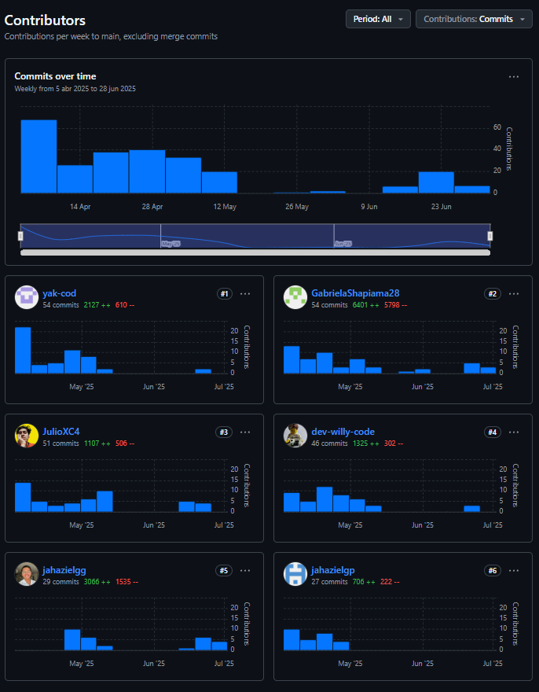
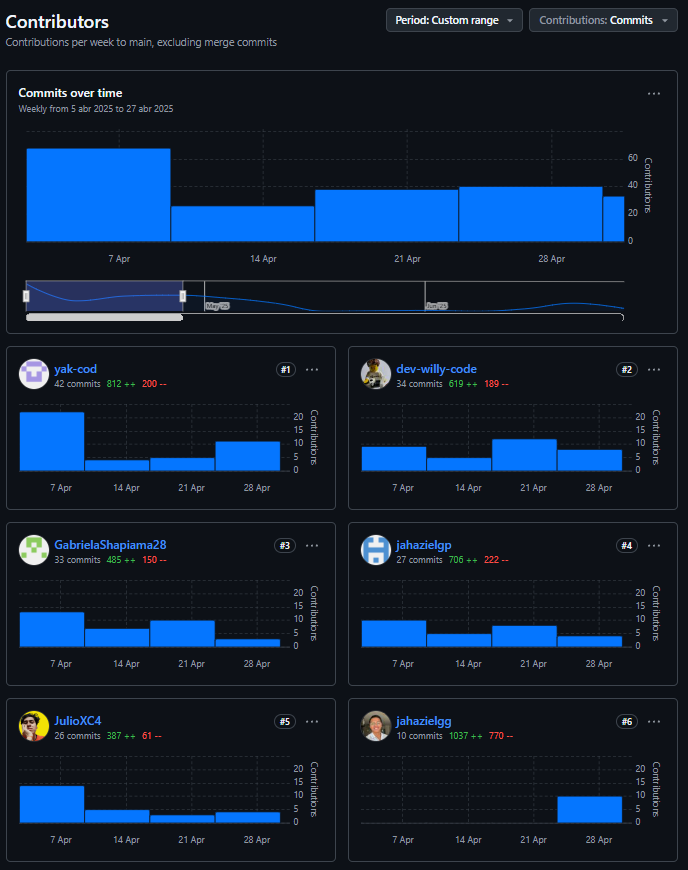
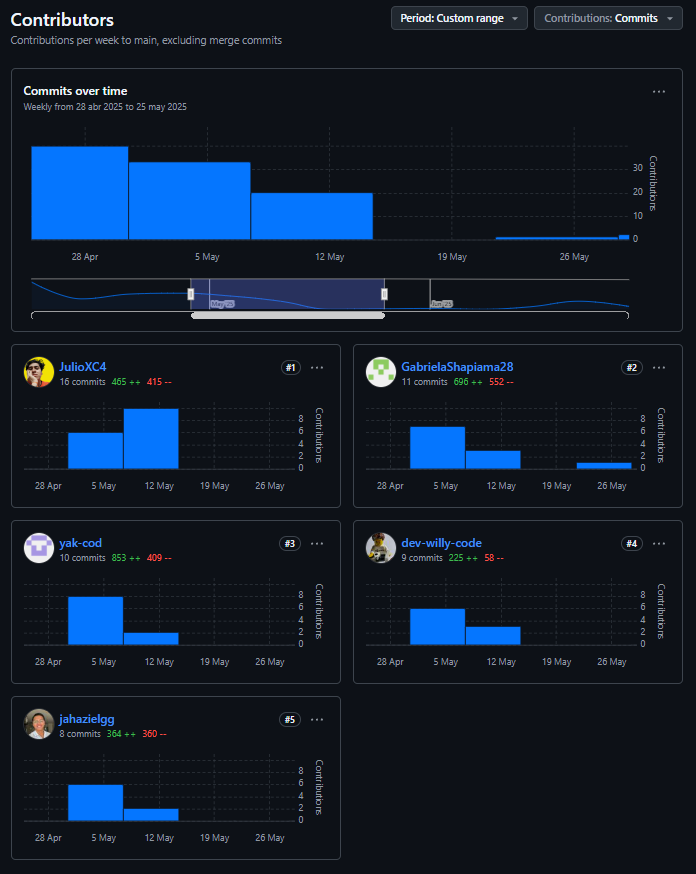
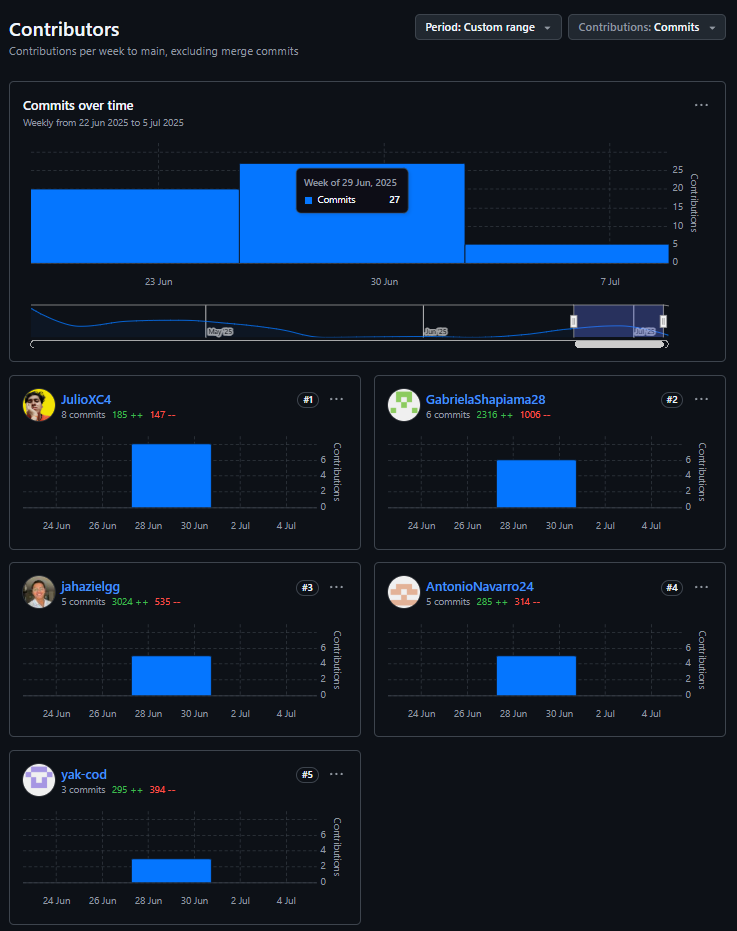

---
# **Informe de Trabajo Final**
---

_Universidad Peruana de Ciencias Aplicadas_

_Ingeniería de Software_

_2025-10_

**Curso:** _Desarrollo de Aplicaciones Open Source - 1ASI0729_

_Sección 4292_

_Prof. Velásquez Núñez, Ángel Augusto_

## Nombre del Startup

**Nombre:** _UI-Topic_

## Nombre del Producto

**Producto:** _Restock_

## Relación de Integrantes

|  Código  |         Apellidos y Nombres         |
| :--------: | :----------------------------------: |
| u202315325 | Avendaño Balarezo, Williams Eduardo |
| u202021885 |         Castro Alejos, Julio         |
| u202319831 |     Guerra Perez, José Jahaziel     |
| u20231b173 |     Guzmán Cabrejos, Yaku Mateo     |
| u202314101 |   Navarro Chinga, Antonio Jhair   |
| u202319448 |   Shapiama Rivera, Gabriela Nicole   |

---

**Mes y Año**
_Abril 2025_

## **Registro de Versiones**

| *Versión* | *Fecha* | *Autor*          | *Descripción de modificación*                                                                                                                                                                                                                                        |
| :----------: | :-------: | :----------------- | :----------------------------------------------------------------------------------------------------------------------------------------------------------------------------------------------------------------------------------------------------------------------- |
|     1.1     | 04/04/25 | Yaku Guzmán       | Se redactó Lean UX Problem Statements y Assumptions.                                                                                                                                                                                                                    |
|     1.2     | 04/04/25 | Gabriela Shapiama  | Se elaboró el Lean UX Canvas y se redactaron los competidores.                                                                                                                                                                                                          |
|     1.3     | 05/04/25 | Williams Avendaño | Se redactó segmentos objetivos y diseño de entrevistas.                                                                                                                                                                                                                |
|     1.4     | 05/04/25 | Jahaziel Guerra    | Se redactó antecedentes y problemática, y análisis competitivo.                                                                                                                                                                                                       |
|     1.5     | 05/04/25 | Julio Castro       | Se redactó perfil de la startup y estrategias frente a competidores.                                                                                                                                                                                                    |
|     2.1     | 09/04/25 | Williams Avendaño | Se registró 1 entrevista y se elaboró el Journey Mapping.                                                                                                                                                                                                              |
|     2.2     | 10/04/25 | Yaku Guzmán       | Se realizaron 3 entrevistas y se redactó el análisis de entrevistas.  Se elaboró el User Task Matrix y tanto el As-Is como el To-Be  Scenario Mapping.                                                                                                     |
|     2.3     | 11/04/25 | Julio Castro       | Se realizó User Personas, Empathy Mapping y User Stories.                                                                                                                                                                                                               |
|     2.4     | 13/04/25 | Gabriela Shapiama  | Se registraron 2 entrevistas. Se elaboró el Impact Mapping  y general Style Guidelines.                                                                                                                                                                           |
|     3.1     | 13/04/25 | Jahaziel Guerra    | Se realizó el Ubiquitous Language, Product Backlog y Web Style Guidelines.                                                                                                                                                                                         |
|     3.2     | 16/04/25 | Yaku Guzmán       | Se redactó Labeling Systems y se realizaron Web Applications, tanto Wireframes como Mock-ups.                                                                                                                                                                      |
|     3.5     | 16/04/25 | Jahaziel Guerra    | Se redactó Organization y Navigation Systems. Se realizaron  Software Architecture Container Diagrams y Web Applications, tanto Wireframes como Mock-ups.                                                                                                    |
|     3.6     | 16/04/25 | Williams Avendaño | Se realizaron SEO and Meta Tags, Searching Systems y Database Diagram. También se realizaron Web Applications,  tanto Wireframes como Mock-ups.                                                                                                              |
|     3.7     | 16/04/25 | Julio Castro       | Se realizó Software Architecture Context Diagram y Web Applications, tanto Wireframes como Mock-ups.                                                                                                                                                               |
|     4.1     | 16/04/25 | Gabriela Shapiama  | Se elaboraron Class Diagrams, Class Dictionary y Landing  Page, tanto Wireframe como Mock-up.                                                                                                                                                                       |
|     4.2     | 18/04/25 | Jahaziel Guerra    | Se realizaron Web Applications Wireflow Diagrams.                                                                                                                                                                                                                        |
|     5.1     | 20/04/25 | Gabriela Shapiama  | Se realizaron Web Applications User Flow Diagrams,  Software Deployment Configuration y Sprint Planning 1.                                                                                                                                                         |
|     5.2     | 21/04/25 | Williams Avendaño | Se realizó Software Development Environment Configuration,  Source Code Style Guide & Conventions y Sprint Backlog.                                                                                                                                               |
|     5.3     | 23/04/25 | Julio Castro       | Se realizó Source Code Management, Aspect Leaders and Collaborators y Execution Evidence for Sprint Review.                                                                                                                                                        |
|     5.4     | 24/04/25 | Jahaziel Guerra    | Se realizó Software Architecture Component Diagram, Web Applications Prototyping y Software Deployment  Evidence for Sprint Review.                                                                                                                           |
|     5.5     | 25/04/25 | Yaku Guzmá        | Se realizaron Software Architecture Component Diagram, Development Evidence y Services Documentation  Evidence  for Sprint Review. Se elaboró Team Collaboration nsights  during Sprint y Conclusiones.                                                  |
|     6.1     |  6/05/25  | Yaku Guzmán       | Se corrigió Task Matrix, redacción de Lean UX Assumptions, formato de todo el documento y Services Documentation  Evidence for Sprint Review 1.                                                                                                            |
|     6.2     |  6/05/25  | Gabriela Shapiama  | Se agregó sección de equipo en el mockup y wireframe del Landing Page, se tradujeron wireframes y mockups del  Landing Page, se actualizaron user flows Desktop,  se corrigió Impact Mapping y se corrigió formato de  perfiles de integrantes. |
|     6.3     |  6/05/25  | Williams Avendaño | Se tradujo mockups y wireframes del Web Application Mobile, se corrigieron títulos del Sprint Bakclog 1,  se corrigió diagrama de base de datos y Source  Code Management.                                                                              |
|     6.4     |  7/05/25  | Jahaziel Guerra    | Se tradujo mockups y wireframes del Web Application Desktop,se actualizaron Wireflows y User Flows Mobile,  se actualizó video de Web Application Prototyping Mobile  y se corrigieron títulos de los Tasks Flow.                                      |
|     6.5     |  7/05/25  | Julio Castro       | Se corrigió redacción de User Stories, se corrigieron aspectos de User Personas, se actualizaron wireframes  y mockups del Landing Page Mobile y se actualizó  Execution Evidence for Sprint Review 1.                                                 |
|     7.1     |  8/05/25  | Gabriela Shapiama  | Se actualizó Student Outcome y se realizó Event Storming                                                                                                                                                                                                               |
|     7.2     |  8/05/25  | Yaku Guzmán       | Se realizó Sprint Planning 2.                                                                                                                                                                                                                                           |
|     7.3     |  8/05/25  | Julio Castro       | Se realizó Sprint Backlog 2.                                                                                                                                                                                                                                            |
|     8.1     | 14/05/25 | Jahaziel Guerra    | Se realizó Development Evidence for Sprint 2 Review y Services Documentation Evidence for Sprint 2 Review.                                                                                                                                                         |
|     8.2     | 14/05/25 | Williams Avendaño | Se realizó Execution Evidence for Sprint 2 Review (landing page) y Software Deployment Evidence for Sprint 2 Review.                                                                                                                                               |
|     8.3     | 14/05/25 | Julio Castro       | Se realizó Execution Evidence for Sprint 2 Review (frontend).                                                                                                                                                                                                          |
|     8.4     | 14/05/25 | Gabriela Shapiama  | Se realizó Team Collaboration Insights during Sprint 2.                                                                                                                                                                                                                |
|     8.5     | 14/05/25 | Yaku Guzmán       | Se realizó avance de conclusiones.                                                                                                                                                                                                                                      |
|     9.1     | 30/05/25 | Julio Castro       | Se actualizaron las user stories y se elaboró diseño de  entrevistas.                                                                                                                                                                                             |
|     9.2     | 31/05/25 | Jahaziel Guerra    | Se actualizó el Product Backlog y se elaboró el Sprint Planning 3.                                                                                                                                                                                                |
|     9.3     |  1/06/25  | Gabriela Shapiama  | Se elaboró Aspect Leaders and Collaborators.                                                                                                                                                                                                                            |
|     9.4     |  2/06/25  | Yaku Guzmán       | Se agregó el Sprint Backlog 3.                                                                                                                                                                                                                                          |
|     9.5     | 16/06/25 | Yaku Guzmán       | Se elaboró Development Evidence for Sprint Review 3.                                                                                                                                                                                                                    |
|     9.6     | 16/06/25 | Julio Castro       | Se realizó Execution Evidence for Sprint Review y Team Collaboration Insights during Sprint 3.                                                                                                                                                                    |
|     9.7     | 16/06/25 | Williams Avendaño | Se elaboró Services Documentation Evidence for Sprint Review y Software Deployment Evidence for Sprint Review 3.                                                                                                                                                   |
|     9.8     | 17/06/25 | Williams Avendaño | Se registraron entrevistas.                                                                                                                                                                                                                                              |
|     9.9     | 17/06/25 | Gabriela Shapiama  | Se registraron entrevistas.                                                                                                                                                                                                                                              |
|     9.10     | 17/06/25 | Yaku Guzmán       | Se registraron entrevistas.                                                                                                                                                                                                                                              |
|     9.11     | 18/06/25 | Jahaziel Guerra    | Se elaboraron las Evaluaciones según heurísticas.                                                                                                                                                                                                                      |
|     9.12     | 21/06/25 | Julio Castro       | Se realizó Video About-the-Product.                                                                                                                                                                                                                                     |
|     9.13     | 21/06/25 | Williams Avendaño | Se actualizaron las conclusiones                                                                                                                                                                                                                                         |
|     9.14     | 21/06/25 | Gabriela Shapiama  | Se actualizaron los anexos.                                                                                                                                                                                                                                              |
|     10.1     |  1/07/25  | Jahaziel Guerra    | Se actualizó el Product Backlog y se elaboró el Sprint Planning 4.                                                                                                                                                                                               |
|     10.2     |  1/07/25  | Gabriela Shapiama  | Se elaboró Aspect Leaders and Collaborators 4.                                                                                                                                                                                                                          |
|     10.3     |  2/07/25  | Jahaziel Guerra    | Se agregó el Sprint Backlog 4.                                                                                                                                                                                                                                          |
|     10.4     |  2/06/25  | Julio Castro       | Se actualizó Project Report Collaboration Insights, User Stories y diagrama de clases.                                                                                                                                                                              |
|     10.5     |  2/06/25  | Yaku Guzman        | Corregir Development Evidence for Sprint Review del Sprint 3.                                                                                                                                                                                                            |
|     10.6     |  2/06/25  | Gabriela Shapiama  | Corrección Formato de links en el reporte.                                                                                                                                                                                                                              |
|     10.7     |  3/06/25  | Yaku Guzman        | Corregir Development Evidence for Sprint Review del Sprint 3 y titles en Sprint Backlog 2.                                                                                                                                                                              |
|     10.8     |  3/06/25  | Antonio Navarro    | Corrección Source Code Management y Sprint backlog 2.                                                                                                                                                                                                                   |
|     10.9     |  4/06/25  | Julio Castro       | Software Deployment  Evidence for Sprint Review 4 y Execution Evidence for Sprint Review 4.                                                                                                                                                                              |
|    10.10    |  4/06/25  | Jahaziel Guerra    | Se elaboró Services Documentation Evidence for Sprint Review 4.                                                                                                                                                                                                    |
|    10.11    |  4/06/25  | Gabriela Shapiama  | Se realizó Team Collaboration Insights during Sprint 3, anexos, conclusiones y bibliografía.                                                                                                                                                                         |
|    10.12    |  5/06/25  | Julio Castro       | Video about-the-product.                                                                                                                                                                                                                                                 |
|    10.13    |  5/06/25  | Yaku Guzman        | Development Evidence for Sprint Review 4.                                                                                                                                                                                                                                |
|    10.14    |  5/06/25  | Antonio Navarro    | Actualizar video About-The-Team en conclusiones.                                                                                                                                                                                                                         |
|    10.15    |  6/06/25  | Antonio Navarro    | Se elaboró conclusiones y recomendaciones.                                                                                                                                                                                                                              |

# Project Report Collaboration Insights

Esta sección detalla cómo el equipo colaboró para construir el **Final Project Documentation Report** del sistema Restock, mostrando evidencia de trabajo conjunto mediante commits, revisiones, herramientas de organización y resultados integrados en el informe final. Se refleja la contribución de cada integrante en la planificación, desarrollo, documentación y presentación de la solución.

**Repositorio del informe del proyecto:**  
[https://shorturl.at/ujj4j](https://shorturl.at/ujj4j)

- **Total de commits:** 507  
- **Autores contribuyentes:**
  - Williams Avendaño (`dev-willy-code`)
  - Yaku Guzmán (`yak-cod`)
  - Julio Castro (`JulioXC4`)
  - Gabriela Shapiama (`GabrielaShapiama28`)
  - Jahaziel Guerra (`jahazielgg`)

Todas las entregas se desarrollaron sobre ramas específicas con *pull requests* revisados en equipo. Se utilizaron issues de GitHub y tableros Trello para distribuir tareas, y herramientas como Figma, Draw.io, PlantUML y Structurizr para la elaboración de diagramas incluidos en el informe.

## TB1 – Informe inicial y Landing Page  
*Periodo:* 5 de abril – 27 de abril de 2025  

Se redactaron las secciones base del informe: Introducción, Justificación, Objetivos, Guias de estilo, Usuarios y Flujo de Valor. Se construyó una **Landing Page estática** con HTML5, CSS3 y JS. Las decisiones se documentaron en Trello, y se utilizó Figma para el primer prototipo visual. Cada sección del informe fue escrita en ramas separadas y luego unificada en `develop`.

- **Contribuciones destacadas del informe:**
  - Definición de problema y objetivos.
  - Análisis de herramientas similares.
  - Diseño de flujo de valor y tipos de usuario.
  - Prototipo inicial en Figma.
  - Página informativa y formulario de contacto en Landing.

- **Commits por integrante:**
  - Williams Avendaño: 34 commits – 619 adiciones / 189 eliminaciones  
  - Yaku Guzmán: 42 commits – 812 adiciones / 200 eliminaciones  
  - Julio Castro: 26 commits – 387 adiciones / 61 eliminaciones  
  - Gabriela Shapiama: 33 commits – 485 adiciones / 150 eliminaciones  
  - Jahaziel Guerra: 10 commits – 1037 adiciones / 770 eliminaciones  

---

## TP1 – Desarrollo del Frontend y mejoras al Landing Page  
*Periodo:* 28 de abril – 25 de mayo de 2025  

Se desarrolló el **frontend** con Angular 19, Angular Material, PrimeNG y arquitectura basada en dominios (`public`, `global`). Se aplicaron patrones como *Request/Response* y *Assembler*. El informe fue ampliado con secciones sobre estructura técnica del frontend, componentes reutilizables, rutas, internacionalización (i18n), y control de roles.

Se añadieron diagramas de carpetas y estructuras en PlantUML. Se mejoró la Landing Page con animaciones y optimización SEO.

- **Contribuciones destacadas del informe:**
  - Explicación de la estructura modular del frontend.
  - Documentación de componentes, servicios y rutas protegidas.
  - Capturas de vistas funcionales (`Home`, `Inventory`, `Orders`, etc.).
  - Detalle de decisiones técnicas y librerías empleadas.

- **Commits por integrante:**
  - Williams Avendaño: 9 commits – 225 adiciones / 58 eliminaciones  
  - Yaku Guzmán: 10 commits – 853 adiciones / 409 eliminaciones  
  - Julio Castro: 16 commits – 405 adiciones / 415 eliminaciones  
  - Gabriela Shapiama: 11 commits – 696 adiciones / 552 eliminaciones  
  - Jahaziel Guerra: 8 commits – 364 adiciones / 360 eliminaciones  

---

## TB2 – Backend, mejoras e integración  
*Periodo:* 26 de mayo – 21 de junio de 2025  

Se diseñó e implementó el **backend con Spring Boot**, siguiendo los principios de **Domain-Driven Design (DDD)**. Se construyeron los agregados `Supply`, `Batch`, `Recipe` y `Order`, junto a value objects (`UnitMeasurement`) y entidades referenciadas (`Category`). El equipo aplicó validaciones, control de excepciones personalizadas y estructura de paquetes clara (`aggregates`, `commands`, `resources`, etc.).

En el informe se documentó el trabajo realizado durante el **Sprint 3**, incluyendo el avance del *Product Backlog*, la implementación y despliegue de los primeros servicios del sistema. Se incluyeron diagramas de arquitectura generados con **Structurizr DSL**, abarcando los niveles C1 (Contexto), C2 (Contenedores) y C3 (Componentes), junto con capturas de Swagger UI y evidencia de los endpoints REST ya operativos.

- **Contribuciones destacadas del informe:**
  - Correcciones y mejoras en los diagramas Structurizr C1 y C2.
  - Descripción actualizada de la organización por boundeds del backend.
  - Registro del trabajo realizado en el Sprint 3, incluyendo backlog, implementación de servicios y despliegue.

- **Commits por integrante:**
  - Williams Avendaño: 3 commits – 481 adiciones / 55 eliminaciones  
  - Yaku Guzmán: 2 commits – 462 adiciones / 1 eliminación  
  - Julio Castro: 9 commits – 255 adiciones / 30 eliminaciones  
  - Gabriela Shapiama: 7 commits – 4708 adiciones / 4227 eliminaciones  
  - Jahaziel Guerra: 7 commits – 349 adiciones / 131 eliminaciones  

## TF – Integración final, autenticación y despliegue  
**Periodo:** 22 de junio – 6 de julio de 2025  

Durante esta etapa se consolidó el sistema completo, asegurando su funcionamiento integrado y seguro. Se implementó autenticación basada en **JWT (Bearer Tokens)**, gestión de roles, guards, validaciones y redirecciones. El frontend y backend se conectaron exitosamente, y se configuró el **despliegue final** de los productos digitales.

Además, se completaron las secciones finales del informe, incluyendo la validación por entrevistas, resultados del proyecto, **Conclusiones**, **Bibliografía** y **Anexos**. Se incorporaron capturas funcionales del sistema, flujos de autenticación, y scripts de ejemplo. También se aplicó una revisión final al estilo Markdown y se actualizaron tablas y artefactos previos.

- **Contribuciones destacadas del informe:**
  - Documentación de la arquitectura final integrada.
  - Registro de actividades y evidencias correspondientes al Sprint 4.
  - Validación de requisitos mediante entrevistas y user flows.
  - Capturas funcionales de la aplicación desplegada, incluyendo autenticación.
  - Versión final de Conclusiones, lecciones aprendidas, y evaluación de objetivos alcanzados.
  - Bibliografía actualizada y créditos de herramientas utilizadas.

- **Commits por integrante:**
  - Antonio Navarro: 5 commits – 285 adiciones / 314 eliminaciones  
  - Yaku Guzmán: 3 commits – 295 adiciones / 394 eliminaciones  
  - Julio Castro: 8 commits – 185 adiciones / 147 eliminaciones  
  - Gabriela Shapiama: 6 commits – 2316 adiciones / 1006 eliminaciones  
  - Jahaziel Guerra: 5 commits – 3024 adiciones / 535 eliminaciones  

## Herramientas colaborativas utilizadas

- **GitHub Projects & Branching:** Para control de versiones y revisiones.
- **Trello:** Organización de tareas por entregas y responsables.
- **Discord y Google Meet:** Reuniones periódicas para coordinación.
- **Figma:** Bocetos y prototipos de interfaz.
- **PlantUML & Draw.io:** Diagramas de arquitectura y flujo.
- **Structurizr DSL:** Modelado de arquitectura de software (C4 Model).
- **Swagger/OpenAPI:** Documentación interactiva de endpoints REST.
- **Markdown Preview & VSCode:** Redacción técnica en equipo del informe.

# Tabla de contenidos

## [Capítulo I: Introducción](cap1-introduction.md)

- [1.1 Startup Profile](cap1-introduction.md#11-startup-profile)
  - [1.1.1 Descripción de la Startup](cap1-introduction.md#111-descripción-de-la-startup)
  - [1.1.2 Perfiles de integrantes del equipo](cap1-introduction.md#112-perfiles-de-integrantes-del-equipo)
- [1.2 Solution Profile](cap1-introduction.md#12-solution-profile)
  - [1.2.1 Antecedentes y problemática](cap1-introduction.md#121-antecedentes-y-problemática)
  - [1.2.2 Lean UX](cap1-introduction.md#122-lean-ux)
    - [1.2.2.1 Problem Statement](cap1-introduction.md#1221-lean-ux-problem-statement)
    - [1.2.2.2 Assumptions](cap1-introduction.md#1222-lean-ux-assumptions)
    - [1.2.2.3 Hypothesis](cap1-introduction.md#1223-lean-ux-hypothesis-statements)
    - [1.2.2.4 Lean UX Canvas](cap1-introduction.md#1224-lean-ux-canvas)
- [1.3 Segmentos Objetivos](cap1-introduction.md#13-segmentos-objetivos)

## [Capítulo II: Requirements Elicitation &amp; Analysis](cap2-requirements-elicitation-and-analysis.md)

- [2.1 Competidores](cap2-requirements-elicitation-and-analysis.md#21-competidores)
  - [2.1.1 Análisis competitivo](cap2-requirements-elicitation-and-analysis.md#211-análisis-competitivo)
  - [2.1.2 Estrategias y tácticas frente a competidores](cap2-requirements-elicitation-and-analysis.md#212-estrategias-y-tácticas-frente-a-competidores)
- [2.2 Entrevistas](cap2-requirements-elicitation-and-analysis.md#22-entrevistas)
  - [2.2.1 Diseño de entrevistas](cap2-requirements-elicitation-and-analysis.md#221-diseño-de-entrevistas)
  - [2.2.2 Registro de entrevistas](cap2-requirements-elicitation-and-analysis.md#222-registro-de-entrevistas)
  - [2.2.3 Análisis de entrevistas](cap2-requirements-elicitation-and-analysis.md#223-análisis-de-entrevistas)
- [2.3 Needfinding](cap2-requirements-elicitation-and-analysis.md#23-needfinding)
  - [2.3.1 User Personas](cap2-requirements-elicitation-and-analysis.md#231-user-personas)
  - [2.3.2 User Task Matrix](cap2-requirements-elicitation-and-analysis.md#232-user-task-matrix)
  - [2.3.3 User Journey Mapping](cap2-requirements-elicitation-and-analysis.md#233-user-journey-mapping)
  - [2.3.4 Empathy Mapping](cap2-requirements-elicitation-and-analysis.md#234-empathy-mapping)
  - [2.3.5 As-is Scenario Mapping](cap2-requirements-elicitation-and-analysis.md#235-as-is-scenario-mapping)
- [2.4 Ubiquitous Language](cap2-requirements-elicitation-and-analysis.md#24-ubiquitous-language)

## [Capítulo III: Requirements Specification](cap3-requirements-specification.md)

- [3.1 To-Be Scenario Mapping](cap3-requirements-specification.md#31-to-be-scenario-mapping)
- [3.2 User Stories](cap3-requirements-specification.md#32-user-stories)
- [3.3 Impact Mapping](cap3-requirements-specification.md#33-impact-mapping)
- [3.4 Product Backlog](cap3-requirements-specification.md#34-product-backlog)

## [Capítulo IV: Product Design](cap4-product-design.md)

- [4.1 Style Guidelines](cap4-product-design.md#41-style-guidelines)
  - [4.1.1 General Style Guidelines](cap4-product-design.md#411-general-style-guidelines)
  - [4.1.2 Web Style Guidelines](cap4-product-design.md#412-web-style-guidelines)
- [4.2 Information Architecture](cap4-product-design.md#42-information-architecture)
  - [4.2.1 Organization Systems](cap4-product-design.md#421-organization-systems)
  - [4.2.2 Labeling Systems](cap4-product-design.md#422-labeling-systems)
  - [4.2.3 SEO Tags and Meta Tags](cap4-product-design.md#423-seo-tags-and-meta-tags)
  - [4.2.4 Searching Systems](cap4-product-design.md#424-searching-systems)
  - [4.2.5 Navigation Systems](cap4-product-design.md#425-navigation-systems)
- [4.3 Landing Page UI Design](cap4-product-design.md#43-landing-page-ui-design)
  - [4.3.1 Landing Page Wireframe](cap4-product-design.md#431-landing-page-wireframe)
  - [4.3.2 Landing Page Mock-up](cap4-product-design.md#432-landing-page-mock-up)
- [4.4 Web Applications UX/UI Design](cap4-product-design.md#44-web-applications-uxui-design)
  - [4.4.1 Web Applications Wireframes](cap4-product-design.md#441-web-applications-wireframes)
  - [4.4.2 Web Applications Wireflow Diagrams](cap4-product-design.md#442-web-applications-wireflow-diagrams)
  - [4.4.3 Web Applications Mock-ups](cap4-product-design.md#443-web-applications-mock-ups)
  - [4.4.4 Web Applications User Flow Diagrams](cap4-product-design.md#444-web-applications-user-flow-diagrams)
- [4.5 Web Applications Prototyping](cap4-product-design.md#45-web-applications-prototyping)
- [4.6 Domain-Driven Software Architecture](cap4-product-design.md#46-domain-driven-software-architecture)
  - [4.6.1 Software Architecture Context Diagram](cap4-product-design.md#461-software-architecture-context-diagram)
  - [4.6.2 Software Architecture Container Diagrams](cap4-product-design.md#462-software-architecture-container-diagrams)
  - [4.6.3 Software Architecture Components Diagrams](cap4-product-design.md#463-software-architecture-components-diagrams)
- [4.7 Software Object-Oriented Design](cap4-product-design.md#47-software-object-oriented-design)
  - [4.7.1 Class Diagrams](cap4-product-design.md#471-class-diagrams)
  - [4.7.2 Class Dictionary](cap4-product-design.md#472-class-dictionary)
- [4.8 Database Design](cap4-product-design.md#48-database-design)
  - [4.8.1 Database Diagram](cap4-product-design.md#481-database-diagram)
- [4.9 DDD Estratégico](cap4-product-design.md#49-DDD-estratégico)

## [Capítulo V: Product Implementation, Validation &amp; Deployment](cap5-prod-implementation-validation-deployment.md)

- [5.1 Software Configuration Management](cap5-prod-implementation-validation-deployment.md#51-software-configuration-management)
  - [5.1.1 Software Development Environment Configuration](cap5-prod-implementation-validation-deployment.md#511-software-development-environment-configuration)
  - [5.1.2 Source Code Management](cap5-prod-implementation-validation-deployment.md#512-source-code-management)
  - [5.1.3 Source Code Style Guide &amp; Conventions](cap5-prod-implementation-validation-deployment.md#513-source-code-style-guide--conventions)
  - [5.1.4 Software Deployment Configuration](cap5-prod-implementation-validation-deployment.md#514-software-deployment-configuration)
- [5.2 Landing Page, Services &amp; Applications Implementation](cap5-prod-implementation-validation-deployment.md#52-landing-page-services--applications-implementation)
  - [5.2.X Sprint n](cap5-prod-implementation-validation-deployment.md#521-sprint-1)
    - [5.2.X.1 Sprint Planning n](cap5-prod-implementation-validation-deployment.md#5211-sprint-planning-1)
    - [5.2.X.2 Aspect Leaders and Collaborators](cap5-prod-implementation-validation-deployment.md#5212-aspect-leaders-and-collaborators)
    - [5.2.X.3 Sprint Backlog n](cap5-prod-implementation-validation-deployment.md#5213-sprint-backlog-1)
    - [5.2.X.4 Development Evidence for Sprint Review](cap5-prod-implementation-validation-deployment.md#5214-development-evidence-for-sprint-review)
    - [5.2.X.5 Execution Evidence for Sprint Review](cap5-prod-implementation-validation-deployment.md#5215-execution-evidence-for-sprint-review)
    - [5.2.X.6 Services Documentation Evidence for Sprint Review](cap5-prod-implementation-validation-deployment.md#5216-services-documentation-evidence-for-sprint-review)
    - [5.2.X.7 Software Deployment Evidence for Sprint Review](cap5-prod-implementation-validation-deployment.md#5217-software-deployment-evidence-for-sprint-review)
    - [5.2.X.8 Team Collaboration Insights during Sprint](cap5-prod-implementation-validation-deployment.md#5218-team-collaboration-insights-during-sprint)

## [Conclusiones](conclusiones.md)

- [Conclusiones y recomendaciones](conclusiones.md#conclusiones-y-recomendaciones)
- [Video About-the-Team](conclusiones.md#video-about-the-team)

## [Bibliografía](bibliography.md)

## [Anexos](anexos.md)

# ABET – EAC - Student Outcome 3

**Criterio:** Capacidad de comunicarse efectivamente con un rango de audiencias.

En el siguiente cuadro se describen las acciones realizadas y enunciados de conclusiones por parte del grupo, que permiten sustentar el haber alcanzado el logro del ABET – EAC - Student Outcome 3.

| **Criterio específico**                                                                     | **Acciones realizadas**                                                                                                                                                                                                                                                                                                                                                                                                                                                                                                                                                                                                                                                                                                                                                                                                                                                                                                                                                                                                                                                                                                                                                                                                                                                                                                                                                                                                                                                                                                                                                                                                                                                                                                                                                  | **Conclusiones**                                                                                                                                                                                                                                                                                                                                                                                                                                                                                                                                                                                                                                                                                                                                                                                                                                                                                                                                                                                                                                                                                          |
| -------------------------------------------------------------------------------------------------- | ------------------------------------------------------------------------------------------------------------------------------------------------------------------------------------------------------------------------------------------------------------------------------------------------------------------------------------------------------------------------------------------------------------------------------------------------------------------------------------------------------------------------------------------------------------------------------------------------------------------------------------------------------------------------------------------------------------------------------------------------------------------------------------------------------------------------------------------------------------------------------------------------------------------------------------------------------------------------------------------------------------------------------------------------------------------------------------------------------------------------------------------------------------------------------------------------------------------------------------------------------------------------------------------------------------------------------------------------------------------------------------------------------------------------------------------------------------------------------------------------------------------------------------------------------------------------------------------------------------------------------------------------------------------------------------------------------------------------------------------------------------------------------ | --------------------------------------------------------------------------------------------------------------------------------------------------------------------------------------------------------------------------------------------------------------------------------------------------------------------------------------------------------------------------------------------------------------------------------------------------------------------------------------------------------------------------------------------------------------------------------------------------------------------------------------------------------------------------------------------------------------------------------------------------------------------------------------------------------------------------------------------------------------------------------------------------------------------------------------------------------------------------------------------------------------------------------------------------------------------------------------------------------------- |
| **Comunica oralmente  con efectividad a  diferentes rangos  de audiencia.**   | **Yaku Guzmán**  TB1: Lideró la presentación de mock-ups y flujos funcionales a usuarios durante sesiones grupales; además, condujo entrevistas como parte del proceso de *needfinding*. TP: Explicó objetivos y organización de tareas durante el Sprint Planning 2. TB2: Presentó el avance técnico del módulo de pedidos en reuniones internas y contribuyó con el tutorial en la landing page.  **Gabriela Shapiama**  TB1: Lideró la explicación del Lean UX Canvas y su relación con hallazgos del usuario. TP: Coordinó la exposición de contextos delimitados durante el Event Storming. TB2: Explicó los avances en el módulo de configuración y colaboró en la exposición del Event Storming actualizado.  **Williams Avendaño**  TB1: Lideró la exposición de benchmarking y la propuesta inicial del sistema de búsqueda. TP: Elaboró y narró el video explicativo para la revisión del Sprint 2. TB2: Explicó el despliegue del sistema en la revisión del sprint.  **Jahaziel Guerra**  TB1: Lideró la presentación oral del análisis del backlog y la arquitectura funcional en sesiones grupales. TP: Explicó las evidencias de desarrollo técnico en reuniones internas. TB2: Presentó la estructura del módulo de recetas en el frontend.  **Julio Castro**  TB1: Lideró la presentación del perfil de usuarios y user personas, enfocando en los hallazgos del proceso de necesidad. TP: Explicó el Sprint Backlog 2 en reuniones de planificación. TB2: Presentó los avances del módulo de inventario y participó en la explicación del video del producto. | **TB1:** Cada integrante asumió liderazgo en al menos una sección clave de comunicación oral. Esto permitió no solo desarrollar habilidades expresivas, sino también adaptar el lenguaje según el tipo de audiencia. A través de entrevistas, presentaciones de análisis, prototipos y flujos, el equipo transmitió efectivamente conceptos complejos y decisiones de diseño.  **TP:** La participación activa y rotativa en presentaciones orales fortaleció la cohesión del grupo y la claridad de los mensajes. Los videos, reuniones y exposiciones contribuyeron a comunicar con precisión el progreso técnico y organizacional del proyecto.  **TB2:** Durante el TB2, el equipo continuó con una comunicación oral efectiva al presentar avances técnicos, funcionales y organizacionales en diferentes contextos. La explicación de módulos específicos, el despliegue del sistema y los videos demostrativos evidencian la capacidad de comunicar de forma clara tanto entre el equipo como frente a evaluadores y usuarios. |
| **Comunica por escrito  con efectividad a  diferentes rangos  de audiencia.** | **Yaku Guzmán**  TB1: Lideró la redacción de escenarios de usuario y tareas funcionales; documentó el desarrollo inicial del flujo base. TP: Redactó las conclusiones del equipo y afinó la coherencia de los supuestos. TB2: Redactó el Sprint Backlog 3 y contribuyó con el registro de entrevistas y evidencias de desarrollo.  **Gabriela Shapiama**  TB1: Lideró la elaboración escrita del Lean UX Canvas y síntesis de hallazgos. TP: Redactó reflexiones del equipo sobre colaboración durante el Sprint. TB2: Actualizó el registro de versiones, anexos, bibliografía y documentación del Event Storming.  **Williams Avendaño**  TB1: Lideró la documentación del proceso de entrevistas y validación de usuarios. TP: Documentó las evidencias del despliegue de software para revisión técnica. TB2: Documentó evidencias de desarrollo del backend, despliegue de software y entrevistas del sprint.  **Jahaziel Guerra**  TB1: Lideró la redacción técnica del análisis contextual, arquitectura y despliegue inicial. TP: Redactó el documento de evidencias técnicas del servicio durante el Sprint Review. TB2: Redactó y corrigió entregables relacionados a clases del backend y heurísticas del sistema.  **Julio Castro**  TB1: Lideró la redacción del perfil estratégico y user personas. TP: Documentó y revisó las User Stories y ejecución del Sprint. TB2: Actualizó el informe con avances en el módulo de inventario, redactó insights de colaboración y el Student Outcome actualizado.                                                             | **TB1:** Cada integrante tomó liderazgo en la elaboración de entregables escritos clave, garantizando una comunicación clara, precisa y estructurada. Esto permitió representar con fidelidad el trabajo realizado, desde documentos metodológicos como el Lean UX Canvas, hasta descripciones funcionales, user personas y análisis técnicos.  **TP:** El equipo fortaleció su redacción técnica corrigiendo y mejorando entregas anteriores, lo cual se refleja en la calidad y claridad de los nuevos documentos. Cada evidencia escrita permitió comunicar adecuadamente tanto los avances del producto como el proceso seguido por el equipo.  **TB2:** Durante TB2, se evidenció un avance en la precisión de los documentos técnicos y colaborativos. La documentación de entrevistas, evidencias de desarrollo, actualizaciones del informe y análisis de módulos muestra la capacidad del equipo de comunicar información compleja a diferentes audiencias a través de medios escritos.                                        |
