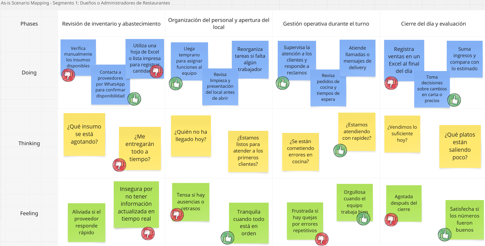
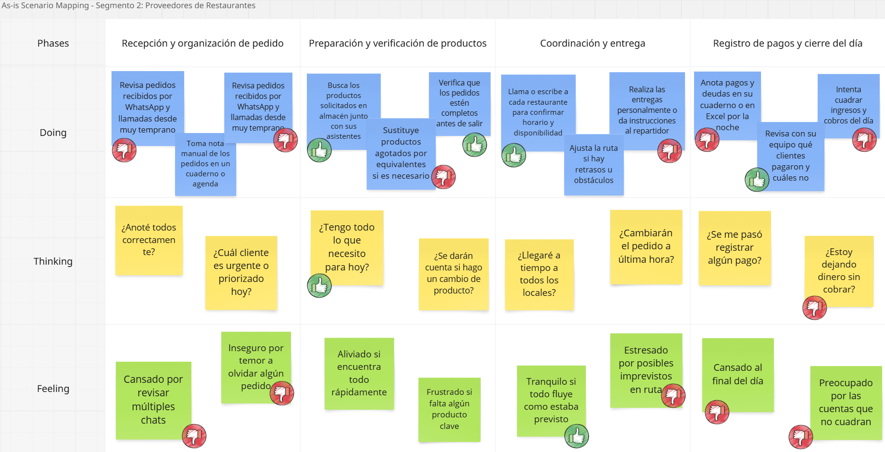

## 2.1 Competidores

- **Oracle Simphony**  (competidor directo): Es una plataforma basada en la nube que permite a los propietarios de restaurantes automatizar sus procesos, lo que contribuye a mantener un control óptimo del inventario, minimizar el desperdicio de alimentos y gestionar eficazmente el flujo de caja. Se enfoca en empresas de hospitalidad, cadenas de restaurantes grandes, y resorts. Su uso está presente especialmente en Estados Unidos, Canadá y en países de Europa como Reino Unido.

- **RestroWorks** (competidor directo): Es una solución integral basada en la nube para la gestión de restaurantes. Incluye funciones de control de inventario, manejo de pedidos, informes financieros y gestión de operaciones en tiempo real. Se enfoca en restaurantes de tamaño pequeño a mediano. Se usa principalmente en Latinoamérica, con una fuerte presencia en países como México, Colombia, y Argentina.  

- **SoftRestaurant** (competidor directo): Es un software de gestión para restaurantes que permite controlar inventarios, ventas, compras, reportes y más. Enfocado en restaurantes pequeños y medianos. Es utilizado principalmente en Latinoamérica para mejorar la eficiencia operativa y el control de los procesos internos en restaurantes.

### 2.1.1 Análisis Competitivo

El objetivo de este análisis es evaluar las oportunidades reales de competir en el mercado, identificando los segmentos objetivos, características de producto y estrategias de venta de los principales actores.
A través de este estudio, buscamos tomar decisiones informadas para diseñar una propuesta de valor diferenciada que nos permita destacar en el mercado objetivo.

| **Componente**                         | **Oracle Simphony**                                                                                                                                                                                                                                                                                       | **RestroWorks**                                                                                                                                                                                                                                               | **SoftRestaurant**                                                                                                                                                                                                                                                                                  |
|----------------------------------------|-----------------------------------------------------------------------------------------------------------------------------------------------------------------------------------------------------------------------------------------------------------------------------------------------------------|----------------------------------------------------------------------------------------------------------------------------------------------------------------------------------------------------------------------------------------------------------------|------------------------------------------------------------------------------------------------------------------------------------------------------------------------------------------------------------------------------------------------------------------------------------------------------|
| **Mercado Objetivo**                   | Hemos identificado tres segmentos objetivos: Grandes cadenas de restaurantes, establecimientos de servicio rápido o locales, y negocios de retail que requieren sistemas POS integrados.                                                                           | Analizando su mercado identificamos dos segmentos objetivos: Restaurantes de todos los tamaños y cocinas en la nube (Cloud Kitchen).                                                                                                                          | Su mercado se segmenta en dos objetivos: Franquicias emergentes y restaurantes pequeños y medianos.                                                                                                                                                                                                 |
| **Propuesta de Valor**                | Ofrece una solución POS en la nube que integra operaciones de front-of-house, cocina y back-office, permitiendo una gestión eficiente de pedidos en línea, recogida en la acera y entrega.                                                                         | Proporciona una plataforma tecnológica unificada que permite a los restaurantes crecer a escala, optimizando operaciones y reduciendo costos.                                                                                                                  | Ofrece un software de gestión integral que centraliza múltiples funciones operativas, mejorando la eficiencia y el servicio al cliente.                                                                                                                                                            |
| **Características del Producto/Servicio** | Incluye procesamiento rápido de pedidos, paneles de análisis potentes, gestión de inventario en tiempo real y capacidades de pedidos móviles.                                                                                                                      | Ofrece gestión de pedidos, control de inventario, suite de cocina, análisis en tiempo real y pedidos digitales.                                                                                                                                               | Proporciona herramientas para la gestión de pedidos, inventario, personal y relaciones con clientes, gestión de menús y facturación.                                                                                                                                                                |
| **Estrategia de Precios**             | Simphony Essentials: 55 USD por mes. Simphony Plus: 75 USD por mes.                                                                                                | Precios basados en módulos: POS, inventario, suite de cocina, análisis, etc. Plan básico estimado desde 200 USD al año.                                                                                                      | Soft Restaurant 11 LITE: 37 USD al mes. Soft Restaurant 11 PRO: 54 USD al mes.                                                                                                                                                                                           |
| **Canales de Distribución**          | Comercializa su producto a través de ventas directas y asociaciones con distribuidores autorizados.                                                                                                                         | Ofrece demostraciones y consultas en línea.                                                                                                                                                                             | Proporciona información y opciones de contacto a través de su sitio web.                                                                                                                                                                                                                             |
| **Estrategias de Marketing y Promoción** | Destaca la flexibilidad de su solución en la nube y su capacidad para adaptarse a diferentes tamaños y tipos de restaurantes, enfatizando seguridad y eficiencia.                                                           | Enfatiza la confianza de más de 23,000 restaurantes a nivel mundial, mostrando casos de éxito y testimonios.                                                                                                            | Subraya su experiencia de más de 20 años en el mercado y presencia en 11 países de América Latina, enfocándose en eficiencia operativa.                                                                                                                                                              |
| **Fortalezas**                        | Integración completa de operaciones, análisis en tiempo real y escalabilidad para negocios de cualquier tamaño.                                                                                                              | Plataforma unificada para gestión de todo el restaurante, incluyendo pedidos digitales y análisis.                                                                                                                     | Centralización de múltiples funciones en un solo sistema, mejora de gestión y experiencia del cliente.                                                                                                                                                                                               |
| **Debilidades**                       | Implementación y personalización complejas, requiere inversión significativa de tiempo y recursos.                                                                                                                           | Precios por módulo pueden ser altos para restaurantes pequeños que no necesitan todas las funciones.                                                                                                                  | Enfoque limitado a Latinoamérica, soporte y presencia internacional más reducidos.                                                                                                                                                                                                                    |
| **Participación de Mercado**         | Presencia en 180 países, atendiendo a una gran variedad de establecimientos de alimentos y bebidas.                                                                                                                          | Más de 23,000 restaurantes a nivel mundial confían en su plataforma.                                                                                                                                                    | Sirve a 42,000 restaurantes en 11 países de América Latina, con fuerte presencia regional.    

### 2.1.2 Estrategias y tácticas frente a competidores

#### Enfoque Estratégico de UI-Topic

UI-Topic surge como una solución enfocada y especializada en la **gestión automatizada de inventarios y pedidos**, con una propuesta de valor centrada en la **usabilidad, automatización predictiva** y **conectividad con proveedores locales**, diferenciándose de sus competidores en simplicidad, escalabilidad y precio. A continuación, se detallan las estrategias y tácticas específicas frente a los principales actores del mercado.

#### 1. Frente a Oracle Simphony

##### Fortalezas del Competidor
- Solución robusta con integración completa (POS, cocina, back-office).
- Amplia presencia global en más de 180 países.
- Análisis en tiempo real y escalabilidad avanzada.

##### Debilidades del Competidor
- Implementación compleja y costosa.
- Mayormente orientado a grandes cadenas o negocios con alto presupuesto.
- Requiere mayor inversión de tiempo y recursos.

##### Estrategias y Tácticas de UI-Topic
- **Estrategia de nicho accesible**: UI-Topic se enfocará en **PYMEs gastronómicas** que no pueden acceder a soluciones como Oracle, ofreciendo un sistema más simple y económico.
- **Táctica de experiencia de usuario**: Interfaz más intuitiva y amigable para facilitar la adopción sin necesidad de formación especializada.
- **Soporte y personalización local**: UI-Topic ofrecerá asistencia directa y adaptada a contextos regionales, lo que Oracle no prioriza.

#### 2. Frente a RestroWorks

##### Fortalezas del Competidor
- Plataforma unificada con múltiples módulos (POS, cocina, inventario, análisis).
- Fuerte presencia internacional, con más de 23,000 restaurantes.
- Capacidad para escalar con el crecimiento del negocio.

##### Debilidades del Competidor
- Precios por módulo pueden elevar el costo total.
- Puede ser excesivo para negocios que solo requieren control de inventario y pedidos.
- Dependencia de conexión constante y complejidad técnica en su implementación.

##### Estrategias y Tácticas de UI-Topic
- **Estrategia de especialización funcional**: UI-Topic se centrará exclusivamente en inventarios y pedidos, ofreciendo profundidad y eficacia donde otros ofrecen dispersión.
- **Táctica de modelo todo-en-uno simple**: Un solo plan que integre las funciones esenciales, sin costos ocultos por módulo.
- **Alineación con cocinas en la nube**: UI-Topic desarrollará funcionalidades específicas para cloud kitchens con foco en insumos y abastecimiento.

#### 3. Frente a SoftRestaurant

##### Fortalezas del Competidor
- Amplia experiencia en Latinoamérica.
- Funcionalidades completas: gestión operativa, personal, clientes, facturación.
- Gran base de usuarios en la región: más de 42,000 restaurantes.

##### Debilidades del Competidor
- Interfaz anticuada y experiencia de usuario limitada.
- Enfoque regional con escasa presencia fuera de LATAM.
- Menor capacidad de innovación tecnológica frente a soluciones en la nube.

##### Estrategias y Tácticas de UI-Topic
- **Estrategia tecnológica cloud-native**: Posicionarse como una alternativa moderna, ágil y accesible desde cualquier dispositivo sin instalaciones físicas.
- **Táctica de actualización generacional**: Apuntar a restaurantes que quieren migrar desde sistemas obsoletos, ofreciendo herramientas de **migración y capacitación gratuita**.
- **Foco en eficiencia operativa automatizada**: UI-Topic hará énfasis en la **reducción de desperdicios y anticipación de necesidades** mediante inteligencia de datos.         |

## 2.2 Entrevistas  

### 2.2.1 Diseño de entrevistas  

#### **Segmento 1: Dueños de Restaurantes**  

##### **Preguntas principales:**  
1. ¿Cuál es su nombre y cuánto tiempo lleva administrando su restaurante?  
2. ¿Cuáles son los principales desafíos que enfrenta en la gestión de su restaurante?  
3. ¿Cómo maneja actualmente el inventario y los pedidos de insumos?  
4. ¿Utiliza algún software o herramienta digital para gestionar su negocio? Si es así, ¿cuáles son sus principales beneficios y limitaciones?  
5. ¿Qué tan importante es para usted mejorar la experiencia del cliente a través de tecnología?  
6. ¿Cuáles son las principales dificultades al momento de recibir y gestionar pedidos de proveedores?  

##### **Preguntas complementarias:**  
7. ¿Cuáles son los criterios clave que considera al elegir un proveedor?  
8. ¿Ha intentado digitalizar su negocio en el pasado? ¿Qué obstáculos ha encontrado?  
9. ¿Cuánto estaría dispuesto a invertir en una solución tecnológica para mejorar la gestión de su restaurante?  

---

#### **Segmento 2: Proveedores para Restaurantes**  

##### **Preguntas principales:**  
1. ¿Cuál es su nombre y qué tipo de productos ofrece a los restaurantes?  
2. ¿Cómo suelen contactar los restaurantes con usted para hacer pedidos?  
3. ¿Qué desafíos enfrenta en la entrega de productos a los restaurantes?  
4. ¿Cómo gestiona el inventario y la logística de distribución?  
5. ¿Qué tan importante es para su negocio la relación a largo plazo con los restaurantes?  
6. ¿Utiliza alguna plataforma digital para gestionar pedidos y clientes?  
7. ¿Qué aspectos considera clave para ofrecer un servicio confiable y eficiente a los restaurantes?  

##### **Preguntas complementarias:**  
8. ¿Ha experimentado problemas con pagos o facturación en su relación con los restaurantes?  
9. ¿Qué tan abierto estaría a utilizar una plataforma digital para mejorar la gestión de sus pedidos y relaciones comerciales?  
10. ¿Cómo maneja la comunicación con los dueños de restaurantes para asegurar la calidad y puntualidad de las entregas?  

### 2.2.2 Registro de entrevistas

## Segmento 1: Dueños de Restaurantes

### Entrevista 1:

**Nombre:** Alex Guardia
**Edad:** 38 años  
**Distrito:** Chorrillos  
**Timing:** (00:05- 05:00 min)  

 
[Ver entrevista (00:05 - 05:00 min)](https://upcedupe-my.sharepoint.com/personal/u202319831_upc_edu_pe/_layouts/15/stream.aspx?id=%2Fpersonal%2Fu202319831%5Fupc%5Fedu%5Fpe%2FDocuments%2Fdocs%2Dassets%2Duitopic%5Fneedfinding%5Finterviews%2Emp4&ga=1&referrer=StreamWebApp%2EWeb&referrerScenario=AddressBarCopied%2Eview%2E4af6ada4%2Df911%2D4a24%2D87bf%2De53e3ec1998e)

**Resumen:**
El señor Alex Guardia es gerente de restaurantes con aproximadamente 5 a 6 años de experiencia. Tiene 38 años y reside en el distrito de Chorrillos. Se caracteriza por ser una persona analítica, comprometida y orientada a la mejora continua.

Los principales desafíos que enfrenta son las casuísticas con los clientes y la coordinación con proveedores. Específicamente en aspectos a las modalidades de pago y los horarios de entrega, los cuales muchas veces no se ajustan a las necesidades operativas del local.

Respecto al inventario, realiza un control físico diario y una verificación electrónica semanal o quincenal. Utiliza software de gestión, pero considera que la mayoría no son personalizables. Además, menciona que el soporte técnico postventa suele ser deficiente.

Estaría dispuesto a invertir entre 500 y 800 dólares en una solución tecnológica integral que incluya implementación, capacitación y soporte eficiente, siempre que se adapte a sus procesos y mejore la eficiencia general del negocio.

### Entrevista 2:
**Nombre:** Lincoln Chauca Rubio  
**Edad:** 36 años  
**Distrito:** Breña  
**Timing:** (05:01 - 09:09 min)  

 
[Ver entrevista (05:01 - 09:09 min)](https://upcedupe-my.sharepoint.com/personal/u202319831_upc_edu_pe/_layouts/15/stream.aspx?id=%2Fpersonal%2Fu202319831%5Fupc%5Fedu%5Fpe%2FDocuments%2Fdocs%2Dassets%2Duitopic%5Fneedfinding%5Finterviews%2Emp4&ga=1&referrer=StreamWebApp%2EWeb&referrerScenario=AddressBarCopied%2Eview%2E4af6ada4%2Df911%2D4a24%2D87bf%2De53e3ec1998e)

**Resumen:**

El señor Lincoln Chauca Rubio es el propietario del restaurante “Amazonas Restaurant”, el cual viene administrando desde hace 5 años.
Chauca Rubio tiene 36 años y reside en el distrito de Breña. Se caracteriza por ser una persona disciplianda, responsable y dedicado. 
Entre los principales desafíos que enfrenta menciona la **rotación de personal**, ya que no cuenta con un equipo estable y constantemente deben contratar nuevos empleados.
Otro reto importante es el **manejo del inventario**, lo cual impacta directamente en la operatividad del negocio.

Actualmente utiliza un software llamado **Vidal**, que le permite gestionar el restaurante de forma más eficiente. Gracias a esta herramienta, los mozos pueden tomar los pedidos a través de una tablet o celular, y también se mantiene una base de datos de los clientes.

Respecto a los proveedores, el señor Chauca menciona que trabajan con **2 o 3 distintos** para obtener mejores precios, ya que estos suelen variar con frecuencia.

En cuanto a la inversión en tecnología, actualmente destina alrededor de **300 soles mensuales**, pero está dispuesto a aumentar ese monto hasta **500 soles** si con ello puede mejorar la gestión de su restaurante.

### Entrevista 3:
**Nombre:** Amparo Soledad Robles Vásquez
**Edad:** 56 años  
**Distrito:** Bellavista  
**Timing:** (09:10 - 14:12 min)  

  
[Ver entrevista (09:10 - 14:12 min)](https://upcedupe-my.sharepoint.com/personal/u202319831_upc_edu_pe/_layouts/15/stream.aspx?id=%2Fpersonal%2Fu202319831%5Fupc%5Fedu%5Fpe%2FDocuments%2Fdocs%2Dassets%2Duitopic%5Fneedfinding%5Finterviews%2Emp4&ga=1&referrer=StreamWebApp%2EWeb&referrerScenario=AddressBarCopied%2Eview%2E4af6ada4%2Df911%2D4a24%2D87bf%2De53e3ec1998e)

**Resumen:**

La señora Amparo Robles Vásquez es dueña del restaurante y cevichería "El 1er Puerto", el cual administra desde hace 20 años. Amparo Robles tiene 56 años y reside en el distrito de Bellavista. Se caracteriza por ser una persona perseverante, responsable y amable.

Los principales desafíos que enfrenta en la gestión de su restaurantes son el contar con un **personal adecuado y el marketing digital**, debido a que se le dificulta el uso de la tecnología.

Actualmente, maneja su **inventario de manera manual**. Sin embargo, planea contratar un sistema que le permita acelerar procesos y expandir su negocio, debido a que es bastante complicado realizar todo manualmente.
Amparo considera que la mejora de atención a los clientes mediante tecnología es esencial.

Por otro lado, menciona que la **seriedad, puntualidad y calidad de productos** son aspectos importantes para elegir a un proveedor.
Amparo está **totalmente dispuesta a invertir** en un software que le permita automatizar su negocio.

---

## Segmento 2: Proveedores para Restaurantes

### Entrevista 1:

**Nombre:** José Santos Tapia Bustamente
**Edad:** 68 años  
**Distrito:** Chorrillos  
**Timing:** (14:27 - 09:09 min)  

 
[Ver entrevista (14:27 - 09:09 min)](https://upcedupe-my.sharepoint.com/personal/u202319831_upc_edu_pe/_layouts/15/stream.aspx?id=%2Fpersonal%2Fu202319831%5Fupc%5Fedu%5Fpe%2FDocuments%2Fdocs%2Dassets%2Duitopic%5Fneedfinding%5Finterviews%2Emp4&ga=1&referrer=StreamWebApp%2EWeb&referrerScenario=AddressBarCopied%2Eview%2E4af6ada4%2Df911%2D4a24%2D87bf%2De53e3ec1998e)

**Resumen:**
El señor José Santos Tapia Bustamante es proveedor de abarrotes, productos de limpieza y licores. Tiene 68 años y reside en el distrito de Chorrillos. Se caracteriza por ser una persona responsable, comprometida con sus clientes y con gran experiencia en el rubro.

Cuenta con 38 años de trayectoria como proveedor y suele establecer relaciones comerciales directamente con los dueños de restaurantes, ya sea por recomendaciones o por contacto presencial.

Realiza la gestión de pedidos de forma manual, revisando cada producto antes del envío para asegurarse de que el pedido esté completo. Utiliza WhatsApp como principal canal de comunicación para coordinar con los restaurantes.

Él considera esenciales la calidad del producto, la atención al cliente y brindar facilidades de pago. Está abierto a utilizar una plataforma digital si esta le permite mejorar la facturación y hacer más eficiente el proceso de entrega.

### Entrevista 2:
**Nombre:** Percy Polo Ferrera
**Edad:** 38 años  
**Distrito:** Chorrillos  
**Timing:** (19:22 - 23:40 min)  

  
[Ver entrevista (19:22 - 23:40 min)](https://upcedupe-my.sharepoint.com/personal/u202319831_upc_edu_pe/_layouts/15/stream.aspx?id=%2Fpersonal%2Fu202319831%5Fupc%5Fedu%5Fpe%2FDocuments%2Fdocs%2Dassets%2Duitopic%5Fneedfinding%5Finterviews%2Emp4&ga=1&referrer=StreamWebApp%2EWeb&referrerScenario=AddressBarCopied%2Eview%2E4af6ada4%2Df911%2D4a24%2D87bf%2De53e3ec1998e)

**Resumen:**

El señor Percy Polo Ferrera es un proveedor que trabaja en la **distribución de diversas bebidas**, principalmente aguas y gaseosas. Percy Polo tiene 38 años y reside en el distrito de Chorrillos. Se caracteriza por ser una persona trabajadora, responsable y organizada.

Usualmente, contacta a los resturantes mediante redes sociales. Usa **WhatsApp** la mayoría del tiempo, plataforma en la que sus clientes le hacen llegar sus pedidos, en un primer momento.

Acerca de la gestión de inventario, Percy se encarga de transportar los pedidos y, al final del día, realizan un **cuadre de inventario** con los supervisores adecuados. 

Comenta que **usa una plataforma digital** para gestionar los pedidos de manera inmediata, la cual le facilita bastante dicho proceso. 

Percy considera que lo primordial es una buena atencion a los clientes para lograr fidelizarlos.

Respecto al tema de pagos y facturacion, comenta que es **esencial una buena comunicación con los clientes** para evitar poblemas en este aspecto.  
 
### Entrevista 3:

**Nombre:** Benjamín Pacheco Quesada
**Edad:** 57 años  
**Distrito:** Miraflores  
**Timing:** (23:41 - 29:13 min)  

 
[Ver entrevista (23:41 - 29:13 min)](https://upcedupe-my.sharepoint.com/personal/u202319831_upc_edu_pe/_layouts/15/stream.aspx?id=%2Fpersonal%2Fu202319831%5Fupc%5Fedu%5Fpe%2FDocuments%2Fdocs%2Dassets%2Duitopic%5Fneedfinding%5Finterviews%2Emp4&ga=1&referrer=StreamWebApp%2EWeb&referrerScenario=AddressBarCopied%2Eview%2E4af6ada4%2Df911%2D4a24%2D87bf%2De53e3ec1998e)

**Resumen:**
El señor Benjamín Pacheco Quesada trabaja como proveedor de licores para la bodega Santiago Queirolo. Tiene 57 años y reside en el distrito de Miraflores. Se caracteriza por ser una persona cordial, organizada y comprometida con el cumplimiento en sus relaciones comerciales.

Atiende a restaurantes de Lima distribuyendo marcas como Santiago Queirolo, Intipalka y Don Santiago. El contacto con los restaurantes suele realizarse mediante WhatsApp, correo electrónico o de manera presencial.

Uno de los principales desafíos que enfrenta es coordinar las entregas en horarios adecuados, ya que algunos restaurantes no permiten recibir productos durante sus horas de atención. Menciona que su empresa cuenta con una página web para contacto inicial, y el resto del proceso se lleva a cabo directamente con los vendedores.

Benjamín valora mantener relaciones comerciales a largo plazo, basadas en la honestidad y el cumplimiento. Estaría dispuesto a utilizar una plataforma que le ayude a coordinar mejor los horarios de entrega y optimizar sus rutas de distribución.

---

### 2.2.3 Análisis de entrevistas

## Segmento 1: Dueños de Restaurantes

Se analizaron **3 entrevistas** a administradores con amplia experiencia en el manejo de restaurantes. La información obtenida permitió identificar características objetivas y subjetivas clave para construir al arquetipo de dueño de restaurantes.

### Características

| Característica                               | Mención | %     | Evidencia                                                                                   |
| -------------------------------------------- | ------- | ----- | ------------------------------------------------------------------------------------------- |
| Más de 5 años de experiencia en gestión      | 3/3     | 100%  | Todos los entrevistados mencionan su trayectoria (“5 a 6 años”, “5 años”, “20 años”)        |
| Utilizan software para facturación o pedidos | 3/3     | 100%  | Uso de software como Dibal, sistemas de caja, o intención de implementarlo pronto |
| Gestión de inventario parcial o manual       | 2/3     | 66.7% | Uso mixto entre registros físicos y digitales; uno usa solo gestión manual                  |
| Han cambiado de software por deficiencias    | 2/3     | 66.7% | Señalan haber probado varias herramientas antes de una funcional                            |
| Dispuestos a invertir en tecnología          | 3/3     | 100%  | Declaran presupuestos o escalas de disposición al 10                                        |
| Reconocen que la tecnología mejora la eficiencia  | 3/3     | 100%  | Vinculan tecnología con mejora de control, marketing y atención |
| Dificultades por complejidad o soporte deficiente | 2/3     | 66.7% | Señalan postventa lenta y sistemas poco intuitivos              |
| Necesidad de personalización                      | 3/3     | 100%  | Indican que los sistemas son genéricos y complicados de adaptar |
| Valor por facilidad de uso y adaptabilidad        | 3/3     | 100%  | Expresan deseo de una solución autogestionable                  |

### Insights

**1. Alta disposición hacia la digitalización, pero con obstáculos prácticos**  
Existe interés por parte de todos los entrevistados en incorporar tecnología para mejorar su gestión. Sin embargo, su adopción ha sido limitada por barreras como sistemas complejos o falta de capacitación. Sugiere que la plataforma debería ser intuitiva y estar diseñada pensando en la realidad operativa del usuario.

**2. Necesidad crítica de herramientas flexibles y adaptables**  
La estandarización de los sistemas actuales no responde a las particularidades de cada restaurante. Mencionan la dificultad de modificar configuraciones o adaptarse a actualizaciones frecuentes. Un sistema que permita editar menús, precios o funcionalidades sin asistencia externa sería lo ideal.

**3. El soporte técnico deficiente afecta la confianza y el uso**  
Los usuarios se sienten desatendidos cuando enfrentan incidencias en momentos críticos. El soporte técnico lento o ineficaz reduce la confianza en el sistema. Una solución que ofrezca soporte ágil y confiable podría diferenciarse en el mercado.

**4. Inversión justificable si existe retorno tangible**  
Todos los entrevistados señalan estar dispuestos a invertir en tecnología si esta genera beneficios claros como control, personalización, eficiencia o mejora de ingresos. Esto valida la viabilidad comercial de una solución enfocada.

---

## Segmento 2: Proveedores para Restaurantes

Se analizaron **3 entrevistas** a proveedores de productos para restaurantes (abarrotes, bebidas, licores), todos con una trayectoria considerable en el rubro. A partir de sus respuestas se identificaron aspectos clave para construir el arquetipo del proveedor.

### Características

| Característica                               | Mención | %     | Evidencia                                                                                   |
| -------------------------------------------- | ------- | ----- | ------------------------------------------------------------------------------------------- |
| Más de 10 años de experiencia               | 3/3     | 100%  | Trayectorias de 38 años, experiencia amplia en distribución y ventas                       |
| Uso de WhatsApp para pedidos                  | 3/3     | 100%  | Mencionan WhatsApp como canal primario para recibir pedidos                                 |
| Manejo logístico manual o con supervisores   | 2/3     | 66.7% | No usan plataformas; dependen de listas físicas y personal de reparto                      |
| No utilizan plataformas digitales especializadas | 2/3  | 66.7% | Uno menciona tener app, los otros usan WhatsApp y gestión manual                           |
| Trato directo con dueños de restaurante      | 3/3     | 100%  | Priorizan relaciones directas como parte de su estrategia comercial                         |
| Apertura a digitalizar su operación          | 3/3     | 100%  | Dispuestos a adoptar apps si estas mejoran su gestión                                      |
| Importancia de la confianza con el cliente    | 3/3     | 100%  | Señalan que la confianza es clave para continuidad y créditos                             |
| Valoración de la puntualidad y cumplimiento   | 3/3     | 100%  | Mencionan cumplimiento de horario y entregas completas como vitales                        |
| Necesidad de mejorar la facturación con tecnología | 2/3 | 66.7% | Describen problemas con gestión manual de facturas y cobros                               |

### Insights

**1. Confianza, cumplimiento y atención**  
La relación con el restaurante se construye sobre la confianza, y esta se gana a través de entregas puntuales, cumplimiento de pedidos y buena atención. Cualquier solución digital debe reforzar esta relación en lugar de reemplazarla, manteniendo la cercanía con el cliente.

**2. Alta apertura hacia plataformas tecnológicas funcionales**  
Los proveedores no solo están abiertos al uso de apps, sino que identifican directamente beneficios como organización de rutas, mejor facturación y eficiencia operativa. Esto representa una oportunidad concreta para implementar soluciones simples pero potentes adaptadas a su entorno.

**3. Procesos de logística e inventario poco tecnificados**  
Aún con estructuras operativas consolidadas, la mayoría depende de medios manuales para controlar entregas e inventario. Esto implica un margen de error y retrasos, los cuales podrían disminuirse mediante una herramienta que digitalice el flujo operativo.

**4. La facturación digital resolvería un punto crítico**  
El manejo de facturas y pagos al crédito es visto como una parte vulnerable de la operación. Señalan que automatizar este proceso (emisión, seguimiento, entrega) permitiría ahorrar tiempo, reducir errores y fortalecer la relación financiera con el restaurante.

### 2.3. Needfinding

### 2.3.1. User Personas

En esta sección se presentan dos User Personas que representan los segmentos clave del proyecto: los Dueños de Restaurantes y los Proveedores para Restaurantes. Estos perfiles permiten comprender en profundidad las necesidades, motivaciones, frustraciones y comportamientos de los usuarios potenciales del sistema, el cual busca mejorar la gestión de inventarios, pedidos y relaciones comerciales en el sector gastronómico.

El User Persona **Carolina Rivas** representa a las administradoras y propietarias de restaurantes con trayectoria, principalmente medianos y grandes negocios ubicados en zonas urbanas de alta competencia. Carolina tiene amplia experiencia en la gestión operativa, y aunque ha intentado digitalizar procesos clave como el inventario o la facturación, se ha encontrado con soluciones poco intuitivas y difíciles de adaptar. Su motivación principal es lograr un control más riguroso de su inventario y aumentar la eficiencia general del negocio sin perder autonomía. Busca una plataforma accesible, personalizable y fácil de usar, que le permita mejorar la toma de decisiones operativas sin requerir soporte técnico constante.

Por otro lado, el User Persona **Jorge Torres** encarna al proveedor tradicional de productos para restaurantes, especialmente aquellos dedicados a la distribución de abarrotes y bebidas. Con más de una década en el rubro, Jorge opera principalmente con métodos manuales apoyados por WhatsApp y Excel. Valora las relaciones comerciales de confianza con sus clientes y la puntualidad en las entregas como pilares de su éxito. Aunque no es nativo digital, muestra alta apertura hacia plataformas tecnológicas que le permitan organizar mejor sus rutas, facturación y seguimiento de pagos. Su mayor necesidad es una solución que simplifique su operación sin romper la cercanía con los restaurantes a los que abastece.

### 2.3.2. User Task Matrix

Se presenta el User Task Matrix, que concentra las tareas que los User Persona realizan para cumplir sus objetivos. Estas tareas comprenden funciones específicas, son actividades que los usuarios llevan a cabo en su día a día, independientemente de la existencia de una solución tecnológica.

Los segmentos considerados para este análisis son:

- Dueños de Restaurantes
- Proveedores para Restaurantes

## Segmento 1: Dueños de restaurantes

Carolina Rivas es propietaria y administradora de un restaurante ubicado en una zona urbana altamente competitiva. Con más de 10 años de experiencia, busca optimizar su operación sin depender de soporte externo. Aunque ha probado diversas soluciones tecnológicas, sus frustraciones con herramientas poco intuitivas la han llevado a preferir procesos controlados por ella misma. Su principal objetivo es tener una gestión eficiente y un control riguroso del inventario y de los ingresos del restaurante.

| Tarea | User Persona 1 ||
|---------------------------------------------------------------|------------|-------------|
| | Frecuencia | Importancia |
| Supervisar y controlar el inventario                      | often      | high        |
| Revisar ingresos y gastos del día                         | often      | high        |
| Capacitar al personal en procedimientos internos          | sometimes  | medium      |
| Atender y resolver reclamos de clientes                   | sometimes  | medium      |
| Coordinar pedidos con proveedores                         | often      | high        |
| Evaluar precios y ajustar carta según rentabilidad        | sometimes  | high        |
| Analizar ventas y tomar decisiones operativas             | often      | high        |
| Buscar herramientas para mejorar la gestión               | rarely     | medium      |

### Análisis

Las tareas más frecuentes e importantes para Carolina se centran en el control del inventario, el manejo de ingresos diarios y la toma de decisiones operativas basadas en datos. Estas acciones son claves para mantener el control dentro de su restaurante.

Otras tareas como la capacitación del personal o la resolución de reclamos son importantes pero no diarias. La búsqueda de herramientas tecnológicas se da ocasionalmente y está condicionada por experiencias previas negativas con sistemas poco intuitivos.

Carolina prioriza la autonomía y el control total sobre su negocio. Su perfil racional la lleva a tomar decisiones informadas y a buscar eficiencia sin perder contacto con los procesos clave del restaurante.

---

## Segmento 2: Proveedores para Restaurantes

Jorge Torres es un proveedor tradicional con más de una década en el rubro, dedicado a la distribución de abarrotes y bebidas a restaurantes. Opera de forma manual con apoyo de WhatsApp y Excel, y valora las relaciones de confianza. Aunque no es un usuario experto en tecnología, muestra interés en soluciones que le permitan mejorar sus operaciones sin sacrificar la cercanía con sus clientes.

| Tarea | User Persona 2 | |
|---------------------------------------------------------------|------------|-------------|
| | Frecuencia | Importancia |
| Preparar y organizar pedidos del día                         | often      | high        |
| Coordinar entregas con restaurantes                          | often      | high        |
| Registrar pagos y realizar seguimiento de cobros             | often      | high        |
| Optimizar rutas de reparto                                   | sometimes  | medium      |
| Comunicarse con clientes por WhatsApp o llamada              | often      | high        |
| Revisar stock disponible antes de despachar                  | sometimes  | high        |
| Gestionar imprevistos en ruta o cambios de pedidos           | sometimes  | medium      |
| Evaluar nuevas formas de mejorar su organización             | rarely     | medium      |

### Análisis

Las tareas más frecuentes e importantes para Jorge están enfocadas en la logística diaria como la preparación de pedidos, coordinación con restaurantes, gestión de pagos y comunicación directa. Estas actividades son escenciales para mantener la eficiencia y cumplir con las entregas a tiempo.

Actividades como optimizar rutas o explorar formas de mejorar la operación tienen menor frecuencia, pero reflejan su interés por crecer sin complicar su sistema actual. Las tareas asociadas a imprevistos también son comunes, aunque las considera parte natural de su trabajo.

A diferencia de Carolina, Jorge trabaja con una estructura más directa y basada en relaciones personales. Sin embargo, ambos coinciden en mejorar la eficiencia, el cumplimiento de tiempos y el deseo de mantener el control de sus respectivos negocios.

### 2.3.3. User Journey Mapping

En esta sección se presentan los User Journey Maps (As-Is) de los segmentos representados, correspondientes a sus respectivas User Personas. Se ilustra el recorrido actual de los usuarios sin la intervención de la solución UI-Topic, con el fin de identificar sus necesidades, puntos de fricción y oportunidades de mejora. Cada mapa refleja las etapas clave de interacción, acciones realizadas, puntos de contacto, experiencias emocionales, dificultades enfrentadas y posibles mejoras. Los diagramas fueron elaborados en la herramienta indicada y están vinculados a las fichas de User Persona previamente desarrolladas.

## Carolina Rivas

## Jorge Torres

### 2.3.4. Empathy Mapping

## Carolina Rivas

## Jorge Torres

### 2.3.5 As-is Scenario Mapping

El siguiente escenario As-Is fue desarrollado a partir de entrevistas y análisis de comportamiento del perfil de Carolina Rivas. Se identificaron las principales fases que conforman su flujo de trabajo diario como administradora de un restaurante

El siguiente escenario As-Is fue desarrollado a partir de entrevistas y análisis del comportamiento del perfil de Jorge Torres. Se identificaron las principales fases que conforman su flujo de trabajo diario como proveedor tradicional de abarrotes y bebidas para restaurantes.

## 2.4. Ubiquitous Language

En esta sección se presentan los términos clave del proyecto UI-Topic. Estos términos han sido acordados en el equipo del proyecto y serán usados de manera consistente en la comunicación, documentación y desarrollo del sistema.

 **Term (EN)**               | **Definición (ES)** |
|----------------------------|---------------------|
| **Supply item** *(Insumo)* | Ingrediente o producto consumible necesario para la preparación de platos en el restaurante. Su stock se monitorea continuamente. |
| **Product** *(Producto)* | Elemento registrado en el inventario, puede ser consumible (como alimentos) o no consumible (como utensilios o envases). |
| **Supplier** *(Proveedor)* | Entidad externa encargada de abastecer insumos al restaurante según los pedidos realizados. |
| **Inventory manager** *(Administrador de inventario)* | Persona responsable de supervisar los niveles de stock y realizar pedidos a proveedores. |
| **Stock level** *(Nivel de stock)* | Cantidad disponible de un insumo o producto en el sistema. Puede estar en estado normal, bajo o crítico. |
| **Critical stock level** *(Nivel crítico de stock)* | Umbral mínimo definido para un insumo. Si el stock disponible cae por debajo de este valor, se activa una alerta. |
| **Supply request** *(Solicitud de insumos)* | Pedido formal realizado al proveedor cuando un insumo necesita ser reabastecido. Puede ser generado automáticamente por el sistema o de forma manual. |
| **Replenishment** *(Reposición)* | Proceso mediante el cual un insumo es reabastecido tras recibir un pedido aprobado. Afecta directamente el stock. |
| **Inventory alert** *(Alerta de inventario)* | Notificación automática generada por el sistema cuando un insumo alcanza el nivel crítico o hay un consumo inesperado. |
| **Verified supplier** *(Proveedor verificado)* | Proveedor aprobado por el restaurante para recibir pedidos automáticos del sistema. Debe cumplir ciertos criterios de calidad y tiempo de entrega. |
| **Internal consumption** *(Consumo interno)* | Uso de insumos dentro del restaurante que no está relacionado a ventas directas, como pruebas de recetas o pérdidas por caducidad. |
| **Supply history** *(Historial de insumos)* | Registro de entradas, salidas, consumos y pedidos relacionados a cada insumo del restaurante. |
| **Menu dependency** *(Dependencia de menú)* | Relación entre los platos del menú y los insumos requeridos para su preparación. Afecta el cálculo de stock disponible. |
