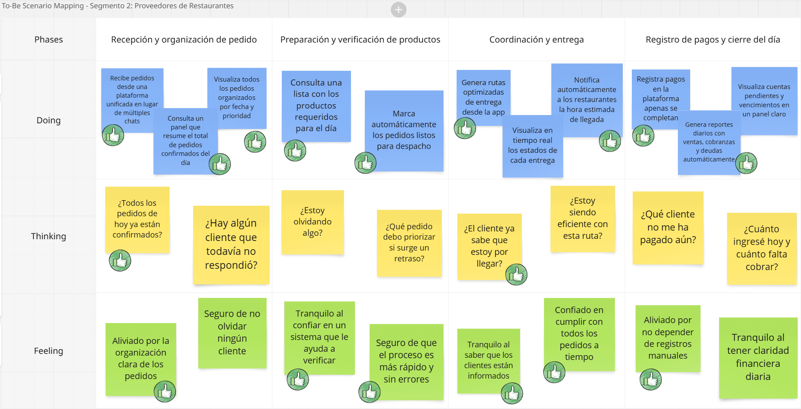

## 3.1 To-Be Scenario Mapping

**Segmento Objetivo 1:** Dueños de Restaurantes

Este escenario To-Be fue construido tras una revisión detallada del escenario As-Is de Carolina Rivas y de las oportunidades de mejora identificadas a partir de las entrevistas. Se definieron las fases del proceso y se contrastaron con las actuales. Se priorizaron mejoras en eficiencia, control, automatización y reducción de frustraciones operativas.

**Segmento objetivo 2:** Proveedores de Restaurantes
 
Este escenario To-Be fue construido a partir del análisis del escenario As-Is de Jorge Torres. se incorporaron mejoras basadas en las necesidades y frustraciones. El equipo propuso una experiencia futura donde Jorge cuenta con una plataforma digital para gestionar pedidos, organizar rutas, registrar pagos y comunicarse con los restaurantes

