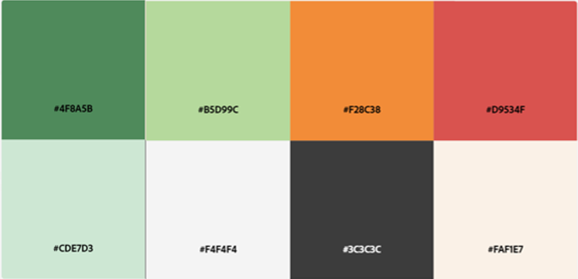
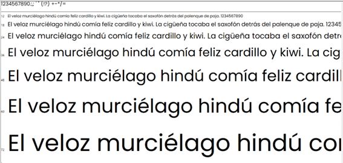
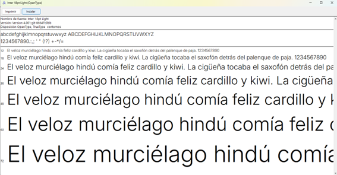
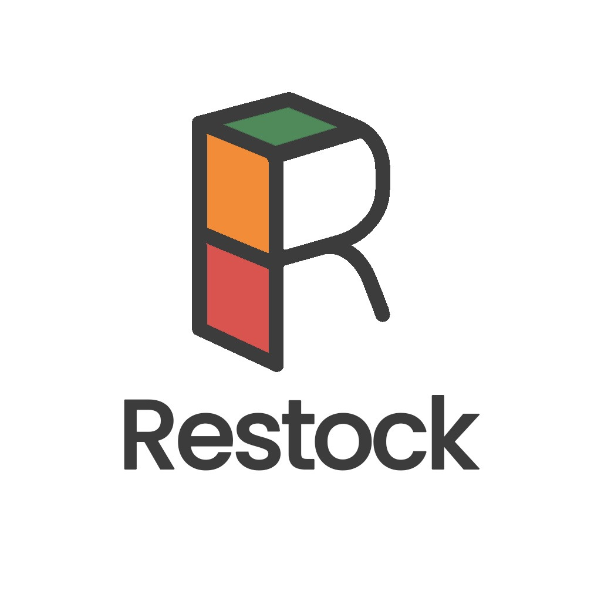

# Capítulo IV: Product Design

## 4.1 Style Guidelines

### 4.1.1 General Style Guidelines

En el diseño de Restock, se tomaron decisiones cuidadosas para garantizar una experiencia de usuario coherente y efectiva. 

#### Colores
La paleta de colores de Restock fue seleccionada con un enfoque en la armonía visual y la accesibilidad. Cada color cumple un rol específico para mejorar la experiencia del usuario:

 

- Naranja mandarina – #F28C38: Este color transmite energía, dinamismo y entusiasmo. En Restock, lo utilizamos para incentivar la acción en botones especiales como el del lector de texto o de retroceder. Representa proactividad y movimiento, ideales para un entorno de gestión ágil de inventarios.

- Rojo coral – #D9534F: Este color simboliza urgencia y atención, por lo que lo empleamos estratégicamente en alertas o notificaciones importantes dentro de la plataforma, así como en botones de cancelación. Su intensidad refuerza el enfoque en tareas prioritarias o advertencias, ayudando a los usuarios a tomar decisiones rápidas.

- Verde oscuro – #4F8A5B: Este color está asociado con estabilidad, crecimiento y seguridad. En Restock, este color refuerza la confianza en los procesos, especialmente en la gestión eficiente de productos. Por ello, ser usa en subtítulos principales y botones de confirmación y selección. Aporta equilibrio visual y solidez al diseño general.

- Verde claro – #B5D99C: Este color representa frescura y renovación. Se utiliza en fondos de secciones especiales para transmitir un ambiente amigable y limpio dentro de la interfaz, fomentando una sensación de ligereza y bienestar mientras se interactúa con la plataforma. 

- Verde menta claro – #CDE7D3: Este color evoca serenidad, limpieza y claridad. Se usa en fondos y para destacar opciones seleccionadas. Apoya la legibilidad y aporta una atmósfera relajada en las secciones de consulta o visualización de datos, facilitando la concentración. 

- Blanco grisáceo - #F4F4F4: Este color simboliza simplicidad, orden y neutralidad. Usado principalmente en los fondos, este color ofrece un lienzo limpio que mejora el contraste con otros elementos y asegura una experiencia visual clara y sin distracciones.

- Gris oscuro – #3C3C3C: Este color refleja profesionalismo y solidez. En Restock, se utiliza para resaltar textos importantes y títulos, aportando un contraste elegante que estructura visualmente la información clave.

- Beige cálido – #FAF1E7: Este color transmite calidez y cercanía. Se usa en fondos pequeños, ya que añade un toque humano al diseño de la plataforma, suavizando los espacios y brindando una sensación acogedora sin perder la sobriedad. 
 

#### Tipografía 

Se seleccionó la tipografía “Poppins” como fuente principal para los títulos de la plataforma por su estilo llamativo y su capacidad para captar la atención del usuario. Además, esta fuente es visualmente agradable y de fácil lectura, lo que garantiza una experiencia cómoda y comprensible para el usuario.

Asimismo, optamos por la tipografía "Inter" como fuente secundaria para los textos de nuestra plataforma por su diseño legible, moderno y llamativo. Su apariencia estética y legibilidad garantizan una experiencia de uso accesible y agradable.

 En cuanto al tamaño, se utiliza jerárquicamente para resaltar títulos, botones y texto de soporte. Los tamaños más grandes captan la atención en puntos clave de la navegación, mientras que los más pequeños se emplean para detalles secundarios, lo que mejora tanto la comprensión como la eficiencia en la interacción.

#### Branding

El branding de Restock está diseñado para reflejar simplicidad, confianza y profesionalismo. El logo y los íconos adoptan un enfoque minimalista, con líneas claras y formas simples que comunican el propósito de la plataforma. El diseño incluye la incial del nombre del producto ofrecido, representado de tal manera que simboliza gestión y orden con una apariencia limpia que es fácilmente reconocible, tanto en entornos web como móviles.
 
&nbsp;  

#### Espaciado

El diseño de Restock se centra en una estrategia que aprovecha de manera inteligente los espacios en blanco, tanto a gran escala como en detalles más pequeños, con el objetivo de brindar una experiencia de usuario clara y fluida. Estos espacios no solo cumplen una función estética, sino que también son fundamentales para mejorar la comprensión del contenido y resaltar elementos importantes como los botones de acción y las secciones más destacadas. El contenido de cada página se presenta dentro de un ancho máximo definido, lo que previene la sobrecarga visual. Además, los márgenes que rodean los bloques de contenido generan una estructura visual armoniosa. Por su parte, los rellenos laterales se ajustan en función del ancho del navegador, garantizando una distribución adecuada y una interfaz adaptable a distintos dispositivos.

#### Dimensiones para el tono de comunicación y lenguaje aplicado

En Restock, definimos cuidadosamente el tono de nuestra comunicación para alinearlo con la misión de nuestra plataforma: facilitar la gestión de inventarios para dueños de restaurantes y proveedores, creando una conexión cercana y empática con nuestro público objetivo. Nuestro tono de voz busca motivar y brindar seguridad, combinando una comunicación clara, accesible y profesional.

Optamos por un tono casual pero respetuoso, que permita a los usuarios sentirse cómodos al interactuar con funcionalidades clave para el control y abastecimiento de sus negocios. Queremos que cada interacción refleje entusiasmo, para fomentar el compromiso con una gestión eficiente, pero también serenidad, asegurando que los usuarios mantengan el control y la confianza mientras usan la plataforma. Este equilibrio nos permite inspirar acción, al tiempo que proyectamos confianza y experiencia en el sector gastronómico y logístico.

Además, se han considerado los siguientes aspectos clave en el diseño de Restock:

- Consistencia: La coherencia en el diseño es esencial para brindar una experiencia uniforme y eficiente. Todos los elementos visuales e interactivos de Restock mantienen una línea gráfica y funcional clara, lo que permite que los usuarios se familiaricen rápidamente y operen la plataforma con facilidad. Esto es vital para negocios que requieren respuestas rápidas y precisas en su operación diaria.

- Navegación: La estructura de navegación ha sido pensada para ser intuitiva y ordenada. Los usuarios pueden acceder fácilmente a secciones como control de stock, historial de pedidos, comunicación con proveedores y reportes de abastecimiento. Los menús son claros y las opciones están organizadas para ahorrar tiempo y evitar complicaciones, facilitando la toma de decisiones en entornos exigentes como las cocinas de restaurantes o los centros de distribución.

- Accesibilidad: La plataforma fue diseñada para adaptarse a todo tipo de usuarios y dispositivos. Desde computadoras hasta tablets o celulares, Restock ofrece botones grandes, opciones de ajuste de idioma, lector de texto y navegación simplificada, permitiendo a dueños de restaurantes y proveedores utilizar la plataforma incluso en ambientes dinámicos y de alta demanda.

#### Elementos de diseño

Además de los lineamientos generales sobre colores, tipografía y branding, en el diseño visual de Restock se han aplicado de manera consciente diversos elementos fundamentales del diseño gráfico que enriquecen la experiencia del usuario y refuerzan la identidad visual de la plataforma.

Uno de los elementos clave es la **línea**, utilizada para dividir secciones, delimitar formularios o separar tarjetas de contenido. Su uso sutil organiza visualmente la interfaz, guiando la lectura y evitando la saturación. El **color** también cumple un rol fundamental, no solo en la identidad visual sino en la comunicación funcional. La paleta incluye tonos como el mandarina, el verde oscuro y el rojo coral, seleccionados por su asociación emocional y su capacidad para transmitir estados como éxito, alerta o error.

En cuanto al **tamaño**, se utiliza jerárquicamente para resaltar títulos, botones y texto de soporte. Los tamaños más grandes captan la atención en puntos clave de la navegación, mientras que los más pequeños se emplean para detalles secundarios, lo que mejora tanto la comprensión como la eficiencia en la interacción. Por su parte, la **textura** es sutil, gracias al uso de fondos suaves como el blanco grisáceo y el beige cálido, los cuales aportan profundidad y calidez sin distraer de la funcionalidad principal.

El **espacio** es uno de los elementos más destacados del diseño de Restock. Se han implementado márgenes amplios, rellenos generosos y separación adecuada entre secciones, lo que permite una interfaz despejada, fácil de recorrer y cómoda para los usuarios, especialmente en contextos de uso intensivo como cocinas o almacenes. A nivel de valor o **brillo** (value), se aplican contrastes suaves que dan lugar a jerarquías visuales claras: botones destacados, hovers, textos principales y elementos de fondo se diferencian sutilmente para guiar al usuario sin abrumarlo.

Respecto a las **formas**, se ha optado por geometrías simples y amigables. Los botones redondeados, las tarjetas con bordes suaves y los íconos estilizados no solo mejoran la estética, sino que también transmiten accesibilidad, orden y modernidad. Estas formas, ya sean geométricas o abstractas, se alinean con la imagen de una herramienta tecnológica funcional pero cercana.

#### Principios de diseño

En cuanto a los principios de diseño, el **contraste** se emplea para asegurar que los elementos importantes, como llamados a la acción (CTA) o errores, sean claramente visibles. Este principio es clave en la accesibilidad visual. La **repetición** de colores, formas e iconografía refuerza la familiaridad y la consistencia del sistema visual, haciendo que los usuarios comprendan rápidamente el uso de cada componente.

La **alineación** contribuye a la profesionalidad del diseño: los formularios, encabezados y listas mantienen una disposición coherente, alineada y clara, lo que facilita la navegación intuitiva. Por último, el principio de **proximidad** agrupa de manera lógica los elementos relacionados (como inputs y botones, o productos y sus descripciones), mejorando la lectura, la interacción y la comprensión de cada bloque de información.
E
Estos elementos y principios no se aplican de forma aislada, sino como parte integral de un sistema visual que busca ser funcional, estético y coherente con la misión de Restock: facilitar la gestión de inventarios a través de una experiencia clara, empática y eficiente.

