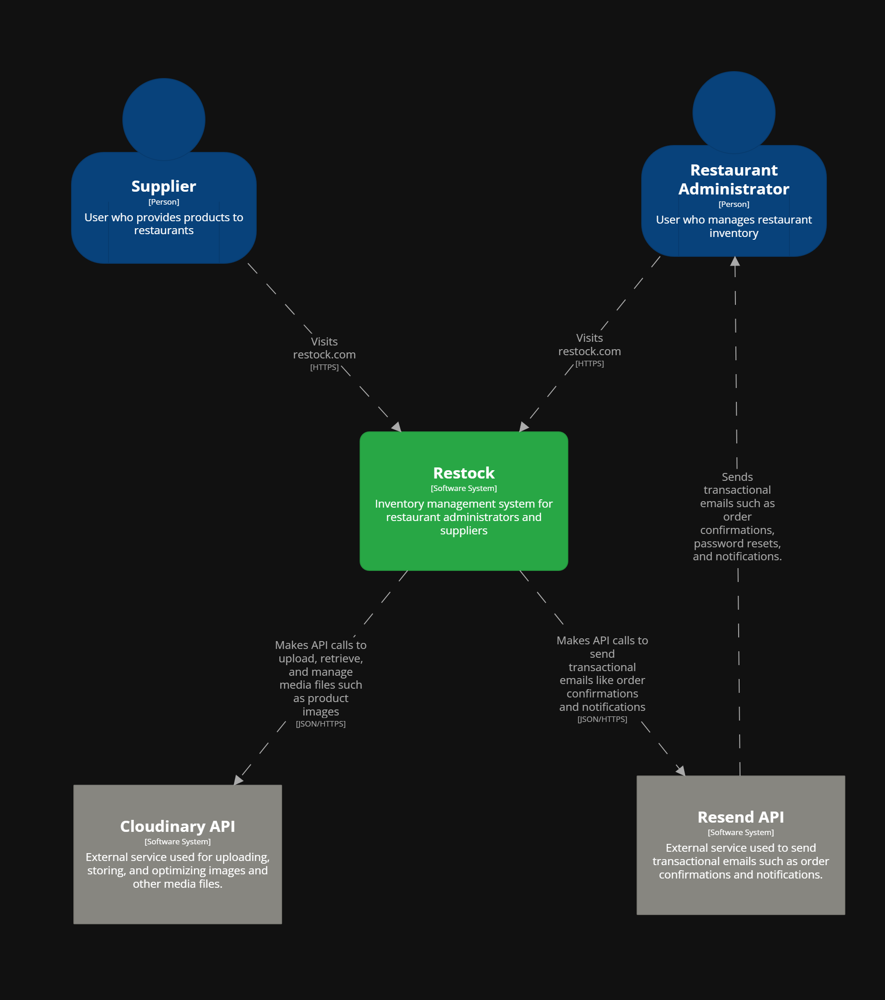

## 4.1. Style Guidelines

### 4.1.2 Web Style Guidelines

## 4.2. Information Architecture.

### 4.2.1 Organization Systems

En el sistema Restock, se emplea la organización jerárquica para destacar información crítica como alertas de stock, ingredientes próximos a vencer y elementos prioritarios en los dashboards. Esta jerarquía visual permite que el usuario identifique de forma inmediata los datos más relevantes según el contexto.

También se aplica una organización secuencial en procesos que requieren una guía paso a paso, como el registro de compras de insumos, la creación de recetas o la actualización del estado de entrega. Estos flujos siguen una progresión lógica para evitar errores de ingreso y facilitar la experiencia del usuario.

En cuanto a los esquemas de categorización, no se utiliza una organización alfabética ni matricial. Sin embargo, sí se emplea una organización cronológica para visualizar datos históricos, como el historial de ventas, registros de compras y vencimientos de insumos. Además, se clasifica el contenido según el tipo de usuario: los administradores de restaurante y los proveedores acceden a interfaces y funcionalidades adaptadas a sus respectivas necesidades y flujos de trabajo.

### 4.2.2. Labeling System

A continuación, se presenta el sistema de etiquetado (labeling system)diseñado para la plataforma Restock. Este sistema busca representar los datos de forma clara, usando etiquetas cortas y familiares que minimicen la carga cognitiva, mejoren la navegación y mantengan coherencia visual con el estilo definido en la guía de diseño.

Se ha priorizado la claridad semántica y la coherencia con el lenguaje visual del producto, especialmente con el tono de comunicación cercano y profesional.

**Landing Page:**
- **Inicio:** Sección principal de bienvenida. Incluye título principal y acceso a la plataforma
- **Beneficios:** Explicación segmentada de las ventajas de Restock para restaurantes y proveedores.
- **Testimonios:** Comentarios reales de usuarios sobre cómo la plataforma les ha ayudado en su gestión.
- **Preguntas Frecuentes:** Preguntas comunes con respuestas claras. Ayuda a resolver dudas sin necesidad de contacto directo.

**Aplicación Web – Administradores de Restaurantes**

- **Dashboard:** Vista general de indicadores clave: stock actual, compras recientes, alertas importantes.
- **Inventario:** Listado de insumos registrados. Incluye cantidades, fechas, perecibilidad y opciones para editar.
- **Compras:** Registro de compras de insumos. Permite agregar nuevas compras y consultar historial.
- **Pedidos a Proveedores:** Sección para generar y gestionar pedidos a los proveedores registrados.
- **Alertas:** Notificaciones automáticas por stock crítico, vencimientos o anomalías en el uso de insumos.
- **Recetas:** Registro de platos del menú vinculados a insumos. Permite calcular consumo y optimizar compras.
- **Reportes:** Acceso a reportes descargables sobre consumo, compras, stock y desempeño operativo.

**Aplicación Web – Proveedores**

- **Pedidos Recibidos:** Lista de órdenes enviadas por restaurantes. Incluye información de estado, entrega y productos solicitados.
- **Mis Productos:** Catálogo editable con los productos que el proveedor ofrece. Incluye nombre, precio y stock.
- **Historial de Ventas:** Registro de pedidos completados. Permite consultar por fechas o restaurante.
- **Facturación:** Seguimiento de pagos, estado de facturas emitidas y recepción de transferencias.

### 4.2.3 SEO Tags and Meta Tags

## Landing Page

#### **Charset**
    <meta charset="utf-8">

#### **Viewport (responsive)**
    <meta name="viewport" content="width=device-width, initial-scale=1">

#### **Title (SEO)**
    <title>UI-Topic | Automatiza el inventario y pedidos de tu restaurante</title>

#### **Meta Description (SEO)**
    <meta name="description" content="Plataforma para restaurantes que reduce desperdicios y mejora las ganancias mediante la gestión inteligente de inventarios y pedidos.">

#### **Meta Keywords (SEO, aunque en desuso para Google)** 
    <meta name="keywords" content="restaurantes, gestión de inventario, pedidos, automatización, proveedores, tecnología gastronómica">

#### **Meta Author**
    <meta name="author" content="UI-Topic Team">

#### **Meta Robots**
    <meta name="robots" content="index, follow">

#### **Meta Language**
    <meta name="language" content="es">

#### **Meta Copyright**
    <meta name="copyright" content="UI-Topic 2025">

## Web Application

#### **Charset**
    <meta charset="utf-8">

#### **Viewport (responsive)**
    <meta name="viewport" content="width=device-width, initial-scale=1">

#### **Title (SEO)**
    <title>UI-Topic App | Panel de gestión</title>

#### **Meta Description (SEO)**
    <meta name="description" content="Panel interno de UI-Topic para gestionar inventario, pedidos y proveedores. Solo accesible para usuarios autorizados.">

#### **Meta Author**
    <meta name="author" content="UI-Topic Team">

#### **Meta Robots**
    <meta name="robots" content="noindex, nofollow">

#### **Meta Language**
    <meta name="language" content="es">

#### **Meta Copyright**
    <meta name="copyright" content="UI-Topic 2025">

### 4.2.4 Searching Systems

## Vista del Administrador de Restaurante

### 1. Medios de ayuda para la búsqueda de datos

- Barra de búsqueda principal en cada módulo (Inventario, Pedidos, Proveedores).
- Autocompletado inteligente: se muestran sugerencias conforme el usuario escribe.
- Historial de búsquedas recientes.
- Mensajes contextuales si no se encuentran resultados (“¿Desea agregar un nuevo insumo?”).

### 2. Filtros y opciones

- Por nombre de producto.
- Por categoría de insumo (carnes, bebidas, verduras, etc.).
- Por proveedor asociado.
- Por estado de stock (stock bajo, suficiente, excedente).
- Por fecha de vencimiento próxima.
- Por pedidos con retraso o por llegar.

### 3. Visualización de resultados

- Filas con:
  - Nombre del insumo.
  - Cantidad actual.
  - Alerta de stock bajo (ícono y color).
  - Botones de acción rápida: **Editar**, **Eliminar**, **Reordenar**.
- Íconos y colores visuales:
  - Stock crítico.
  - Stock bajo.
  - Stock saludable.

## Vista del Proveedor

### 1. Medios de ayuda para la búsqueda de datos

- Buscador centralizado para gestionar productos ofrecidos y pedidos recibidos.
- Autocompletado para clientes, productos o pedidos.
- Filtros combinables para analizar entregas, productos y clientes activos.

### 2. Filtros y opciones

- Por restaurante cliente.
- Por producto ofrecido.
- Por estado del pedido (pendiente, entregado, vencido).
- Por fecha de entrega programada.
- Por frecuencia de pedidos (clientes frecuentes o nuevos).

### 3. Visualización de resultados

- Listas de pedidos con:
  - Nombre del cliente (restaurante).
  - Productos solicitados.
  - Fecha de entrega.
  - Estado (pendiente, entregado, retrasado).
- Colores de estado:
  - Pedido entregado.
  - Pedido pendiente.
  - Pedido retrasado.

### 4.2.5 Navigation Systems

La navegación en el sistema está diseñada para ser intuitiva y guiada mediante componentes de UI que permiten a los usuarios alcanzar sus objetivos de forma fluida. La navegación principal se presenta como una barra lateral fija con acceso rápido a secciones clave: Resumen, Suscripción, Inventario, Proveedores, Alertas, Pedidos y Recetas.

El contenido dentro de cada vista se organiza mediante tabs, filtros y botones de acción, lo que permite al usuario navegar por distintas categorías o ejecutar tareas específicas sin perder el contexto. En la landing page, se utiliza el desplazamiento vertical para explorar los beneficios y llamados a la acción (CTAs), permitiendo un flujo narrativo hasta llegar al punto de registro o descarga de la aplicación.

La navegación también se adapta según el tipo de usuario. Por ejemplo, los proveedores acceden a sus funciones desde una sección separada en el panel, asegurando que su recorrido dentro del sistema sea coherente con sus tareas específicas, como la gestión de productos ofrecidos o visualización de órdenes recibidas.

### 4.6.1 Software Architecture Context Diagram

**Context Diagram**
