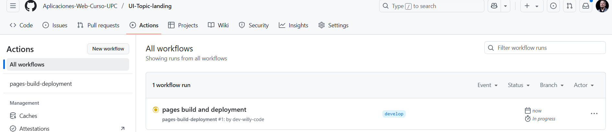
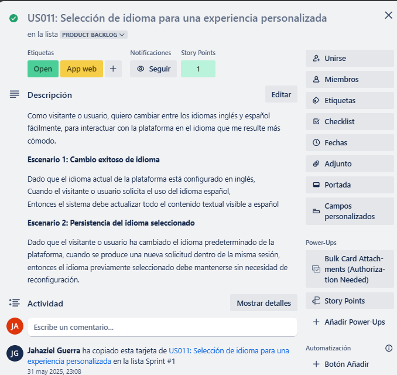
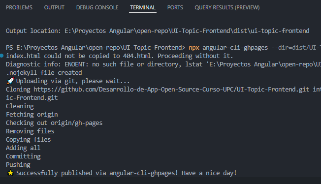

# Capítulo V: Product Implementation, Validation & Deployment

## 5.1. Software Configuration Management.

### 5.1.1 Software Development Environment Configuration

A continuación, se listan las herramientas y estándares adoptados por el equipo para el desarrollo colaborativo del sistema:

| Actividad               | Herramienta / Guía                                    | Propósito                                                     | Tipo de acceso / Ruta                                                                                                                 |
| ----------------------- | ------------------------------------------------------ | -------------------------------------------------------------- | ------------------------------------------------------------------------------------------------------------------------------------- |
| Project Management      | Trello                                                 | Seguimiento de backlog, tareas y sprints.                      | [https://trello.com/](https://trello.com/)                                                                                               |
| Requirements Management | Gherkin Conventions                                    | Escritura legible de requisitos con formato Given/When/Then.   | [https://cucumber.io/docs/gherkin/](https://cucumber.io/docs/gherkin/)                                                                   |
| Product UX/UI Design    | Figma                                                  | Prototipos y diseño responsive.                               | SaaS –[https://figma.com](https://figma.com)                                                                                            |
| Frontend Dev            | HTML, CSS, JavaScript, TypeScript, Angular             | Construcción del frontend del sistema.                        | [https://angular.io/guide/styleguide](https://angular.io/guide/styleguide)                                                               |
| Backend Dev             | Java + Spring Boot                                     | Lógica de negocio y servicios REST.                           | [https://spring.io/projects/spring-boot](https://spring.io/projects/spring-boot)                                                         |
| IDE                     | IntelliJ IDEA + WebStorm                               | Desarrollo, depuración y pruebas.                             | [https://www.jetbrains.com/idea](https://www.jetbrains.com/idea) / [https://www.jetbrains.com/webstorm](https://www.jetbrains.com/webstorm) |
| Code Standards          | Google Java Style Guide, Google TypeScript Style Guide | Mantener un código consistente y legible.                     | [https://google.github.io/styleguide](https://google.github.io/styleguide)                                                               |
| Version Control         | Git + GitHub                                           | Gestión colaborativa del código fuente.                      | SaaS –[https://github.com](https://github.com)                                                                                          |
| Software Deployment     | Github pages                                           | Despliegue continuo del sistema en ambientes de testing.       | SaaS –[https://railway.app](https://railway.app) / [https://render.com](https://render.com)                                                |
| Software Documentation  | Notion + Postman                                       | Documentación de APIs, funcionalidades y criterios técnicos. | SaaS –[https://www.notion.so](https://www.notion.so) / [https://www.postman.com](https://www.postman.com)                                  |

### 5.1.2. Source Code Management

En esta sección el equipo establece los medios y esquema de organización que aplicará para el seguimiento de modificaciones. Para ello se utilizará **GitHub** como plataforma y sistema de control de versiones.

A continuación se indican los URLs de los repositorios de GitHub para cada producto:

- **Landing Page**: [Restock | Landing Page](https://github.com/Desarrollo-de-App-Open-Source-Curso-UPC/UI-Topic-landing.git)
- **Web Services**: [[Restock | Backend](https://github.com/Desarrollo-de-App-Open-Source-Curso-UPC/UI-Topic-backend.git)]
- _(Incluye el proyecto y los archivos de pruebas unitarias e integración/aceptación)_
- **Frontend Web Application**: [[Restock | Frontend](https://github.com/Desarrollo-de-App-Open-Source-Curso-UPC/UI-Topic-frontend.git)]

#### GitFlow Workflow

Se implementará el modelo de ramificación propuesto por Vincent Driessen en su artículo *“A successful Git branching model”*, conocido como **GitFlow**. Este modelo organiza el trabajo en las siguientes ramas:

- `main`: Rama principal, contiene siempre el código en producción.
- `develop`: Rama de desarrollo principal, donde se integran las funcionalidades antes de pasar a producción.
- `feature/*`: Ramas creadas a partir de `develop` para desarrollar nuevas funcionalidades.**Convención de nombres:** `feature/<nombre-corto-descriptivo>`_Ejemplo: `feature/login-auth`_
- `release/*`: Ramas creadas desde `develop` cuando se prepara una nueva versión para producción.**Convención de nombres:** `release/<versión>`_Ejemplo: `release/1.2.0`_
- `hotfix/*`: Ramas creadas desde `main` para corregir errores críticos en producción.
  **Convención de nombres:** `hotfix/<descripción-corta>`
  _Ejemplo: `hotfix/fix-payment-bug`_

#### Versionado Semántico

Se aplicará el esquema de **Semantic Versioning 2.0.0**, con el siguiente formato:

- **MAJOR**: Incompatibilidades en la API.
- **MINOR**: Nuevas funcionalidades sin romper compatibilidad.
- **PATCH**: Correcciones de errores menores y ajustes sin afectar funcionalidades.

_Ejemplo de versión:_ `v1.3.2`

#### Convenciones de Commits

Se utilizará el estándar de **Conventional Commits** para los mensajes de commits. Esto facilitará la automatización en los procesos de integración continua y generación de changelogs.

**Ejemplos:**

- `feat: add login functionality`
- `fix: correct null pointer exception on user service`
- `chore: update dependencies`

### 5.1.3. Source Code Style Guide & Conventions.

#### Frontend (Landing Page - HTML, CSS, JavaScript)

##### Convenciones generales:

- **Idioma**: Todo el código, incluyendo nombres de variables, funciones y clases, está escrito en **inglés**.
- **Indentación**: 2 espacios.
- **Formato de archivos**: `.html`, `.css`, `.js`
- **Estilo de código adoptado**:
  - [W3Schools HTML Style Guide](https://www.w3schools.com/html/html5_syntax.asp)
  - [Google HTML/CSS Style Guide](https://google.github.io/styleguide/htmlcssguide.html)

##### Nomenclatura:

- **Clases CSS**: `kebab-case` (ej. `main-container`)
- **IDs HTML**: `camelCase` (ej. `mainContent`)
- **Variables JS**: `camelCase` (ej. `userName`)
- **Funciones JS**: `camelCase` (ej. `handleClick()`)

#### Frontend Web App (Angular + TypeScript)

##### Convenciones generales:

- **Idioma**: Código completamente en **inglés**.
- **Estructura de carpetas**: Segregación por módulos y componentes.
- **Indentación**: 2 espacios.
- **Formato de archivos**: `.ts`, `.html`, `.css`

##### Estilo de código adoptado:

- [Angular Style Guide (Oficial)](https://angular.io/guide/styleguide)
- [Google TypeScript Style Guide](https://google.github.io/styleguide/tsguide.html)

##### Nomenclatura:

- **Componentes**: `PascalCase` (ej. `UserProfileComponent`)
- **Servicios**: `camelCase` + sufijo `Service` (ej. `authService`)
- **Interfaces**: `PascalCase`, prefijo `I` opcional (ej. `User`, `IUser`)
- **Archivos**: `kebab-case` (ej. `user-profile.component.ts`)
- **Variables y funciones**: `camelCase`

#### Backend (Java + Spring Boot)

##### Convenciones generales:

- **Idioma**: Código y documentación interna en **inglés**.
- **Indentación**: 4 espacios.
- **Formato de archivos**: `.java`

##### Estilo de código adoptado:

- [Google Java Style Guide](https://google.github.io/styleguide/javaguide.html)
- [Spring Boot Features &amp; Best Practices](https://docs.spring.io/spring-boot/docs/current/reference/html/features.html)

##### Nomenclatura:

- **Clases**: `PascalCase` (ej. `UserService`)
- **Variables**: `camelCase` (ej. `userRepository`)
- **Constantes**: `UPPER_SNAKE_CASE` (ej. `MAX_USERS`)
- **Endpoints**: `kebab-case` para URLs (ej. `/api/user-profile`)
- **Paquetes**: Todo en minúsculas y separados por punto (ej. `com.project.backend.controller`)

### 5.1.4. Software Deployment Configuration

Para la Landing Page desarrollada en HTML, CSS y JavaScript, la configuración del despliegue en GitHub Pages se define de la siguiente manera:

**Repositorio de Código Fuente**

Se debe crear un repositorio en GitHub y subir todos los archivos del proyecto (HTML, CSS, JS).
Es obligatorio que el archivo `index.html` esté ubicado en la raíz del repositorio para poder realizar el despliegue correctamente.

#### Pasos de Despliegue en GitHub Pages:

1. En GitHub, ir a la sección **Settings** del repositorio.
2. En el menú lateral, seleccionar **Pages**.
3. En la opción **Source**, seleccionar la rama main y la carpeta raíz (`/root`).
4. Guardar los cambios.
5. GitHub generará automáticamente la URL pública donde la Landing Page estará disponible.

#### Configuración Adicional:

- El despliegue se realiza automáticamente cada vez que se actualiza la rama configurada (por ejemplo, `main`).


## 5.2. Landing Page, Services & Applications Implementation

### 5.2.1 Sprint 1

#### 5.2.1.1. Sprint Planning 1

A continuación, se presenta la planificación correspondiente a nuestro Sprint 1, el cual tiene como enfoque principal el desarrollo de la landing page de Restock. En esta etapa inicial, el equipo definió el objetivo del sprint, seleccionó las historias de usuario más relevantes y estableció los entregables clave que permitirán construir una primera versión funcional y visualmente atractiva de la página. Esta planificación busca asegurar un entendimiento compartido entre todos los miembros del equipo y sentar las bases para comunicar eficazmente el valor de la plataforma a los usuarios potenciales.

| Sprint #                             | Sprint 1                                                                                                                                                                                                                                                                                                                                                                                                                                                                                                                              |
| ------------------------------------ | ------------------------------------------------------------------------------------------------------------------------------------------------------------------------------------------------------------------------------------------------------------------------------------------------------------------------------------------------------------------------------------------------------------------------------------------------------------------------------------------------------------------------------------- |
| **Sprint Planning Background** |                                                                                                                                                                                                                                                                                                                                                                                                                                                                                                                                       |
| Date                                 | 2025-04-23                                                                                                                                                                                                                                                                                                                                                                                                                                                                                                                            |
| Time                                 | 19:00 pm (GMT-5)                                                                                                                                                                                                                                                                                                                                                                                                                                                                                                                      |
| Location                             | Modalidad remota mediante la plataforma Discord                                                                                                                                                                                                                                                                                                                                                                                                                                                                                       |
| Prepared By                          | Shapiama Rivera, Gabriela Nicole                                                                                                                                                                                                                                                                                                                                                                                                                                                                                                      |
| Attendees (to planning meeting)      | Avendaño Balarezo, Williams Eduardo / Castro Alejos / Julio, Guerra Perez, José Jahaziel / Guzmán Cabrejos, Yaku Mateo / Shapiama Rivera, Gabriela Nicole                                                                                                                                                                                                                                                                                                                                                                          |
| Sprint 0 Review Summary              | Dado que este es el sprint inicial, no se presenta un resumen del sprint anterior.                                                                                                                                                                                                                                                                                                                                                                                                                                                    |
| Sprint 0 Retrospective Summary       | Dado que este es el sprint inicial, no se presenta una retroalimentación del sprint anterior.                                                                                                                                                                                                                                                                                                                                                                                                                                        |
| **Sprint Goal & User Stories** |                                                                                                                                                                                                                                                                                                                                                                                                                                                                                                                                       |
| Sprint 1 Goal                        | Nos enfocamos en implementar la estructura principal y las funcionalidades clave de la landing page pública de Restock.<br />Creemos que esto aportará una percepción más sólida del producto y despertará mayor interés entre los usuarios potenciales, al comunicar de forma clara el valor y los beneficios de la plataforma.<br />Esto se confirmará cuando los visitantes puedan navegar de manera fluida por la página, comprendan fácilmente qué ofrece Restock y muestren intención de interactuar o registrarse. |
| Sprint 1 Velocity                    | 56 puntos                                                                                                                                                                                                                                                                                                                                                                                                                                                                                                                             |
| Sum of Story Points                  | 56 puntos                                                                                                                                                                                                                                                                                                                                                                                                                                                                                                                             |

#### 5.2.1.2 Aspect Leaders and Collaborators

##### Aspect Leaders and Collaborators

Durante el Sprint 1, se han definido los principales aspectos a desarrollar, correspondientes a funcionalidades específicas como la visualización de contenido, navegación fluida, adaptabilidad responsiva y gestión de autenticación de usuarios.

Con el objetivo de asegurar una comunicación clara y eficiente dentro del equipo, se elaboró la siguiente matriz de liderazgo y colaboración (LACX), asignando para cada aspecto un líder responsable (L) y colaboradores de apoyo (C).

| Team Member (Last Name, First Name) | GitHub Username    | Mostrar Mensaje de Valor | Beneficios Segmentados | CTA con Redirección y Descarga | Barra de Navegación | Pasos del Funcionamiento | Video Explicativo | Footer Landing Page | Testimonios de Clientes | Preguntas Frecuentes | Formulario de Contacto | Navegación Fluida | Responsive Desktop | Responsive Móviles | Responsive Tablet | Registro | Inicio de Sesión | Recuperación de Contraseña |
| :---------------------------------- | :----------------- | :----------------------- | :--------------------- | :------------------------------ | :------------------- | :----------------------- | :---------------- | :------------------ | :---------------------- | :------------------- | :--------------------- | :----------------- | :----------------- | :------------------ | :---------------- | :------- | :---------------- | :--------------------------- |
| Vendaño Balarezo, Williams Eduardo | dev-willy-code     | L                        | C                      | C                               | C                    | C                        | L                 | C                   | C                       | C                    | C                      | L                  | C                  | C                   | C                 | C        | C                 | C                            |
| Castro Alejos, Julio                | JulioXC4           | C                        | L                      | C                               | C                    | C                        | C                 | L                   | C                       | C                    | C                      | C                  | L                  | C                   | C                 | C        | C                 | C                            |
| Guerra Perez, José Jahaziel        | jahazielgp         | C                        | C                      | L                               | C                    | L                        | C                 | C                   | L                       | C                    | C                      | C                  | C                  | L                   | C                 | C        | C                 | C                            |
| Guzmán Cabrejos, Yaku Mateo        | yak-cod            | C                        | C                      | C                               | L                    | C                        | C                 | C                   | C                       | L                    | L                      | C                  | C                  | C                   | L                 | L        | C                 | C                            |
| Shapiama Rivera, Gabriela Nicole    | GabrielaShapiama28 | C                        | C                      | C                               | C                    | C                        | C                 | C                   | C                       | C                    | C                      | C                  | C                  | C                   | C                 | C        | L                 | L                            |

#### 5.2.1.3 Sprint Backlog 1

El objetivo principal de este Sprint es diseñar, implementar y validar las secciones del landing page, asegurando una navegación fluida, una experiencia responsiva en todos los dispositivos y funcionalidades críticas como registro, inicio de sesión y recuperación de contraseña. Se busca garantizar que el usuario final pueda interactuar de manera sencilla y eficiente con la plataforma, mejorando su satisfacción y promoviendo el cumplimiento de los objetivos de negocio.


[[Enlace al Trello](https://trello.com/invite/b/680c05f1fac416bfdb0ea024/ATTI41428da9336a1d11b0878438a247c3531DFD7E76/sprint-backlog-1)]

| User Story ID | User Story Title                                                | Task ID | Task Title                | Task Description                                                                                          | Estimated Hours |
| ------------- | --------------------------------------------------------------- | ------- | ------------------------- | --------------------------------------------------------------------------------------------------------- | --------------- |
| US-08         | Mostrar Mensaje de Valor en la Sección Principal               | T001    | Diseñar sección         | Crear diseño visual para 'mostrar mensaje de valor en la sección principal'.                            | 1/2 h           |
|               |                                                                 | T002    | Implementar funcionalidad | Codificar el componente necesario para 'mostrar mensaje de valor en la sección principal'.               | 1h              |
|               |                                                                 | T003    | Realizar pruebas          | Verificar que 'mostrar mensaje de valor en la sección principal' funcione correctamente.                 | 1/2h            |
| US-09         | Mostrar Beneficios Segmentados por Tipo de Usuario              | T004    | Diseñar sección         | Crear diseño visual para 'mostrar beneficios segmentados por tipo de usuario'.                           | 1/2h            |
|               |                                                                 | T005    | Implementar funcionalidad | Codificar el componente necesario para 'mostrar beneficios segmentados por tipo de usuario'.              | 1h              |
|               |                                                                 | T006    | Realizar pruebas          | Verificar que 'mostrar beneficios segmentados por tipo de usuario' funcione correctamente.                | 1/2h            |
| US-10         | Incluir Llamados a la Acción (CTA) con Redirección y Descarga | T007    | Diseñar sección         | Crear diseño visual para 'incluir llamados a la acción (cta) con redirección y descarga'.              | 1/2h            |
|               |                                                                 | T008    | Implementar funcionalidad | Codificar el componente necesario para 'incluir llamados a la acción (cta) con redirección y descarga'. | 1h              |
|               |                                                                 | T009    | Realizar pruebas          | Verificar que 'incluir llamados a la acción (cta) con redirección y descarga' funcione correctamente.   | 1/2h            |
| US-05         | Visualización de la barra de navegación                       | T010    | Diseñar sección         | Crear diseño visual para 'visualización de la barra de navegación'.                                    | 1/2h            |
|               |                                                                 | T011    | Implementar funcionalidad | Codificar el componente necesario para 'visualización de la barra de navegación'.                       | 1h              |
|               |                                                                 | T012    | Realizar pruebas          | Verificar que 'visualización de la barra de navegación' funcione correctamente.                         | 1/2h            |
| US-06         | Visualización de pasos del funcionamiento                      | T013    | Diseñar sección         | Crear diseño visual para 'visualización de pasos del funcionamiento'.                                   | 1/2h            |
|               |                                                                 | T014    | Implementar funcionalidad | Codificar el componente necesario para 'visualización de pasos del funcionamiento'.                      | 1h              |
|               |                                                                 | T015    | Realizar pruebas          | Verificar que 'visualización de pasos del funcionamiento' funcione correctamente.                        | 1/2h            |
| US-07         | Alternativa con video explicativo                               | T016    | Diseñar sección         | Crear diseño visual para 'alternativa con video explicativo'.                                            | 1/2h            |
|               |                                                                 | T017    | Implementar funcionalidad | Codificar el componente necesario para 'alternativa con video explicativo'.                               | 1h              |
|               |                                                                 | T018    | Realizar pruebas          | Verificar que 'alternativa con video explicativo' funcione correctamente.                                 | 1/2h            |
| US-04         | Visualización de footer en landing page                        | T019    | Diseñar sección         | Crear diseño visual para 'visualización de footer en landing page'.                                     | 1/2h            |
|               |                                                                 | T020    | Implementar funcionalidad | Codificar el componente necesario para 'visualización de footer en landing page'.                        | 2h              |
|               |                                                                 | T021    | Realizar pruebas          | Verificar que 'visualización de footer en landing page' funcione correctamente.                          | 1/2h            |
| US-01         | Ver testimonios de clientes                                     | T022    | Diseñar sección         | Crear diseño visual para 'ver testimonios de clientes'.                                                  | 2h              |
|               |                                                                 | T023    | Implementar funcionalidad | Codificar el componente necesario para 'ver testimonios de clientes'.                                     | 1/2h            |
|               |                                                                 | T024    | Realizar pruebas          | Verificar que 'ver testimonios de clientes' funcione correctamente.                                       | 1h              |
| US-02         | Consultar Preguntas Frecuentes                                  | T025    | Diseñar sección         | Crear diseño visual para 'consultar preguntas frecuentes'.                                               | 1/2h            |
|               |                                                                 | T026    | Implementar funcionalidad | Codificar el componente necesario para 'consultar preguntas frecuentes'.                                  | 1h              |
|               |                                                                 | T027    | Realizar pruebas          | Verificar que 'consultar preguntas frecuentes' funcione correctamente.                                    | 1/2h            |
| US-03         | Enviar Formulario de Contacto                                   | T028    | Diseñar sección         | Crear diseño visual para 'enviar formulario de contacto'.                                                | 1h              |
|               |                                                                 | T029    | Implementar funcionalidad | Codificar el componente necesario para 'enviar formulario de contacto'.                                   | 1/2h            |
|               |                                                                 | T030    | Realizar pruebas          | Verificar que 'enviar formulario de contacto' funcione correctamente.                                     | 1h              |
| US-16         | Navegación fluida entre secciones                              | T031    | Diseñar sección         | Crear diseño visual para 'navegación fluida entre secciones'.                                           | 1/2h            |
|               |                                                                 | T032    | Implementar funcionalidad | Codificar el componente necesario para 'navegación fluida entre secciones'.                              | 1h              |
|               |                                                                 | T033    | Realizar pruebas          | Verificar que 'navegación fluida entre secciones' funcione correctamente.                                | 1/2h            |
| US-13         | Visualización responsive en desktop                            | T034    | Diseñar sección         | Crear diseño visual para 'visualización responsive en desktop'.                                         | 1/2h            |
|               |                                                                 | T035    | Implementar funcionalidad | Codificar el componente necesario para 'visualización responsive en desktop'.                            | 1h              |
|               |                                                                 | T036    | Realizar pruebas          | Verificar que 'visualización responsive en desktop' funcione correctamente.                              | 1/2h            |
| US-15         | Visualización responsive en dispositivos móviles              | T037    | Diseñar sección         | Crear diseño visual para 'visualización responsive en dispositivos móviles'.                           | 1h              |
|               |                                                                 | T038    | Implementar funcionalidad | Codificar el componente necesario para 'visualización responsive en dispositivos móviles'.              | 1/2h            |
|               |                                                                 | T039    | Realizar pruebas          | Verificar que 'visualización responsive en dispositivos móviles' funcione correctamente.                | 1/2h            |
| US-14         | Visualización responsive en tablet                             | T040    | Diseñar sección         | Crear diseño visual para 'visualización responsive en tablet'.                                          | 1/2h            |
|               |                                                                 | T041    | Implementar funcionalidad | Codificar el componente necesario para 'visualización responsive en tablet'.                             | 1h              |
|               |                                                                 | T042    | Realizar pruebas          | Verificar que 'visualización responsive en tablet' funcione correctamente.                               | 1/2h            |
| US-17         | Registro                                                        | T043    | Diseñar sección         | Crear diseño visual para 'registro'.                                                                     | 2h              |
|               |                                                                 | T044    | Implementar funcionalidad | Codificar el componente necesario para 'registro'.                                                        | 2h              |
|               |                                                                 | T045    | Realizar pruebas          | Verificar que 'registro' funcione correctamente.                                                          | 1h              |
| US-18         | Inicio de sesión                                               | T046    | Diseñar sección         | Crear diseño visual para 'inicio de sesión'.                                                            | 2h              |
|               |                                                                 | T047    | Implementar funcionalidad | Codificar el componente necesario para 'inicio de sesión'.                                               | 1h              |
|               |                                                                 | T048    | Realizar pruebas          | Verificar que 'inicio de sesión' funcione correctamente.                                                 | 1h              |
| US-19         | Recuperación de contraseña                                    | T049    | Diseñar sección         | Crear diseño visual para 'recuperación de contraseña'.                                                 | 2h              |
|               |                                                                 | T050    | Implementar funcionalidad | Codificar el componente necesario para 'recuperación de contraseña'.                                    | 1/2h            |
|               |                                                                 | T051    | Realizar pruebas          | Verificar que 'recuperación de contraseña' funcione correctamente.                                      | 1h              |

#### 5.2.1.4. Development Evidence for Sprint Review

Durante el Sprint 1, el equipo se enfocó exclusivamente en el desarrollo de la Landing Page de la plataforma Restock.
El objetivo principal fue construir una página pública funcional, atractiva visualmente y completamente responsiva, que comunique eficazmente la propuesta de valor de la plataforma a los usuarios potenciales.
A lo largo del Sprint se diseñaron e implementaron secciones clave como Hero, Sobre Nosotros, Beneficios, Testimonios, Preguntas Frecuentes, Tutoriales, Contacto y el Footer.
También se trabajó en asegurar la adaptabilidad móvil, el cumplimiento de criterios de accesibilidad y la optimización inicial para motores de búsqueda (SEO).

| Repository                        | Branch                             | Commit Id | Commit Message                                                                  | Commit Message Body                                                                            | Commited on (Date) |
| --------------------------------- | ---------------------------------- | --------- | ------------------------------------------------------------------------------- | ---------------------------------------------------------------------------------------------- | ------------------ |
| GabrielaShapiama/UI-Topic-landing | feature/acces                      | f3de2d0   | fix(access): remove incorrect image.                                            | Removed an incorrect image that was incorrectly placed in the access module.                   | 26-04-2025         |
| Yaku Guzman/UI-Topic-landing      | feature/tutorial-section           | 1c1d5e2   | fix(tutorial-section): fix tutorial links width                                 | Fixed the width issue affecting the layout of tutorial links on different screens.             | 26-04-2025         |
| Williams/UI-Topic-landing         | feature/seo-tags-meta-tags         | b50e3c3   | feat(seo-tags-meta-tags): adding seo tags and meta tags                         | Added SEO and meta tags to improve page indexing and online visibility.                        | 26-04-2025         |
| JulioXC4/UI-Topic-landing         | feature/voice-reader-accessibility | 936c01d   | feat(voice): add file voice.js                                                  | Added a new JavaScript file to handle voice-related functionalities.                           | 26-04-2025         |
| JulioXC4/UI-Topic-landing         | feature/language-toggle            | 5bf2a4f   | feat(navbar): add language switch icon and console log for future functionality | Introduced a language switcher icon and set up console logs for future multi-language support. | 26-04-2025         |
| GabrielaShapiama/UI-Topic-landing | feature/acces                      | 4fd9958   | fix(access): fix text position.                                                 | Adjusted the text alignment issues on the access screen.                                       | 26-04-2025         |
| GabrielaShapiama/UI-Topic-landing | feature/acces                      | a9b89b2   | fix(access): remove incorrect css.                                              | Removed unnecessary or incorrect CSS rules from the access styles.                             | 26-04-2025         |
| GabrielaShapiama/UI-Topic-landing | feature/acces                      | c0f15db   | style(access): change buttons format.                                           | Updated the button styles to align with the platform's visual guidelines.                      | 25-04-2025         |
| jahazielgp/UI-Topic-landing       | feature/fix-navbar                 | e293098   | fix(navbar): fix navbar.                                                        | Fixed layout and functionality issues in the navigation bar.                                   | 25-04-2025         |
| jahazielgp/UI-Topic-landing       | feature/benefits-section           | d6cee23   | feat(benefits): add benefits section.                                           | Added HTML and CSS structure for the Benefits section.                                         | 25-04-2025         |
| Yaku Guzman/UI-Topic-landing      | feature/tutorial-section           | 4d7e12d   | fix(tutorial-section): add tutorial css file                                    | Added a dedicated CSS file to improve the Tutorial section styling.                            | 25-04-2025         |
| Yaku Guzman/UI-Topic-landing      | feature/footer-section             | a3187cc   | fix(footer-section): fix link to css                                            | Fixed broken or incorrect link to the footer’s CSS file.                                      | 25-04-2025         |
| Williams/UI-Topic-landing         | feature/preguntas                  | c307001   | fix(preguntas): adding other files                                              | Added missing assets and files needed for the FAQ section.                                     | 25-04-2025         |
| Williams/UI-Topic-landing         | feature/preguntas                  | 057ba2e   | fix(preguntas): adding add dropdown menu                                        | Implemented the dropdown functionality for the FAQ section.                                    | 25-04-2025         |
| GabrielaShapiama/UI-Topic-landing | feature/access                     | 57c525a   | feat(access): add navebar.                                                      | Created and styled the navbar for the access page.                                             | 25-04-2025         |
| GabrielaShapiama/UI-Topic-landing | feature/access                     | 1269f12   | chore(access): translate some comments.                                         | Translated developer comments into English for better clarity.                                 | 25-04-2025         |
| GabrielaShapiama/UI-Topic-landing | feature/access                     | e48c646   | fix(access): remove incorrect function.                                         | Removed a non-functional or unnecessary JavaScript function.                                   | 25-04-2025         |
| GabrielaShapiama/UI-Topic-landing | feature/access                     | 84764de   | feat(access): add recovery password logic.                                      | Implemented logic for the password recovery feature.                                           | 25-04-2025         |
| GabrielaShapiama/UI-Topic-landing | feature/access                     | f787614   | feat(access): add access to plataform.                                          | Added login and basic access functionality to the platform.                                    | 25-04-2025         |
| Williams/UI-Topic-landing         | feature/descargar                  | 06f232a   | fix(descargar): make section fully responsive for all screen sizes              | Made the Descargar section fully responsive across all devices.                                | 25-04-2025         |
| Yaku Guzman/UI-Topic-landing      | feature/footer-section             | ef64a65   | fix(footer-section): fix vh                                                     | Adjusted viewport height (vh) settings in the footer section.                                  | 23-04-2025         |
| Yaku Guzman/UI-Topic-landing      | feature/footer-section             | 5bcde82   | feat(tutorial-section): add tutorial section                                    | Built the complete Tutorial section (HTML and CSS).                                            | 23-04-2025         |
| Yaku Guzman/UI-Topic-landing      | feature/footer-section             | 7ecf4f2   | fix(footer-section): fix responsive                                             | Fixed responsiveness issues in the footer layout.                                              | 23-04-2025         |
| Yaku Guzman/UI-Topic-landing      | feature/footer-section             | 1dea22f   | feat(contacto-section): add responsive                                          | Made the Contact section fully responsive.                                                     | 23-04-2025         |
| Williams/UI-Topic-landing         | feature/descargar                  | e4598c3   | feat(descargar): create descargar section(html,css)                             | Created the Download section with full HTML and CSS styling.                                   | 22-04-2025         |
| Williams/UI-Topic-landing         | feature/preguntas                  | 64f1af0   | feat(preguntas): create preguntas frecuentes(html,css)                          | Developed the FAQ (Preguntas Frecuentes) section structure and style.                          | 22-04-2025         |
| Williams/UI-Topic-landing         | feature/testimonios                | 74f270e   | fix(testimonios): moving section to main tag                                    | Moved the Testimonials section to the main content area for better semantics.                  | 22-04-2025         |
| Williams/UI-Topic-landing         | feature/testimonios                | 9e3685a   | fix(testimonios): updating testimonios(html)                                    | Updated the Testimonials section HTML content.                                                 | 22-04-2025         |
| Yaku Guzman/UI-Topic-landing      | feature/footer-section             | cdc23c1   | feat(footer-section): add responsive                                            | Implemented responsive behavior for the footer section.                                        | 22-04-2025         |
| jahazielgp/UI-Topic-landing       | feature/about-us-section           | 71e82c6   | feat(about-us): add about-us section.                                           | Added the About Us section including structure and initial styling.                            | 22-04-2025         |
| Yaku Guzman/UI-Topic-landing      | feature/footer-section             | 7bb7da7   | feat(footer-section): add icons                                                 | Added social media icons into the footer layout.                                               | 22-04-2025         |
| jahazielgp/UI-Topic-landing       | feature/develop                    | f6e104a   | chore: refactor directories.                                                    | Restructured project folders for better organization and scalability.                          | 21-04-2025         |
| Williams/UI-Topic-landing         | feature/testimonios                | 27377d0   | feat(testimonios): add testimonios(html,css,img)                                | Created the Testimonials section including text and images.                                    | 21-04-2025         |
| Yaku Guzman/UI-Topic-landing      | feature/contacto-section           | b469827   | feat(contacto-section): add contacto html and css                               | Built the Contact section with full HTML and CSS.                                              | 21-04-2025         |
| Yaku Guzman/UI-Topic-landing      | feature/footer-section             | efd9aac   | feat(footer/section): add footer html and css                                   | Implemented the complete Footer section including structure and styles.                        | 21-04-2025         |
| jahazielgp/UI-Topic-landing       | feature/hero-section               | 9341bde   | feat(hero-section): add responsive design.                                      | Made the Hero section fully responsive for mobile and desktop.                                 | 20-04-2025         |
| jahazielgp/UI-Topic-landing       | feature/hero-section               | 7746107   | feat(hero-section): add hero html, css and js components.                       | Built the Hero section with its respective HTML, CSS, and JavaScript.                          | 20-04-2025         |
| jahazielgp/UI-Topic-landing       | feature/develop                    | 303ad89   | chore: initial commit                                                           | Project initialization with base structure.                                                    | 20-04-2025         |
| jahazielgp/UI-Topic-landing       | main                               | 556268a   | Initial commit                                                                  | Setup initial project files and base structure.                                                | 02-04-2025         |

#### Productos según alcance del Sprint:

##### Landing Page

Durante el Sprint 1 se implementó la Landing Page de Restock.
Los principales avances fueron:

- Diseño responsivo para diferentes tamaños de pantalla.
- Creación de secciones: Hero, Sobre Nosotros, Beneficios, Testimonios, Preguntas Frecuentes, Tutorial, Contacto y Footer.
- Aplicación de buenas prácticas de accesibilidad (etiquetado semántico, contraste adecuado).
- Optimización inicial para motores de búsqueda (SEO básico).
- Implementación de navegación fluida entre secciones.
- Validación de compatibilidad en navegadores y dispositivos.

#### 5.2.1.5 Execution Evidence for Sprint Review

A continuación, se presenta el video de la landing page. Este muestra la interacción principal de los usuarios con la plataforma, destacando los flujos de navegación, diseño responsivo y la estructura general de la aplicación.

**Video de landing page:**

[Enlace al video](https://upcedupe-my.sharepoint.com/:v:/g/personal/u202021885_upc_edu_pe/EfFh_aLa215IpYb2gWuRmkMBv48d7taz_93yGa29b-vC7g?e=ooggOw&nav=eyJyZWZlcnJhbEluZm8iOnsicmVmZXJyYWxBcHAiOiJTdHJlYW1XZWJBcHAiLCJyZWZlcnJhbFZpZXciOiJTaGFyZURpYWxvZy1MaW5rIiwicmVmZXJyYWxBcHBQbGF0Zm9ybSI6IldlYiIsInJlZmVycmFsTW9kZSI6InZpZXcifX0%3D)

#### 5.2.1.6 Services Documentation Evidence for Sprint Review

Durante este sprint se completó el diseño e implementación del Landing Page del sistema, el cual forma parte del acceso inicial al sistema y constituye un punto de entrada fundamental para los usuarios. Aunque no se implementaron endpoints tradicionales de tipo REST en este sprint, se documenta a continuación la URL del recurso publicado, junto con evidencia de despliegue, interacción y commits relacionados.

**Descripción del Logro:**

-Implementación del Landing Page estático.

-Deployment del landing page.

### Recursos del Sprint

| Recurso      | Acción implementada   | Método HTTP | URL / Endpoint                                                              | Link de repositorio                                                         |
| ------------ | ---------------------- | ------------ | --------------------------------------------------------------------------- | --------------------------------------------------------------------------- |
| Landing Page | Visualización inicial | GET          | https://desarrollo-de-app-open-source-curso-upc.github.io/UI-Topic-landing/ | https://github.com/Desarrollo-de-App-Open-Source-Curso-UPC/UI-Topic-landing |

#### 5.2.1.7. Software Deployment Evidence for Sprint Review.

Durante este Sprint, se realizaron actividades de despliegue de la Landing Page utilizando GitHub Pages como plataforma de hosting. A continuación, se detallan los pasos ejecutados:

**1- Se accedió a la sección Settings del repositorio.**

Dentro de Pages, se seleccionó la rama (main o master) y la carpeta (root o /docs) desde la cual GitHub Pages debía publicar el sitio.
Se guardaron los cambios para activar la publicación automática.


**2- Por default ya esta activado el https**


**3- En la seccion "All workflows" se puede ver que la app se esta deployando.**



**4- El landing page fue exitosamente deployado**


**5- Se obtuvo y verificó la URL pública proporcionada por GitHub Pages.**


#### 5.2.1.8 Team Collaboration Insights during Sprint

##### Desarrollo de las Actividades de Implementación

Durante el Sprint 1, el equipo de Restock se enfocó en el desarrollo de la **Landing Page**.
Las actividades de implementación se llevaron a cabo de la siguiente manera:

- Se crearon ramas específicas para cada sección o funcionalidad (`feature/[nombre-de-seccion]`), permitiendo un trabajo paralelo organizado.
- Cada miembro del equipo asumió la responsabilidad de desarrollar una o más secciones de la Landing Page.
- Se realizaron commits frecuentes, registrando avances de manera continua y detallada.
- Las funcionalidades desarrolladas se integraron mediante Pull Requests hacia la rama `develop`.
- Se mantuvo una comunicación constante mediante la plataforma Discord para coordinar avances y resolver dudas en tiempo real.
- Se aplicaron buenas prácticas de programación, control de versiones y colaboración en equipo.

Gracias a esta organización, se logró cumplir de manera efectiva el objetivo del sprint, garantizando que todos los integrantes contribuyeran de forma activa en el desarrollo de la Landing Page.

---

##### Evidencia de Colaboración en GitHub

Se presenta a continuación la captura de los insights del repositorio de GitHub, correspondiente al Sprint 1:


**Insights:**

- **26 Pull Requests** fusionados correctamente.
- **5 autores** contribuyendo al repositorio.
- **39 commits** realizados en el periodo del Sprint.
- Participación activa de todos los miembros asignados al desarrollo de la Landing Page.

### 5.2.2 Sprint 2

#### 5.2.2.1. Sprint Planning 2

| Sprint #                             | Sprint 2                                                                                                                                                                                                                                                                                                                                                                                                                                                                                                                                                                                                                                                     |
| ------------------------------------ | ------------------------------------------------------------------------------------------------------------------------------------------------------------------------------------------------------------------------------------------------------------------------------------------------------------------------------------------------------------------------------------------------------------------------------------------------------------------------------------------------------------------------------------------------------------------------------------------------------------------------------------------------------------ |
| **Sprint Planning Background** |                                                                                                                                                                                                                                                                                                                                                                                                                                                                                                                                                                                                                                                              |
| Date                                 | 2025-05-05                                                                                                                                                                                                                                                                                                                                                                                                                                                                                                                                                                                                                                                   |
| Time                                 | 07:00 pm (GMT-5)                                                                                                                                                                                                                                                                                                                                                                                                                                                                                                                                                                                                                                             |
| Location                             | Modalidad remota mediante la plataforma Discord                                                                                                                                                                                                                                                                                                                                                                                                                                                                                                                                                                                                              |
| Prepared By                          | Guzmán Cabrejos, Yaku Mateo                                                                                                                                                                                                                                                                                                                                                                                                                                                                                                                                                                                                                                 |
| Attendees (to planning meeting)      | Avendaño Balarezo, Williams Eduardo / Castro Alejos, Julio / Guerra Perez, José Jahaziel / Guzmán Cabrejos, Yaku Mateo / Shapiama Rivera, Gabriela Nicole                                                                                                                                                                                                                                                                                                                                                                                                                                                                                                 |
| Sprint 1 Review Summary              | Durante el Sprint 1 se logró implementar casi en su totalidad la Landing Page del sistema Restock, desarrollando secciones clave como el header, footer, sección de beneficios y preguntas frecuentes, así como la integración inicial de estilos globales y tipografía. Quedó faltante la funcionalidad de cambio de idioma, la cual será prioridad para el siguiente sprint. El equipo cumplió con los entregables establecidos, respetando el diseño de mockups y la guía de estilos. Se identificaron oportunidades de mejora en la velocidad de desarrollo y gestión de tiempos.                                                             |
| Sprint 1 Retrospective Summary       | Durante el Sprint 1, el equipo logró avanzar de forma coordinada y efectiva en el desarrollo de la landing page, sin enfrentar mayores dificultades. Cada integrante cumplió puntualmente con las secciones asignadas, lo que permitió avanzar según lo planificado. La adopción de convenciones comunes en el código y el diseño contribuyó a mantener la coherencia del producto y facilitó la integración entre partes. Como mejora para el siguiente sprint, se acordó implementar revisiones diarias (daily reviews) que permitan alinear mejor los avances, detectar bloqueos tempranos y mejorar la comunicación continua entre miembros. |
| **Sprint Goal & User Stories** |                                                                                                                                                                                                                                                                                                                                                                                                                                                                                                                                                                                                                                                              |
| Sprint 2 Goal                        | Nuestro enfoque está en  brindar información clara y detallada a los visitantes de la plataforma, así como habilitar funcionalidades clave para los usuarios del sistema  interno.<br />Creemos que esto proporciona  mayor comprensión del propósito de la solución a los visitantes y mejora la eficiencia operativa del personal de los restaurantes.<br />Esto se confirmará cuando  los visitantes puedan explorar contenido relevante desde el acceso  público, y los usuarios autenticados naveguen por el panel principal y accedan a al menos tres módulos funcionales del sistema.                                                        |
| Sprint 2 Velocity                    | 94                                                                                                                                                                                                                                                                                                                                                                                                                                                                                                                                                                                                                                                           |
| Sum of Story Points                  | 91                                                                                                                                                                                                                                                                                                                                                                                                                                                                                                                                                                                                                                                           |

#### 5.2.2.2 Aspect Leaders and Collaborators

##### Aspect Leaders and Collaborators

Durante el Sprint 2,  se ha definido el desarrollo e integración de los módulos principales del frontend de la aplicación web interna  Restock , abarcando funcionalidades clave como la gestión de productos, pedidos, inventario y compras. Estas implementaciones buscan optimizar los procesos internos y mejorar la trazabilidad del inventario, brindando mayor eficiencia a los administradores de restaurantes y su personal.

Con el fin de mantener una coordinación efectiva y una comunicación fluida entre los integrantes del equipo, se estructuró la matriz de liderazgo y colaboración (LACX), donde se asignó un líder (L) encargado de cada funcionalidad y colaboradores (C) que brindan apoyo en su implementación.

<div style="font-size: 0.75em; overflow-x: auto;">

| Team Member (Last Name, First Name) | GitHub Username    | Configuración de perfil | Panel de suscripción y planes | Alertas para proveedores | Calificaciones de proveedores | Barra de navegación | Alertas para restaurantes | Registro de recetas | Registro de ventas de restaurantes | Registro de proveedores desde restaurantes | Inventario de insumos | Pedidos a proveedores | Ordenes de proveedores | Resumen de datos |
| :---------------------------------- | :----------------- | :----------------------- | :----------------------------- | :----------------------- | :---------------------------- | :------------------- | :------------------------ | :------------------ | :--------------------------------- | :----------------------------------------- | :-------------------- | :--------------------- | :--------------------- | :--------------- |
| Vendaño Balarezo, Williams Eduardo | dev-willy-code     | C                        | L                              | L                        | L                             | C                    | C                         | C                   | L                                  | C                                          | C                     | C                      | C                      | C                |
| Castro Alejos, Julio                | JulioXC4           | C                        | C                              | C                        | C                             | C                    | C                         | C                   | C                                  | C                                          | L                     | C                      | C                      | C                |
| Guerra Perez, José Jahaziel        | jahazielgg         | L                        | C                              | C                        | C                             | L                    | L                         | L                   | C                                  | C                                          | C                     | C                      | C                      | C                |
| Guzmán Cabrejos, Yaku Mateo        | yak-cod            | C                        | C                              | C                        | C                             | C                    | C                         | C                   | C                                  | L                                          | C                     | C                      | C                      | L                |
| Shapiama Rivera, Gabriela Nicole    | GabrielaShapiama28 | C                        | C                              | C                        | C                             | C                    | C                         | C                   | C                                  | C                                          | C                     | L                      | L                      | C                |

</div>

#### 5.2.2.3 Sprint Backlog 2

El objetivo principal de este Sprint es desarrollar la interfaz frontend de los dashboards para **administradores de restaurantes y proveedores**, enfocándose en una estructura clara, navegación eficiente y visualización adecuada de datos críticos.


Además, se realizaron mejoras en el *landing page*, incluyendo la implementación de un **toggle de idioma** (inglés/español) y la incorporación de **atributos de accesibilidad** como `aria-label` y `lang`, asegurando mayor inclusión y cumplimiento de estándares web.




[[Enlace al Trello Sprint 2](https://trello.com/invite/b/681ab5854ac93bbc3c456c4e/ATTI2ddc2248f5308bf6ee343af5c381ec7f2CE97AD8/sprint-backlog-2)]

| User Story ID | User Story Title                                      | Task ID | Task Title                | Task Description                                                                                          | Estimated Hours |
| ------------- | ----------------------------------------------------- | ------- | ------------------------- | --------------------------------------------------------------------------------------------------------- | --------------- |
| US-08         | Selector de idioma en landing page                    | T001    | Diseñar sección         | Crear diseño visual para 'mostrar mensaje de valor en la sección principal'.                            | 1/2 h           |
|               |                                                       | T002    | Implementar funcionalidad | Codificar el componente necesario para 'mostrar mensaje de valor en la sección principal'.               | 1h              |
|               |                                                       | T003    | Realizar pruebas          | Verificar que 'mostrar mensaje de valor en la sección principal' funcione correctamente.                 | 1/2h            |
| US-09         | Optimización para pantallas de tablet                | T004    | Diseñar sección         | Crear diseño visual para 'mostrar beneficios segmentados por tipo de usuario'.                           | 1/2h            |
|               |                                                       | T005    | Implementar funcionalidad | Codificar el componente necesario para 'mostrar beneficios segmentados por tipo de usuario'.              | 1h              |
|               |                                                       | T006    | Realizar pruebas          | Verificar que 'mostrar beneficios segmentados por tipo de usuario' funcione correctamente.                | 1/2h            |
| US-10         | Acceso limitado según estado de suscripción         | T007    | Diseñar sección         | Crear diseño visual para 'incluir llamados a la acción (cta) con redirección y descarga'.              | 1/2h            |
|               |                                                       | T008    | Implementar funcionalidad | Codificar el componente necesario para 'incluir llamados a la acción (cta) con redirección y descarga'. | 1h              |
|               |                                                       | T009    | Realizar pruebas          | Verificar que 'incluir llamados a la acción (cta) con redirección y descarga' funcione correctamente.   | 1/2h            |
| US-05         | Registrar una compra de insumo                        | T010    | Diseñar sección         | Crear diseño visual para 'visualización de la barra de navegación'.                                    | 1/2h            |
|               |                                                       | T011    | Implementar funcionalidad | Codificar el componente necesario para 'visualización de la barra de navegación'.                       | 1h              |
|               |                                                       | T012    | Realizar pruebas          | Verificar que 'visualización de la barra de navegación' funcione correctamente.                         | 1/2h            |
| US-06         | Gestión de perfil del restaurante                    | T013    | Diseñar sección         | Crear diseño visual para 'visualización de pasos del funcionamiento'.                                   | 1/2h            |
|               |                                                       | T014    | Implementar funcionalidad | Codificar el componente necesario para 'visualización de pasos del funcionamiento'.                      | 1h              |
|               |                                                       | T015    | Realizar pruebas          | Verificar que 'visualización de pasos del funcionamiento' funcione correctamente.                        | 1/2h            |
| US-07         | Gestión de perfil del proveedor                      | T016    | Diseñar sección         | Crear diseño visual para 'alternativa con video explicativo'.                                            | 1/2h            |
|               |                                                       | T017    | Implementar funcionalidad | Codificar el componente necesario para 'alternativa con video explicativo'.                               | 1h              |
|               |                                                       | T018    | Realizar pruebas          | Verificar que 'alternativa con video explicativo' funcione correctamente.                                 | 1/2h            |
| US-04         | Actualización manual y edición previa de inventario | T019    | Diseñar sección         | Crear diseño visual para 'visualización de footer en landing page'.                                     | 1/2h            |
|               |                                                       | T020    | Implementar funcionalidad | Codificar el componente necesario para 'visualización de footer en landing page'.                        | 2h              |
|               |                                                       | T021    | Realizar pruebas          | Verificar que 'visualización de footer en landing page' funcione correctamente.                          | 1/2h            |
| US-01         | Visualizar ingredientes más usados                   | T022    | Diseñar sección         | Crear diseño visual para 'ver testimonios de clientes'.                                                  | 2h              |
|               |                                                       | T023    | Implementar funcionalidad | Codificar el componente necesario para 'ver testimonios de clientes'.                                     | 1/2h            |
|               |                                                       | T024    | Realizar pruebas          | Verificar que 'ver testimonios de clientes' funcione correctamente.                                       | 1h              |
| US-02         | Consultar Preguntas Frecuentes                        | T025    | Diseñar sección         | Crear diseño visual para 'consultar preguntas frecuentes'.                                               | 1/2h            |
|               |                                                       | T026    | Implementar funcionalidad | Codificar el componente necesario para 'consultar preguntas frecuentes'.                                  | 1h              |
|               |                                                       | T027    | Realizar pruebas          | Verificar que 'consultar preguntas frecuentes' funcione correctamente.                                    | 1/2h            |
| US-23         | Visualización de feedback                            | T028    | Diseñar sección         | Crear diseño visual para 'enviar formulario de contacto'.                                                | 1h              |
|               |                                                       | T029    | Implementar funcionalidad | Codificar el componente necesario para 'enviar formulario de contacto'.                                   | 1/2h            |
|               |                                                       | T030    | Realizar pruebas          | Verificar que 'enviar formulario de contacto' funcione correctamente.                                     | 1h              |
| US-26         | Navegación fluida entre secciones                    | T031    | Diseñar sección         | Crear diseño visual para 'navegación fluida entre secciones'.                                           | 1/2h            |
|               |                                                       | T032    | Implementar funcionalidad | Codificar el componente necesario para 'navegación fluida entre secciones'.                              | 1h              |
|               |                                                       | T033    | Realizar pruebas          | Verificar que 'navegación fluida entre secciones' funcione correctamente.                                | 1/2h            |
| US-13         | Visualización responsive en desktop                  | T034    | Diseñar sección         | Crear diseño visual para 'visualización responsive en desktop'.                                         | 1/2h            |
|               |                                                       | T035    | Implementar funcionalidad | Codificar el componente necesario para 'visualización responsive en desktop'.                            | 1h              |
|               |                                                       | T036    | Realizar pruebas          | Verificar que 'visualización responsive en desktop' funcione correctamente.                              | 1/2h            |
| US-15         | Visualización responsive en dispositivos móviles    | T037    | Diseñar sección         | Crear diseño visual para 'visualización responsive en dispositivos móviles'.                           | 1h              |
|               |                                                       | T038    | Implementar funcionalidad | Codificar el componente necesario para 'visualización responsive en dispositivos móviles'.              | 1/2h            |
|               |                                                       | T039    | Realizar pruebas          | Verificar que 'visualización responsive en dispositivos móviles' funcione correctamente.                | 1/2h            |
| US-14         | Visualización responsive en tablet                   | T040    | Diseñar sección         | Crear diseño visual para 'visualización responsive en tablet'.                                          | 1/2h            |
|               |                                                       | T041    | Implementar funcionalidad | Codificar el componente necesario para 'visualización responsive en tablet'.                             | 1h              |
|               |                                                       | T042    | Realizar pruebas          | Verificar que 'visualización responsive en tablet' funcione correctamente.                               | 1/2h            |
| US-45         | Estado general del inventario                         | T043    | Diseñar sección         | Crear diseño visual para 'registro'.                                                                     | 2h              |
|               |                                                       | T044    | Implementar funcionalidad | Codificar el componente necesario para 'registro'.                                                        | 2h              |
|               |                                                       | T045    | Realizar pruebas          | Verificar que 'registro' funcione correctamente.                                                          | 1h              |
| US-47         | Identificar a los Mejores Clientes                    | T046    | Diseñar sección         | Crear diseño visual para 'inicio de sesión'.                                                            | 2h              |
|               |                                                       | T047    | Implementar funcionalidad | Codificar el componente necesario para 'inicio de sesión'.                                               | 1h              |
|               |                                                       | T048    | Realizar pruebas          | Verificar que 'inicio de sesión' funcione correctamente.                                                 | 1h              |
| US-49         | Búsqueda y Filtrado de Proveedores                   | T049    | Diseñar sección         | Crear diseño visual para 'recuperación de contraseña'.                                                 | 2h              |
|               |                                                       | T050    | Implementar funcionalidad | Codificar el componente necesario para 'recuperación de contraseña'.                                    | 1/2h            |
|               |                                                       | T051    | Realizar pruebas          | Verificar que 'recuperación de contraseña' funcione correctamente.                                      | 1h              |

#### 5.2.2.4 Development Evidence for Sprint Review

En esta sección se presentan los avances realizados durante el Sprint 2, centrado en el desarrollo de los módulos principales de la aplicación web interna de Restock.
El objetivo principal fue implementar funcionalidades claves para la gestión de productos, inventario y resumen, con el fin de mejorar la eficiencia operativa y la trazabilidad de los recursos dentro de los administradores de restaurantes y proveedores.

| Repository | Branch | Commit id | Commit message | Commit Message Body | Commited on |
|------------|--------|------------|----------------|----------------------|--------------|
| JulioXC4/UI-Topic-landing | feature/TODO-BRANCH | be4a0ea | fix: deploy fixes |  | 16-05-2025 |
| GabrielaShapiama/UI-Topic-landing | feature/profile | e47acb8 | feat(profile): update styles of add and create component. |  | 16-05-2025 |
| GabrielaShapiama/UI-Topic-landing | feature/profile | b2a9c16 | feat(profile): update styles of add and create component. |  | 16-05-2025 |
| jahazielgg/UI-Topic-landing | feature/alerts | 7a50f75 | feat(alerts): add mock data for restaurant alerts and update routing |  | 16-05-2025 |
| jahazielgg/UI-Topic-landing | feature/alerts | 2f1ce38 | feat(alerts): add restaurant alerts component and update routing |  | 16-05-2025 |
| GabrielaShapiama/UI-Topic-landing | feature/profile | 99ba24e | feat(profile): add observable to profile service. |  | 16-05-2025 |
| GabrielaShapiama/UI-Topic-landing | feature/profile | cca31b5 | chore(profile): delete constant test. |  | 16-05-2025 |
| GabrielaShapiama/UI-Topic-landing | feature/profile | ddee246 | chore(profile): add import to dashboard layout component. |  | 16-05-2025 |
| GabrielaShapiama/UI-Topic-landing | feature/profile | b59b0ca | chore(profile): organize imports of profile overview. |  | 16-05-2025 |
| GabrielaShapiama/UI-Topic-landing | feature/profile | ff9a8aa | chore(profile): organize imports of profile settings. |  | 16-05-2025 |
| GabrielaShapiama/UI-Topic-landing | feature/profile | 8dabaa2 | chore(profile): organize imports of profile details. |  | 16-05-2025 |
| GabrielaShapiama/UI-Topic-landing | feature/profile | ade3f7e | chore(profile): organize imports of personal data settings. |  | 16-05-2025 |
| GabrielaShapiama/UI-Topic-landing | feature/profile | e99de89 | chore(profile): organize imports of business data settings. |  | 16-05-2025 |
| GabrielaShapiama/UI-Topic-landing | feature/profile | e367a6b | feat(profile): import route link for profile section. |  | 16-05-2025 |
| GabrielaShapiama/UI-Topic-landing | feature/profile | 49ea5b8 | feat(profile): add route to icon profile. |  | 16-05-2025 |
| GabrielaShapiama/UI-Topic-landing | feature/profile | d28acd5 | feat(profile): add route to profile. |  | 16-05-2025 |
| GabrielaShapiama/UI-Topic-landing | feature/profile | 3ae6fd2 | feat(profile): add admin avatar image. |  | 16-05-2025 |
| GabrielaShapiama/UI-Topic-landing | feature/profile | 418d61f | feat(profile): add profile overview page. |  | 16-05-2025 |
| GabrielaShapiama/UI-Topic-landing | feature/profile | 52c64bb | feat(profile): add profile details component. |  | 16-05-2025 |
| GabrielaShapiama/UI-Topic-landing | feature/profile | 6ccec51 | feat(profile): add profile settings component. |  | 16-05-2025 |
| GabrielaShapiama/UI-Topic-landing | feature/profile | 5cf61e0 | feat(profile): add business data settings component. |  | 16-05-2025 |
| GabrielaShapiama/UI-Topic-landing | feature/profile | e6f92b0 | feat(profile): add personal data settings component. |  | 16-05-2025 |
| GabrielaShapiama/UI-Topic-landing | feature/profile | 7ecec12 | feat(profile): add security settings component. |  | 16-05-2025 |
| GabrielaShapiama/UI-Topic-landing | feature/profile | 128ccb4 | feat(profile): add profile entity. |  | 16-05-2025 |
| GabrielaShapiama/UI-Topic-landing | feature/profile | 33ec5ae | feat(profile): add profile service. |  | 16-05-2025 |
| GabrielaShapiama/UI-Topic-landing | feature/profile | 8c16a75 | chore(profile): update schema. |  | 16-05-2025 |
| Williams/UI-Topic-landing | feature/inventory | 0a6bc69 | feat(styles-inventory): adding styles in inventory |  | 16-05-2025 |
| jahazielgg/UI-Topic-landing | feature/inventory | e973505 | feat(supplier-inventory): add supplier inventory route and update role name in mock data |  | 16-05-2025 |
| Williams/UI-Topic-landing | feature/sales | 2c21c71 | feat(sales): adding registered sales not added to inventory modal component |  | 15-05-2025 |
| Yaku Guzman/UI-Topic-landing | feature/restaurant-supplier | 87a2190 | feat(restaurant-supplier): add responsive. |  | 15-05-2025 |
| Williams/UI-Topic-landing | feature/sales | d1776c5 | feat(sales): adding registered sales button |  | 15-05-2025 |
| Yaku Guzman/UI-Topic-landing | feature/restaurant-supplier | a1c4628 | chore: optimize imports. |  | 15-05-2025 |
| Yaku Guzman/UI-Topic-landing | feature/restaurant-supplier | 408199c | feat(restaurant-supplier-modal): add responsive. |  | 15-05-2025 |
| Yaku Guzman/UI-Topic-landing | feature/restaurant-supplier | 93e5b19 | feat(supplier-analytics-overview): add responsive. |  | 15-05-2025 |
| Williams/UI-Topic-landing | feature/sales | 0d6c6b2 | feat(sales): fixing roots |  | 15-05-2025 |
| Yaku Guzman/UI-Topic-landing | feature/supplier-analytics | ab01bd1 | chore: restructure supplier-catalog directory. |  | 15-05-2025 |
| Yaku Guzman/UI-Topic-landing | feature/supplier-analytics | 7d940a0 | feat(supplier-analytics): add responsive. |  | 15-05-2025 |
| Yaku Guzman/UI-Topic-landing | feature/supplier-analytics | 3f319bb | chore: optimize imports. |  | 15-05-2025 |
| Yaku Guzman/UI-Topic-landing | feature/supplier-analytics | 321982f | feat(restaurant-analytics): add responsive. |  | 15-05-2025 |
| Yaku Guzman/UI-Topic-landing | feature/supplier-analytics | 0732c4d | fix(restaurant-analytics): add scroll if the height is over the max. |  | 15-05-2025 |
| Yaku Guzman/UI-Topic-landing | feature/supplier-analytics | 128abf8 | fix(restaurant-analytics-pending-order): fix background color. |  | 15-05-2025 |
| Williams/UI-Topic-landing | feature/sales | bf49e46 | feat(sales): adding 3 bounded context |  | 15-05-2025 |
| Williams/UI-Topic-landing | feature/sales | 416d176 | feat(general-styles): fixing styles |  | 15-05-2025 |
| Jahaziel Guerra/UI-Topic-landing | feature/dashboard | f72ebe7 | Update dashboard-layout.component.css |  | 15-05-2025 |
| jahazielgg/UI-Topic-landing | feature/sidebar | 5ae3cd5 | style(sidebar): adjust layout height and update sidebar background color |  | 15-05-2025 |
| Yaku Guzman/UI-Topic-landing | feature/restaurant-summary | 8d677a3 | fix(restaurant-last-supplies): fix color of category. |  | 15-05-2025 |
| Yaku Guzman/UI-Topic-landing | feature/restaurant-summary | da5fc55 | fix(restaurant-analytics-pending-order): add pending order component. |  | 15-05-2025 |
| Yaku Guzman/UI-Topic-landing | feature/restaurant-summary | 257d041 | fix(order-entity): add order entity. |  | 15-05-2025 |
| Yaku Guzman/UI-Topic-landing | feature/restaurant-summary | ee0aa16 | fix(restaurant-analytics-alert): fix alert button width. |  | 15-05-2025 |
| Yaku Guzman/UI-Topic-landing | feature/restaurant-summary | 3a94089 | feat(mockup): add order mockup for testing. |  | 15-05-2025 |
| Yaku Guzman/UI-Topic-landing | feature/restaurant-summary | dc6279f | feat(restaurant-analytics-overview): add restaurant analytics overview format. |  | 15-05-2025 |
| Yaku Guzman/UI-Topic-landing | feature/restaurant-summary | e8f3f6a | feat(restaurant-last-supplies): add restaurant last supplies component. |  | 15-05-2025 |
| Williams/UI-Topic-landing | feature/sales | 617987d | feat(sales): fixing styles.css |  | 15-05-2025 |
| Williams/UI-Topic-landing | feature/sales | 932e82c | feat(sales): fixing styles.css |  | 15-05-2025 |
| Jahaziel Guerra/UI-Topic-landing | feature/inventory | 2a273ed | Update user.service.ts |  | 15-05-2025 |
| jahazielgg/UI-Topic-landing | feature/side-bar | 3b40f04 | style(sidebar): correct background color and clean up unused styles in sidebar |  | 14-05-2025 |
| jahazielgg/UI-Topic-landing | feature/side-bar | 50c510f | feat(sidebar): update sidebar dimensions and adjust styles for improved layout |  | 14-05-2025 |
| jahazielgg/UI-Topic-landing | feature/side-bar | 966ff46 | feat(sidebar): implement responsive sidebar layout and update routing configuration |  | 14-05-2025 |
| Williams/UI-Topic-landing | feature/sales | 07c0e1b | feat(sales): fixing app.route.ts |  | 14-05-2025 |
| Williams/UI-Topic-landing | feature/sales | 76270a3 | feat(sales): fixing app.route.ts |  | 14-05-2025 |
| Williams/UI-Topic-landing | feature/sales | 683e925 | chore(bounded-context): reeestructure bounded context |  | 14-05-2025 |
| Yaku Guzman/UI-Topic-landing | feature/restaurant-summary | 8fcb204 | feat(restaurant-analytics-overview): add restaurant analytics overview structure. |  | 14-05-2025 |
| Yaku Guzman/UI-Topic-landing | feature/restaurant-summary | 04e0e0f | feat(restaurant-analytics-alert): restaurant analytics alerts component. |  | 14-05-2025 |
| Yaku Guzman/UI-Topic-landing | feature/restaurant-summary | e52919d | feat(restaurant-analytics-overview): add restaurant analytics overview. |  | 14-05-2025 |
| Yaku Guzman/UI-Topic-landing | feature/restaurant-summary | 6cee60e | feat(routes): add restaurant summary route. |  | 14-05-2025 |
| Williams/UI-Topic-landing | feature/sales | 16e1410 | feat(sales): adding sales table |  | 14-05-2025 |
| Yaku Guzman/UI-Topic-landing | feature/supplier-summary | 151cb8b | feat(supplier-analytics-overview): complete summary overview composition. |  | 14-05-2025 |
| Yaku Guzman/UI-Topic-landing | feature/supplier-summary | 49227ac | feat(supplier-analytics-frequent): add supplier analytics frequent customer component. |  | 14-05-2025 |
| Yaku Guzman/UI-Topic-landing | feature/supplier-summary | 3437c04 | chore: for testing |  | 14-05-2025 |
| Yaku Guzman/UI-Topic-landing | feature/supplier-summary | 4ff97d2 | feat(supplier-analytics-account): add supplier analytics account component. |  | 14-05-2025 |
| Yaku Guzman/UI-Topic-landing | feature/supplier-summary | 2735580 | feat(supplier-analytics-alert): add supplier analytics alert component. |  | 14-05-2025 |
| Yaku Guzman/UI-Topic-landing | feature/supplier-summary | cd81849 | feat(supplier-analytics-overview): add supplier analytics overview page. |  | 14-05-2025 |
| Yaku Guzman/UI-Topic-landing | feature/supplier-summary | a149e49 | feat(summary-alerts): add summary alerts chore. |  | 14-05-2025 |
| Yaku Guzman/UI-Topic-landing | feature/supplier-summary | a2a1da4 | feat(supplier-summary): add general image. |  | 14-05-2025 |
| Yaku Guzman/UI-Topic-landing | feature/supplier-summary | 6ece90d | feat(supplier-summary): change addSupplier behavior. |  | 14-05-2025 |
| Yaku Guzman/UI-Topic-landing | feature/supplier-summary | 25a3ef2 | feat(supplier-summary): add general image. |  | 14-05-2025 |
| Yaku Guzman/UI-Topic-landing | feature/supplier-summary | 0e359c2 | feat(supplier-overview): add filters. |  | 14-05-2025 |
| Yaku Guzman/UI-Topic-landing | feature/supplier-summary | 7038cfe | feat(supplier-detail): add format to buttons. |  | 14-05-2025 |
| Williams/UI-Topic-landing | feature/navbar | 949b474 | feat(navbar): adding navbar |  | 14-05-2025 |
| Williams/UI-Topic-landing | feature/dashboard | 697314c | feat(dashboard-layout): adding role redirect in dashboard-layout |  | 14-05-2025 |
| Williams/UI-Topic-landing | feature/sales | 69771c6 | feat(sales): adding control_point icon |  | 14-05-2025 |
| Williams/UI-Topic-landing | feature/sales | 102c42e | feat(sales): adding control_point icon |  | 14-05-2025 |
| Yaku Guzman/UI-Topic-landing | feature/supplier-summary | 07223d2 | feat(routes): add role redirect. |  | 14-05-2025 |
| Yaku Guzman/UI-Topic-landing | feature/supplier-summary | 35180ab | feat(styles): add styles. |  | 14-05-2025 |
| Williams/UI-Topic-landing | feature/sales | ac7de9e | feat(sales): adding roleredirect |  | 14-05-2025 |
| Williams/UI-Topic-landing | feature/sales | 8a183a8 | feat(sales): adding roleredirect |  | 14-05-2025 |
| Yaku Guzman/UI-Topic-landing | feature/TODO-BRANCH | f36330b | chore: delete unused component |  | 14-05-2025 |
| Williams/UI-Topic-landing | feature/TODO-BRANCH | d56e5ea | feat(sales): add register modal |  | 14-05-2025 |
| Yaku Guzman/UI-Topic-landing | feature/restaurant-supplier | b5e56d2 | feat(supplier-detail): format for new summary component. |  | 14-05-2025 |
| Yaku Guzman/UI-Topic-landing | feature/restaurant-supplier | 8a3c083 | feat(supplier-summary): add supplier summary component. |  | 14-05-2025 |
| Yaku Guzman/UI-Topic-landing | feature/restaurant-supplier | 12723db | chore: add format to buttons. |  | 14-05-2025 |
| Yaku Guzman/UI-Topic-landing | feature/restaurant-supplier | 2bdd124 | fix(supplier-service): fix file name |  | 14-05-2025 |
| Yaku Guzman/UI-Topic-landing | feature/restaurant-supplier | aa11a2f | chore: change role_id for testing. |  | 14-05-2025 |
| Yaku Guzman/UI-Topic-landing | feature/restaurant-supplier | af8b637 | feat(supplier-modal): optimize import. |  | 14-05-2025 |
| Yaku Guzman/UI-Topic-landing | feature/restaurant-supplier | 445322d | feat(supplier-mock): add supplier mock for testing. |  | 14-05-2025 |
| Yaku Guzman/UI-Topic-landing | feature/restaurant-supplier | 8fbd66b | feat(supplier-overview): add supplier overview format. |  | 14-05-2025 |
| Yaku Guzman/UI-Topic-landing | feature/restaurant-supplier | a99c0ac | feat(supplier-modal): add format. |  | 14-05-2025 |
| Yaku Guzman/UI-Topic-landing | feature/restaurant-supplier | 08428ec | feat(supplier-detail): mock supplier for testing. |  | 14-05-2025 |
| Yaku Guzman/UI-Topic-landing | feature/restaurant-supplier | 39cf23f | feat(supplier-entity): add "added" attribute for testing. |  | 14-05-2025 |
| Yaku Guzman/UI-Topic-landing | feature/restaurant-supplier | 7023229 | chore: delete unused file. |  | 13-05-2025 |
| Yaku Guzman/UI-Topic-landing | feature/restaurant-supplier | 103f94a | fix(supplier-overview): add import ngs. |  | 13-05-2025 |
| Yaku Guzman/UI-Topic-landing | feature/restaurant-supplier | 3fe8dd8 | fix(supplier-modal): fix mat row |  | 13-05-2025 |
| Yaku Guzman/UI-Topic-landing | feature/restaurant-supplier | ea2af74 | chore: add mock testing |  | 13-05-2025 |
| Yaku Guzman/UI-Topic-landing | feature/restaurant-supplier | 680eb7e | fix(supplier-modal): fix mat-header |  | 13-05-2025 |
| Yaku Guzman/UI-Topic-landing | feature/restaurant-supplier | 22518c6 | chore: add import |  | 13-05-2025 |
| Yaku Guzman/UI-Topic-landing | feature/restaurant-supplier | dc9c985 | feat(supplier-overview): change hasSuppliers. |  | 13-05-2025 |
| Yaku Guzman/UI-Topic-landing | feature/restaurant-supplier | 21aa017 | feat(supplier-modal): add button. |  | 13-05-2025 |
| Yaku Guzman/UI-Topic-landing | feature/restaurant-supplier | b0e34ec | feat(supplier-service): add supplier service. |  | 13-05-2025 |
| Yaku Guzman/UI-Topic-landing | feature/restaurant-supplier | 7e24822 | chore: add environment behavior |  | 13-05-2025 |
| Yaku Guzman/UI-Topic-landing | feature/restaurant-supplier | 3adad03 | feat(supplier-overview): add supplier overview component. |  | 13-05-2025 |
| Yaku Guzman/UI-Topic-landing | feature/restaurant-supplier | 60f3d4d | feat(supplier-modal): add supplier modal component. |  | 13-05-2025 |
| Yaku Guzman/UI-Topic-landing | feature/restaurant-supplier | d9dfcbd | feat(supplier-detail): add supplier detail component. |  | 13-05-2025 |
| Yaku Guzman/UI-Topic-landing | feature/restaurant-supplier | 9f2d7ad | feat(supplier): add supplier service. |  | 13-05-2025 |
| Yaku Guzman/UI-Topic-landing | feature/restaurant-supplier | 975ec35 | feat(supplier): add supplier entity. |  | 13-05-2025 |
| jahazielgg/UI-Topic-landing | feature/dashboard | a4bbdd0 | feat(dashboard): refactor layout with responsive sidebar and add role redirect component |  | 13-05-2025 |
| jahazielgg/UI-Topic-landing | feature/laguage-switcher | 83d16d5 | feat(user): update User interface to include optional fields and restructure address |  | 13-05-2025 |
| jahazielgg/UI-Topic-landing | feature/laguage-switcher | d49c5d2 | refactor(language-switcher): rename component class for consistency |  | 13-05-2025 |
| jahazielgg/UI-Topic-landing | feature/laguage-switcher | a5a2390 | feat(sidebar): refactor sidebar layout and styles for improved responsiveness |  | 13-05-2025 |
| jahazielgg/UI-Topic-landing | feature/laguage-switcher | 5387fed | feat(routes): update routing configuration and remove unused animation provider |  | 13-05-2025 |
| Yaku Guzman/UI-Topic-landing | feature/restaurant-supplier | a117d8f | feat(supplier-overview): create suppliers overview component. |  | 13-05-2025 |
| Williams/UI-Topic-landing | feature/reviews | 6f8fc0d | (feat/reviews): add review |  | 13-05-2025 |
| Williams/UI-Topic-landing | feature/dashboard | 7498eb4 | chore(reeestruring-bounded-contexts): add reeestruring bounded contexts |  | 13-05-2025 |
| Williams/UI-Topic-landing | feature/suscriptions | ad3822b | feat(subscriptions): add subscription styles and reestructuring |  | 13-05-2025 |
| Williams/UI-Topic-landing | feature/subscription | 6522efe | feat(supplier-alerts): add supplier alerts |  | 12-05-2025 |
| Williams/UI-Topic-landing | feature/subscription | 8fde40e | feat(subscriptions): organize code |  | 12-05-2025 |
| Williams/UI-Topic-landing | feature/subscription | 6cd7b4d | feat(subscriptions): add validation and component |  | 12-05-2025 |
| Williams/UI-Topic-landing | feature/subscription | 0e10372 | chore(json-server): add db.json and routes |  | 11-05-2025 |
| Williams/UI-Topic-landing | feature/subscription | bbddc72 | chore(json-server): add json-server |  | 11-05-2025 |
| Williams/UI-Topic-landing | feature/subscription | af825e7 | feat(subscription): add subscription styles |  | 11-05-2025 |
| Williams/UI-Topic-landing | feature/subscription | 85eb2aa | feat(subscription): add subscription css. |  | 11-05-2025 |
| Williams/UI-Topic-landing | feature/subscription | e0eb816 | feat(subscription): add subscription html css. |  | 11-05-2025 |
| Williams/UI-Topic-landing | feature/subscription | 1f26f33 | feat(subscription): add subscription styles. |  | 11-05-2025 |
| Williams/UI-Topic-landing | feature/subscription | 3685df3 | feat(subscription): add subscription styles. |  | 10-05-2025 |
| Williams/UI-Topic-landing | feature/subscription | 0f2ddad | feat(subscription): add subscription bounded context. |  | 10-05-2025 |
| jahazielgg/UI-Topic-landing | feature/sidebar | 96caa4f | fix(sidebar): update angular json. |  | 10-05-2025 |
| jahazielgg/UI-Topic-landing | feature/sidebar | d9533b1 | feat(sidebar): add language switcher to integrate into the sidebar |  | 10-05-2025 |
| jahazielgg/UI-Topic-landing | feature/sidebar | ccd8434 | feat(sidebar): add language switcher to integrate into the sidebar |  | 10-05-2025 |
| jahazielgg/UI-Topic-landing | feature/sidebar | 463b593 | feat(sidebar): add a mock service for user info use |  | 10-05-2025 |
| jahazielgg/UI-Topic-landing | feature/sidebar | daafbac | feat(sidebar): add sidebar component. |  | 10-05-2025 |
| jahazielgg/UI-Topic-landing | develop | 4b36778 | chore: initial commit. |  | 09-05-2025 |
| Williams/UI-Topic-landing | develop | 9854a5b | chore(install-dependencies): add ngx-translate angular-material tailwindcss. |  | 10-05-2025 |
| Williams Avendaño/UI-Topic-landing | main | 079dd3d | Initial commit |  | 09-05-2025 |

#### 5.2.2.5 Execution Evidence for Sprint Review

A continuación, se presenta el video del frontend de la aplicación web interna. Este demuestra la interacción de los usuarios autenticados con los módulos principales del sistema, incluyendo la navegación por el sidebar, la gestión de productos, el seguimiento de alertas y el control de inventario.

**Video del frontend:** 

 
[Enlace al video](https://upcedupe-my.sharepoint.com/:v:/g/personal/u202021885_upc_edu_pe/ETDVDbf3CyRHspaBM0QOKCwBJu3DhOq9j9Un5OmGHZvtHA?e=4b2Tin&nav=eyJyZWZlcnJhbEluZm8iOnsicmVmZXJyYWxBcHAiOiJTdHJlYW1XZWJBcHAiLCJyZWZlcnJhbFZpZXciOiJTaGFyZURpYWxvZy1MaW5rIiwicmVmZXJyYWxBcHBQbGF0Zm9ybSI6IldlYiIsInJlZmVycmFsTW9kZSI6InZpZXcifX0%3D)

#### 5.2.2.6 Services Documentation Evidence for Sprint Review.

#### 5.2.2.7 Software Deployment Evidence for Sprint Review

Durante este Sprint, se realizaron las actividades de despliegue del frontend de la aplicación web `UI-Topic-frontend` utilizando la plataforma **GitHub Pages**. A continuación, se detallan los pasos ejecutados:

1. Se preparó la aplicación Angular para producción ejecutando el comando de compilación con la ruta base correspondiente:

```bash
ng build --base-href="/UI-Topic-frontend/"

```


Esto generó una versión optimizada del frontend dentro de la carpeta dist/.

2. Se instaló el paquete oficial angular-cli-ghpages para facilitar el despliegue en GitHub Pages:

```bash
ng add angular-cli-ghpages
```

Esto configuró automáticamente los scripts necesarios para hacer deploy desde dist/.

3. Se ejecutó el siguiente comando para desplegar el contenido compilado a la rama gh-pages del repositorio:

```bash
npx angular-cli-ghpages --dir=dist/UI-Topic-frontend
```

Esto creó la rama gh-pages, subió los archivos de producción y habilitó el sitio público.

4. Luego, se accedió al repositorio en GitHub y se ingresó a la sección Settings > Pages, donde se verificó que el origen de publicación estuviera configurado correctamente (rama gh-pages y carpeta raíz /).
5. Finalmente, se obtuvo y verificó la URL pública generada por GitHub Pages, validando que la aplicación se mostrara correctamente.
 


[Frontend App](https://desarrollo-de-app-open-source-curso-upc.github.io/UI-Topic-Frontend/dashboard/restaurant/inventory)
 

#### 5.2.2.8 Team Collaboration Insights during Sprint.

Se crearon ramas específicas para cada sección o funcionalidad (feature/[nombre-de-seccion]), permitiendo un trabajo paralelo organizado.
Cada miembro del equipo asumió la responsabilidad de desarrollar una o más secciones del Frontend.
Se realizaron commits frecuentes, registrando avances de manera continua y detallada.
Las funcionalidades desarrolladas se integraron mediante Pull Requests hacia la rama develop.
Se mantuvo una comunicación constante mediante la plataforma Discord para coordinar avances y resolver dudas en tiempo real.
Se aplicaron buenas prácticas de programación, control de versiones y colaboración en equipo.

##### **Analíticos de colaboración**

 


##### **Analíticos de commits de GitHub**


 
